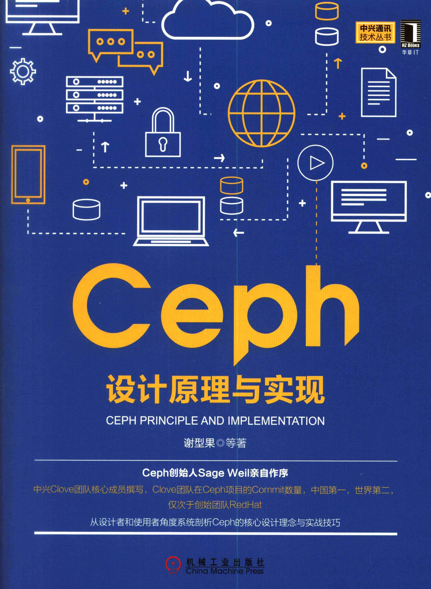


# 内容介绍

本书是中兴Clove团队多年研究和实践经验的总结。Ceph创始人Sage Weil的高度评价并亲自作序。

Clove团队是Ceph项目的核心贡献者，从贡献的Commit数上看，连续多个版本的贡献在中国排名第一，世界排名第二。Clove团队对Ceph有非常深入的研究，在中兴通讯内部进行了大量的生产实践。

本书同时从设计者和使用者的角度系统剖析了Ceph的整体架构、核心设计理念，以及各个组件的功能与原理；同时，结合大量在生产环境中积累的真实案例，展示了大量实战技巧。每一章都从基本原理切入，采用循序渐进的方式自然过渡至Ceph，并结合Ceph的核心设计理念指出需要进行哪些必要的改进和裁剪，使得读者不但能够知其然，而且能够知其所以然，真正做到了“源于Ceph，高于Ceph”。此外，写作时尽量避免涉及过多非必要的专业术语，做到深入浅出并且每章相对独立，以最大程度减少阅读障碍。

# 本书核心内容：

- Ceph核心算法CRUSH设计算法分析及拓展

- Ceph新型高性能存储引擎BlueStore的特性及关键流程分析

Ceph高级特性ECOverwrites

Ceph PG 状态机及数据修复、平衡机制

- Ceph RBD、RGW、Ceph-FS三大主要组件的实现与拓展

Ceph生产环境实战技巧

# Ceph

# 设计原理与实现

CEPH PRINCIPLE AND IMPLEMENTATION 

谢型果 任焕文 严军

罗润兵韦巧苗 骆科学

$\odot$ 著

# 图书在版编目（CIP）数据

Ceph 设计原理与实现/谢型果等著. --北京：机械工业出版社，2017.8（中兴通讯技术丛书）

ISBN 978-7-111-57842-0 

I.C… II. 谢… III. 分布式文件系统 IV. TP316

中国版本图书馆CIP数据核字（2017）第206048号

# Ceph 设计原理与实现

出版发行：机械工业出版社（北京市西城区百万庄大街22号邮政编码：100037）

责任编辑：何欣阳 责任校对：李秋荣

印刷：三河市宏图印务有限公司 版次：2017年9月第1版第1次印刷

开本： $186\mathrm{mm}\times 240\mathrm{mm}$ 1/16 印张：19.75

书号：ISBN978-7-111-57842-0 定价：69.00元

凡购本书，如有缺页、倒页、脱页，由本社发行部调换

客服热线：（010）88379426 88361066 投稿热线：（010）88379604

购书热线：（010）68326294 88379649 68995259 读者信箱：hzit@hzbook.com

版权所有·侵权必究

封底无防伪标均为盗版

本书法律顾问：北京大成律师事务所 韩光/邹晓东

# Fereword推荐序一

Ceph began more than ten years ago as an effort to build a better distributed file system for large supercomputers. In the course of designing for scalability and failure, we ended up creating something that was perfectly timed and well-suited for the explosion of cloud computing infrastructure deployments a few years later. Ceph was open source, scalable, avoiding single points of failure, and provided a block interface that was already well integrated with KVM, the preferred open source hypervisor. The rest is history. 

Today, Ceph provides several storage interfaces: the RBD block interface, used widely for backing virtual machines; the RGW object interface, which provides an S3-compatible object storage interface; and CephFS, the scalable POSIX distributed file system we originally set out to build. It is scalable, fast, runs on commodity storage components, and, most importantly, it is $100\%$ free and open source software. Ceph is deployed by a majority of OpenStack clouds and is used in a broad range of other domains, from genomics research to high energy physics to video streaming. As the world's demands for data storage continue to expand we expect to see many more. 

Our goal then and now is to ensure that the most compelling storage system available is a free one. Until recently, the market for systems that would store data at scale was dominated by expensive storage appliance vendors with few (if any) open solutions. This drove up costs, driving many cash-strapped users (like research and academic institutions) out of the market, but more importantly it meant that the engineering and development of storage systems was done in secret, in parallel, by many different organizations. Free 

software allows organizations to effectively pool their engineering resources, taking advantage of their competitors' investments as well as the community of users and casual contributors to improve the quality of the system. 

I am delighted that Ceph has seen great interest and success in China, and excited to see this book published to help make open source storage more accessible to everyone. It has been a challenge to collaborate effectively with users and developers in China due to time zones and language differences, but I hope that this book (and others) will help bridge the divide. 

——Sage Weil Ceph创始人

# Forward 推荐序二

# 张万春 中兴通讯股份有限公司副总裁

阅读了谢型果、任焕文、严军、罗润兵、韦巧苗、骆科学6位同事创作的《Ceph设计原理与实现》，感到非常高兴，并由衷祝贺创作团队的杰出贡献！就这本书，我想谈三点看法：

# 一、中兴通讯重视技术的发展

云计算、大数据、人工智能三位一体，它们重新定义了IT，重新定义了资产，重新定义了工具和效率，这些技术力量越来越快地驱动和改变了整个产业，成为支撑行业变革、选择技术伙伴、拓展创新业务和提供高效服务的技术平台。中兴通讯作为全球通信领域的重要厂商，非常重视技术的发展。在云计算领域，多年来致力于利用先进技术，研发更高速度、更大容量、更高安全、更具弹性、更低成本的云计算基础设施。其中Ceph就是开源分布式云储存领域中最具活力、最先进的基础技术社区之一，本书记录了我们在这个领域最新的探索实践。

# 二、中兴通讯重视社区的力量

中兴通讯非常认同和重视社区的力量，致力于建立开放合作的生态环境。我们参加了全球多个开源的社区项目，成为其中最关键的伙伴，包括我们和Openstack、Ceph社区的合作。中兴通讯在Ceph领域技术能力的发展，离不开与社区的合作。中兴通讯的Ceph团队是一个优秀的自组织、自管理、自激励的开放合作的敏捷组织，他们内通外联与社区合作，共同推动Ceph技术的发展演进。

# 三、中兴通讯乐于分享最佳实践

中兴通讯作为最负社会责任的高科技企业，非常愿意将我们的知识、经验和服务分享到社区、回馈到社会。本书的6位作者身处Ceph技术研发的最前沿，他们精心创作的《Ceph设计原理与实现》有着三个鲜明的特点：一是最系统，二是最前沿，三是最有深度。我们很乐意将这本优秀的著作分享给大家！

最后再次感谢创作团队的重大贡献，并欢迎各位读者开启精彩的《Ceph设计原理与实现》阅读之旅！

# Foreword 推荐序三

# 陆平 中兴通讯股份有限公司副总裁

近几年，随着IT信息技术的飞速发展，云计算、虚拟化及池化技术得到了广泛的应用。作为云计算最受追捧的开源项目，OpenStack让越来越多的人感受到了虚拟化的魅力，并在金融、政务、电力和制造业广泛被使用。在最新的OpenStack2017用户调研中，CephRBD以绝对优势（ $65\%$ ）的环境占有率，证明了大家对Ceph充满信心，而作为OpenStack默认存储后端的Ceph，也不负众望，近两年发展得如火如荼，不仅吸引了越来越多的大厂商加入到Ceph生态圈，而且越来越多的行业也采用了Ceph作为其优选的存储解决方案。在大数据盛行的时代，数据量井喷式增长，动辄上PB、EB甚至是ZB的存储需求比比皆是，而且对性能、可靠性的要求也越来越高，Ceph以其优异的性能、可靠性及灵活的扩展性能受到各行各业的青睐，想想也是理所应当的事情。

Ceph作为一个十多年前就已经诞生的开源项目，能够发展到今天，它的生命力是由每一个社区贡献者释放和延续的，我们很欣喜地发现，这种由参与的力量所带来的生命力，随着Ceph开源社区的不断发展及贡献者的日益增多，而变得越来越旺盛。让我们更兴奋的是在广大贡献者的不断努力下，Ceph依然在飞速发展，中兴通讯作为Ceph开源社区中持续活跃的贡献者，无疑给Ceph开源社区注入了更多的激情和活力。

本书是中兴通讯在 Ceph 开源社区中长期积累的创作成果，不仅从设计原理及思想上对 Ceph 进行了剖析，而且结合实践深入浅出地将 Ceph 的独特魅力展现给大家，对于想进阶参与 Ceph 开源社区的人来说，绝对是一本不可多得的好书。

Ceph是“存储的未来”，相信在大家的共同努力下，这个“未来”不会远了。

# 前言 Protace

诞生于2006年的Ceph，是开源社区的明星项目，也是私有云事实上的标准——OpenStack的默认存储后端。作为当前最火爆的分布式存储系统，Ceph拥有诸多引人注目的特性。

首先，Ceph 是一种软件定义存储，可以运行在几乎所有主流的 Linux 发行版（典型如 CentOS 和 Ubuntu）和其他类 UNIX 操作系统（典型如 FreeBSD）上。2016 年，社区进一步将 Ceph 从 x86 架构移植到 ARM 架构中，令 Ceph 应用场景进一步扩展至移动、低功耗等前沿领域，使得 Ceph 未来充满无限可能。

其次，Ceph的分布式基因使其可以轻易管理成百上千个节点、PB级及以上存储容量的大规模集群，同时基于计算的扁平寻址设计使得Ceph客户端可以直接和服务端的任意节点通信，从而避免因为存在访问热点而导致性能瓶颈。实际上，在没有网络传输限制的前提下，Ceph可以呈现我们所梦寐以求的、性能与集群规模成线性扩展的优秀特性。

最后，Ceph 是一个统一存储系统，既支持传统的块、文件存储协议，例如 SAN 和 NAS；也支持新兴的对象存储协议，例如 S3 和 Swift，这使得 Ceph 理论上可以满足时下一切主流的存储应用需求。此外，良好的架构设计使得 Ceph 可以轻易拓展至需要存储的任何领域。

上述这一切使得理论上只要存在存储需求，Ceph 就能找到用武之地。因此，诚如 Ceph 社区所言：Ceph 是存储的未来！

# 为什么写这本书

在Ceph的设计理念中，高可扩展性、高可靠性和高性能都是其核心考虑要素。此

外，为了能够最大程度地拓展 Ceph 的“触角”（Ceph 本意就是章鱼），Ceph 当中所有组件都被设计成松耦合和高度可定制的。基于上述考虑，Ceph 采用面向对象的语言—— $\mathrm{C}++$ 进行开发，并且在具体实现上大量采用了 STL 和 Boost 库中的高级特性。一方面， $\mathrm{C}++$ 被公认为最复杂的编程语言之一；另一方面，经过 10 年的发展，Ceph 已经成为一个代码行数超过百万的庞然大物，各种组件多如牛毛，组件之间关系错综复杂。更加令人望而生畏的是：随着 Ceph 应用场景日益广泛，大量新需求新特性持续涌入，Ceph 正加速向前发展！社区代码每天都在发生翻天覆地的变化——一方面很多模块从无到有，另一方面很多模块从有到无，即便是一些仍然存在的模块，短短几个开发周期之后就会变得面目全非。上述这一切都成为大量渴望接触 Ceph、玩转 Ceph 和深度参与 Ceph 的开发人士的梦魇，足以令他们手足无措，对 Ceph 望而却步。

此外，虽然 Ceph 诞生至今已经超过 10 年的时间，但是在国内兴起却是近几年的事情（感谢 OpenStack），因此相关书籍异常匮乏。市面上仅有的几本，或者单纯从实践角度针对如何使用 Ceph 进行介绍，因为缺乏理论作为指导，加之 Ceph 的命令集一直处于进化之中并且越来越庞大，普通读者可能无法留下深刻印象；或者单纯从源码角度对 Ceph 进行分解和剖析，一方面牵涉到大量实现细节，另一方面源码日新月异，因此非资深开发者可能不易上手。再将视野转向国外——Ceph 官方社区虽然早有专门的文档库对 Ceph 进行系统性的介绍，但是一方面文档库过于庞大并且涉及大量专业术语，另一方面作者和国内读者语言、文化背景存在巨大差异，导致直接阅读这类文档困难重重、举步维艰。

来自ZTE的Clove团队，自2014年开始接触Ceph，是国内最早从事Ceph研究和开发的团队之一。团队从传统存储领域转型，大部分成员此前都有从事SAN或者NAS开发的背景，因此转战Ceph可谓如鱼得水。自成立之日起，Clove团队就一直和Ceph社区保持着良好的互动，我们在使用Ceph、享受Ceph带给我们种种好处的同时，一方面通过反馈故障、修复故障、推送特性等方式持续回馈社区，另一方面通过参与和举办线下沙龙等方式不遗余力地宣传和推广Ceph。时至今日，团队中不少人都已经成长为国内在Ceph社区中独当一面的活跃开发者。

因为我们在多年的摸索过程中深切体会到学习资料匮乏对 Ceph 初学者所造成的巨大困扰；加之，普及 Ceph、推广 Ceph，与社区共筑良好的 Ceph 生态圈并最终实现社区广大开发者和用户双赢也是我们和社区的共识，我们自 2016 年年中开始动笔编写本书。之所以选择这个时间点，一是因为我们团队已经在传统存储领域以及 Ceph 社区耕耘多年，自身积淀已经逐步殷实；二是 Ceph 这两年在国内发展如火如荼，受众日益广泛，时机

逐渐成熟。书中大部分内容基于社区最新（2017年1月）发布的Kraken稳定版，侧重于BlueStore、ECoverwrites、QoS等一众新增组件和新增特性的介绍，写作时每章务必追求从基本原理切入，采用循序渐进的方式自然过渡和推广至Ceph，并结合Ceph的核心设计理念指出需要进行哪些必要的改进和裁剪，使得读者不但能够知其然，而且能够知其所以然；同时，写作时尽量避免涉及过多、非必要的专业术语，做到深入浅出；并且每章相对独立，最大程度地减少阅读障碍。此外，为了进一步加深读者印象，每个章节都穿插了不少实用案例，最后一章的素材更是全部源于我们日常积累的、从客户处收集的生产案例，极具代表性和通用性，如果读者能够在阅读、学习的同时进行实战演练，理论结合实践，相信必定能够取得更大收益。

# 本书的读者对象

本书适合于对 Ceph 有一定了解，想更进一步参与到 Ceph 开源项目中来，并致力于为 Ceph 项目添砖加瓦的开发者阅读。

此外，高级运维人员通过阅读本书也能够了解和掌握 Ceph 的核心设计理念及高级应用技巧，从而在日常运维工作中更加得心应手。

# 本书的主要内容

Ceph整体架构如下：

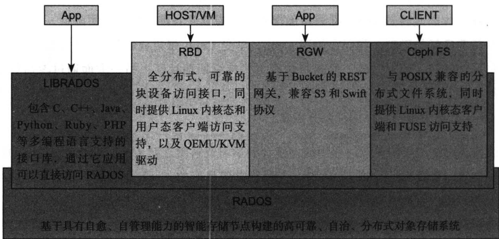


Ceph整体架构


其中，RADOS 是 Ceph 的支撑组件，除了 Ceph 当前的三大核心应用组件 RBD、RGW 和 CephFS 之外（它们分别提供块、对象和文件访问接口），原则上，基于 RADOS 及其派生的 librados 标准库也可以开发任意类型的其他应用组件。本书侧重介绍 RADOS 及三大核心应用组件——RBD、RGW 和 CephFS，详细章节及简介如下：

# 第1章 计算为王

CRUSH是Ceph两大核心设计之一。CRUSH良好的设计理念使其具有计算寻址、高并发和动态数据均衡、可定制的副本策略等基本特性，进而能够非常方便地实现诸如去中心化、有效抵御物理结构变化并保证性能随集群规模呈线性扩展、高可靠等高级特性，因而非常适合应用于Ceph这类对可扩展性、性能和可靠性都具有严苛要求的大型分布式存储系统。

# 第2章 性能之巅

自Jewel版本开始，社区引入了一种新型的高性能对象存储引擎——BlueStore，用于取代服役已经超过10年的FileStore。BlueStore的引入毫无疑问是这两年来Ceph最引人注目的特性之一。

# 第3章 时空博弈

Ceph 传统的三副本数据备份方式能够在取得高可靠性的前提下最小化前端请求的响应时延，因而特别适合对可靠性和性能都有一定要求的上层应用。这种目前使用最广泛的备份方式缺点在于会大量占用额外的存储空间，因而导致集群的实际空间利用率不高。与之相反，纠删码以条带为单位，通过数学变换，将采用任意 $\mathrm{k} + \mathrm{m}$ 备份策略所消耗的额外存储空间都成功控制在1倍以内，代价是计算资源消耗变大和前端请求响应时延变长，因而适合对时延不敏感的“冷数据”（例如备份数据）应用。在Kraken版本中，社区通过解决纠删码中最复杂的覆盖写难题，使得纠删码类型的存储池第一次见到了迈向生产环境的曙光。

# 第4章 迁移之美

PG是Ceph最核心和最复杂的概念之一，这也使得学习和了解PG成为Ceph最富挑战性的工作之一。在PG为数众多的优秀特性中，也许最重要也最引人注目的是它可以在OSD之间（根据CRUSH的实时计算结果）自由进行迁移，这是Ceph赖以实现自动数据恢复、自动数据平衡等高级特性的基础。

# 第5章 控制先行

在虚拟化技术大行其道的今天，如何针对有限的资源进行集中管理并按需分配以最大化收益，一直是焦点议题之一。Ceph通过积极引入QoS功能，有望对集群的IOPS、带宽等I/O资源进行合理统筹，实现按需、定量分配，从而对外提供更加精细化的存储服务。

# 第6章 无心插柳

自2007年SageA.Weil正式发布Ceph以来，Ceph实际上已经存在并发展了10余年时间。Ceph在设计之初被定位为一个纯粹的分布式文件系统（CephFS)，但随着虚拟化逐渐成为信息时代的主旋律和以OpenStack为代表的云计算技术闪电崛起，社区果断调整重心，开始着力发展新型分布式块存储服务组件——RBD，并使其逐渐成长为OpenStack等IaaS云计算环境中虚机、镜像、云盘等服务不可或缺的默认块设备存储后端。可以说，Ceph能够在为数众多的同类软件竞争中脱颖而出，并逐渐成长为最炙手可热的分布式统一存储系统，很大程度上得益于收获了OpenStack的青睐，而RBD取代CephFS伴随OpenStack先一步进入公众视野则是意料之外、情理之中。

# 第7章 应云而生

在《浪潮之巅》一书的前言中，吴军博士开宗明义地提出：“近一百多年来，总有一些公司很幸运地、有意识或无意识地站在技术革命的浪尖之上。在这十几年间，它们代表着科技的浪潮，直到下一波浪潮的来临。”

当前，方兴未艾的云计算无疑代表了科技发展下一波浪潮的到来，而率先基于AWS推出公有云服务并成为公有云事实标准的亚马逊公司无疑一只脚已经踏上了这波浪潮的浪潮之巅。事实上，自2006年面世以来，AWS当前存储的对象规模已经高达千亿级别，并已经累积为亚马逊创造了超过百亿美元的利润，由此可见云计算所蕴含的巨大商机。AWS要求存储系统能够提供与传统块、文件存储都不相同的第三类接口——对象存储接口，并采用自定义的S3协议通过互联网（HTTP）进行传输。在此背景下，为了赶上云计算为代表的这波科技浪潮，Ceph兼容以S3为代表的对象存储协议簇的对象存储网关——RGW应云而生。

# 第8章 经典重现

文件系统伴随操作系统一同诞生，是计算机科学中最基本和最经典的概念之一。Ceph自诞生之日起就被定位为一个分布式文件系统。时至今日，在Ceph的三大典型应

用场景中，RBD和RGW先后乘着云计算的东风后来居上获得了日益广泛的应用，但是起步最早的CephFS却一直迟迟未能有所建树。究其原因，一是文件系统采用树状结构管理数据（文件和目录）、基于查表进行寻址的设计理念，与Ceph采用扁平方式管理数据、基于计算进行寻址的设计理念格格不入；二是支持文件系统必然要求Ceph引入集中的元数据管理服务器（作为树状结构的统一入口用于寻址），这又与Ceph去中心化、追求近乎无限横向扩展能力的设计思想激烈冲突。

尽管颇具戏剧性，然而一个不可否认的事实是：RBD和RGW的蓬勃发展反过来又促使Ceph在云计算以外的领域也迅速普及并逐渐变得广为人知。随着传统块、文件存储设备日薄西山，业界期待Ceph作为一个真正意义上的大一统存储系统接管传统存储的呼声越来越高。因此，尽管道阻且长，但是作为替代传统文件存储的重要一环，重启CephFS研究并使之早日进入生产环境已是势在必行。

# 第9章 运用之妙

运用之妙，存乎一心。经过漫长的 Ceph 基本原理学习之旅，相信大部分读者已经按捺不住、想要通过亲自动手实践来体验 Ceph 的种种神奇魅力。在本书的最后，我们精心准备了以 Ceph 应用于生产环境的各种案例为原材料烹制的饕餮盛宴，以飨读者。

# 勘误与支持

赠人玫瑰，手有余香。我们真诚地希望每位读者都能从阅读本书中找到乐趣并获得收益。当然，由于水平有限，书中难免存在错误和疏漏，我们将每位读者都当成是志同道合（关注Ceph、爱好Ceph）的朋友，朋友们的指正自然永远是欢迎的。

如果您在阅读本书过程中碰到任何问题，可以通过以下电子邮箱联系我们：

luo.kexue@zte.com.cn 

xie.xingguo@zte.com.cn 

# 致谢

Ceph 官方社区的源代码是创作本书的原始素材，因此我们首先要感谢 Ceph 官

方社区，特别是社区领袖和 Ceph 创始人 Sage A. Weil 先生。Sage 学识渊博、为人和善，乐于接纳新人和帮助新人成长。在他的带领下，Ceph 欣欣向荣，十年间从一个默默无闻的学院派作品逐渐成长为开源社区万众瞩目的明星项目。作为 Ceph 官方社区的一分子，Clove 团队与有荣焉。

其次，我们要感谢所在部门的主管领导——谭芳部长，是他给予了Clove团队无微不至的关怀和无与伦比的信任，让我们有勇气去不断突破自身瓶颈，全力以赴追求心中的梦想。

再次，我们也非常感谢那些阅读过本书草稿并提出宝贵意见的人：宋维斌（针对本书的大部分章节，他都阅读了两遍以上，他是我们所见过的最细心的人）、朱尚忠（他指出了本书一些晦涩难懂之处，使得读者能够获得更加轻松愉快的阅读体验）和罗慕尧等。

最后，我们要特别感谢IT技术学院的闫林老师，如果没有他的鼓励和帮助，相信本书将不会有机会和广大读者朋友们见面。

开放正在成为这个时代的主旋律，开源正在成为软件开发的新信条。与大师同行，和开源社区共成长，让每个深度参与到开源社区中的开发者们都受益匪浅。而以 Linus、Sage 等为首的开源社区领袖，则完美阐释了约翰·邓普顿的名言，“It is nice to be important, but it's more important to be nice”，他们永远是后来者学习和追赶的榜样。

我们期待并将继续为之努力。

# Contents 目录

推荐序一

推荐序二

推荐序三

前言

# 第1章 计算为王——基于可扩展 哈希的受控副本分布策略

CRUSH 1 

1.1 straw及straw2算法简介… 2

1.2 CRUSH算法详解 6

1.2.1 集群的层级化描述——ClusterMap·

1.2.2 数据分布策略——Placement Rule 9

1.3 调制CRUSH 14

1.3.1 编辑CRUSHMap· 15

1.3.2 定制CRUSH规则 19

1.3.3 数据重平衡· 21

1.4 总结与展望 23

# 第2章 性能之巅——新型对象存储 引擎BlueStore 25

2.1 设计理念与指导原则 26

2.2 磁盘数据结构 30

2.2.1 PG 30 

2.2.2 对象 38

2.3 缓存管理 46

2.3.1 常见的缓存淘汰算法 46

2.3.2 BlueStore中的缓存管理…49

2.4 磁盘空间管理 53

2.4.1 常见磁盘空间管理模式 53

2.4.2 BitmapFreelistManager 56 

2.4.3 BitmapAllocator 57 

2.5 BlueFS 59 

2.5.1 RocksDB与BlueFS 59

2.5.2 磁盘数据结构 62

2.5.3 块设备 65

2.6 实现原理 66

2.6.1 mkfs 66 

2.6.2 mount 67 

2.6.3 read 69 

2.6.4 write 72 

2.7 使用指南 77

2.7.1 部署BlueStore 77

2.7.2 配置参数 80

2.8 总结与展望 83

# 第3章 时空博弈——纠错码原理与overwrites支持· 84

3.1 RAID技术概述· 85

3.2 RS-RAID和Jerasure 90

3.2.1 计算校验和 92

3.2.2 数据恢复 92

3.2.3 算术运算 93

3.2.4 缺陷与改进 99

3.2.5 Jerasure 100 

3.3 纠删码在Ceph中的应用 102

3.3.1 术语· 104

3.3.2 概述· 105

3.3.3 新写 106

3.3.4 读· 108

3.3.5 覆盖写 110

3.3.6 日志 112

3.3.7 Scrub 113 

3.4 总结与展望 … 113

# 第4章 迁移之美 —— PG 读写流程与状态迁移详解 ………… 116

4.1 PG概述· 117

4.2 读写流程 … 120

4.2.1 消息接收与分发 127

4.2.2 do_request 129 

4.2.3 do_op 129 

4.2.4 executectx 136 

4.3 状态迁移 146

4.3.1 状态机概述 147

4.3.2 创建PG· 150

4.3.3 Peering 154 

4.3.4 Recovery 169 

4.3.5 Backfill 172 

4.4 总结与展望 … 173

# 第5章 控制先行——存储服务质量 QoS 175

5.1 研究现状 176

5.2 dmClock算法原理 177

5.2.1 mClock 177 

5.2.2 dmClock 179 

5.3 QoS的设计与实现 180

5.3.1 优先级队列（prio）……181

5.3.2 权重的优先级队列（wpq）…183

5.3.3 dmClock队列 184

5.3.4 Client的设计· 191

5.4 总结与展望 192

# 第6章 无心插柳——分布式块存储 RBD· 195

6.1 RBD架构· 195

6.2 存储组织 196

6.2.1 元数据 197

6.2.2 数据 209

6.3 功能特性 211

6.3.1 快照 211

6.3.2 克隆 216

6.4 总结与展望 219

# 第7章 应云而生——对象存储网关  
RGW 220

7.1 总体架构 221

7.2 数据组织和存储 222

7.2.1 用户 225

7.2.2 存储桶 228

7.2.3 对象 229

7.2.4 数据存储位置 231

# 7.3 功能实现 232

7.3.1 功能特性· 233

7.3.2 I/O路径· 235

7.3.3 存储桶创建 240

7.3.4 对象上传 242

7.3.5 对象下载 244

# 7.4 总结与展望 244

# 第8章 经典重现——分布式文件系统 CephFS 246

# 8.1 文件系统基础知识 247

8.1.1 文件系统 247

8.1.2 文件系统中的元数据 249

8.1.3 硬链接和软链接 250

8.1.4 日志· 251

# 8.2 分布式文件系统 CephFS 252

8.2.1 CephFS设计框架和背景…252

8.2.2 MDS的作用· 254

# 8.3 MDS设计原理与实现 255

8.3.1 MDS元数据存储 255

8.3.2 MDS负载均衡实现 260

8.3.3 MDS故障恢复 268

# 8.4 总结与展望 271

# 第9章 运用之妙——应用案例实战 272

9.1 实战案例一：Ceph 集群定时 Scrub 272

9.2 实战案例二：Ceph 对接 OpenStack 274

9.3 实战案例三：Ceph数据重建配置策略 288

9.4 实战案例四：Ceph 集群 Full紧急处理 290

9.5 实战案例五：Ceph快照在增量备份的应用 292

9.6 实战案例六：Ceph 集群异常watcher 处理 297

9.7 总结与展望 … 298

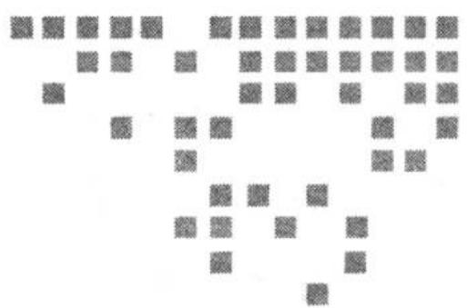


# 第1章

Chapter 1 

# 计算为王

# ——基于可扩展哈希的受控副本分布策略CRUSH

> [💡 **阅读笔记：Ceph 的两级映射机制 (对象 -> PG -> OSD)**](./notes/two_level_mapping_mechanism_qa.md)  
> 疑问：对象到 PG，PG 到 OSD，这两级映射都是 CRUSH 控制的吗？
> 结论：不是。对象到 PG 靠 Hash，PG 到 OSD 才靠 CRUSH。

大部分存储系统将数据写入到后端存储设备之后，数据很少会在设备之间再次移动。这就存在一个潜在问题：即使一个数据分布已经趋于完美均衡的系统，随着时间的推移，新的空闲设备不断加入，老的故障设备不断退出，数据也会重新变得不均衡，这种情况在大型分布式存储系统中尤为常见。

一种可行的解决方案是将数据以足够小的粒度打散，然后完全随机地分布在所有存储设备之间，这样，从概率上而言，如果系统运行的时间足够长，所有设备的空间利用率将会趋于均衡。当新设备加入后，数据会随机地从不同的老设备迁移过来；同样，当老设备因为故障退出后，其原有数据会随机迁出至其他正常设备。这样整个系统将一直处于动态平衡过程之中，从而能够适应任何类型的负载和拓扑结构变化。进一步的，因为任何数据（可以是文件、块设备等）都被打散成为多个碎片然后写入不同的底层存储设备，从而使得在大型分布式存储系统中获得尽可能高的I/O并发和汇聚带宽成为可能。

一般而言，使用哈希函数可以达到上述目的，但是实际应用中还需要解决两个问题：一是如果系统中存储设备数量发生变化，如何最小化数据迁移量从而使得系统尽快恢复平衡；二是在大型（PB级及以上）分布式存储系统中，数据一般包含多个备份，如何合理分布这些备份从而尽可能地使得数据具有较高的可靠性。因此，需要对普通哈希函数加以扩展，使之能够解决上述问题，Ceph称为CRUSH（Controlled Replication Under Scalable Hashing）。

顾名思义，CRUSH 是一种基于哈希的数据分布算法。以数据唯一标识符、当前存储集群的拓扑结构以及数据备份策略作为 CRUSH 输入，可以随时随地通过计算获取数据所在的底层存储设备（例如磁盘）位置并直接与其通信，从而避免查表操作，实现去中心化和高度并发。CRUSH 同时支持多种数据备份策略，典型如镜像、RAID 及其衍生的纠删码等，并受控地将数据的多个备份映射到集群不同物理区域中的底层存储设备之上，从而保证数据可靠性。上述这些特性使得 CRUSH 特别适用于对可扩展性、性能以及可靠性都有极高要求的大型分布式存储系统。

本章按照如下形式组织：首先，我们介绍CRUSH需要解决的问题，由此引出CRUSH最重要的基本选择算法——straw及其改进版本straw2；其次，完成基本算法分析后，我们介绍如何将其进一步拓展至具有复杂层级结构的真实集群，为了实现上述目的，我们首先介绍集群拓扑结构和数据分布规则的具体描述形式，然后以此为基础介绍CRUSH的完整实现；最后，由于实际应用中集群拓扑结构千变万化，CRUSH配置相对复杂，我们结合一些实际案例，分析如何针对CRUSH进行深度定制，以满足生产环境中形式各异的数据分布需求，同时介绍如何通过人工调整的方式来解决生产环境中常见的、因为各种各样的因素所导致的数据分布不均衡问题。

# 1.1 straw及straw2算法简介

> [💡 **阅读笔记：Straw 算法核心疑问解答**](./notes/straw_algorithm_qa.md)  
> 疑问：e1/e2 是指代磁盘吗？签长最大者即被选中？

> [💡 **阅读笔记：映射过程与数据拷贝的关系**](./notes/straw_mapping_vs_copy_qa.md)  
> 疑问：数据映射是算出来的还是考贝出来的？

Ceph 在设计之初被定位于管理大型分级存储网络，网络中的不同层级具有不同程度的灾难容忍程度，因此也称为容灾域（或者安全域）。图 1-1 是一个典型 Ceph 集群的层级结构：

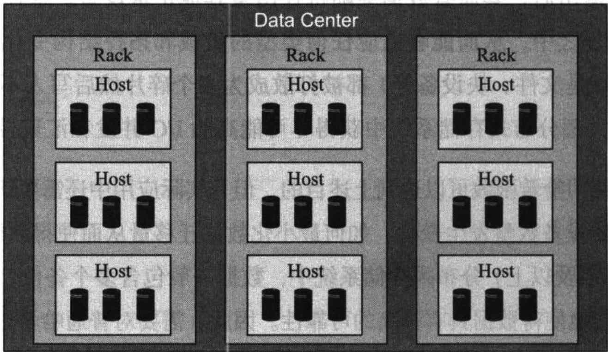


图1-1 一个典型的Ceph集群


图1-1中，单个主机包含多个磁盘，每个机架包含多个主机并采用独立的供电和网络交换系统，从而可以将整个集群以机架为单位划分为若干容灾域。为了实现高可靠性，实际上要求数据的多个副本分布在不同机架的主机磁盘之上。因此，CRUSH首先应该是一种基于层级的深度优先遍历算法。此外，上述层级结构中，每个层级的结构特征也存在差异，一般而言越处于顶层其结构变化的可能性越小，反之越处于底层则其结构变化越频繁，例如大多数情况下一个Ceph集群自始至终只对应一个数据中心，但是主机或者磁盘数量随时间流逝则可能一直处于变化之中。因此，从这个角度而言，CRUSH还应该允许针对不同的层级按照其特点设置不同的选择算法，从而实现全局和动态最优。

在CRUSH的最初实现中，SageWeil一共设计了4种不同的基本选择算法，这些算法是实现其他更复杂组合算法的基础，表1-1罗列了它们各自的优缺点。


表 1-1 CRUSH 基本选择算法对比


通过对比每种算法“添加元素”和“删除元素”产生的数据迁移量来评判其好坏


<table><tr><td>对比项\算法</td><td>unique</td><td>list</td><td>tree</td><td>straw</td></tr><tr><td>时间复杂度</td><td>O(1)</td><td>O(N)</td><td>O(log(N))</td><td>O(N)</td></tr><tr><td>添加元素</td><td>差</td><td>最好</td><td>好</td><td>最好</td></tr><tr><td>删除元素</td><td>差</td><td>差</td><td>好</td><td>最好</td></tr></table>

由表1-1可见，unique算法执行效率最高但是抵御结构变化能力最差；straw算法执行效率较低但是抵御结构变化能力最好；list和tree算法执行效率和抵御结构变化能力介于上述两者之间。如果综合考虑呈爆炸式增长的存储空间需求（导致需要添加元素）、在大型分布式存储系统中某些部件故障是常态（导致需要删除元素）以及愈发严苛的数据可靠性需求（导致需要将数据副本存储在更高级别的容灾域中，例如不同的数据中心），那么针对任何层级采用straw算法都是一个不错的选择。事实上，这也是CRUSH算法的现状，在大多数将Ceph用于生产环境的案例中，除了straw算法之外，其他3种算法基本上形同虚设，因此我们将重点放在straw算法的分析上。

顾名思义，straw算法将所有元素比作吸管，针对指定输入，为每个元素随机计算一个长度，最后从中选择长度最长的那个元素（吸管）作为结果输出，这个过程也被形象地称为抽签（draw），对应元素的长度称为签长。

显然 straw 算法的关键在于如何计算签长。理论上，如果所有元素构成完全一致，那

么只需要将指定输入和元素自身唯一编号作为哈希输入即可计算出对应元素的签长。因此，如果样本容量足够大，那么最终所有元素被选择的概率是相等的，从而保证数据在不同元素之间均匀分布。然而实际中前期规划的再好的集群，其存储设备随着时间推移也会逐渐趋于异构化，典型如因为批次不同而导致的磁盘容量差异（参照摩尔定律，磁盘容量每18个月翻一番），显然，在此情况下，我们不应该也无法对所有设备一视同仁，因此需要在CRUSH算法中引入一个额外的参数——权重来体现这种差异，让权重大（对应容量大）的设备分担更多的数据，权重小（对应容量小）的设备分担更少的数据，从而使得数据在异构存储网络中也能合理的分布。

上述过程应用于 straw 算法，则可以通过使用权重对签长的计算过程进行调整来实现，即我们总是倾向于让权重大的元素获得更大的签长，让权重小的元素获得更小的签长。因此，此时 straw 算法执行结果取决于三个因素：固定输入、元素编号和元素权重，这其中元素编号起的是随机种子的作用，所以针对固定输入，straw 算法实际上只受元素权重的影响。进一步的，如果每个元素的签长只和自身权重相关，则可以证明此时 straw 算法对于添加元素和删除元素的处理都是最优的，我们以添加元素为例进行论证：

1）假定当前集合中一共包含 $\mathbf{n}$ 个元素：

$$
\left(\mathbf {e} _ {1}, \mathbf {e} _ {2}, \dots , \mathbf {e} _ {n}\right)
$$

2）向集合中添加新元素 $\mathbf{e}_{\mathrm{n + 1}}$ 

$$
\left(\mathbf {e} _ {1}, \mathbf {e} _ {2}, \dots , \mathbf {e} _ {n}, \mathbf {e} _ {n + 1}\right)
$$

3）针对任意输入 $\mathbf{x}$ ，加入 $\mathbf{e}_{\mathrm{n + 1}}$ 之前，分别计算每个元素签长并假定其中最大值为 $\mathbf{d}_{\mathrm{max}}$ 

$$
\left(d _ {1}, d _ {2}, \dots , d _ {n}\right)
$$

4）因为新元素 $\mathbf{e}_{\mathrm{n + 1}}$ 的签长计算只和自身编号及自身权重相关，所以可以使用 $\mathbf{x}$ 独立计算其签长（同时其他元素的签长不受 $\mathbf{e}_{\mathrm{n + 1}}$ 加入的影响），假定为 $\mathbf{d}_{\mathrm{n + 1}}$ 

5）又因为straw算法总是选择最大的签长作为最终结果，所以：

如果 $\mathrm{d}_{\mathrm{n} + 1} > \mathrm{d}_{\max}$ ，那么 $\mathbf{x}$ 将被重新映射至新元素 $\mathbf{e}_{\mathrm{n} + 1}$ ；反之对 $\mathbf{x}$ 的已有映射结果无任何影响。

可见，添加一个元素，straw算法会随机地将一些原有元素中的数据重新映射至新加

入的元素之中；同理，删除一个元素，straw 算法会将该元素中全部数据随机地重新映射至其他元素之中。因此无论添加或者删除元素，都不会导致数据在除被添加或者删除之外的两个元素（即不相关的元素）之间进行迁移。

理论上 straw 算法是非常完美的，然而在 straw 算法实现整整 8 年之后，得益于 Ceph 应用日益广泛，不断有用户向社区反馈每次集群有新的 OSD 加入或者旧的 OSD 删除时总会引起不相关的数据迁移，Sage 被迫开始针对 straw 算法已有实现重新进行审视。原 straw 算法伪代码如下：

```python
max_x = -1  
max_item = -1  
for each item:  
    x = hash(input, r)  
    x = x * item_straw  
    if x > max_x:  
        max_x = x  
        max_item = item  
return max_item 
```

可见，算法选择的结果取决于每个元素根据输入（input）、随机因子（r）和 item_straw 计算得到的签长，而 item_straw 通过权重计算得到：

reverse $=$ rearrange all weights in reverse order   
straw $= -1$ weight_diff Prev_total $= 0$ for each item: item_straw $=$ straw \* 0x10000 weight_diff Prev $=$ (reverse[current_item] - reverse[prev_item]) \* items Remain weight_diff Prev_total += weight_diff Prev weight_diff_next $=$ (reverse next_item] - reverse[prev_item]) \* items Remain scale $=$ weight_diff Prev_total / (weight_diff Prev_total + weight_diff_next) straw $\ast =$ pow(1 / scale, 1 / items Remain) 

原 straw 算法实现中，将所有元素按其权重进行逆序排列后逐个计算每个元素的 item_straw，计算过程中不断累积当前元素与前后元素的权重差值，以此作为计算下一个元素 item_straw 的基准，因此原有实现中 straw 算法的最终选择结果不但取决于每个元素的自身权重，而且也和集合当中所有其他元素的权重强相关，从而导致每次有元素加入当前集合或者从当前集合中删除时，都会引起不相关的数据迁移。

出于兼容性考虑，Sage引入了一种新的算法对原有的straw算法进行修正，称

为 straw2。修正后的 straw2 算法在计算签长时仅使用元素自身权重，因此可以完美反映 Sage 的初衷（也因此得以避免不相干的数据迁移），同时计算也更加简单，其伪代码如下：

```python
max_x = -1  
max_item = -1  
for each item:  
    x = hash(input, r)  
    x = ln(x / 65536) / weight  
    if x > max_x:  
        max_x = x  
        max_item = item  
return max_item 
```

上述逻辑中，针对输入和随机因子执行哈希后，结果落在[0,65535]之间，因此 $\mathbf{x}/$ 65536必然小于1，对其取自然对数（ $\ln (\mathrm{x} / 65536)$ ）后结果为负值。进一步地，将其除以自身权重（weight）后，则权重越大，结果越大（因为负得越少），从而体现我们所期望的每个元素权重对于抽签结果的正反馈作用。

# 1.2 CRUSH算法详解

CRUSH 算法基于权重将数据映射至所有存储设备之间，这个过程是受控的并且高度依赖于集群的拓扑描述——cluster map，不同的数据分布策略通过制定不同的 placement rule 实现，后者实际上是一组包括最大副本数、容灾级别等在内的自定义约束条件，例如针对图 1-1 所示的集群，我们可以通过一条 placement rule 将互为镜像的 3 个数据副本（这也是 Ceph 的默认数据备份策略）分别写入位于不同机架的主机磁盘之上，以避免所有副本同时掉电从而导致业务中断。

针对指定输入 $\mathbf{x}$ ，CRUSH将输出一个包含 $\mathbf{n}$ 个不同目标存储对象（例如磁盘）的集合。CRUSH的计算过程中仅仅使用x、clustermap和placementrule作为哈希函数的输入，因此如果clustermap不发生变化（一般而言placement rule不会轻易变化)，那么结果就是确定的；同时因为使用的哈希函数是伪随机的，所以CRUSH选择每个目标存储对象概率相对独立（然而我们在后面将会看到——受控的副本策略改变了这种独立性），从而可以保证数据在整个集群之间均匀分布。

# 1.2.1 集群的层级化描述——Cluster Map

cluster map 是 Ceph 集群拓扑结构的逻辑描述形式。实际应用中 Ceph 集群通常具有形如“数据中心 $\rightarrow$ 机架 $\rightarrow$ 主机 $\rightarrow$ 磁盘”（参考图 1-1）这样的树状层级关系，所以 cluster map 可以使用树这种数据结构来实现——每个叶子节点都是真实的最小物理存储设备（例如磁盘），称为 device；所有中间节点统称为 bucket，每个 bucket 可以是一些 devices 的集合，也可以是低一级的 buckets 集合；根节点称为 root，是整个集群的入口。每个节点都拥有唯一的数字 ID 和类型，以标识其在集群中所处的位置和层级，但是只有叶子节点，也就是 device 才拥有非负 ID，表明其是承载数据的最终设备。节点的权重属性用于对 CRUSH 的选择过程进行调整，使得数据分布更加合理，上一级节点权重是其所有孩子节点的权重之和。

表1-2列举了clustermap中一些常见的节点（层级）类型。


表 1-2 cluster map 常见的节点类型


<table><tr><td>类型ID</td><td>类型名称</td><td>类型ID</td><td>类型名称</td></tr><tr><td>0</td><td>osd</td><td>6</td><td>pod</td></tr><tr><td>1</td><td>host</td><td>7</td><td>room</td></tr><tr><td>2</td><td>chassis</td><td>8</td><td>datacenter</td></tr><tr><td>3</td><td>rack</td><td>9</td><td>region</td></tr><tr><td>4</td><td>row</td><td>10</td><td>root</td></tr><tr><td>5</td><td>pdu</td><td></td><td></td></tr></table>

需要注意的是，这里并非强调每个Ceph集群都一定需要划分为11个层级，表1-2中每种层级类型的名称也不固定，而是都可以根据自己的喜好进行修改和裁剪。假定所有磁盘规格一致（这样每个磁盘的权重一致），我们可以给出图1-1所示集群的clustermap描述，如图1-2所示。

实现上，类似图1-2中这种树状的层级关系在clustermap中是通过一张二维映射表建立起来的：

<bucket, items> 

树中的每个节点都是一个 bucket（device 也被抽象为一种 bucket 类型），每个 bucket 都只保存自身所有直接孩子的编号。当 bucket 类型为 device（对应图 1-2 中的 osd）时，容易知道此时其对应的 items 列表为空，即 bucket 为叶子节点。

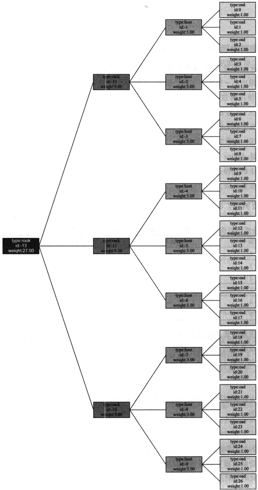


图1-2 集群的clustermap描述（对应集群参考图1-1）


# 1.2.2 数据分布策略——Placement Rule

使用 cluster map 建立对应集群的拓扑结构描述之后，可以定义 placement rule 来完成数据映射。

每条 placement rule 可以包含多个操作，这些操作共有 3 种类型：

# (1) take

take 从 cluster map 选择指定编号的 bucket（即某个特定的 bucket），并以此作为后续步骤的输入。例如系统默认的 placement rule 总是以 cluster map 中的 root 节点作为输入开始执行的。

# (2) select

select 从输入的 bucket 当中随机选择指定类型和数量的条目 (items)。Ceph 当前支持两种备份策略——多副本和纠删码，相应的有两种 select 算法——firstn 和 indep。实现上两种算法都是深度优先，并无显著不同，主要区别在于纠删码要求结果是有序的，因此，如果无法得到满足指定数量（例如 4）的输出，那么 firstn 会返回形如 [1,2,4] 这样的结果，而 indep 会返回形如 [1,2,CRUSH_ITEM_NON,4] 这样的结果，即 indep 总是返回要求数量的条目，如果对应的条目不存在（即选不出来），则使用空穴进行填充。select 执行过程中，如果选中的条目故障、过载或者与其他之前已经被选中的条目冲突，都会触发 select 重新执行，因此需要指定最大尝试次数，防止 select 陷入死循环。

# (3)emit

emit 输出最终选择结果给上级调用者并返回。

可见，一条placement rule中真正起决定性作用的是select操作。

> [💡 **阅读笔记：Select 参数解读与最终 OSD 定位机制**](./notes/select_params_and_recursive_descent_qa.md)  
> 疑问：Select 的 replicas 是什么意思？如果 Type 是 Rack 而非 OSD，数据如何存储？

为了简化 placement rule 配置，select 操作也支持容灾域模式。以 firstn 为例，如果为容灾域模式，那么 firstn 将返回指定数量的叶子设备，并保证这些叶子设备位于不同的、指定类型的容灾域之下。因此，在容灾域模式下，一条最简单的 placement rule 可以只包含如下 3 个操作：

```txt
take(root)   
select(replicas,type)   
emit(void) 
```

上述select操作中的type为想要设置的容灾域类型，例如设置为rack，则select将

保证选出的所有副本都位于不同机架的主机磁盘之上；也可以设置为 host，那么 select 只保证选出的所有副本都位于不同主机的磁盘之上。


图1-3以firstn为例展示了select从指定的bucket当中查找指定数量条目的过程：


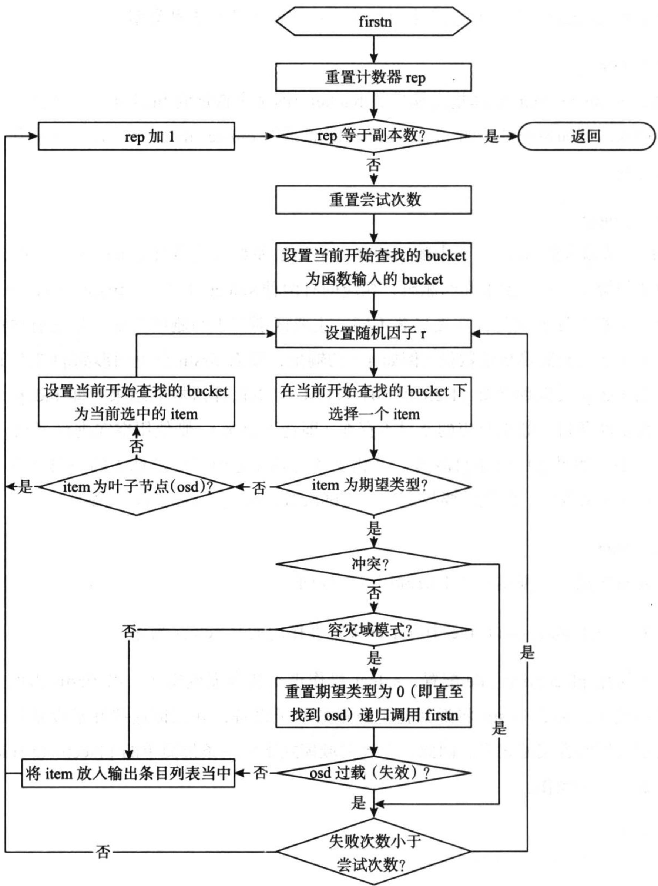


图1-3 基于firstn的select执行过程


图1-3中几个关键处理步骤的补充说明如下：

# （1）如何从bucket下选择一个条目（item）？

构建集群的 cluster map 时，通过分析每种类型的 bucket 特点可以为其指定一种合适的选择算法（例如 straw2），用于从对应的 bucket 中选择一个条目。因此从 bucket 选择条目的过程实际上就是执行设定的选择算法。这个选择算法的执行结果取决于两个因素：一是输入对象的特征标识符 x，二是随机因子 r（r 实际上是作为哈希函数的种子）。因为 x 固定不变，所以如果选择失败，那么在后续重试的过程中需要对 r 进行调整，以尽可能输出各种不同结果。目前 r 由待选择的副本编号和当前的尝试次数共同决定。

为了防止陷入死循环，需要对选择每个副本过程中的尝试次数进行限制，这个限制称为全局尝试次数（choose_total_tries）；同时因为在容灾域模式下会产生递归调用，所以还需要限制产生递归调用时作为下一级输入的全局尝试次数，因为这个限制会导致递归调用时的全局尝试次数成倍增长（按照递归的概念，多次递归后这个全局尝试次数应该成指数增长，但是实际上至多会递归调用一次，所以这里是将原始输入的全局尝试次数放大N倍后作为下一级输入的全局尝试次数），所以实现上采用一个布尔变量（chooseleaf descend_once）进行控制，如果为真，则在产生递归调用时下一级被调用者至多重试一次；反之则下一级被调用者不进行重试，由调用者自身重试。为了降低冲突概率（如前，每次尽量使用不同的随机因子r可以降低冲突概率），也可以使用当前的重试次数（或者其 $2^{N-1}$ 倍，这里的N由chooseleafvary_r参数决定）对递归调用时的随机因子r再次进行调整，这样产生递归调用时，其初始随机因子r将取决于待选择的副本编号和调用者传入的随机因子（称为parent_r）。

值得一提的是，Jewel版本之前，容灾域模式下作为递归调用时所使用的副本编号是固定的，例如调用者当前正在选择第2个副本，那么执行递归调用时的起始副本编号也将是2。按照上面的分析，副本编号会作为输入参数之一对递归调用时的初始随机因子r产生影响，有用户反馈这在OSD失效时会触发不必要的数据（PG）迁移，因此在Jewel版本之后，容灾域模式下会对递归调用的起始副本独立编号（这个操作受chooseleaf_stable控制），以进一步降低两次调用之间的相干性。

在老的CRUSH实现中，因为选择的过程是执行深度优先遍历，所以如果对应集群的层次较多，并且在中间某个层次的bucket下因为冲突而选择条目失败，那么可以在当前的bucket下直接进行重试，而不用每次回归到初始输入的bucket之下重新开始重试，这样可以稍微提升算法的执行效率，此时同样需要对这个局部重试过程的次数进行

限制，称为局部重试次数（choose_local_retries）。此外，因为进入这种模式的直接原因是bucket自带选择算法冲突概率较高（即使用不同的r作为输入也反复选中同一个条目），所以针对这种模式还设计了一种备用的选择算法。这种后备选择算法的基本原理是将对应的bucket下的所有条目进行随机重排，只要输入x不变，那么随着r的变化，算法会不停记录前面已经被选择过的条目，并将其从本次候选条目中排除，从而能够有效降低冲突概率，保证最终能够成功选中一个不再冲突的条目。切换至后备选择算法需要冲突次数达到一定限制，这个限制主要由当前bucket的规模决定（原实现中要求冲突次数至少大于当前bucket下条目数的一半），当然切换至后备选择算法时，也可以再次限制启用后备选择算法进行重试的次数（choose_local_fallback_retries）。上述过程因为对整个CRUSH的执行过程进行了大量人工干预从而严重损伤了CRUSH的伪随机性（即公平性），所以会导致严重的数据均衡问题，因此在Ceph的第一个正式发行版Argonaut之后即被废弃，不再建议启用。

表 1-3 汇总了如上分析的、所有影响 CRUSH 执行的可调参数:


表 1-3 CRUSH 可调参数


表中的默认值和最优值针对Jewel版本而言


<table><tr><td>参数名称</td><td>默认值/最优值</td><td>说明</td></tr><tr><td>choose_local_tries</td><td>0/0</td><td rowspan="2">已被废弃，不建议进行调整</td></tr><tr><td>choose_local_fallback_tries</td><td>0/0</td></tr><tr><td>choose_total_tries</td><td>50/50</td><td>如果集群比较大，层次比较多，或者每个主机下的磁盘数量比较少，可能会导致CRUSH无法选出足够的OSD完成所有副本映射，此时可以通过设置更大的choose_total_tries加以解决</td></tr><tr><td>chooseleaf descend_once</td><td>1/1</td><td>控制容灾域模式下产生递归调用时的重试次数。至多产生一次递归调用，递归时如果此标志位置位，至多重试一次。不建议进行调整</td></tr><tr><td>chooseleafvary_r</td><td>1/1</td><td>不建议进行调整</td></tr><tr><td>chooseleaf_stable</td><td>1/1</td><td>不建议进行调整</td></tr><tr><td>straw_CALC_version</td><td>1/1</td><td>用于对straw类型bucket下的条目权重计算过程进行校正。因为straw算法已经被废弃，所以本参数对于新建集群无影响</td></tr></table>

# (2) 冲突

冲突指选中的条目已经存在于输出条目列表之中。

# (3) OSD 过载 (或失效)

> [💡 **阅读笔记：CRUSH reweight 过载测试机制**](./notes/crush_reweight_mechanism_qa.md)  
> 疑问：reweight 是自动调整的还是手动设置？它和 weight 的区别？

虽然哈希以及由哈希派生出来的CRUSH算法从理论上能够保证数据在所有磁盘之间均匀分布，但是实际上：

□ 集群规模较小，集群整体容量有限，导致集群PG总数有限，亦即CRUSH输入的样本容量不够。

□CRUSH本身的缺陷——CRUSH的基本选择算法中，以straw2为例，每次选择都是计算单个条目被选中的独立概率，但是CRUSH所要求的副本策略使得针对同一个输入、多个副本之间的选择变成了计算条件概率（我们需要保证副本位于不同容灾域中的OSD之上），所以从原理上CRUSH就无法处理好多副本模式下的副本均匀分布问题。

这些因素导致在真实的 Ceph 集群，特别是异构集群中，出现大量磁盘数据分布悬殊（这里指每个磁盘已用空间所占的百分比）的情况，因此需要对 CRUSH 计算结果进行人工调整。这个调整同样是基于权重进行的，即针对每个叶子设备（即磁盘，亦即 OSD），除了由其基于容量计算得来的真实权重（weight）之外，Ceph 还为其设置了一个额外的权重，称为 reweight。算法正常选中一个 OSD 后，最后还将基于此 reweight 对该 OSD 进行一次过载测试，如果测试失败，则仍将拒绝选择该条目，这个过程如图 1-4 所示。

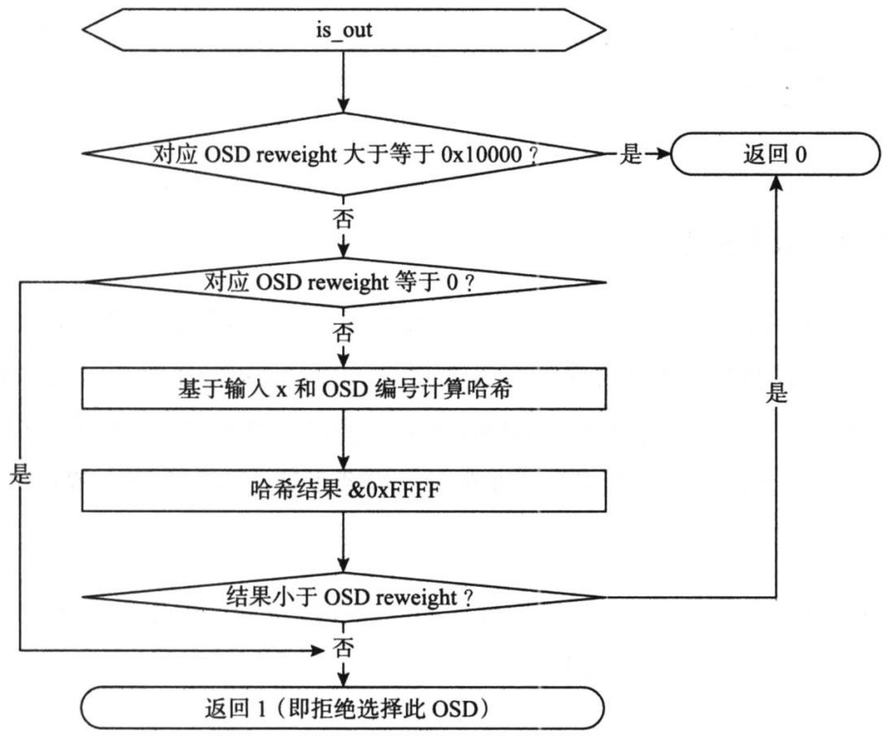


图1-4 过载测试


由测试过程可见：对应OSD的reweight调整得越高，那么通过测试的概率越高（例

如手动设置某个OSD的reweight为 $0 \times 10000$ ，那么通过测试的概率是 $100\%$ ，反之则通过测试的概率越低。因此在实际应用中，通过降低过载OSD或者（和）增加空闲OSD的reweight都可以触发数据在OSD之间重新分布，从而使得数据分布更加合理。

引入过载测试的另一个好处在于可以对OSD暂时失效和OSD被永久删除的场景进行区分，区分这两者的意义在于：如果OSD暂时失效（例如对应的磁盘被拔出超过一定时间，Ceph会将其设置为out)，可以通过将其reweight调整为0从而利用过载测试将其从候选条目中淘汰，进而将其中的数据迁移至其他OSD，这样该OSD正常回归时，将其reweight重新调整为 $0\mathrm{x}10000$ 即可将原来归属于该OSD的数据再次迁回，而迁回过程中只需要同步该OSD不在线期间产生的新数据即可，即只需要进行增量同步；相反，如果是删除OSD，此时会同步将其从对应的bucket条目中删除，这样即使该OSD后续被重新添加回集群，因为其在clustermap中的唯一编号可能已经发生了变化（参考前面的分析：条目编号会作为straw2算法输入参数之一，所以OSD编号改变会导致CRUSH选择结果产生变化），所以也可能承载与之前完全不同的数据。

初始时 Ceph 将每个 OSD 的 reweight 都设置为 0x10000，因此上述过载测试对 CRUSH 的最终选择结果不会产生任何影响。

# 1.3 调制CRUSH

按照 Ceph 的设计，任何涉及客户端进行数据寻址的场景都需要基于 CRUSH 进行计算，所以提升 CRUSH 的计算效率具有重要意义。调制 CRUSH 即针对表 1-3 中的参数进行调整，从而使 CRUSH 正常工作的同时能够花费尽可能小的计算代价，以提升性能。需要注意的是，为了使调整后的参数正常生效，需要保证客户端和服务器对应的 Ceph 版本严格一致。

调制CRUSH最简单的办法是使用现成的、预先经过验证的模板（profile），命令如下（以下命令均以Jewel版本为准）：

ceph osd crush tunables {profile} 

一些系统已经预先定义好的模板如表1-4所示


表 1-4 系统自定义 CRUSH 可调参数模板 (截至 Jewel 版本)


<table><tr><td>模板名称</td><td>说明</td></tr><tr><td>argonaut</td><td>最初的CRUSH版本，支持后备选择算法（通过设置choose_local_tries和choose_local_fallback_tries启用），该功能已被废弃。此外这个模板中choose_total_tries值为19，已经被证明在大部分用于生产环境的集群中都无法正常工作（无法选出足够的副本数）</td></tr><tr><td>bobtail</td><td>将choose_total_tries设置为经过大量生产环境验证、更合理的50；引入chooseleaf descend_once，对容灾域模式下的重试次数进行控制</td></tr><tr><td>firefly</td><td>引入chooseleafvary_r，对容灾域模式下，产生递归调用时作为下一级输入的随机因子r进行调整，降低冲突（失败）概率</td></tr><tr><td>hammer</td><td>增加straw2算法支持</td></tr><tr><td>jewel</td><td>引入chooseleaf_stable，减少不相关数据迁移</td></tr><tr><td>legacy</td><td>同argonaut</td></tr><tr><td>optimal</td><td>同jewel</td></tr><tr><td>default</td><td>同firefly，这也是一个新集群创建时默认所启用的CRUSH可调参数</td></tr></table>

> [💡 **阅读笔记：CRUSH 参数模板 Profile 内容与源码实现**](./notes/crush_profiles_and_implementation_qa.md)  
> 疑问：Profile 具体改了哪些参数？是纯概念还是代码实现？

当然，在一些特定的场景（例如集群比较大同时主机中的磁盘数量比较少）可能使用上述模板仍然无法使得CRUSH正常工作，那么此时需要手动进行参数调整。

# 1.3.1 编辑CRUSHMap

为了方便将CRUSH的计算过程作为一个相对独立的整体进行管理（因为内核客户端也需要用到），Ceph将集群的clustermap和所有的placement rule合并成一张CRUSH map，因此基于CRUSH map可以独立实施数据备份及分布策略。一般而言，通过CLI即可方便地在线修改CRUSH的各项配置，当然也可以通过直接编辑CRUSH map实现，步骤如下：

# (1) 获取 CRUSH map

大部分情况下创建集群成功后，对应的CRUSH map已经由系统自动生成，可以通过如下命令获取：

```txt
ceph osd getcrushmap -o {compiled-crushmap-filename} 
```

上述命令将输出集群的CRUSH map至指定文件。当然出于测试或者其他目的，也可以手动创建CRUSH map，命令如下：

```batch
crushtool -o {compiled-crushmap-filename} --build --num_osds Nlayer1 ... 
```

其中，--num_osds Nlayer1 ...将N个OSD从0开始编号，然后在指定的层级之间

平均分布，每个层级（layer）需要采用形如 <name, algorithm, size>（其中 size 指每种类型的 bucket 下包含条目的个数）的三元组进行描述，并按照从低（靠近叶子节点）到高（靠近根节点）的顺序进行排列，例如可以用如下命令生成图 1-2 所示集群的 CRUSH map (osd->host->rack->root):

```batch
crushtool -o mycrushmap --build --num_osds 27 host straw2 3 rack straw2 3\ root uniform 0 
```

> [💡 **阅读笔记：crushtool 中 root 层 size=0 的含义与源码**](./notes/crushtool_build_root_size_zero_qa.md)  
> 疑问：为何 root 的 size 是 0？这不是代表空 Bucket 吗？

需要注意的是，上述两种方式输出的CRUSH map都是经过编译的，需要经过反编译之后才能被正常编辑。

# (2) 反编译 CRUSH map

执行命令：

```txt
crushtool -d {compiled-crushmap-filename} -o {decompiled-crushmap-filename} 
```

即可将步骤（1）中输出的CRUSH map转化为可编辑版本，例如：

```batch
crushtool -d mycrushmap -o mycrushmap.txt 
```

# (3) 编辑 CRUSH map

得到反编译后的CRUSH map之后，可以直接以文本形式打开和编辑，例如可以直接修改表1-3中的所有可调参数：

```txt
vi mycrushmap.txt   
#begin crush map   
tunable choose_local_tries 0   
tunable choose_local_fallback_tries 0   
tunable choose_total_tries 50   
tunable chooseleaf descend_once1   
tunable chooseleafvary_r1   
tunable straw_calc_version1 
```

也可以修改 placement rule:

```txt
vi mycrushmap.txt   
# rules   
rule replicated_ruleset{ ruleset 0 type replicated min_size1 max_size10 step take root 
```

```txt
stepchooseleaffirstn0type host stepemit 
```

上述placement rule中各个参数含义如表1-5所示。


表 1-5 CRUSH map 中 ruleset 相关选项及其具体含义


<table><tr><td colspan="2">选项名称</td><td>含义</td></tr><tr><td colspan="2">ruleset</td><td>对应规则(集)的唯一编号。不同的pool可以使用不同的ruleset</td></tr><tr><td colspan="2">type</td><td>副本策略,包含如下选项:replicatederasure</td></tr><tr><td colspan="2">min_size</td><td rowspan="2">用于对选择副本数的范围进行约束</td></tr><tr><td colspan="2">max_size</td></tr><tr><td rowspan="3">step</td><td>take</td><td rowspan="3">这三个操作具体含义参考1.2.2节,这里仅对“step chooseleaf firstn 0 type host”补充说明如下:chooseleaf,容灾域模式,可以替换为choose,后者对应非容灾域模式。firstn,两种选择算法之一,可以替换为 indep。0,表示由具体的调用者指定输出的副本数,例如不同的pool可以使用同一套ruleset(拥有相同的备份策略),但是可以拥有不同的副本数。type,对应chooseleaf 操作,指示输出必须是分布在由本选项指定类型的、不同的bucket之下的叶子节点;对应choose 操作,指示输出类型</td></tr><tr><td>chooseleaf</td></tr><tr><td>emit</td></tr></table>

因此上述规则指示“采用多副本数据备份策略，副本必须位于不同主机的磁盘之上”。

# （4）编译CRUSH map

以文本形式修改后的CRUSH map，还需要经过编译，才能被 Ceph 识别，执行命令：

```css
crushtool -c {decompiled-crush-map-filename} -o {compiled-crush-map-filename} 
```

# （5）模拟测试

> [💡 **阅读笔记：crushtool 模拟测试参数与结果解析**](./notes/crushtool_test_simulation_qa.md)  
> 疑问：两个测试例子中的输入参数和输出结果各是什么意思？为什么要模拟 100000 个对象？

在新的CRUSH map 生效之前，可以先进行模拟测试，以验证对应的修改是否符合预期，例如可以使用如下命令打印输入范围为[0,9]、副本数为3、采用编号为0的ruleset的映射结果：

crushtool -i mycrushmap --test --min-x 0 --max-x 9 --num-rep 3 --ruleset 0 \ --showMappings   
CRUSH rule $0\times 0$ [19,11,3]   
CRUSH rule $0\times 1$ [15,7,21]   
CRUSH rule $0\times 2$ [26,5,14]   
CRUSH rule $0\times 3$ [8,25,13] 

```csv
CRUSH rule 0 x 4 [5,13,21]  
CRUSH rule 0 x 5 [7,25,16]  
CRUSH rule 0 x 6 [17,25,8]  
CRUSH rule 0 x 7 [13,4,25]  
CRUSH rule 0 x 8 [18,5,15]  
CRUSH rule 0 x 9 [26,3,16] 
```

也可以仅统计结果分布概况（这里输入变为[0,100000]）：

```txt
crushtool -i mycrushmap --test --min-x 0 --max-x 100000 --num-rep 3 \
--ruleset 0 --show/utilization
rule 0 (replicated/ruleset), x = 0..100000, numrep = 3..3
rule 0 (replicated/ruleset) num_rep 3 result size == 3: 100001/100001
device 0: stored : 11243 expected : 11111.2
device 1: stored : 11064 expected : 11111.2
device 2: stored : 11270 expected : 11111.2
device 3: stored : 11154 expected : 11111.2
device 4: stored : 11050 expected : 11111.2
device 5: stored : 11211 expected : 11111.2
device 6: stored : 10848 expected : 11111.2
device 7: stored : 10958 expected : 11111.2
device 8: stored : 11203 expected : 11111.2
device 9: stored : 11031 expected : 11111.2
device 10: stored : 10997 expected : 11111.2
device 11: stored : 11165 expected : 11111.2
device 12: stored : 10993 expected : 11111.2
device 13: stored : 11188 expected : 11111.2
device 14: stored : 11150 expected : 11111.2
device 15: stored : 11222 expected : 11111.2
device 16: stored : 11152 expected : 11111.2
device 17: stored : 11103 expected : 11111.2
device 18: stored : 11044 expected : 11111.2
device 19: stored : 11056 expected : 11111.2
device 20: stored : 11023 expected : 11111.2
device 21: stored : 11514 expected : 11111.2
device 22: stored : 11026 expected : 11111.2
device 23: stored : 10888 expected : 11111.2
device 24: stored : 11025 expected : 11111.2
device 25: stored : 1069 expected : 11111.2
device 26: stored : 1356 expected : 1356 
```

# (6) 注入集群

新的CRUSH map 验证充分后，可以重新注入集群，使之生效，执行命令：

```txt
ceph osd setcrushmap -i {compiled-crushmap-filename} 
```

# 1.3.2 定制CRUSH规则

在上一节中，我们介绍了编辑CRUSH map的一般方法，本节我们介绍如何对CRUSH规则进行灵活定制，以满足特定需求，我们仍将以图1-1所示的集群为例进行说明。

最常见的场景是需要提升容灾域，例如，默认的容灾域一般为 host 级别，可以提升为 rack，修改对应的 ruleset（当然也可以新建一条 ruleset）如下：

```txt
vi mycrushmap.txt   
# rules   
rule replicated_ruleset{ ruleset 0 type replicated min_size1 max_size 10 step take root step chooseleaf firstn O type rack step emit 
```

# 测试结果如下：

```csv
crushtool -i mycrushmap --test --min-x 0 --max-x 9 --num-rep 3 \
--ruleset 0 --showMappings
CRUSH rule 0 x 0 [19,15,3]
CRUSH rule 0 x 1 [15,2,18]
CRUSH rule 0 x 2 [26,5,14]
CRUSH rule 0 x 3 [8,20,13]
CRUSH rule 0 x 4 [5,13,19]
CRUSH rule 0 x 5 [7,25,10]
CRUSH rule 0 x 6 [17,25,5]
CRUSH rule 0 x 7 [13,4,18]
CRUSH rule 0 x 8 [18,8,11]
CRUSH rule 0 x 9 [26,1,16] 
```

可见此时所有副本都位于不同 rack 的 OSD 之上。

也可以限制只选择某个特定 rack（例如 rack2）下的 OSD，例如：

```tcl
vi mycrushmap.txt   
# rules   
rule replicated_rule set { ruleset 0 type replicated min_size 1 
```

```txt
max_size 10 step take rack2 step chooseleaf firstn O type host step emit 
```

# 测试结果如下：

```powershell
crushtool -i mycrushmap --test --min-x 0 --max-x 9 --num-rep 3 \
--ruleset 0 --showMappings
CRUSH rule 0 x 0 [19,21,26]
CRUSH rule 0 x 1 [20,23,26]
CRUSH rule 0 x 2 [26,20,22]
CRUSH rule 0 x 3 [22,25,18]
CRUSH rule 0 x 4 [21,26,18]
CRUSH rule 0 x 5 [21,25,19]
CRUSH rule 0 x 6 [19,25,23]
CRUSH rule 0 x 7 [21,18,25]
CRUSH rule 0 x 8 [18,24,21] 
```

可见此时所有副本都被限制在 rack2（包含 OSD 编号范围 [18,26]）之下的 OSD 上。

另外需要注意的是，在CRUSH map中，除了OSD（叶子节点）之外，其他层级关系都是虚拟的（不管其有无实际的物理实体对应），这为灵活定制CRUSH提供了更大的便利，例如在下面这个极端的例子中，我们通过新建一个虚拟的host，以此为基础限制所有副本都必须分布在编号为0、9、18这三个特定的OSD上：

```tcl
vi mycrushmap.txt   
host virtualhost { id -14 # do not change unnecessarily # weight 3.000 alg straw2 hash 0 # rjenkins1 item osd.0 weight 1.000 item osd.9 weight 1.000 item osd.18 weight 1.000 } # rules rule customized/ruleset { ruleset 1 type replicated min_size 1 max_size 10 step take virtualhost 
```

```txt
stepchooseleaffirstn0typeosd stepemit 
```

# 实际测试结果如下：

```txt
crushtool -i mycrushmap --test --min-x 0 --max-x 9 --num-rep 1 \
--ruleset 1 --showMappings
CRUSH rule 0 x 0 [0]
CRUSH rule 0 x 1 [9]
CRUSH rule 0 x 2 [9]
CRUSH rule 0 x 3 [0]
CRUSH rule 0 x 4 [18]
CRUSH rule 0 x 5 [18]
CRUSH rule 0 x 6 [18]
CRUSH rule 0 x 7 [18]
CRUSH rule 0 x 8 [18]
CRUSH rule 0 x 9 [9] 
```

更复杂的例子可以通过将上面这些例子进行适当的组合得到，这里不再赘述。

# 1.3.3 数据重平衡

在1.2节，我们曾经提及如果集群数据分布不均衡，那么通过手动调整每个OSD的reweight可以触发PG在OSD之间进行迁移，以恢复数据平衡。上述数据重平衡操作可以逐个OSD或者批量进行。

> [💡 **阅读笔记：Reweight 触发数据迁移的原理与源码**](./notes/crush_reweight_migration_mechanism_qa.md)  
> 疑问：数据迁移是纯逻辑映射还是实际数据拷贝？触发机制和触发点是什么？代码在哪？

首先查看整个集群的空间利用率统计：

```txt
ceph osd df tree 
```

找到空间利用率较高的OSD，然后逐个执行：

```txt
ceph osd reweight{osd_numeric_id} {reweight} 
```

上述命令中各个参数含义如表1-6所示


表 1-6 reweight 命令中的参数及其含义


<table><tr><td>参数</td><td>含义</td></tr><tr><td>osd_numeric_id</td><td>必选，整型。
OSD对应数字ID</td></tr><tr><td>reweight</td><td>必选，浮点类型，[0,1]。
待设置的OSD的reweight。reweight取值越小，将使得更多的数据从对应的OSD迁出</td></tr></table>

也可以批量调整，目前有两种模式：一种是按照OSD当前空间利用率（reweight-by-utilization）；另一种是按照PG在OSD之间的分布（reweight-by-pg）。为了防止影响前端业务，可以先测试执行上述命令后，将会触发PG迁移数量的相关统计（以下都以reweight-by-utilization相关命令为例进行说明），以方便规划进行调整的时机：

```txt
ceph osd test-reweight-by-utilization {overload} {max_change} \{max_osds} --no-increasing 
```

上述命令中各个参数含义如表1-7所示。


表 1-7 [test-]reweight-by-utilization 命令中的参数及其含义


<table><tr><td>参数</td><td>含义</td></tr><tr><td>overload</td><td>可选,整型,≥100;默认值为120。当且仅当某个OSD的空间利用率大于等于集群平均空间利用率的overload/100时,调整其reweight</td></tr><tr><td>max_change</td><td>可选,浮点类型,[0,1];默认值受mon_reweight_max_change控制,目前为0.05。每次调整reweight的最大幅度,即调整上限。实际每个OSD调整幅度取决于自身空间利用率与集群平均空间利用率的偏离程度——偏离越多,则调整幅度越大,反之则调整幅度越小</td></tr><tr><td>max_osds</td><td>可选,整型;默认值受mon_reweight_max_osds控制,目前为4。每次至多调整的OSD数目</td></tr><tr><td>--no-increasing</td><td>可选,字符类型。如果携带,则从不将reweight进行上调(上调指将当前underload的OSD权重调大,让其分担更多的PG);如果不携带,至多将OSD的reweight调整至1.0</td></tr></table>

例如：

```txt
ceph osd test-reweight-by-utilization 105 .2 4 --no-increasing no change  
moved 197 / 11016 (1.78831%)  
avg 344.25  
stddev 90.4592 -> 92.0923 (expected baseline 18.2618)  
min osd.11 with 61 -> 60 pgs (0.177197 -> 0.174292 * mean)  
max osd.31 with 424 -> 379 pgs (1.23166 -> 1.10094 * mean)  
load 105  
max_change 0.2  
max_change_osds 4  
average 0.156612  
overload 0.164443  
osd.20 weight 1.000000 -> 0.844574  
osd.27 weight 1.000000 -> 0.869125  
osd.31 weight 1.000000 -> 0.890121  
osd.13 weight 1.000000 -> 0.895248 
```

由输出可见，本次如果真正执行rewegith-by-utilization命令将导致：

□197个PG发生迁移。

□每个OSD承载的平均PG数目为344.25，执行本次调整后，标准方差将由90.4592变为92.0923。

□当前负载最轻的OSD为osd.11，只承载了61个PG，执行本次调整后，将承载60个PG。

□当前负载最重的OSD为osd.31，承载了424个PG，执行本次调整后，将减少到379个PG。

□执行本次调整后（命令可以重复执行），共计对osd.20、osd.27、osd.31、osd.13在内的4个OSD的reweight进行了调整。

输入以下命令将确认执行调整：

ceph osd reweight-by-utilization 105 .2 4 --no-increasing 

# 1.4 总结与展望

作为Ceph设计基础之一的CRUSH算法已经走过了10年的时间。CRUSH良好的设计理念使其具有计算寻址、高并发和动态数据均衡、可定制的副本策略等基本特性，进而能够非常方便地实现诸如去中心化、有效抵御物理结构变化并保证性能随集群规模呈线性扩展、高可靠等高级特性，因而非常适合类似于Ceph这类对可扩展性、性能和可靠性都具有严苛要求的大型分布式存储系统。

然而回到具体实现上，无论是 list 和 tree 算法被先后废弃，还是原创的 straw 算法被完全重写，无不证明 CRUSH 从来就不是完美的。兴许 CRUSH 最为人诟病之处在其引入扩展的副本策略支持之后所导致的数据不均衡问题 $\theta$ ，虽然从设计者的角度无比希望将这个问题交由 CRUSH 自身加以圆满解决，然而实现上由于 Ceph 所支持的集群可能具有复杂的层级拓扑结构使得解决这个问题困难重重而变得遥遥无期，在现阶段以及可预见的将来依然只能依托于用户进行人工干预。此外，在生产环境中，用户向社区抱怨在一些异构集群中 CRUSH 选不出足够副本数的声音从未停止，虽然可以通过针对 CRUSH 的一些参数进行调整加以解决（然而这从来就不是一件轻松的事情），但是相应的会以牺

牲CRUSH的计算性能作为代价，因此也远远无法作为一个商业级成熟软件的解决方案。最后，基于计算寻址的设计使得无论何时针对CRUSH升级都要求客户端和服务端同时进行，这通常会为内核客户端（krbd、kcephfs）类型的用户带来极大的困扰，同时因为Ceph流控机制相对薄弱，升级过程中潜在的数据迁移问题有极大可能会影响到正常业务，进而成为平滑在线升级方案中的隐患。

当然，伴随着Ceph社区的不断发展壮大，相信上述这一切最终都能够得到妥善解决。

# 第2章

# Chapter 2

# 性能之巅

# 新型对象存储引擎BlueStore

https://cloud-atlas.readthedocs.io/zh-cn/latest/ceph/arch/bluestore.html

BlueStore 最早在 Jewel 版本中引入，用于取代传统的 FileStore，作为新一代高性能对象存储后端。BlueStore 在设计中充分考虑了对下一代全 SSD 以及全 NVMe SSD 闪存阵列的适配，例如将一直沿用至今、用于高效索引元数据的 DB 引擎由 LevelDB 替换为 RocksDB (RocksDB 基于 LevelDB 发展而来，并针对直接使用 SSD 作为后端存储介质的场景做了大量优化)。FileStore 因为仍然需要通过操作系统自带的本地文件系统间接管理磁盘，所以所有针对 RADOS 层的对象操作，都需要预先转换为能够被本地文件系统识别、符合 POSIX 语义的文件操作，这个转换的过程极其繁琐，效率低下。

针对FileStore的上述缺陷，BlueStore选择绕过本地文件系统，由自身接管裸设备（例如磁盘），直接进行对象操作，不再进行对象和文件之间的转换，从而使得整个对象存储的I/O路径大大缩短，这是BlueStore能够提升性能的根本原因。除此之外，考虑到元数据的索引效率对于性能有着致命影响，BlueStore在设计中将元数据和用户数据严格分离，因此BlueStore中的元数据可以单独采用高速固态存储设备，例如使用NVMe SSD进行存储，能够起到性能加速的作用。最后，与传统机械磁盘相比，SSD普遍采用4K或者更大的块大小，因此SSD采用位图进行空间管理可以取得比较高的空间收益（机械磁盘块大小为扇区，SSD块大小为4K，假定磁盘容量均为1TB，如果使用位图管理磁盘

空间，那么两者的位图大小分别为256MB和32MB，相差8倍！现在主流SSD容量远比主流机械磁盘容量小，所以SSD对应的位图更小，使其常驻内存成为可能)，同时，因为位图相较当前主流的段索引方式而言，碎片化程度更低、效率更高，所以BlueStore的磁盘空间管理回归传统，采用位图方式。

本章按照如下形式组织：首先，我们回顾BlueStore需要重点解决的问题，以及期望具有的特性，因为BlueStore的设计理念与FileStore是如此的不同，所以几乎所有磁盘数据结构都需要重新设计；其次，BlueStore虽然绕过了本地文件系统，但是本地文件系统中诸如缓存、磁盘空间管理等技术对存储系统而言具有通用性，通过针对一些现有方案进行对比分析，我们期望找到一种高度契合BlueStore定位同时兼具优异性能的缓存/磁盘空间管理方案来和BlueStore进行适配；再次，数据库引擎是BlueStore的心脏，RocksDB作为一种通用的键值对数据库解决方案，具有高度可定制化的特性，通过对RocksDB的一些组件进行替换并合理地进行功能裁剪，我们可以从RocksDB获得更加卓越的性能表现，从而使得BlueStore心跳更加有力；最后，通过针对BlueStore上电、读写等几个关键流程进行分析，我们简要探讨了BlueStore的内部实现，并据此给出安装部署BlueStore的步骤及注意事项。

# 2.1 设计理念与指导原则

存储系统中，所有读操作都是同步的，即除非在缓存中命中，否则必须要从磁盘中读到指定的内容后才能向前端返回。写操作则不一样，一般而言，出于效率考虑，所有写操作都会预先在内存中进行缓存，由文件系统进行合适的组织后，再批量写入磁盘。理论上，数据写入缓存即可向前端返回写入完成应答，但是由于内存数据在掉电后会丢失，因此出于数据可靠性考虑，我们无法这么做。一种可行的替代方案是将数据先写入相较普通磁盘而言性能更好并且掉电后数据不会丢失的中间设备，等待数据写入普通磁盘后再释放中间设备上的相应空间。这个写中间设备的过渡过程称为写日志，中间设备相应地被称为日志设备，一般可由NVRAM或者SSD等高速固态存储设备充当。引入日志设备后，数据在写入日志设备后即可向前端应答写入完成，如果此时掉电，即使数据尚未写入普通设备，系统重新上电后也可以通过日志重放进行数据恢复。因此，日志系统的引入可以在不影响数据可靠性的基础上对写操作进行加速，包含日志的存储系统也被称为日志型存储系统。日志型存储系统一个显而易见的缺点是引入了日志设备，需要

消耗额外的硬件资源，但是因为日志空间可以回收供重复使用，所以日志设备不需要配置很大的容量，因此实现上也可以多个普通磁盘共享一个高速日志设备。除此之外，因为同一份用户数据要先后在日志设备和普通磁盘上写两次，所以日志型存储系统还存在“双写”的问题。特别的，当日志设备和普通磁盘合一时，因为“双写”问题所带来的性能损失则是灾难性的。

除了数据可靠性之外，存储系统一般而言还需要考虑数据一致性的问题，即涉及数据修改相关的操作，要么全部完成，要么没有任何变化，而不能是介于此两者之间的某个中间状态（All or nothing）。符合上述语义的存储系统也称为事务型存储系统，其最大的特点是所有的修改操作都符合事务的ACID语义。ACID，是保证事务正确执行四个基本要素的缩写，即：原子性（Atomicity）、一致性（Consistency）、隔离性（Isolation）、持久性（Durability）。一个支持事务（Transaction）语义的系统（典型如数据库），必须具有这四种特性，否则在事务执行过程中无法保证数据的正确性。

BlueStore 可以理解为一个事务型的本地日志文件系统（但是实际上存储的是对象），因为其面向下一代全闪存阵列的设计，所以 BlueStore 在保证数据可靠性和一致性的前提下，需要尽可能减小由于日志系统存在而引入的“双写”问题所带来的负面影响，以提升写性能（事实上，因为目前 Ceph 的主要商用备份策略依然是跨节点的多副本，所以 Ceph 的写性能一直为人诟病）。当前，全闪存阵列普遍使用普通 SSD 充当数据盘，为了起到写加速的作用，此时日志设备（与数据盘相对，以下简称日志盘）只能由性能更高的 NVRAM 或者 NVMe SSD 等高速固态存储设备充当。与传统阵列普遍使用机械磁盘充当数据盘、使用普通 SSD 充当日志盘不同，全闪存阵列后端固态存储介质的主要性能开销不再是寻址时间，而是数据传输时间。因此，当一次写入的数据量超过一定规模时，写入日志盘的时延和直接写入数据盘的时延不再具有明显优势（参见表 2-1），此时日志存在的必要性大大减弱。


表 2-1 不同存储介质 512KB 顺序读写时延


机械磁盘（HitachiHUA722010CLA330）与普通SSD（S3500）读/写时延相差约为64/162倍，普通SSD（S3500）和NVMe SSD（P3600）读/写时延相差约为2/4倍


<table><tr><td>磁盘类型</td><td>512KB 顺序读时延 (ms)</td><td>512KB 顺序写时延 (ms)</td></tr><tr><td>HitachiHUA722010CLA330</td><td>515.32</td><td>473.37</td></tr><tr><td>Intel S3500</td><td>8.38</td><td>2.91</td></tr><tr><td>Intel P3600</td><td>3.36</td><td>0.74</td></tr></table>

一个可行的改进方案是使用增量日志，即针对大范围的覆盖写，只在其前后非磁盘块大小对齐的部分使用日志，其他部分因为不需要执行RMW，则可以直接执行重定向写。

为了更好地理解上述改进方案，首先介绍与之相关的几个术语：

# (1) block-size (块大小)

磁盘块大小指对磁盘进行操作的最小粒度（也称为原子粒度），例如对普通机械盘而言，这个最小粒度为512字节，即一个扇区；现代SSD普遍使用更大的块大小，例如4KB。

# (2) RMW (Read Modify Write)

指当覆盖写（即改写已有内容）发生时，如果本次改写的内容不足一个磁盘块大小，那么需要先将对应的块读上来，然后将待修改内容与原先的内容进行合并（从这个角度而言，也可以将RMW中的M理解为Merge），最后将更新后的块重新写入原先的位置。RMW引入了两个问题：一是额外的读惩罚；二是因为要针对已有内容执行覆盖写，所以如果磁盘中途异常掉电，那么会导致潜在的数据损坏风险。

# (3) COW (Copy-On-Write)

指当覆盖写发生时，不是直接更新磁盘对应位置的已有内容，而是重新在磁盘上分配一块新的空间，用于存放本次新写入的内容，这个过程也称为写时重定向。当新写完成、对应的地址指针更新后，即可释放原有数据对应的磁盘空间。COW理论上可以解决RMW引入的两个问题，但是自身也存在缺陷。

首当其冲的是COW机制破坏了数据在磁盘分布的物理连续性，经过多次COW后，前端任何大范围的顺序读后续都将变成随机读，因为读性能对整个存储系统的性能表现有着至关重要的影响，所以这在机械磁盘作为主流存储介质大行其道的年代后果将是灾难性的。不过，近年来随着SSD的逐渐普及，这种情况有所好转——众所周知，机械磁盘的读写时延主要是寻道时延，所以随机读写和顺序读写时延可能相差一个数量级或以上，而SSD则不然，SSD的随机读写相较于顺序读写时延一般而言并无数量级的差异，而且因为COW机制也有将任意随机写转化为顺序写的能力，所以其对写性能也有一定的补偿作用。

其次，针对非块大小对齐的小块覆盖写，综合来看，采用COW依然得不偿失，这

是因为：

> [💡 **阅读笔记：COW "不能释放原有块" 机制解析与权衡**](./notes/cow_partial_overwrite_qa.md)  
> 疑问：为什么不能释放旧块？为什么不把旧数据读出来一起写入新块以避免浪费空间？

□将新的内容直接写入新块后，原有的块因为仍然保留了部分有效内容，所以COW之后不能释放（至少不能全部释放）。这样，这部分读惩罚会被转嫁到后续针对波及范围内的读操作本身，即执行COW之后，后续所有针对波及范围内的读操作，都需要两次或者多次读操作，再执行Merge操作后才能拼凑出前端最终需要读取的内容。显而易见，上述操作将大大影响读性能。

□因为COW涉及空间重分配和地址指针重定向，所以COW最终将引入更多元数据。对存储系统而言，元数据的多寡关乎其功能丰富与否，一般而言，元数据越多，其功能越丰富；反之，则功能相对单一。因为任何操作必然涉及元数据，所以元数据是存储系统中当之无愧的热点数据，因此如果元数据过多，导致其无法常驻缓存，那么必然会导致系统性能大打折扣。从这个角度而言，减少系统的元数据开销，特别是与空间管理相关的元数据开销（因为其与管理的空间大小成正比），对于性能的提升作用不言而喻。

了解上述基本概念后，理解BlueStore的写策略变得简单。简言之，BlueStore针对写操作综合运用了RMW和COW策略——任何一个写请求，根据磁盘块大小，将其切分为三个部分，即首尾非块大小对齐部分和中间块大小对齐部分，然后针对中间块对齐部分采用COW策略，首尾非块对齐部分采用RMW策略。考虑到RMW策略存在数据损坏的隐患，还需要针对这类操作引入日志，即将对应的数据先写入日志盘后才去真正更新数据盘，数据盘更新完成之后才能释放日志。

针对上层，BlueStore 主要提供了读写两种类型的多线程访问接口，这些接口都是基于 PG 粒度的。因为读请求之间可以并发，而写请求（这里的写请求泛指修改操作，下同）则是排它的，所以 PG 内部使用读写锁来实现上述语义。此外，因为所有读请求都是同步的，而写请求出于效率考虑一般需要设计成异步，所以实现上，还需要为每个 PG 设计一个队列，用于对所有操作该 PG 的写请求进行保序。这个队列称为 OpSequencer，不同类型的 ObjectStore 实现略有不同，在 BlueStore 的实现中，OpSequencer 主要包含两个 FIFO（First In First Out，即先进先出）队列，分别用于对写请求的不同阶段进行保序。如前所述，BlueStore 将所有写请求划分为普通和带日志两种。带日志的写请求创建后，其生命周期分为两个阶段——写日志和覆盖写数据，只有当写日志完成之后，才可以开始覆盖写数据，因为后一阶段在实现策略上使用独立的线程池完成，所以需要一个额外的队列，用于将所有进入覆盖写数据阶段的带日志写请求在线程池中再次进行排序。所

有写请求通过标准（由 ObjectStore 定义）的 queue_transactions 接口提交至 BlueStore 处理。顾名思义，通过 queue_transactions 提交的是多个事务，这些事务形成一个事务组，作为一个整体同样需要符合 ACID 语义。当前受限于 PG 实现，一个事务组并不能真正针对同一个 PG 当中的多个对象操作。

通过BlueStore提供的接口来操作PG下的某个对象，首先需要找到BlueStore中对应的PG上下文和对象上下文，因为这两类上下文保存了关键的PG和对象元数据信息，而且BlueStore通过kvDB固化这两类上下文至磁盘，所以我们首先需要了解这两类上下文的磁盘数据结构（On-Disk Format，磁盘数据结构一般需要保持相对稳定，改动时需要考虑兼容性）。

# 2.2 磁盘数据结构

相较 FileStore 而言，BlueStore 因为绕过了系统的本地文件系统，由自身接管磁盘，所以其磁盘数据结构远比 FileStore 复杂。除了 PG 和对象相应的管理结构以外，还需要大量用于组织磁盘数据（典型如将对象中一段逻辑数据映射到磁盘等）的结构。需要注意的是，每种数据结构一般都有磁盘和内存两种格式，在 BlueStore 中习惯上磁盘格式以“_t”结尾并且全部小写，而内存格式不以“_t”结尾并且只有首字母大写。另外，前面已经提及，在 BlueStore 的设计实现中，因为元数据对性能有着至关重要的影响，所以所有元数据都设计成可以和用户数据分开存放，目前统一以键值对的形式存放在 kvDB 中，推荐使用单独的、高性能 SSD/NVMe SSD/NVRAM 设备承载。

> [💡 **阅读笔记：BlueStore 元数据转 KV 存储与索引机制**](./notes/bluestore_metadata_kv_indexing_qa.md)  
> 疑问：元数据是怎么转成 KV 对的？读取时怎么通过 Key 找到物理数据？

# 2.2.1 PG

Ceph对集群中所有存储资源进行池化管理。资源池（pool，也称为存储池）实际上是一个虚拟概念，表示一组约束条件，例如可以针对一个pool设计一组CRUSH规则，限制其只能使用某些存储资源，或者尽量将所有数据副本分布在物理上隔离的、不同的安全域；也可以针对不同的pool指定不同的副本策略，例如针对时延敏感的应用采用多副本备份策略，针对一些不重要的备份数据，为提升空间利用率则采用纠删码备份策略；甚至可以分别为每个pool指定独立的scrub、压缩、校验策略等。和Linux的设计哲学类

似，Ceph将任意类型的前端数据都抽象为对象（类似Linux当中的文件）这个小巧但是精致的概念，每个对象采用一定的策略可以生成一个全局唯一的对象标识（即ObjectID，简称OID)，进一步的，基于此全局唯一的对象标识最终可以形成一个扁平的寻址空间，从而大大提升索引效率。

为了实现不同pool之间的策略隔离，Ceph并不是将任何上层数据一步到位映射到磁盘（OSD），而是引入了一个中间结构，称为PG，实现两级映射，如图2-1所示。

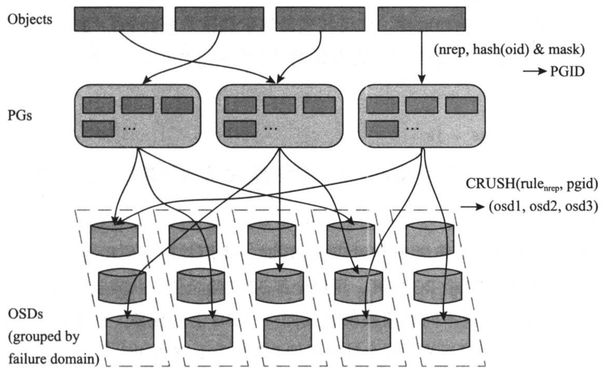


图2-1对象以PG为单位进行组织，PG通过CRUSH分布在不同安全域中的OSD之上


第一级映射是静态的，负责将任何前端类型的应用数据按照固定大小进行切割、编号后作为伪随机哈希函数输入，均匀映射至PG，以实现负载均衡策略；第二级映射实现PG到OSD的映射，这级映射仍然采用伪随机哈希函数（以保证PG在OSD之间分布的均匀性），但是其输入除了全局唯一的PGID之外，还引入了集群拓扑，并且使用CRUSH规则对计算过程进行调整，以帮助PG在不同OSD之间进行灵活迁移，进而实现数据可靠性、自动平衡等高级特性。最终，pool以PG作为基本单位进行组织，因此PG实际上是一些对象的逻辑载体（集合）。

为了维持扁平寻址空间，实际上要求PG也拥有一个全集群唯一的ID——PGID。因为集群所有的pool由Monitor统一管理，所以Monitor可以为每个pool分配一个集群内唯一的pool-id（在设计上，出于高可靠性的考虑，要求Monitor必须也是分布式的，因此为了保证生成pool-id的全局唯一性，实际上要求Monitor实现分布式一致性，当前采

用Paxos实现)。基于此，我们只需要为pool内的每个PG再分配一个pool内唯一的编号即可。我们假定某个pool的pool-id为1，创建此pool时指定了256个PG，那么容易理解这些PGID应当具有形如1.0，1.2，...，1.255这样的格式。

Ceph 通过 C/S（Client/Server）模式实现外部应用和存储集群之间的数据交互。

> [💡 **阅读笔记：客户端如何定位并选择目标 OSD**](./notes/client_osd_location_mechanism_qa.md)  
> 疑问：客户端生成对象名后，怎么知道该将请求发送给哪个服务端？

任何时候，客户端需要访问集群时，首先由特定类型的 Client 根据其操作的对象名（例如针对 RBD 应用，对象名是由 RBD Client 负责生成的，形如“rbd_data.12d72ae8944a.0000000000000002a7”的字符串），计算出一个 32 位的哈希值，然后根据其归属的 pool 及此哈希值，通过简单的运算，例如取模，即可找到最终承载该对象的 PG。假定 pool-id 为 1 的 pool 当中的某个对象，经过计算后 32 位的哈希值为 0x4979FA12，该 pool 配置的 PG 数目为 256，则：

$$
0 \times 4 9 7 9 F A 1 2 \mod 2 5 6 = 1 8
$$

由此，我们知道此对象由pool内编号为18的PG负责承载，同时可以得到其对应的完整PGID为1.18。

一般而言，将每个对象映射至对应的PG时，我们并不会使用全部的32位哈希值（按照每个OSD承载100个PG估算，用掉全部32位哈希值一共需要集群拥有42949672个OSD！），因此会出现不同对象被映射到同一个PG上的现象。例如我们很容易验证pool内的如下对象通过模运算同样会被映射到PGID为1.18的PG上：

$$
\begin{array}{l} 0 \times 4 9 7 9 F B 1 2 \mod 2 5 6 = 1 8 \\ 0 \times 4 9 7 9 F C 1 2 \mod 2 5 6 = 1 8 \\ 0 \times 4 9 7 9 F D 1 2 \mod 2 5 6 = 1 8 \\ \dots \end{array}
$$

可见，针对这个例子，我们仅使用了这个“全精度”32位哈希值的后8位。因此，如果pool内的PG数目可以写成 $2^{n}$ 的形式（例如这里256可以写成 $2^{8}$ ），即可以被2整除时，容易验证前端每个对象执行到PG映射时，其低 $n$ 比特是有意义的；进一步地，我们很容易验证此时归属于同一个PG的对象，其32位哈希值中低 $n$ 比特都是相同的，基于此，我们将 $2^{n} - 1$ 称为PG的掩码，其中 $n$ 为PG掩码的位数。相反，如果PG数目不能被2整除，即无法写成 $2^{n}$ 形式，仍然假定此时其最高位为 $n$ （说明：从1开始计数），则此时我们使用普通的取模操作无法保证“归属某个PG下的所有对象其低 $n$ 比特都相同”这个特性。例如假定PG数目为12，此时 $n = 4$ ，容易验证对于如下序列，其哈希值只有低2比特是相同的：

```txt
0x00 mod 12 = 0  
0x0C mod 12 = 0  
0x18 mod 12 = 0  
0x24 mod 12 = 0 
```

因此需要针对普通的取模操作加以改进，以保证针对不同的输入，当其结果相等时，维持“这些输入具有尽可能多的相同的低比特位”这样一个相对“稳定”的特性。

一种改进的方案是使用掩码来替代取模操作，例如仍然假定PG数目对应的最高比特位为 $n$ ，则其掩码为 $2^{n} - 1$ ，需要将某个对象映射至PG时，直接执行hash & $(2^{n} - 1)$ 即可。但是这个改进方案仍然存在一个潜在问题——如果PG数目不能被2整除，那么直接采用这种方式进行映射会产生空穴，即将某些对象映射到一些实际上并不存在的PG上，如图2-2所示。

<table><tr><td>0</td><td>1</td><td>2</td><td>3</td><td>4</td><td>5</td><td>6</td><td>7</td><td>8</td><td>9</td><td>10</td><td>11</td><td>12</td><td>13</td><td>14</td><td>15</td></tr></table>

图2-2 使用掩码方式进行对象至PG映射这里PG数目为12， $n = 4$ ，可见执行hash $\& (2^{4} - 1)$ 会产生 $0\sim 15$ 共计16种不同的结果而实际上编号为 $12\sim 15$ 的PG并不存在

因此需要进一步对上述改进方案进行修正。由 $n$ 为PG数目中的最高比特位，必然有：

PG数目 $\geqslant 2^{n - 1}$ 

即 $[0, 2^{n-1}]$ 内的 PG 必然都是存在的，于是可以通过 hash & $(2^{n-1}-1)$ 将那些实际上并不存在的 PG 重新映射到 $[0, 2^{n-1}-1]$ 区间，如图 2-3 所示。

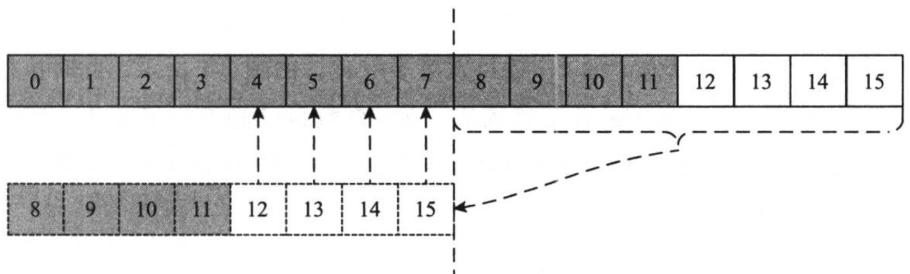


图2-3 使用修正后的掩码方式对图2-2中的映射结果进行校正，效果等同于将这些空穴通过平移的方式重定向到前半个对称区间


这样，退而求其次，如果PG数目不能够被2整除，我们只能保证相对每个PG而

言，映射到该PG下的所有对象，其低 $n - 1$ 比特都是相同的。改进后的映射方法称为stable_mod，其逻辑如下：

if ((hash & (2 $^n$ - 1)) < pg_num) return (hash & (2 $^n$ - 1)); else return (hash & (2 $^{n-1}$ -1)); 

仍然以PG数目等于12为例，可以验证对于如下序列，采用stable_mod方式可以保证其输入的低 $n - 1 = 3$ 比特都是相等的：

```txt
0x05 stable_mod 12 = 5  
0x0D stable_mod 12 = 5  
0x15 stable_mod 12 = 5  
0x1D stable_mod 12 = 5 
```

综上，无论PG数目是否能够被2整除，使用stable_mod都可以产生一个最好的、相对稳定的结果，这是PG分裂的一个重要理论基础。

Ceph的主要设计理念之一是高可扩展性。初期规划的Ceph集群容量一般而言都会偏保守，无法应对随着时间推移而呈爆炸式的数据增长需求，因此扩容成为一种常态。对Ceph而言，需要关注的一个问题是扩容前后负载在所有OSD之间的重新均衡——即如何能让新加入的OSD立即参与负荷分担，从而实现集群性能与规模呈线性扩展这一优雅特性。在Ceph的实现中，这是通过PG自动迁移和重平衡实现的，然而遗憾的是存储池中的PG数目并不会随着集群规模增长而自动增加，这在某些场景下往往会导致潜在的性能瓶颈（相关的分析我们将在第4章中进行）。为此，Ceph提供了一种手动增加存储池中PG数目的机制。当集群中的PG数目增加后，新的PG会被随机、均匀地映射至所有OSD之上，又因为存储池中的PG数目发生了变化，由图2-1所示，此时执行前端对象至PG的映射时，作为stable_mod输入之一的PG数目已经发生了变化，所以会导致某些对象也被从老PG中重新映射至新PG中，因此需要同步转移这部分对象。上述过程称为PG分裂，具体步骤如下：

> [💡 **阅读笔记：PG 分裂机制、倍增原理与实践建议**](./notes/pg_splitting_mechanism_qa.md)  
> 疑问：什么时候该分裂？为什么必须倍增？pg_num 和 pgp_num 怎么配合？

1）Monitor检测到pool中的PG数目发生修改，发起并完成信息同步，随后将包含了变更信息的新OSDMap推送至相关的OSD。

2）OSD接收到新OSDMap，与老OSDMap进行对比，判断对应的PG是否需要进

行分裂。如果新老OSDMap中某个pool的PG数目发生了变化（Ceph目前只支持增加pool中的PG数目），则需要执行分裂。

3）假定这个pool老的PG数目为 $2^{4}$ 、新的PG数目为 $2^{6}$ ，以pool中某个老PG（ $\mathrm{PGID} = \mathrm{Y.X}$ ，其中 $\mathrm{X} = 0\mathrm{bX}_3\mathrm{X}_2\mathrm{X}_1\mathrm{X}_0$ ）为例，容易验证其中已有对象的哈希值都可以分成如图2-4所示的四种类型（按前面的分析，分裂前后，对象哈希值中只有低6比特有效，图中只展示这6个比特）：

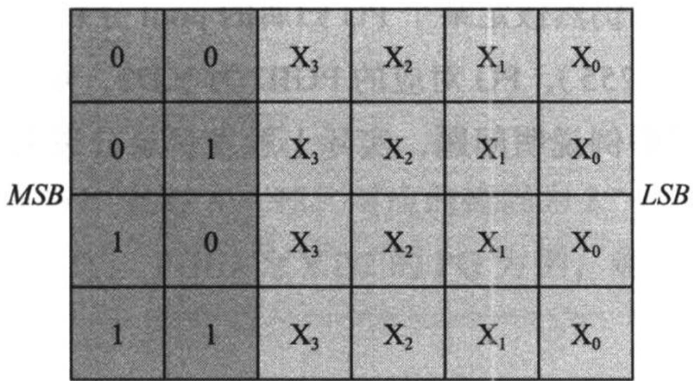


图2-4PG分裂（ $2^{4} - > 2^{6}$ ）过程中，对象哈希值特征


依次针对这四种类型的对象使用新的PG数目再次执行stable mod，结果如表2-2所示。


表 2-2 针对 PG (Y.X) 使用新的 PG 数目 $\left( {{2}^{4} -  > {2}^{6}}\right)$ 重新执行 stable mod


<table><tr><td>对象哈希值(32位,二进制)</td><td>执行stable_mod结果(X=0b X3X2X1X0)</td></tr><tr><td>0b????????????????????????????00 X3X2X1X0</td><td>X</td></tr><tr><td>0b?????????????????????????????01 X3X2X1X0</td><td>1*16+X</td></tr><tr><td>0b?????????????????????????????10 X3X2X1X0</td><td>2*16+X</td></tr><tr><td>0b?????????????????????????????11 X3X2X1X0</td><td>3*16+X</td></tr></table>

可见，切换到新的OSDMap后，因为PG数目发生了变化，仅有第一种类型（ $\mathrm{X}_5\mathrm{X}_4 = 00$ ）的对象使用stable_mod方法仍然能够映射到老的PG上，其他三种类型的对象并无实际PG对应，因此我们需要创建3个新的PG（容易验证这3个新的PG在存储池内的编号可以通过 $(\mathfrak{m}^{*}16) + \mathrm{X},\mathrm{m} = 1,2,3$ 得到），来转移部分来自老PG上的对象，使得客户端更新到最新的OSDMap后，使用stable_mod方法仍然能够重定向到正确的PG上。

针对所有老的PG重复上述过程，最终可以将存储池中的PG数目调整为原来的4倍，即 $2^{6}$ ，又因为在调整PG数目的过程中，我们总是基于老的PG（称为祖先PG）产生新的孩子PG，并且新的孩子PG中最初的对象全部来自于老的PG，所以这个过程被形

象地称为PG分裂。在FileStore实现中，因为PG对应一个文件目录，其下的对象全部使用文件保存，所以出于索引效率和PG分裂的考虑，FileStore对目录下的文件进行分层管理。采用stable_mod执行对象至PG的映射后，因为同一个PG下的所有对象，总是可以保证它们的哈希值至少低（ $n - 1$ ）比特是相同的，所以一个自然的想法是使用对象哈希值逆序之后作为目录分层的依据（同时也能满足上层应用需要按照某种顺序遍历PG下所有对象的需求），例如假定某个对象的32位哈希结果为0xA4CEE0D2，则其可能的一个目录层次为./2/D/0/E/E/C/4/A/0xA4CEE0D2，这样我们最终可以得到一个符合常规的、树形的目录结构。例如仍然假定某个PG归属的pool分裂之前共有256个PG（此时 $n = 8$ ，对应的掩码为 $2^{8} - 1 = 255$ ），PG对应的PGID为Y.D2，则某个时刻其一个可能的目录结构为（这里仅仅为了举例说明问题，实际上触发目录分裂需要当前目录下的文件数目超过某个阈值）：

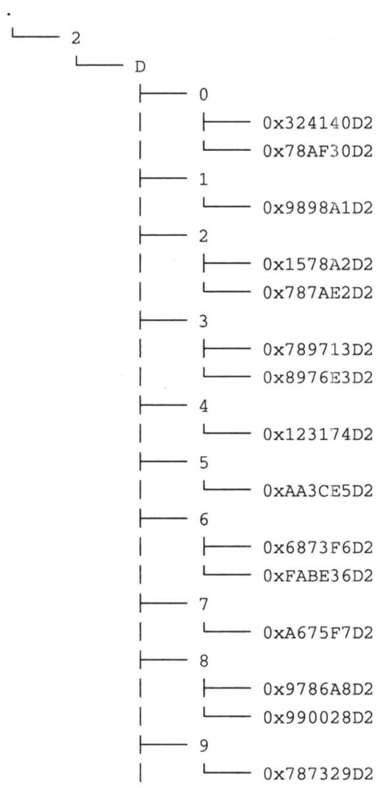


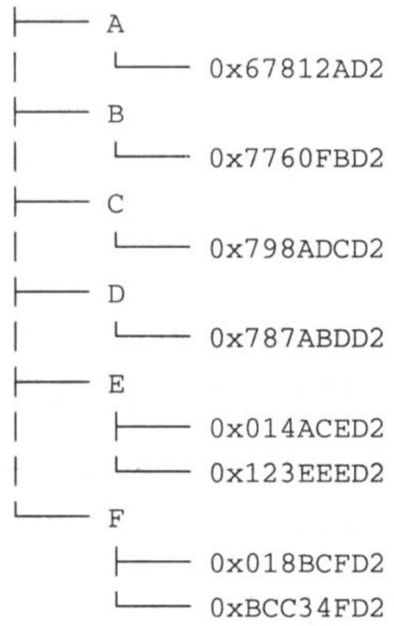


如果分裂为4096个PG（此时 $n = 12$ ，对应的掩码为 $2^{12} - 1 = 4095$ ），则原来每个PG对应分裂成16个PG，仍然以PGID为Y.D2的PG为例，通过简单计算可以得到这15个新PG的PGID分别为：

```txt
Y.1D2  
Y.2D2  
...  
Y.ED2  
Y.FD2 
```

可见这些新的PG对应的对象分别存储于老PG的如下目录：

```txt
./2/D/1/  
./2/D/2/  
...  
./2/D/E/  
./2/D/F/ 
```

因此，此时可以不用移动对象（文件），而是直接修改文件夹的归属即可完成底层对象在PG之间的转移。

引入PG分裂之后，如果仍然直接使用PGID作为CRUSH输入，据此计算新增孩子PG在OSD之间的映射结果，因为此时每个PG的PGID都不相同，那么将引发大量新增孩子PG在OSD之间迁移。考虑到分裂之前PG在集群OSD之间的分布已经趋于均衡，更好的办法是让同一个祖先诞生的孩子PG和其保持相同的分布，这样当分裂完成之后，整个集群的PG分布仍然是均衡的。为此，每个存储池除了记录当前的PG数目之外，为了应对PG分裂，还需要记录分裂之前祖先PG的个数，后者称为PGP数目（pgp_num）。

最后，利用CRUSH将每个PG分布到不同安全域中的OSD之上时，我们不是直接使用PGID，而是转而使用其在存储池内的唯一编号针对PGP数目执行stable_mod，再和pool-id一起，哈希之后作为CRUSH的特征输入（即x），从而保证每个孩子PG和其祖先取得相同的CRUSH计算结果（因为此时同一个祖先的孩子PG产生的x都相同）。

新的BlueStore实现中，因为同一个OSD下所有对象共享一个扁平的寻址空间，所以PG分裂时，甚至不需要类似FilesStore执行分裂时对象在不同文件夹之间转移的过程，因而更加高效。PG对应的磁盘数据结构称为bluestore_cnode_t（后续简称cnode），定义见表2-3，目前仅包含一个字段，用于指示执行stable_mod时，PG的掩码位数。


表 2-3 bluestore_cnode_t


<table><tr><td>成员</td><td>含义</td></tr><tr><td>bits</td><td>指示归属于PG的对象，在执行到PG的映射过程中，其32位的全精度哈希值（从低位开始计算）有多少位是有效的</td></tr></table>

# 2.2.2 对象

BlueStore中的对象非常类似于文件，例如每个对象拥有BlueStore实例内唯一的编号、独立大小、从0开始进行逻辑编址、支持扩展属性等，因此对象的组织形式，也是采用类似文件的形式，基于逻辑段（extent）进行的。

参考文件系统，原理上，每个extent都可以写成形如——{offset，length，data}的三元组形式，各成员含义如表2-4所示。


表 2-4 extent 抽象类型


<table><tr><td>成员</td><td>含义</td></tr><tr><td>offset</td><td>对象内逻辑偏移，从0开始编址</td></tr><tr><td>length</td><td>逻辑段长度</td></tr><tr><td>data</td><td>逻辑段包含的数据，为抽象数据类型</td></tr></table>

其中 data 是个抽象数据类型，主要用于从磁盘上索引对应逻辑段包含的用户数据。考虑到磁盘空间碎片化严重时，我们可能无法保证为每个逻辑上连续的段（即 extent）分配物理上也连续的一段空间，所以逻辑段和磁盘上的物理空间段应该是一对多的关系，因此 data 在设计上主要包含一些物理空间段的集合，每个段对应磁盘上的一块独立存储空间，BlueStore 称为 bluestore_pextent_t（简称 pextent），其成员如表 2-5 所示。


表 2-5 bluestore_pextent_t


<table><tr><td>成员</td><td>含义</td></tr><tr><td>offset</td><td>磁盘上的物理偏移</td></tr><tr><td>length</td><td>长度</td></tr></table>

前面已经提及，出于访问效率考虑，磁盘的最小访问单元不可能设计为比特，而是块大小，所以 pextent 中的 offset 和 length 也必须是块大小对齐的。因此，如果 extent 中的 offset 不是块大小对齐的，则上述物理空间强制对齐约束会使得 extent 的逻辑起始地址和对应的物理起始地址之间产生一个偏移；相应的，如果 extent 中的 length 不是块大小对齐的，则 extent 中的逻辑结束地址和对应的物理结束地址也可能产生一个偏移。后面我们将会看到，这两个偏移的存在将大大增加数据处理的难度。

因为extent是对象内的基本数据管理单元，所以很多扩展功能——例如数据校验、数据压缩、对象间的数据共享等，都是基于extent粒度实现的，下面分别予以阐述：

# （1）数据校验

数据校验指对数据实施正确性检测。任何我们使用的计算机组件都不是完美的，因此都可能产生静默数据错误（Silent Data Corruption）。静默数据错误，顾名思义，是不能被计算机组件自身觉察的错误，因此其潜在危害性极大。单个组件静默数据错误出现几率极低，参考欧洲原子能研究机构——CERN的研究报告 $\Theta$ ，一般在 $10^{-7}$ 水平，因而极易被忽略，但是因为每个组件都可能发生（例如磁盘、RAID 5 控制器、内存等），如果考虑长时间海量数据的场景，那么静默数据错误的产生几乎是必然的。

解决静默数据错误的主要手段是引入校验和，即采用某种特定的校验算法，使用原始数据作为输入，得到固定长度输出，此输出即为校验和。之后将校验和与原始数据分开存储，后续读取数据时，分别读取原始数据与校验和，然后针对原始数据重新计算校验和。如果此校验和与之前保存的校验和相等，那么认为数据是正确的，反之则认为数据出错。这里存在的一个潜在问题是：如果重新计算出来的校验和，与之前保存的校验和不相等，那么我们到底应该认为是原始数据出错，还是保存的校验和出错了呢？BlueStore 的解决方案比较简单，它直接将校验和单独使用 kvDB 保存，借助于数据库的 ACID 特性，我们知道校验和总是可靠的，因此如果重新计算出来的校验和与 kvDB 保存的校验和不一致，则可以断定是原始数据出错。

一种设计良好的校验算法应当具有极低的冲突概率（指使用不同输入得到相同输出的概率，显然冲突概率越低，说明校验算法发生误检的可能性越小，对应的校验算法越好），当然这也取决于输出长度，例如针对同一种算法，输出64位校验和显然比输出32位校验和冲突的概率要低得多，因为前一种算法可能输出 $2^{64}$ 种不同的结果，而后一种算法只能输出 $2^{32}$ 种不同的结果。此外，冲突概率一般还和校验算法的执行效率相关，一般而言，更低的冲突概率总是对应更复杂的计算过程，使得整个校验算法执行效率低下，因此实际选择校验算法时，也不能一味追求低冲突概率，而是需要根据自身需求在这两者（冲突概率和执行效率）之间进行权衡。

当前主流的校验算法有CRC、xxhash等（BlueStore默认都支持），可以根据配置项灵活进行选择。

# （2）数据压缩

数据压缩针对原始数据进行转换，以期得到长度更短的输出，目的是为了节省磁盘空间。与数据校验不同，数据压缩的转换过程必须是可逆的，即采用输出作为输入，我们反过来可以还原得到原始数据，后面这个过程称为数据解压缩。

常见的压缩算法大多是基于模式匹配的，因此一般而言，其过程迭代次数决定了压缩收益，这意味着对大多数压缩算法而言，更高的压缩比几乎总是对应更多的性能损耗（因为需要更多的迭代次数，即更长的压缩时间）。因此实际选用压缩算法时，同样需要考虑在这两者（压缩收益和执行效率）之间进行权衡。

采用数据压缩算法需要固化两个关键信息——一是选用的压缩算法；二是压缩后的数据长度。BlueStore 使用压缩头保存这两个信息，如表 2-6 所示。

需要注意的是：不同于其他元数据，压缩头是和压缩后的数据一起保存的，这主要是因


表 2-6 bluestore_compression_header_t


<table><tr><td>成员</td><td>含义</td></tr><tr><td>type</td><td>压缩算法类型</td></tr><tr><td>length</td><td>数据压缩后的长度</td></tr></table>

为存储压缩头也需要额外的磁盘空间，所以需要纳入到压缩后的数据之中，据此一并计算压缩收益，即压缩率。当压缩率小于某个阈值（目前为0.875，亦即要求至少压缩掉原始数据长度的1/8），即如果采用压缩算法获得的净收益太小，BlueStore将拒绝压缩。

> [💡 **阅读笔记：压缩后 Extent 的不完全覆盖写方案解析**](./notes/compressed_extent_partial_overwrite_qa.md)  
> 疑问：方案二（重定向写）是否也需要像方案一那样读旧数据并解压？

引入数据压缩的一个重大缺陷在于其对不完全覆盖写的负面影响。假定我们需要针对某个压缩后的extent执行不完全覆盖写，一般而言有两种方案：一是先将对应的内容从磁盘上读出来，解压缩，然后再执行正常的覆盖写流程；二是直接执行重定向写，即

完全重新分配一个extent，且允许其与需要被覆盖写的extent存在部分重合的内容。其中，方案一的缺点在于严重影响写效率；方案二的缺点一是存在空间浪费，二是增加了元数据，使得读操作效率降低。而且因为压缩可以重复进行，即新分配的extent又可以再次执行压缩，所以多次不完全覆盖写后，采用方案二对象当中的部分内容可能被多个extent重复保存多次，进一步浪费空间和降低性能，有违引入压缩算法的初衷。

目前BlueStore是基于方案二实现数据压缩策略的，因为这远非一种完美的压缩策略，所以默认没有开启。

# （3）数据共享

数据共享主要是指extent在不同对象间的共享，基于extent的数据共享一般由对象克隆操作引入。当某个extent的数据被多个extent共享时，需要使用一个中立结构来表明这些数据的共享信息。这些信息主要包含共享数据的起始地址、数据长度和被共享的次数。因此，这个中立结构由形如——{offset，length，refs}三元组记录组成，BlueStore称为bluestore_shared_blob_t，其主要内容是一张基于extent的引用计数表。因为这张表在对象之间共享，所以需要和对象分开，单独进行存储。

extent之间除了数据共享之外，还存在一种比较特殊的共享方式——存储空间共享。因为BlueStore自身管理磁盘空间，所以可以自定义最小可分配空间。一般情况下，这个最小可分配空间和磁盘块大小相等，但是出于分配效率考虑（更大的块大小对应更小的位图，从而也对应着更快的索引速度），也可以将其提升为块大小的整数倍。例如假定磁盘块大小为4K、最小可分配空间为16K，此时即使写入1个字节的数据，也需要为之分配16K的磁盘空间，但是实际上这已分配的16K空间中，只有一个4K的块真正被使用，其他3个块均未被使用，因此存在被其他extent共同使用的可能。

至此，我们已经讨论了extent三元组中的data抽象数据类型目前所期望支持的所有特性

> [💡 **阅读笔记：Blob 与 Extent 的关系及源码对应**](./notes/bluestore_blob_extent_relation_qa.md)  
> 疑问：表 2-7 和表 2-8 是什么关系？PExtentVector 属于哪个表？

据此可以定义其磁盘数据结构如表2-7所示（BlueStore称为bluestore_blob_t，简称blob）。


表 2-7 bluestore_blob_t


<table><tr><td colspan="2">成员</td><td>含义</td></tr><tr><td colspan="2">extents</td><td>磁盘上的物理段集合，单个extent的类型为bluestore_pextent_t</td></tr><tr><td colspan="2">成员</td><td>含义</td></tr><tr><td rowspan="4">flags</td><td>FLAG MUTABLE</td><td>blob对应数据可以被修改,例如没有被压缩</td></tr><tr><td>FLAG_COMPRESSED</td><td>blob对应数据经过压缩</td></tr><tr><td>FLAG_CSUM</td><td>blob对应数据经过校验</td></tr><tr><td>FLAG_has UNUSED</td><td>blob物理空间中包含未被使用的块</td></tr><tr><td colspan="2">unused</td><td>blob所有未被使用物理块的集合。以块大小为单位对整个blob的物理空间进行划分,使用单个比特标识每个区域的状态,如果置位,表明该区域包含用户数据;反之表明该区域不包含任何用户数据</td></tr><tr><td colspan="2">compressed_length_orig</td><td rowspan="2">压缩控制。分别对应压缩前后用户数据长度</td></tr><tr><td colspan="2">compressed_length</td></tr><tr><td colspan="2">csum_type</td><td rowspan="2">校验控制。csum_type用于指定一种校验算法类型,典型如CRC32。csum_chunk_order用于指定计算校验和时,每次输入的原始数据块大小,例如共计16K的原始数据,csum_chunk_order为12,则每次输入4K(212)原始数据计算其校验和,共需要16K/4K=4次才能完成校验。值得注意的是,每次计算得到的校验和,其长度是固定的,具体取决于所选择的校验算法,例如选择CRC32,则每次输入4K的原始数据,总是得到固定4个字节的校验和。csum_data用于保存具体的校验和。因为BlueStore使用kvDB保存校验和,测试结果表明每个键值对中键或者值长度超过一定范围时,kvDB的操作效率会显著降低,所以出于性能考虑,我们一般会限制单个blob所能保存数据的最大长度,进而限制产生的检验和长度。假定此时校验算法选择CRC32,blob允许保存的最大数据长度为512KB,那么至多会产生(512K/4K)*4=512字节长度的校验数据,以免显著降低kvDB的访问性能(注意:出于同样的原因,我们会将对象的extent map切成若干个更小的集合进行存储,参考下文)</td></tr><tr><td colspan="2">csum_data</td></tr></table>

相应的extent磁盘数据结构见表2-8。


表 2-8 extent


<table><tr><td>成员</td><td>含义</td></tr><tr><td>logical_offset</td><td>逻辑段起始地址</td></tr><tr><td>length</td><td>逻辑段长度</td></tr><tr><td>blob</td><td>负责将逻辑段内的数据映射至磁盘，参考表2-7</td></tr><tr><td>blob_offset</td><td>当logical_offset不是磁盘块大小自然对齐时，将对应逻辑段内的数据通过blob映射到磁盘物理段（或者集合中）会产生物理段内的偏移，这个偏移称为blob_offset；反之如果logical_offset天然块大小对齐，则blob_offset始终为0</td></tr></table>

表中logical_offset、length和blob_offset几个成员的关系如图2-5所示。

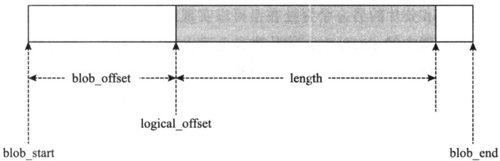


图2-5 extent中的逻辑段与物理段之间的关系


同一个对象下所有extent可以进一步组成一个extent map，据此可以索引本对象下的所有有效数据。需要注意的是：因为支持稀疏写，所以extent map中的extent 可以是不连续的（即extent map 中的相邻两个 extent，前一个extent 的逻辑结束地址小于后一个extent 的逻辑起始地址），因此extent map中可能存在空穴。此外，如果单个对象内的extent 过多（例如小块随机写），或者磁盘碎片化严重等，都可能导致整个extent map编码之后变得十分臃肿，从而严重影响kvDB的访问效率，所以需要对超过一定大小的

extent map 进行分片，并且将这些分片信息从归属对象的元数据信息中独立出来，单独保存。这些分片信息 BlueStore 称为 shard_info，其关键数据成员如表 2-9 所示。

表 2-9 shard_info


<table><tr><td>成员</td><td>含义</td></tr><tr><td>offset</td><td>分片对应的逻辑起始地址</td></tr><tr><td>bytes</td><td>分片编码后的长度</td></tr></table>

> [💡 **阅读笔记：Blob 被相邻 Extent 共享及分片问题**](./notes/bluestore_blob_spanning_shard_qa.md)  
> 疑问：为什么一个 Blob 会被多个 Extent 共享？分片时为什么会有归属问题？

针对extent map进行分片并不是一个十分精确的过程，即我们只需要保证每个分片进行编码后，其长度落在一个指定的、相对宽松的范围内即可。因此实现时，总是基于上一次的分片信息预先估算当前extent map每个extent编码后的平均大小，再以此计算本次分片过程中每个新分片的逻辑起始地址和逻辑结束地址，作为后续真正将extent map编码存盘时的依据。由于不是基于精确计算（即不是先将每个extent编码之后，再确定分片信息），这个分片过程有时可能需要进行多次；此外，如果某个blob被两个相邻的extent共享，而这两个extent又恰好隶属于两个不同的分片范围，那么会因为该blob“跨越”两个分片而无法确定其归属，此时BlueStore将优先针对该blob执行分裂操作，如果分裂失败（例如由于该blob被压缩、设置了FLAG_SHARED标志等），则将该blob加入 spanning_blob_map，后续将整个spanning_blob_map和对象的其他元数据（例如onode，参考下文）一并作为单条记录进行保存（BlueStore假定单个对象内这类blob数量不是很多）。

针对extent map 分片的另一个好处在于可以实现对于 extent 的按需加载，即只有需要访问特定分片范围内的 extent 时，才从磁盘上读出对应的分片，通过解码还原出该分片内的所有 extent 至 extent map；同样，当某个分片内的 extent 被修改时，也只需要更新对应的分片即可。这样做一方面减少了常驻内存的元数据数量，另一方面也减少了操作对象上下文时波及的元数据数量，两者都有助于改善性能。

> [💡 **阅读笔记：extent map 代码定义与表 2-10 的对应关系**](./notes/extent_map_code_definition_qa.md)  
> 疑问：extent map 在源码中在哪里定义？表 2-10 的成员对应哪些代码？

综上我们可以定义extent map的磁盘数据结构（实际上也包含部分内存数据结构，BlueStore未进行严格隔离）如表2-10所示。


表 2-10 extent map


<table><tr><td colspan="2">成员</td><td>含义</td></tr><tr><td colspan="2">extent_map</td><td>逻辑段集合</td></tr><tr><td rowspan="5">shards</td><td>key</td><td>将extent map对应的分片写入kvDB,需要全局唯一的key,这个key由对应的对象key + 分片的起始逻辑地址+固定的“x”后缀组成</td></tr><tr><td>offset</td><td>分片的逻辑起始地址</td></tr><tr><td>shard_info</td><td>参见表2-9。因为extent map独立于对象存储,所以对象的磁盘结构中也需要相应的固化一些关键信息,用于从kvDB中还原extent map</td></tr><tr><td>loaded</td><td>对象上下文从kvDB加载时,我们并不需要同步加载完整的extent map,只有当对应范围内的extent被访问时,才从kvDB加载包含该extent的分片。本标志位指示对应的分片已经从kvDB中加载</td></tr><tr><td>dirty</td><td>指示对应分片中的extent被修改过,后续需要对本分片重新编码、存盘</td></tr><tr><td colspan="2">spanning_blob_map</td><td>对象内所有跨越两个分片的blob集合</td></tr></table>

至此，我们已经分析得到了BlueStore中构建一个对象的所有关键元素，下面我们开始介绍对象的磁盘数据结构，BlueStore称为bluestore_onode_t，简称onode。

介绍 onode 之前，首先澄清一个容易混淆的概念——即 BlueStore 看到的对象和上层看到的对象，这两者实际上并不相同。原则上，BlueStore 只需要通过一个唯一索引和上层对象建立联系即可，因为上层的每个对象具有全局唯一的 OID，所以这个索引可以直接由 OID 充当。但是随着 Ceph 本身的发展，我们不断地往对象中追加诸如命名空间、快照等一些与特定应用绑定的关键信息，这些信息虽然对 BlueStore 而言并不可见，但是会使得 OID 全局唯一性丧失（例如快照的引入，使得两个不同的对象拥有相同的 OID 但是不同的快照 ID），所以这些额外信息也需要在执行上层对象至 onode 的映射过程中一并考虑。

老的 FileStore 直接将上层对象进行转义后作为文件名存储（如果转义后的文件名仍然很长，例如超过 255 个字符，FileStore 还需要再次执行哈希），BlueStore 做法类似，但是因为所有对象相关的元数据都使用 kvDB 存储，所以转义后的对象名不是作为文件名而是作为 kvDB 表中的唯一索引。转义的过程主要有两个关注点：一是在包含所有必要信息的前提下，尽可能地减少转义后的字符串长度，这是因为无论转义后的对象名作为文件名还是 DB 索引，长度之于性能都有着至关重要的影响；二是区分对象名中定长和非定长部分——原始对象名中，既有诸如 OID 和命名空间等长度不定的字符串，也有哈希、快照 ID 等定长整数类型，实现时需要将这两种类型进行区别对待，以提升编码效率。转义过程具体描述如下：

1）所有定长整型部分，直接转换为等宽的字符串，例如32位的哈希值0x30313233，编码后对应字符串“1234”（注意，存储一个char类型需要一个Byte，即8个比特；另外能够这样做对于选用的kvDB有要求，例如不能将0x00作为默认的字符串结束符）。

2）所有变长字符串部分，需要进行字符串转义，以界定其结束位置。具体实现时，BlueStore将原字符串中任意小于等于'#'的字符，都转换为长度固定为3、形如"#XY"的字符串；将原字符串中任意大于等于'\~'的字符，都转换为长度固定为3、形如"\~XY"的字符串；最后再将转换后的字符串使用!!作为结束符（因为!!小于'#'，所以如果!!出现在原始字符串中，将被转义，亦即原始字符串中经过处理后不可能出现!!字符）。

3）依次将原始对象名中的所有成员按照上述原则进行预处理后，再按照固定顺序直接拼接成一个完整的字符串即可。

建立上层对象至 onode 的映射关系后，即可以通过对象名索引到 onode。和 FileStore 类似，onode 也包含四个部分，分别为：数据、扩展属性、omap 头部和 omap 条目。数据及扩展属性和文件系统中文件相关概念类似；omap 存储的内容则和扩展属性十分类似，但是两者分别位于不同的地址空间，换言之，omap 当中的某个条目可以和扩展属性拥有相同的键但是不同的值（内容）；另外，一般的文件系统对于扩展属性长度都有限制（典型如 XFS 限制单个扩展属性长度至多为 4K），但是使用 omap 则无此限制，从这个角度而言，也可以认为扩展属性只适用于保存少量小型属性对，而 omap 则适用于保存大量大型属性对。基于此，BlueStore 中扩展属性是和 onode 一并保存的，而 omap 则分开保存，表 2-11 罗列了目前为止所有与 onode 相关的、需要在 kvDB 中进行存储的条目类型：


表 2-11 kvDB 当中与 onode 相关的条目类型


<table><tr><td>条目类型</td><td>唯一索引</td></tr><tr><td>onode</td><td>固定前缀“O”+onode-key+固定后缀“o”</td></tr><tr><td>extent map</td><td>onode索引+offset+固定后缀“x”</td></tr><tr><td>omap</td><td>固定前缀“M”+BlueStore实例内全局唯一id</td></tr><tr><td>ref map(blustore_shared_blob_t)</td><td>固定前缀“X”+BlueStore实例内全局唯一id</td></tr></table>

由表2-11可见，对于extentmap，我们生成索引的策略稍有不同，不是一味追求缩短其长度，而是使用了对应onode本身的索引作为固定前缀，这主要是考虑了局部性原理——我们在加载了onode之后，有很大的概率需要继续加载extentmap，以方便接下来进行数据读写，所以将每个onode和其关联的extentmap相邻存储，按照局部性原理可以提升数据库的访问性能。

在本节的最后，我们给出 onode 的磁盘数据结构，如表 2-12 所示。


表 2-12 bluestore_onode_t


<table><tr><td colspan="2">成员</td><td>含义</td></tr><tr><td colspan="2">nid</td><td>逻辑标识,单个BlueStore实例内唯一。nid 主要用来保证对象构建关联的omap索引时的唯一性(参见表2-11)</td></tr><tr><td colspan="2">size</td><td>对象大小</td></tr><tr><td colspan="2">attrs</td><td>扩展属性对</td></tr><tr><td>flags</td><td>FLAG_OMAP</td><td>对象关联的omap是否使用</td></tr><tr><td colspan="2">extent_map_shards</td><td>对象关联的extent map的分片概要信息(参见表2-9),用于从kvDB中索引某个具体分片</td></tr><tr><td colspan="2">expected_object_size</td><td rowspan="3">上层应用提示信息,用于优化基于对象的读、写、压缩控制等策略</td></tr><tr><td colspan="2">expected_write_size</td></tr><tr><td colspan="2">alloc_hint_flags</td></tr></table>

> [💡 **阅读笔记：BlueStore 对象相关数据结构体总结**](./notes/bluestore_object_structures_summary_qa.md)  
> 总结：2.2.2 节中对象相关的数据结构体及其关系（Onode, ExtentMap, Extent, Blob, PExtent）。

# 2.3 缓存管理

# 2.3.1 常见的缓存淘汰算法

在现代计算机系统中，为了适配不同组件（例如CPU、内存、磁盘等）之间处理数据速度之间的差异，一般都需要使用缓存。缓存最开始被集成在CPU内部，特指CPU高速缓存，如今概念已被扩充，常见的内存即是一种缓存，甚至磁盘内部也有缓存。一般而言，内存容量远大于CPU高速缓存容量，磁盘容量则远大于内存容量，因此无论是哪一种层次的缓存都面临一个同样的问题：当容量有限的缓存空闲页面全部用完后，又

有新的页面需要被添加至缓存时，如何挑选并舍弃原有的部分页面，从而腾出空间放入新的页面？解决这个问题的算法被称为缓存淘汰（也称为替换）算法，典型的缓存淘汰算法有如下两种：

# (1) LRU (Least Recently Used)

LRU算法总是淘汰缓存中当前保存的所有页面中最长时间未使用的页面。LRU算法是基于时间局部性原理提出的：如果缓存中的某个页面正在被访问，那么在近期内它很有可能再次被访问。基于LRU产生了许多变种，典型如增强时钟算法。如果请求队列体现出了很好的时间局部特性，那么可以证明此时LRU是最优算法。此外，LRU算法容易实现，也是其优点之一。

# (2) LFU (Least Frequently Used)

LFU算法是基于另外一种页面访问模型SDD而提出的：它假定CPU读写主要存储设备中每个页面（对应磁盘，则以块为单位）的概率是独立的，并且整体上遵循一个固定的概率分布模型（例如正态分布）。符合SDD模型的系统中，有的页面被访问的频率很高，而有的相对较低，因此保留缓存中访问频率较高的页面可以提高命中率。基于SDD产生了LFU算法，它总是选择淘汰缓存中访问频率最低的页面。然而历史访问频率较高的页面，并不见得在将来很长一段时间内都会被持续访问，因此LFU算法一般也需要兼顾频率的时效性。

LRU和LFU算法只能在请求序列呈现明显的时间局部性或者空间局部性时取得较高的收益，因此单独而言都不是一种普适性的算法。基于LRU和LFU算法产生了ARC(Adaptive Replacement Cache)算法。ARC综合考虑了LRU和LFU算法的长处，同时使用两个队列对缓存中的页面进行管理：MRU（Most Recently Used）队列保留最近访问过的页面；MFU（Most Frequently Used）队列保留最近一段时间内至少被访问过两次的页面。ARC算法的关键之处在于两个队列的长度是可变的，会根据请求序列所呈现的特性自动进行调整，以取得在LRU算法和LFU算法之间的某种平衡：当系统中的请求序列呈现明显的时间局部性时，此时MFU队列长度为0，ARC退化为LRU算法；反之当系统中的请求序列呈现明显的空间局部性时，此时MRU队列长度为0，ARC退化为LFU算法。因此，无论请求序列呈现何种特性，ARC通过自身参数的调整，都能够始终保持良好的缓存命中率，同时，因为这些参数的调整过程不需要人工干预，所以ARC是自适

应的。ARC 的缺点在于维护队列众多（MRU、MRF 队列及其对应的影子队列，共计 4 个）、算法复杂因此执行效率较低，在一些专有系统，特别是对于时延敏感的系统——例如数据库系统当中不是特别适用。

$2Q^{\ominus}$ （20（2Q基于LRU/2发展而来，后者本质上是一种LFU算法）是一种针对数据库，特别是关系型数据库系统优化的缓存淘汰算法。数据库系统因为需要保证每个操作的原子性，经常存在多个事务操作同一块热点数据的场景，因此针对数据库系统的缓存淘汰算法主要聚焦在如何识别多个并发事务之间的数据相关性问题。与ARC类似，2Q也使用了多个队列来管理整个缓存空间，分别称为Alin、Alout和Am。这些队列都是LRU队列，其中Alin和Am是真正的缓存队列，Alout则是Alin和Am的影子队列，即Alout只保存相关页面的管理结构而不保存真实数据。新页面总是被首先加入Alin，当某个页面在Alin期间被频繁访问时，2Q认为这些访问是相关的，不会针对该页面执行任何热度提升操作，直至其被正常淘汰至Alout。当Alout中某个页面被再次命中时，2Q认为这些访问不再相关，此时执行页面热度提升，将其加入Am队列头部；Am队列中的页面再次被命中时，同样将其转移至Am头部进行页面热度提升；从Am中淘汰的页面也进入Alout。参考上述过程，2Q实现的关键在于使用Alin队列来识别真正的热点数据——即如果缓存中的同一个页面在一个较短的时间段内被连续索引，则将这些索引视作“相关的”，不进行重复统计。这个时间段称为“相关索引间隔”（CorrelatedReferencePeriod)，在2Q的实现中取决于Alin队列的容量。同理，Alout的容量决定了一个页面被从Alin或者Am当中淘汰时，其之前累计的访问热度还能持续多长时间，称为“热度保留间隔”（Retained Information Period)。“相关索引间隔”和“热度保留间隔”是2Q判定页面热度的主要依据。在2Q的实现中，因为这两个参数的调整基于缓存容量自动进行，所以2Q的实现是极其高效的，特别适合于类似数据库系统这类时延敏感的应用。

综上，我们讨论了LRU和LFU两种基本缓存淘汰算法，以及由它们发展而来的ARC和2Q算法。实际上，任何算法都不是万能的，原因在于缓存和次级存储设备容量之间存在的巨大差异，因此无法建立两者之间的一一对应关系，而缓存淘汰算法的要义在于对请求序列进行预测，尽可能保留将来使用概率高的页面而淘汰将来使用概率低的页面。因此如果请求序列完全随机（即访问次级存储设备中任何一个位置数据的概率都

是相等的), 那么任何算法都不可避免存在误淘汰的可能, 并且误淘汰的概率与所使用的缓存大小成反比。

# 2.3.2 BlueStore中的缓存管理

BlueStore 目前使用了两种类型的缓存算法：LRU 和 2Q。如前所述，2Q 非常类似于一个简化版本的 ARC，区别在于只使用一个影子队列，用于保存从 A1in 和 Am 队列当中被淘汰的空页面。参考 Theodore 和 Dennis 的测试结论，推荐 A1in 和 Am 队列的容量配比为 1:1，Alout 队列保存的空页面数量则为 A1in 和 Am 队列所能保存的页面之和。该推荐配比在所有测试场景下都可以取得一个比较好的命中性能，因而具有普适性。另外，出于减少锁碰撞的目的，BlueStore 会实例化多个缓存（这主要是因为不同 PG 之间的客户端请求可以并发处理，所以为了提升处理性能，每个 OSD 相应会设置多个 PG 工作队列，BlueStore 中缓存实例数与之对应）。本节首先介绍 Cache 基类，然后介绍由 Cache 派生而来的 TwoQCache 类。至于 LRUCache，因为比较简单并且可以视作 TwoQCache 的一种特例，则不做展开分析。

Cache 的基本数据成员如表 2-13 所示。


表 2-13 Cache


<table><tr><td>成员</td><td>含义</td></tr><tr><td>logger</td><td>用于缓存命中率相关的统计</td></tr><tr><td>lock</td><td>互斥锁。缓存相关的所有操作，几乎都需要在 lock 的保护下进行</td></tr><tr><td>num_extents</td><td>当前缓存的 extent 总数</td></tr><tr><td>num_blobs</td><td>当前缓存的 blob 总数</td></tr><tr><td>last_trim_seq</td><td>BlueStore 使用 mempool 对自身使用的内存进行全局统计和追踪，并启用一个专门的监听线程，周期性的更新内存相关的统计数据。
该线程每被唤醒一次，即将内部的 mempool_seq 计数器加 1，同时更新内存使用相关的统计数据。在上层读写线程（也包括 BlueStore 自身的 sync 线程）的驱动下，BlueStore 通过 Cache 的 trim() 方法，使得整个 BlueStore 的内存使用不超过给定的阈值。trim() 通过比对 Cache 内置的 last_trim_seq 和 BlueStore 内置的 mempool_seq 两个独立计数器，即可感知相应的内存使用数据是否更新。如果没有更新（两个计数器相等），表明可以跳过本次 trim() 操作；否则将本计数器更新为 mempool_seq，然后执行 tim() 操作</td></tr></table>

BlueStore 的 Cache 既可以用于缓存用户数据，也可以用于缓存元数据。从设计的角

度来看，因为2Q特别适合于数据库应用，所以BlueStore使用2Q作为默认的缓存类型应该尽量用来缓存元数据而不是用户数据（事实上，目前BlueStore缓存元数据的比重受bluestore_cache_meta_ratio控制，默认为0.9，亦即BlueStore中cache的 $90\%$ 用来缓存元数据）。

参考2.2节，BlueStore大的元数据类型有两种：Collection和Onode，其中Collection对应PG在BlueStore当中的内存管理结构。考虑到单个BlueStore实例所能管理的Collection数量有限（Ceph推荐每个OSD承载大约100个PG)，而且Collection管理结构本身比较小巧，所以BlueStore将所有Collection设计成常驻内存。Onode则不同，一个Collection本身能够容纳的Onode仅受磁盘空间的限制，所以单个BlueStore实例能够管理的Onode数量和其管理的磁盘空间成正比，这决定了通常情况下Onode几乎不可能常驻内存，于是需要引入淘汰机制。因此Cache设计上主要面向两种类型的数据——用户数据和Onode。

和其他类型的元数据类似（例如OSDMap），Onode也是直接采用LRU队列管理的（这意味着实际上BlueStore所有的元数据都不是采用2Q进行管理的，只有数据才是，有违我们引入2Q的初衷）。理论上可以直接将所有Onode在Cache中使用单个LRU队列管理，这样效率最高，但是因为每个Onode唯一归属于某个特定的Collection，所以还需要引入一个中间结构，来建立Onode和其归属的Collection之间的联系，方便针对Collection级别的操作（例如删除Collection时，不需要完整遍历Cache中的Onode队列，逐个检查其与被删除Collection之间的关系）。这个中间结构称为OnodeSpace，其关键数据成员如表2-14所示。


表 2-14 OnodeSpace


<table><tr><td>成员</td><td>含义</td></tr><tr><td>cache</td><td>表明自身归属于哪个 Cache 实例 (BlueStore 可以包含多个 Cache 实例)</td></tr><tr><td>onode_map</td><td>查找表</td></tr></table>

基于同样的考虑，针对用户数据，除了在Cache中使用通用队列进行管理之外，也需要考虑建立它和上层管理结构之间的对应关系。考虑到Onode中Extent是管理用户数据的基本单元，而Blob则真正负责执行用户数据到磁盘空间映射，所以我们基于Blob引入一个中间结构——BufferSpace，负责建立每个Blob中用户数据到缓存之间的二级索引，其关键数据成员如表2-15所示。


表 2-15 BufferSpace


<table><tr><td>成员</td><td>含义</td></tr><tr><td>cache</td><td>表明自身归属于哪个 Cache 实例</td></tr><tr><td>buffer_map</td><td>查找表</td></tr><tr><td>writing</td><td>包含脏数据的缓存队列（所有归属于同一个 Blob 并且当前状态为 BUFFER_WRITING 的 Buffer 使用同一个 writing_list 管理）</td></tr></table>

顾名思义，BufferSpace管理的基本单元是Buffer，一个Buffer管理Blob当中的一段数据（注意：不一定是干净的数据）。Buffer的关键数据成员如表2-16所示。


表 2-16 Buffer


<table><tr><td colspan="2">成员</td><td>含义</td></tr><tr><td colspan="2">space</td><td>表明自身归属于哪个BufferSpace实例</td></tr><tr><td rowspan="3">state</td><td>STATE_empty</td><td>Buffer当前没有保存任何数据。如果Cache类型为2Q,表明对应的Buffer已经被淘汰,Buffer目前位于A1out队列当中</td></tr><tr><td>STATE Cleaner</td><td>Buffer当前保存了干净数据(Buffer中的数据没有被改写,并且和磁盘数据一致)</td></tr><tr><td>STATE_WRITING</td><td>Buffer当前保存了脏数据(Buffer中的数据被改写,并且和磁盘数据不一致),Buffer不存在于Cache当中。当对应的写操作完成,Buffer状态会转化为STATE Cleaner,同时取决于Buffer的标志位,Buffer会被加入到Cache当中或者删除</td></tr><tr><td colspan="2">cache_private</td><td>当Buffer存在于Cache中时,例如2Q,用于将Buffer在Cache的不同队列之间进行调整;也表示Buffer当前位于哪个队列</td></tr><tr><td>flags</td><td>FLAG_NOCACHE</td><td>指示当前写入的数据不是热点数据,写操作完成后,对应的Buffer直接释放,不需要转入Cache</td></tr><tr><td colspan="2">offset</td><td rowspan="3">三元组,分别对应数据(在extent当中的)逻辑起始地址、逻辑长度和数据本身</td></tr><tr><td colspan="2">length</td></tr><tr><td colspan="2">data</td></tr><tr><td colspan="2">seq</td><td>对应写操作的序列号。写操作完成后,由回调函数按序列号批量处理对应的Buffer,依据Buffer的flags写入Cache或者直接删除</td></tr><tr><td colspan="2">lru_item</td><td>用于将buffer插入Cache的数据缓存队列</td></tr><tr><td colspan="2">state_item</td><td>用于将buffer插入对应BufferSpace中的writing_list</td></tr></table>

参考上表，Buffer 只有三种状态，因此对应的状态转换也比较简单，如图 2-6 所示：

另外，因为 Blob（对应 Extent）是我们操作用户数据的一个基本单位，所以我们对于缓存的操作一般也是基于 BufferSpace 的粒度进行的，而不是 Buffer 本身。据此，定义 BufferSpace 当中的一些关键方法，如表 2-17 所示。

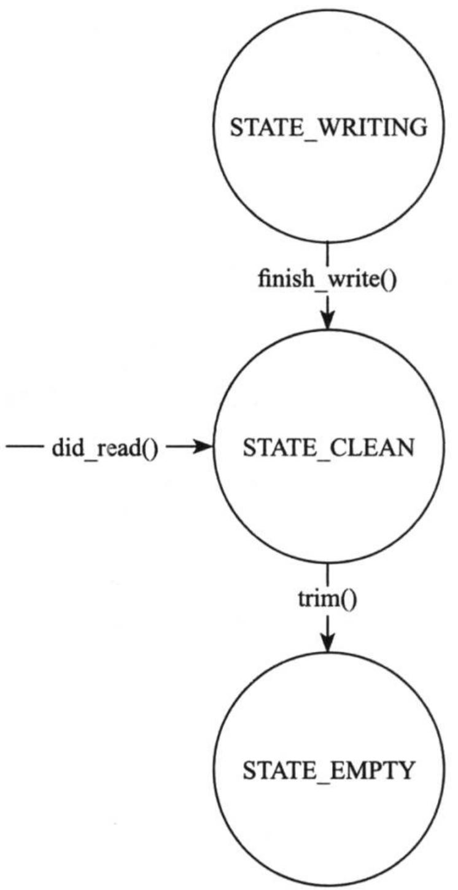


图2-6 Buffer状态转换


表 2-17 BufferSpace 公共接口


<table><tr><td>接口名称</td><td>含义</td></tr><tr><td>discard()</td><td>丢弃指定范围（offset + length）内所有波及的Buffer 当中的数据。过程为：针对指定范围内的所有Buffer，逐个测试其管理的数据范围与指定范围的交集，如果Buffer 管理的数据范围包含在交集内，则完全删除 Buffer；否则执行分裂，产生（至多两个）新的 Buffer，这些 Buffer 仅包含原有的、不在交集内的部分数据。
    discard() 适用于数据需要被覆盖写的场景（此时需要先丢弃缓存中的原有数据，然后再写入新的数据）</td></tr><tr><td>read()</td><td>读取指定范围（offset + length）内的数据，返回全部或者部分命中的数据段</td></tr><tr><td>did_read()</td><td>如果对应的读操作在 BufferSpace 未命中或部分未命中，则对应的读操作完成后，会创建一个或者多个 Buffer，关联未命中部分的数据，加入 BufferSpace（并最终加入 Cache）</td></tr><tr><td>write()</td><td>向 BufferSpace 中写入指定偏移和长度的脏数据，过程为：新建一个 Buffer，设置其状态为 STATE_WRITING，保存本次待写入的脏数据（offset + length + data）；然后执行 discard()，丢弃缓存内与本次写入范围重合的原有数据；最后将新创建的 Buffer 加入 BufferSpace 中的 writing_list</td></tr><tr><td>finish_write()</td><td>当写操作完成时，调用本方法将相关的 Buffer 从 writing_list 移除，同时按照 Buffer 的 flags，设置 Buffer 状态为 STATE_CLEAN，加入 Cache；或者直接删除（如果对应的 Buffer 设置了 FLAG_NOCACHE 标志）</td></tr></table>

所有的 Onode 和 Buffer 最终都需要加入 Cache，进行全局热度识别和应用淘汰策略。在 BlueStore 的 2Q 实现中，这两类数据分别应用了不同的淘汰策略——针对 Onode 采用 LRU；针对 Buffer 才是真正的 2Q，因此 TwoQCache 相应的管理结构如表 2-18 所示。


表 2-18 TwoQCahce


<table><tr><td>成员</td><td>含义</td></tr><tr><td>onode_lru</td><td>全局Onode LRU队列</td></tr><tr><td>warm_in</td><td rowspan="3">参考2Q相关的理论分析，对应关系如下：warm_in:Alinbuffer.hot:Amwam_out:Alout</td></tr><tr><td>buffer.hot</td></tr><tr><td>warm_out</td></tr><tr><td>buffer_bytes</td><td rowspan="2">全局缓存容量使用统计及每种队列容量使用统计，用于应用淘汰策略</td></tr><tr><td>buffer_list_bytes</td></tr></table>

值得注意的是，虽然TwoQCache内部对Onode和Buffer分开管理，但是整个缓存空间却是全局共享的，因此需要为两者指定一个合适的分割比例。在实际测试中，因为用户数据的缓存和操作系统以及磁盘级的缓存有所重叠，所以社区也有人提议将整个TwoQCache全部用做Onode缓存，不过实际效果仍然待验证。此外，除了这些通用的缓存之外，还有其他一些出于特殊目的而引入的缓存——例如用于在Onode之间实现数据共享的SharedBlob，我们在相关的章节再进行详细介绍。

# 2.4 磁盘空间管理

# 2.4.1 常见磁盘空间管理模式

块是磁盘进行数据操作的最小单位，任意时刻磁盘中的每个块只能是“空闲”或“占用”两种状态之一，因而使得采用一个比特表示磁盘中一个块的状态成为可能。如果将磁盘空间按照块进行切分、编号，然后每个块使用唯一的一个比特表示其状态，那么所有比特最终会形成一个有序的比特流，通过这个比特流，进而可以以块为粒度，索引磁盘中任意（存储）空间的状态，这种磁盘空间管理方式称为位图。

显然，位图和所管理的磁盘空间成正比。例如每管理1GB的磁盘空间，以块大小为扇区计，固定需要大小为256KB的位图。使用位图进行磁盘空间管理的一个重大缺陷在于如果位图无法全部装入内存，那么其管理效率就会大打折扣。早期的计算机系统中，因为磁盘容量有限（当然内存容量也有限），所以使得本地文件系统直接采用位图管理磁

盘空间成为可能。然而随着存储系统逐步朝着专业化、高端化的方向发展，一个现代存储系统中内存和磁盘两种存储介质的容量可能达到一个相当悬殊的比例——例如 EMC 的 VMAXe 宣称最大可支持的内存和磁盘容量分别为 512GB 和 1.3PB（1:2662），这样整个系统的位图将超过 300GB。显然，这种量级的位图如果作为一个整体，其索引效率是极其低下的，因此在大容量、集中式的高端存储系统中不可能被直接采用。

一个改进的方向是使用段管理磁盘空间。每个段包含两个成员：offset 和 length，前者指示被管理磁盘空间的起始地址，后者指示其长度。假定 offset 和 length 都是 64 位无符号整数，这样单个段管理的磁盘空间范围为 $[0, 2^{64}(16\mathrm{EB})]$ ，而自身固定需要 $128 = 16\mathrm{B}$ 的存储空间。可见如果每个段管理的磁盘空间足够大，那么使用段式磁盘空间管理可以取得极高的收益；反之，如果每个段固定只用于管理一个磁盘基本块，那么所耗费的存储空间将是位图的 128 倍。因此，段式磁盘空间管理相较于位图而言比较灵活，适用于上层应用对于磁盘空间申请范围比较宽泛的场景。

无论使用何种方式管理磁盘空间，当管理的磁盘空间足够大时，都需要考虑其索引效率，而索引效率一般和其对应的内存组织形式有关。例如针对位图，假定某个位图当中包含 $n$ 个比特，那么直接将这 $n$ 个比特进行顺序排列或者树状排列（常用的树状排列形式为B-tree、AVL tree等二叉树形式），针对单个比特的查找操作时间复杂度分别为 $O(n)$ 和 $O(\log_2n)$ （指二叉树），当 $n$ 足够大时，两种排列形式的索引效率可以相差几个数量级。此外，因为上层应用对于磁盘空间需求形式各异，采用不同的空间分配策略所取得的效果也会大相径庭。例如针对段式管理，常见的空间分配策略有3种：

首次拟合法（First Fit）。首次拟合法总是查找所有段中第一个满足所需求空间大小的段进行分配后返回。

□最佳拟合法（Best Fit）。最佳拟合法总是查找所有段中某个空间与所需求空间大小最接近的段进行分配后返回。

□最差拟合法（Worst Fit）。最差拟合法总是查找所有段中空间最大的段，从中分配所需求的空间后返回。

上述3种空间分配策略各有优劣。一般而言，最佳拟合法适合于请求空间范围较为广泛的系统。因为按照最佳拟合法进行空间分配时，总是查找和分配管理空间与请求空间大小最为匹配的段，从而使得整个系统中所有段管理的空间处于相差甚远的状态。相反，最差拟合法因为每次都从管理空间最大的段开始分配，从而使得整个系统中所有段管理的空间趋于一致，所以适合于请求空间范围较窄的系统。而首次拟合法的分配方式

是随机的，因此它的适用场景也介于两者之间，常见于事先无法对请求空间范围进行预测的通用系统。从分配效率来看，最佳拟合法和最差拟合法一般都需要针对所有的段按其管理的空间大小进行排序，而首次拟合法一般按照每个段的起始地址自然排序，考虑随着时间推移，空间会逐步趋于碎片化，为了应对后续潜在的大块连续空间分配请求，也为了提升索引效率（索引效率和段的绝对数量强相关，减少段的数量可以提升索引效率），需要将已归还的、物理上连续的段再次合并为一个独立的大段，首次拟合法在处理上述段合并过程中具有天然优势，因此其综合效率最高。

综上，一般需要综合考虑请求空间大小的分布规律、效率对于系统的重要性等因素来制定合适的空间分配策略，例如一种常见的做法是在系统可用空间比较充裕时采用首次拟合法，以提升分配效率；当系统空间碎片化程度较高时，再切换到最佳拟合法，以减少空间碎片。

作为一种通用存储系统的默认存储后端，原理上BlueStore应该采用段式磁盘空间管理，但是因为Ceph天然面向分布式设计的特性（这使得每个节点上内存和磁盘容量可以控制在一个较低的水平，并且这种分而治之的思想使得每个节点的磁盘空间管理相对独立），加上BlueStore设计之初就被定位为面向SSD等拥有比传统机械磁盘更大基本块、更小标称容量的高速固态存储设备，所以BlueStore空间管理默认采用位图（实际上也支持段，可以根据需要切换）。前面已经提及，磁盘所有基本块任意时刻只有“空闲”和“占用”两种状态，因此，磁盘空间管理也可以分为追踪所有空闲空间列表和追踪所有已分配空间列表两个部分。显然，这两个部分是强相关的，例如从空闲空间列表中新分配空间需要同时将其加入已分配空间列表，表明其已被占用；反过来从已分配空间列表中释放空间也需要同步将其加入空闲空间列表，供再次分配，这说明任意时刻我们都可以由一张列表推导出另一张列表。因此，BlueStore进行空间管理时，并不需要将两张列表全部存盘。考虑到每个Onode已经详细记录了存放数据时所对应的磁盘空间，并且我们一般在释放空间时进行合并操作（指将物理上连续的多个段合并为一个独立的大段，这样最终空闲空间列表中的条目相对较少），所以BlueStore选择将空闲空间列表存盘。系统上电时，通过加载空闲空间列表，最终可以在内存中还原出完整的已分配空间列表。

BlueStore中，FreelistManager组件负责管理空闲空间列表，Allocator组件负责管理已分配空间列表，两种组件又各有段和位图两种实现形式。因为BlueStore默认使用位图形式，所以这里仅介绍两种组件的位图实现，分别对应BitmapFreelistManager和BitmapAllocator。

# 2.4.2 BitmapFreelistManager

BitmapFreelistManager 以块为粒度，将连续、数量固定的多个块进一步组成一个段，从而将整个磁盘空间划分为若干连续的段进行管理。每个段以其在磁盘中的对应起始地址进行编号，可以得到一个 BlueStore 实例内唯一的索引，从而可以使用 kvDB 固化 BitmapFreelistManager 中的所有段信息。如前所述，单个块的状态可以使用一个比特进行标记，因此每个段的值部分是一个长度固定的比特流，比特流中的某个比特置位，表明对应的块已经被分配，反之则表明对应的块空闲。此外，因为使用 kvDB 存储段信息，所以需要合理调整 BitmapFreelistManager 中的段大小设置，过大（此时值长度变大）或者过小（此时键值对数量增加）的段设置都不利于充分发挥 kvDB 的性能。

系统运行过程中，BitmapFreelistManager中的块需要频繁地在“空闲”和“占用”两种状态之间切换，由表2-19所示的布尔运算实现。

可见，固定使用“1”作为掩码，基于异或运算可以实现每个块在“空闲”（对


表 2-19 基于布尔运算实现单个块状态快速翻转


<table><tr><td>原有状态</td><td>掩码</td><td>XOR</td></tr><tr><td>0</td><td>1</td><td>0^1=1</td></tr><tr><td>1</td><td>1</td><td>1^1=0</td></tr></table>

应“0”）和“占用”（对应“1”）两种状态之间快速切换，因此，BitmapFreelistManager分配或者释放一段空间的运算逻辑是相同的，这是BitmapFreelistManager设计的理论依据。

BitmapFreelistManager 定义的公共接口如表 2-20 所示。


表 2-20 BitmapFreelistManager 公共接口


<table><tr><td>接口名称</td><td>含义</td></tr><tr><td>create()</td><td>通过BlueStore的mkfs()接口创建一个BitmapFreelistManager。因为BitmapFreelistManager中的一些关键参数例如块大小、每个段包含的块数目等等可配置，所以需要通过create()固化到kvDB中。后续重新上电时，这些参数将直接从kvDB读取，防止因为配置变化而导致BitmapFreelistManager无法正常工作</td></tr><tr><td>init()</td><td>初始化BitmapFreelistManager。上电时调用，用于从kvDB中加载块大小、每个段包含的块数目等可配置参数</td></tr><tr><td>allocate()</td><td>从BitmapFreelistManager中分配指定范围（[offset, offset + length]）空间</td></tr><tr><td>release()</td><td>从BitmapFreelistManager中释放指定范围（[offset, offset + length]）空间</td></tr><tr><td>initialize_reset()</td><td rowspan="2">上电时，BlueStore通过这两个接口遍历BitmapFreelistManager中所有空闲段，并将其从Allocator中同步移除，从而还原得到上一次下电时Allocator对应的内存结构</td></tr><tr><td>initialize_next()</td></tr></table>

# 2.4.3 BitmapAllocator

BitmapAllocator 实现了一个块粒度的内存版本磁盘空间分配器。和 BitmapFreelist-Manager 不同，因为 BitmapAllocator 中的所有段信息不需要使用 kvDB 存盘，所以可以采用非扁平方式进行组织，以提升索引效率。实现上，BitmapAllocator 中的块是以树状形式组织的，如图 2-7 所示。

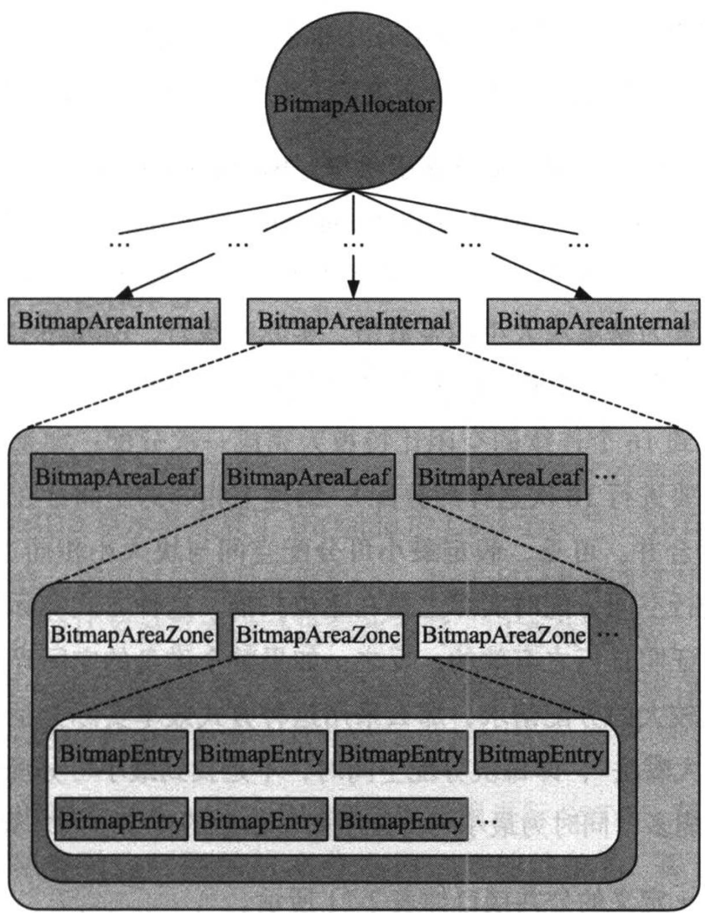


图2-7BitmapAllocator层次结构


BitmapEntry 是整个 BitmapAllocator 中的最小可操作单位，例如可以定义为 64 位无符号整数，这样单个 BitmapEntry 可以同时记录 64 个物理上相邻块的状态。一定数量的 BitmapEntry 可以进一步组成一个 BitmapZone。BitmapZone 是 BitmapAllocator 中单次最大可分配单位，其大小可以配置。BitmapZone 拥有独立的锁逻辑，所有 API 都被设计成原子的，因此不同 BitmapZone 之间的操作可以并发。如果 BitmapAllocator 管理的磁盘空间过大，为了提升索引效率，可以进一步引入一些中间逻辑结构，将所有 BitmapZone 再次

进行树状组织。这个中间树状结构称为BitmapArea，其中叶子节点称为BitmapAreaLeaf，一个BitmapAreaLeaf叶子节点包含固定数量的BitmapZone；多个BitmapAreaLeaf叶子节点可以组成一个BitmapAreaInternal中间节点；多个BitmapAreaInternal中间节点可以再次作为更上一级BitmapAreaInternal中间节点的孩子节点，直至最终到达根节点——BitmapAllocator。整个BitmapAllocator的拓扑结构都是可配置的，主要受两个参数约束：一是BitmapZone大小，这个参数不但决定了BitmapAllocator单次可分配的最大连续空间，也决定了并发操作的粒度；二是BitmapArea中单个（中间或叶子）节点的跨度（span-size），这个参数决定了BitmapArea的高度，进而决定了整个BitmapAllocator的索引效率。

为了减少空间碎片化，同时提升索引效率，BitmapAllocator 也允许自定义最小可分配空间。顾名思义，最小可分配空间是 BitmapAllocator 分配空间的最小粒度，所有通过 BitmapAllocator 分配的空间必须是最小可分配空间的整数倍，相应的，这要求最小可分配空间必须配置为基本块大小的整数倍。实际实现时，BitmapAllocator 总是以最小可分配空间为单位，直至分配到上层所需求的空间为止（例如最小可分配空间为 16 个基本块大小，则每找到 16 个连续的空闲比特视为完成一次分配；如果需求空间为 256 个基本块，则一共需要进行 16 次这样的分配），物理上相邻的空间会在以段形式返回给上层应用时自动进行合并。可见，假定最小可分配空间与块大小相同（这是默认情况！），BitmapAllocator 进行空间分配时实际上是在逐位扫描，这种方式实际上只在磁盘空间碎片化程度很高时被证明是行之有效的；反之，如果整个磁盘的空间碎片化程度很低同时有大量空间需求比较大的分配请求，那么采用这种方式效率实际上是非常低的。一个改进的方向是使用“大嘴法”，即每次分配空间时，不是找到最小可分配空间即完成一次分配，而是找到尽可能多、同时为最小可分配空间整数倍的连续空间才算完成一次分配。

BitmapAllocator 定义的公共接口如表 2-21 所示。


表 2-21 BitmapAllocator 公共接口


<table><tr><td>接口名称</td><td>含义</td></tr><tr><td>init_add_free()</td><td>参见表2-20，BlueStore上电时，通过FreelistManager读取磁盘中空闲的段，然后调用本接口将BitmapAllocator中相应的段空间标记为空闲</td></tr><tr><td>init_rm_free()</td><td>将BitmapAllocator指定范围的空间（[offset, offset + length]）标记为已分配</td></tr><tr><td>reserve()</td><td>预留空间/释放预留空间。</td></tr><tr><td>unreserve()</td><td>因为BitmapAllocator支持多线程访问，所以通过BitmapAllocator进行空间分配时，需要先调用reserve()接口进行空间预留，以保证后续通过allocate()接口能够分配到所请求的空间。如果通过allocate()分配的空间比之前reserve()少，那么差值需要通过unreserved()返还</td></tr><tr><td>allocate()</td><td>分配/释放空间。</td></tr><tr><td>release()</td><td>分配的空间不一定是连续的，有可能是一些离散的段。allocate()接口可以同时指定hint参数，用于对下次开始分配的起始地址（例如可以是上一次成功分配后所返回空间的结束地址）进行预测，以提升分配速率</td></tr><tr><td>get_free()</td><td>返回当前BitmapAllocator实例中的所有空闲空间大小</td></tr></table>

需要注意的是，因为BlueStore将不同类型的数据严格分开并且允许使用不同的设备存储，所以一个BlueStore实例中可能存在多个BitmapAllocator实例。

# 2.5 BlueFS

# 2.5.1 RocksDB与BlueFS

诞生于2011年的LevelDB是基于Google的BigTable数据库系统发展而来的，是键值对类型的日志型非关系数据库，专为存储海量（例如千万级别）键值对设计。理论上，LevelDB中的键或者值只受存储容量的限制，可以为任意长度的字节流，所有键值对严格按照键排序。LevelDB继承并发展了BitTable中LSM-Tree+SSTable（Sorted String Table，有序字符串表，键值对的磁盘存储格式。BigTable针对键值对的修改操作采用了写时重定向的策略，即从不对已有记录进行覆盖写，以避免RMW，从而提升性能，因此SSTable的内容是只读的）的概念，将SSTable在磁盘上进行分级存储，进一步提升索引性能，这也是LevelDB的由来。

然而随着SSD的逐渐普及，LevelDB使用单线程进行SSTable压缩以及利用mmap将SSTable读入内存等做法已经无法充分发挥SSD的性能。基于LevelDB诞生了RocksDB，后者致力于为新型高性能固态存储介质例如SSD、NVRAM等提供更加卓越的键值对类型数据库访问性能。表2-22展示了LevelDB和RocksDB的性能对比。

RocksDB具有如下特性：

□专为使用本地闪存设备作为存储后端、且数据库容量不超过几个TB的应用程序设计，是一种内嵌式的非分布式数据库。


表 2-22 LevelDB 和 RocksDB 性能对比 ${}^{\text{①}}$


测试结论表明：LevelDB在空间利用率上更有优势，而RocksDB在绝大多数场景下性能更有优势


<table><tr><td>Test step</td><td>LevelDB</td><td>RocksDB</td></tr><tr><td>Write 100M values</td><td>36m8.29s</td><td>21m18.60s</td></tr><tr><td>DB Size</td><td>2.7GB</td><td>3.2GB</td></tr><tr><td>Query 100M values</td><td>2m55.37s</td><td>2m44.99s</td></tr><tr><td>Delete 50M values</td><td>3m47.64s</td><td>1m53.84s</td></tr><tr><td>Compaction</td><td>3m59.87s</td><td>3m20.27s</td></tr><tr><td>DB Size</td><td>1.4GB</td><td>1.6GB</td></tr><tr><td>Query 50M values</td><td>12.12s</td><td>13.59s</td></tr><tr><td>Write 50M values</td><td>3m5.28s</td><td>1m26.90s</td></tr><tr><td>DB Size</td><td>673MB</td><td>993MB</td></tr></table>


① https://www.influxdata.com/benchmarking-leveldb-vs-rocksdb-vs-hyperleveldb-vs-lmdb-performance-for-influxdb/ 


□适合于存储小型或者中性键值对；性能随键值对长度上升下降很快。

□性能随CPU核数以及后端存储设备的I/O能力呈线性扩展。

除此之外，RocksDB还拥有诸多LevelDB所不具备的特性，典型如对于列簇（Column Families）、备份和还原点、Merge操作符的支持等。RocksDB采用C++进行开发，在设计上非常灵活，几乎所有组件都可以根据需要进行替换，这其中就包括用于固态SSTable和WAL（Write Ahead Log，指日志）的本地文件系统。因为RocksDB设计理念和BlueStore高度一致，所以BlueStore默认采用RocksDB取代LevelDB作为元数据存储引擎。同时，因为多数操作系统默认的本地文件系统（典型如XFS、ext4、ZFS等）都处于RocksDB而言很多功能不是必须的，所以为了进一步提升RocksDB的性能，需要对本地文件系统的功能进行裁剪。当然更彻底的解决办法是为RocksDB量身定制一款本地文件系统，在此背景下，BlueFS应运而生。

BlueFS 是个简易的用户态日志型文件系统，它恰到好处地实现了 RocksDB::Env 所定义的全部接口，后者用于固化 RocksDB 运行过程中产生的 .sst（对应 SSTable）和 .log（对应 WAL）文件。基于同样的道理（参考本章第 1 节，引入日志的目的一般都是为了进行写加速），WAL 对于提升 RocksDB 的性能至关重要，所以 BlueFS 在设计上支持将 .sst 和 .log 文件分开存储，以方便将 .log 文件单独使用速度更快的固态存储设备例如 NVMe SSD 或者 NVRAM 存储。

这样，引入BlueFS后，BlueStore将所有存储空间从逻辑上分成了三个层次：

# （1）慢速（Slow）空间

这类空间主要用于存储对象数据，可由普通大容量机械磁盘提供，由BlueStore自行管理。

# （2）高速（DB）空间

这类空间主要用于存储BlueStore内部产生的元数据（例如onode），可由普通SSD提供，容量需求比（1）小。因为BlueStore的元数据都交由RocksDB管理，而RocksDB最终通过BlueFS将数据存盘，所以这类空间由BlueFS直接管理。

# （3）超高速（WAL）空间

这类空间主要用于存储RocksDB内部产生的.log文件，可由NVMe SSD或NVRAM等时延相较普通SSD更小的设备充当，容量需求和（2）相当（实际上还取决于RocksDB相关参数设置）。超高速空间也由BlueFS直接管理。

需要注意的是，上述高速、超高速空间需求不是固定的，和慢速空间的使用情况紧密相关（BlueStore元数据数量和对象数量、对象中数据稀疏程度、被覆盖写的次数等相关；而RocksDB中WAL的数量则和记录（即BlueStore中的元数据）数量、访问习惯、自身的压缩策略等都相关），如果高速、超高速空间规划的较为保守，BlueFS也允许使用慢速空间进行数据转存。因此，在设计上，BlueStore将自身管理的一部分慢速空间拿出来和BlueFS进行共享，并在运行过程中进行实时监控和动态调整，具体策略为：BlueStore通过自身周期性被唤醒的同步线程实时查询BlueFS的可用空间，如果BlueFS的可用空间在整个BlueStore可用空间中的占比过小，则新分配一定量的空间至BlueFS（如果BlueFS所有空间绝对数量不足设定的最小值，则一次性将其管理的空间总量追加至最小值）；反之如果BlueFS的可用空间在整个BlueStore可用空间中占比过大，则从BlueFS中回收一部分空间至自身。

综上，如果3类空间分别使用不同的设备管理，那么一般情况下BlueFS中的可用空间一共有3种。对于.log文件以及自身产生的日志（BlueFS本身也是一种日志型的本地文件系统），BlueFS总是优先选择使用WAL类型的设备空间，如果不存在或者WAL设备空间不足，则选择DB类型的设备空间，如果仍然不存在或者DB设备空间也不足，则选择Slow类型的设备空间。对于.sst文件，则优先使用DB类型的设备空间，如果不存在或者DB设备空间不足，则选择Slow类型的设备空间。Slow类型的设备因为由BlueStore直接管理，所以与BlueFS共享的空间也是由BlueStore直接管理，后者会将所

有已经成功分配给BlueFS的空间段单独使用一个名字叫作bluefs_extents的结构进行管理，并从自身的Allocator中扣除。bluefs_extents是一个集合，每个元素对应Slow设备中的一个空间段，每次更新后会作为BlueStore的元数据存盘。这样，后续BlueFS上电时，通过BlueStore预先加载的bluefs_extents，即可正确初始化这部分共享空间对应的Allocator。至于DB设备以及WAL设备，因为单独由BlueFS管理并且对BlueStore不可见，所以在上电时由BlueFS自身负责初始化，亦即通常情况下BlueFS在上电时会初始化3个Allocator实例，分别管理3种类型的可用空间。

在2.4节中我们曾经提及——对于磁盘空间的管理，一般固化空闲空间列表和已分配空间列表中的任意一种即可。BlueStore选择固化空闲空间列表，同时所有已分配空间信息也保存在每个Onode之中，因此这两类信息实际上存在重复。但是由于一个BlueStore实例管理的Onode数目原理上只受存储容量的限制，实际场景中Onode数目可能十分巨大，因此为了加速上电过程，BlueStore需要额外固化一张空闲空间列表。BlueFS则不同，一方面BlueFS存储的数据十分有限，其规模为BlueStore的千分之一到百分之一之间（常见的存储系统中元数据和数据比重一般都在这个范围之内）；另一方面RocksDB生成的.sst文件大小固定，并且从不进行修改，所以BlueFS中绝大部分磁盘空间需求都是比较统一和固定的。因此，基于上述两个因素，BlueFS既不保存空闲空间列表，也不保存已分配空间列表，而是通过上电时遍历所有文件的元数据信息，据此生成完整的已用空间列表，即Allocator。

# 2.5.2 磁盘数据结构

在上一节中，我们介绍了BlueFS相关概念，本节介绍BlueFS的磁盘数据结构。和其他通用的文件系统类似，BlueFS也有目录和文件的概念，而且因为是日志型文件系统，所以BlueFS的磁盘数据主要包括文件、目录和日志三种类型。

传统文件系统普遍采用层级（树状）结构对目录和文件进行组织，这种组织方式在面向存储海量文件的设计中，因为具有较高的单点查找效率（以二叉树为例，单个查找操作的时间复杂度为 $O(\log_2n)$ ），并且可以以目录为单位对文件进行区域隔离，所以被实践证明是行之有效的。然而凡事皆有两面性，采用层级结构的文件系统的磁盘数据格式一般而言都比较复杂，因此如果存储的文件数量没有达到一定规模，其效率反而会比直接采用扁平结构更低。如前所述，BlueFS因为只用于存储单个BlueStore（对应一块磁盘）的元数据，所存储的文件规格比较统一（绝大多数为SSTable）并且数量十分有限，所以

可以直接采用扁平结构进行组织。实际实现时，BlueFS 使用两类表来追踪所有管理的文件及其目录层级关系，如图 2-8 所示。

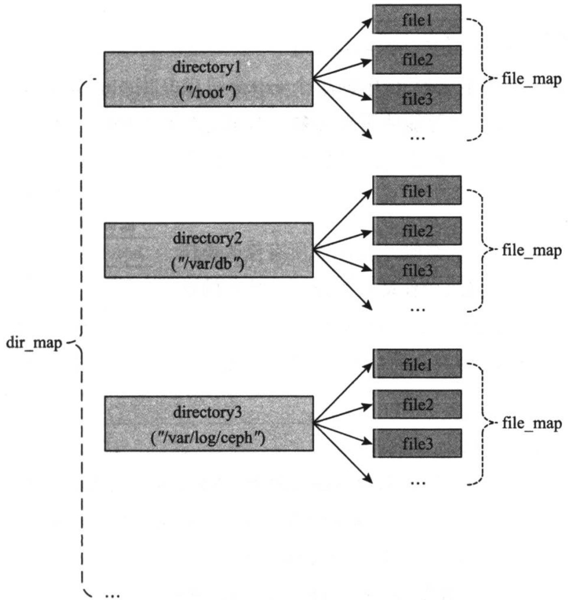


图2-8 BlueFS的文件组织形式


由图2-8可见，BlueFS定位某个具体文件一共需要经过两次查找：第一次通过dir_map找到文件所在的最底层文件夹；第二次通过该文件夹下的file_map找到对应的文件。需要注意的是：因为是扁平组织，所以dir_map中每个条目描述的都是文件的绝对路径，即条目之间没有隶属关系。每个文件也采用一个类似inode的结构进行管理，BlueFS称为bluefs_fnode_t（简称fnode，下同）。因此，file_map建立的实际上是文件名和fnode之间的映射关系，fnode相应的磁盘数据结构如表2-23所示。


表 2-23 bluesfs_fnode_t


<table><tr><td>成员</td><td>含义</td></tr><tr><td>ino</td><td>唯一标识一个 fnode</td></tr><tr><td>size</td><td>文件大小</td></tr><tr><td>mtime</td><td>文件上一次被修改的时间</td></tr><tr><td>prefer_bdev</td><td>存储该文件优先使用的块设备，例如.log文件或者BlueFS自身的日志文件将优先使用WAL设备</td></tr><tr><td>extents</td><td>磁盘上的物理段集合</td></tr></table>

原则上，表2-23中的extent中的单个extent可以复用bluestore_pextent_t（参考表2-5），但是因为每个文件都可能使用来自多个不同块设备（WAL、DB和Slow）的空间，

所以BlueFS的extent还需要额外记录其归属的块设备

标识，具体见表2-24。

和其他日志型文件系统类似，BlueFS所有修改操作也是基于日志的。每个修改操作都会生成一个独立的日志事务，然后再通过flush_log()调用进行批量提交。以


表 2-24 bluefsextent_t


<table><tr><td>成员</td><td>含义</td></tr><tr><td>bdev</td><td>归属块设备标识</td></tr><tr><td>offset</td><td>归属块设备上的物理地址</td></tr><tr><td>length</td><td>空间长度</td></tr></table>

mkdir() 操作为例，BlueFS 只是简单生成一条日志记录，即可向上层应用返回操作成功：

```txt
op_code: OP_DIR_CREATE  
op_data: dir(string) 
```

为了减少每次需要刷盘的日志量以提升效率，BlueFS采用增量日志模式。因此，随着时间推移，BlueFS中日志数量会逐渐膨胀，这一方面会造成不必要的空间浪费，尤其日志本身使用的是容量较小的高速WAL设备空间；另一方面会导致BlueFS在上电时需要进行大量的日志重放，才能得到完整的dir_map和相应的file_map，上电时间变长，所以BlueFS需要定期对日志进行清理。

这个清理的过程称为日志压缩，其主要逻辑是将当前最新的dir_map和所有file_map加入到一个独立的日志事务中并存盘，这样，下次上电时，BlueFS通过重放这个日志事务，即可还原出完整的dir_map和其对应的file_map。因此，这个日志事务可以重新作为后续增量日志事务的基准，为每个日志事务分配一个独一无二的序列号之后，所有序列号小于此基准序列号的日志事务都可以删除，从而释放日志空间。早期的实现中，日志压缩过程是完全同步的。日志压缩需要独占式地访问dir_map和file_map从而造成写停顿（write_stalls），所以当前实现了日志压缩的一个改进版本。改进后的日志压缩流程除了生成内存基准日志事务的过程严格同步之外（通过持有BlueFS全局的排他锁实现），其他过程都是异步的，因此可以大大改善由于日志压缩所引起的写停顿。综上，我们可以定义日志事务的磁盘数据结构如表2-25所示。


表 2-25 blueshifts_transaction_t


<table><tr><td>成员</td><td>含义</td></tr><tr><td>uuid</td><td>日志事务归属 bluefs 对应的 uuid</td></tr><tr><td>seq</td><td>全局唯一序列号</td></tr><tr><td>op_bl</td><td>编码后的日志事务条目，可以包含多条。每个条目由操作码和操作涉及的相关数据组成</td></tr></table>

因为上电时，我们总是通过日志重放来得到BlueFS所有元数据，所以还需要一个固定入口，用于索引日志（日志本身采用一个单独的文件进行保存）所对应的存储位置。这个入口称为超级块（SuperBlock），BlueFS总是将其写入由自身接管的DB设备的第二个4K存储空间，其结构如表2-26所示。


表 2-26 bluesfssuper_t


<table><tr><td>成员</td><td>含义</td></tr><tr><td>uuid</td><td>bluefs 关联的 uuid</td></tr><tr><td>osd_uuid</td><td>bluefs 关联的 OSD 对应的 uuid</td></tr><tr><td>version</td><td>超级块当前版本</td></tr><tr><td>block_size</td><td>DB/WAL 设备块大小，固定为 4K</td></tr><tr><td>log_fnode</td><td>日志文件对应的 fnode</td></tr></table>

BlueFS 提供的 API 与传统文件系统并无二致，这里不再赘述。最后，我们给出引入 RocksDB 和 BlueFS 之后的 BlueStore 逻辑架构图如图 2-9 所示。

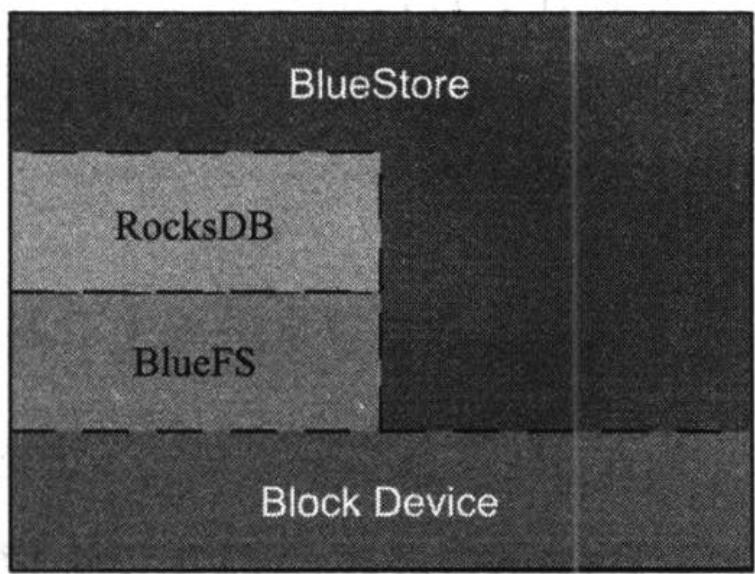


图2-9BlueStore逻辑架构（使用RocksDB $^+$ BlueFS）


# 2.5.3 块设备

在上一节中，我们知道引入RocksDB + BlueFS后，BlueStore至多可以管理三种类型的存储空间——Slow、DB和WAL，这三类空间的容量和性能需求不尽相同，因此实际部署时可以分别使用不同类型的块设备（Block Device）提供。

在Linux的设计中，一切皆文件，因此块设备也被内核当作文件管理。对于块设备的访问最终通过相应的驱动程序实现，并且只能以块（从512B到4KB不等）为粒度进行，这也是块设备名称的由来。不同块设备其传输速率除了取决于制造工艺外，还受限于所使用的总线（传输）标准，例如采用传统SATA3.0总线标准的块设备的理论传输速率上限为6Gbps，而如果采用PCIe3.0X4总线标准则其理论传输速率上限高达32Gbps。SATA总线标准及其对应的AHCI接口其实是为高延时的机械磁盘设计的，但是目前依然为主流的SSD所采用。随着SSD的性能逐渐增强（摩尔定律指出：当价格不变时，集成电路上可容纳的元器件的数目，约每隔 $18\sim 24$ 个月便会增加一倍，性能也将提升一倍），这些标准已经成为限制SSD发展的一大瓶颈，专为机械硬盘而设计的AHCI标准并不太适合低延时的SSD，于是NVMe应运而生。NVMe（Non-VolatileMemoryexpress）与AHCI类似，都是一种逻辑设备接口标准。与传统的SATA SSD相比，基于PCIe的NVMe SSD能够提供数十倍或更高的IOPS，同时平均时延下降至几十分之一或更低。

SPDK（Storage Performance Development Kit）是Intel专为高性能、可扩展、用户态的存储类应用程序开发的工具套。SPDK取得高性能的关键在于将所有必需的驱动程序移植到用户态，同时采用主动轮询的模式来替代中断，从而避免内核上下文切换以及中断处理带来的额外开销。SPDK自带NVMe驱动，目前BlueStore基于SPDK实现了对于NVMe SSD这类新型块设备的支持，从而在设计上支持使用NVMe SSD充当DB及WAL设备（目前社区正在计划增加对于NVRAM的支持，后续可以将WAL保存在性能更好的NVRAM设备上）进行性能增强，进而使得在未来，基于BlueStore构建全闪存的高性能Ceph存储集群成为可能。

# 2.6 实现原理

在前几节中，我们已经介绍了BlueStore一些基本设计理念及相关支撑组件，本节我们通过几个主要的流程介绍BlueStore的具体实现，分别是mkfs、mount、read和write。

# 2.6.1 mkfs

mkfs 主要固化一些用户指定的配置项到磁盘，这样后续 BlueStore 上电时，这些配置项将直接从磁盘读取，从而不受配置文件改变的影响（这也说明每个 BlueStore 实例的配置项可以是不同的）。之所以需要固化这些配置项，是因为 BlueStore 使用不同的配置

项对于磁盘数据的组织形式不同（BlueStore 的每一种组件，例如 FreelistManager，都支持多种不同实现方式），如果前后两次上电使用不同的配置项访问磁盘数据有可能导致数据发生永久性损坏。一些需要在 mkfs 过程中写入磁盘的典型配置项及其含义如表 2-27 所示。


表 2-27 需要通过 mkfs 固化的配置项


<table><tr><td>元数据类型</td><td>作用</td></tr><tr><td>os_type</td><td>ObjectStore 类型,目前有 FileStore 和 BlueStore 两种,这两种 OS 对于磁盘数据的管理形式完全不同</td></tr><tr><td>fsid</td><td>唯一标识一个 BlueStore 实例</td></tr><tr><td>freelist_type</td><td>标识 FreelistManager 的类型。如前所述,因为 BlueStore 固化所有空闲空间列表至 kvDB,所以 FreelistManager 不能动态变化,否则上电时无法正常从 kvDB 读取所有空闲空间信息。基于 freelist_type 可以创建相应类型的 FreelistManager,然后由 FreelistManager 从 kvDB 读取所有空闲空间信息,进而在内存中重建得到完整的空闲空间列表。基于 FreelistManager 的空闲空间信息总是可以得到 Allocator,这意味着 Allocator 的具体类型在上电时是可以动态改变的</td></tr><tr><td>kv backbone</td><td>使用何种类型的 kvDB,目前有 LevelDB 和 RocksDB 可选</td></tr><tr><td>bluefs</td><td>如果使用 RocksDB 作为默认的 kv backbone,是否使用 BlueFS 替换 RocksDB 默认的本地文件系统接口</td></tr></table>

# 2.6.2 mount

OSD 进程上电时，BlueStore 通过 mount 操作完成正常上电前的检查和准备工作，其处理逻辑如图 2-10 所示。

由图2-10可见，mount操作主要包含以下几个步骤：

# （1）校验 ObjectStore 类型

因为 ObjectStore 有多种实现，不同实现对于磁盘的管理方式不同，所以需要在 mkfs 时固化 ObjectStore 类型至磁盘，并在 mount 进行类型校验，防止将磁盘数据写坏。

# (2) fsck 或者 deep-fsck

fsck扫描并校验BlueStore实例当中的所有元数据。如果打开deep选项，会进一步深度扫描并校验所有对象数据。如果BlueStore中对象数量比较多，那么在mount操作中执行fsck或者deep-fsck会大大延长OSD上电时间，因此也可以通过Ceph提供的工具选择在业务比较空闲、或者执行例行维护时手动进行。目前mount过程中的fsck选项默

认是关闭的。

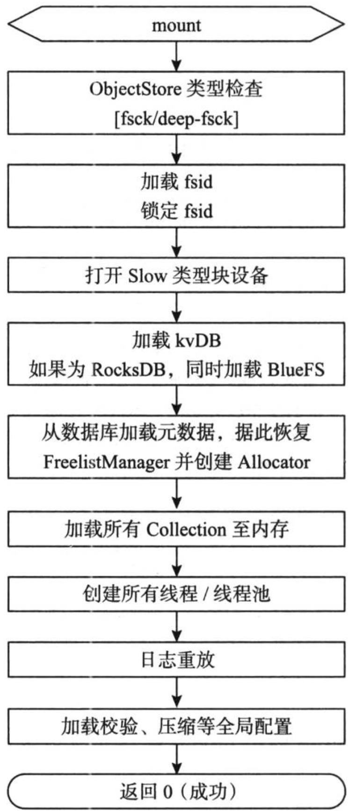


图2-10 mount


# (3) 加载并锁定 fsid

fsid 唯一标识一个 BlueStore 实例。锁定 fsid 的目的是为了防止对应的磁盘被多个 OSD 进程对应的 BlueStore 实例同时打开和访问，从而引起数据一致性问题。

# （4）加载主块设备

如前所述，主块设备用作存储对象数据，一般可由大容量的慢速机械磁盘充当，由BlueStore直接管理。

# （5）加载数据库，读取元数据

表2-28中列举了mount过程中需要从数据库读取的主要元数据。


表 2-28 mount 过程中需要加载的元数据


<table><tr><td>元数据类型</td><td>作用</td></tr><tr><td>nid_max</td><td>每个对象拥有BlueStore实例内唯一的nid。nid_max用于标识当前BlueStore最小未分配的nid，新建对象的nid总是从当前的nid_max开始分配</td></tr><tr><td>blobid_max</td><td>类似nid，整个BlueStore实例内唯一。引入blobid的目的主要是实现blob在对象之间的共享，而共享信息（为bluestore_shared_blob_t，参考“2.2.2对象”）需要独立于对象存储，因此需要一个全局唯一的标识</td></tr><tr><td>freelist_type</td><td>标识FreelistManager的类型，参考表2-27</td></tr><tr><td>min_min_alloc_size</td><td>为了提升空间管理效率同时降低空间碎片化程度，BlueStore也允许自行配置最小可分配空间（Minimal Allocable Size，简称MAS）。BlueStore总是记录历史MAS中的最小值，并据此创建Allocator（举例来说，假定我们指定磁盘的基本块为扇区，那么我们后续将基本块大小调整为扇区的整数倍也是能正常工作的，反之则不行）</td></tr><tr><td>bluefs_extents</td><td>从主设备分配给BlueFS，供BlueFS使用的额外空间</td></tr></table>

# (6) 加载 Collection

如前所述，因为Collection数量有限，所以可以常驻内存。

完成上述步骤后，mount随后会创建一些工作线程，比如用于进行数据同步的同步线程，用于执行回调函数的finisher线程，用于统计内存使用的监控线程等，如果上次下电不是优雅下电，那么还可能需要执行日志重放进行数据恢复。最后，在设置了一些诸如校验算法、压缩算法之类的全局参数之后，mount操作全部完成，上层应用可以正常读写BlueStore当中的数据。

# 2.6.3 read

read 接口用于读取对象指定范围内的数据，目前 BlueStore 实现的 read 接口是同步的，其处理逻辑如图 2-11 所示。

参见图2-11，read逻辑比较简单，主要涉及查找Collection、查找Onode、读缓存和读磁盘4个步骤：

# （1）查找Collection

如前，BlueStore上电时已经通过mount操作预先将所有Collection加载至内存，而且因为单个BlueStore管理的PG数量有限，所以这个查找过程耗时相对后续操作几乎可以忽略。成功查找到Collection之后，如果对应的Collection存在，将以阻塞的形式获取Collection内部读写锁中的读锁，亦即针对同一个Collection，所有读操作可以并发。

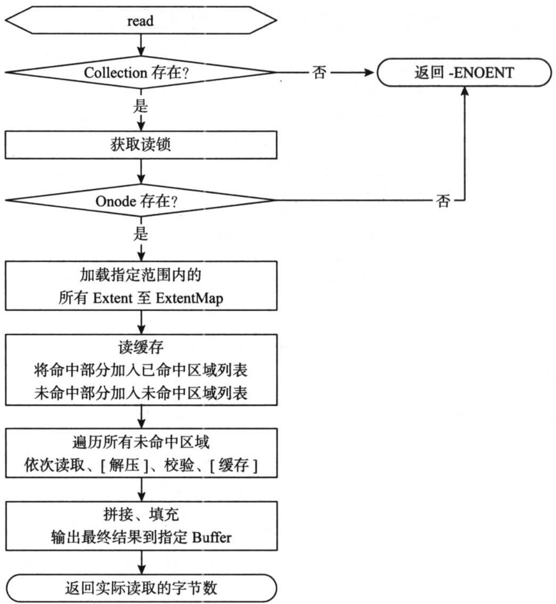


图2-11 read


# (2) 查找 Onode

BlueStore 中 Onode 使用 LRU 队列进行管理，因此如果对应的 Onode 没有在缓存中命中，那么需要基于其磁盘格式在内存中进行重建。2.2.2 节中提到，每个 Onode 包含一张 ExtentMap，ExtentMap 包含若干个 Extent，每个 Extent 负责管理一段逻辑范围内的数据并关联一个 Blob，并最终由 Blob 通过若干个 pextent 负责将这些数据映射至磁盘。这几种管理结构的映射关系如图 2-12 所示。

每个 Blob 包含一个 SharedBlob。顾名思义，SharedBlob 是用于实现 Blob、也就是 Extent 之间的数据共享，其主要内容为一张基于 extent 的引用计数表，表明对应的内容被引用（即克隆）的次数。除此之外，SharedBlob 还包含 BufferSpace，用于对 Blob 中的数据进行缓存，并最终纳入 Cache 管理。

引入SharedBlob之后，每个Blob有shared和!shared状态。如果为shared状态，则

表明该 Blob 确实被多个 Onode 共享，此时 SharedBlob 关联了一张有效的引用计数表，出于和 ExtentMap 类似的考虑，这张引用计数表也是按需加载的，只有真正需要被使用时，才会从 kvDB 加载至 SharedBlob，此时 SharedBlob 的状态变为 loaded（对应的，引用计数表未从磁盘加载时其状态为 !loaded），BlueStore 会同步将其加入 Collection 的全局 SharedBlob 缓存，供后续需要再次使用时快速索引。

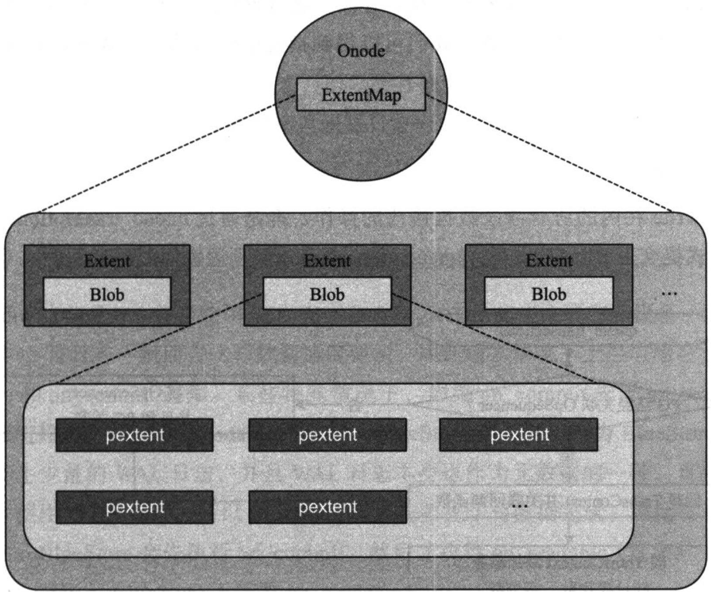


图2-12 Onode内部结构


综上，如果Onode没有在缓存中命中，为了防止从kvDB当中一次性读取大量数据（例如对象的空间使用情况比较复杂，导致ExtentMap的Extent数量巨大；或者磁盘碎片化比较严重，导致每个Extent包含大量的pextent等）进行Onode重建，造成前端线程长时间的等待，包括ExtentMap、SharedBlob在内的管理结构都是动态、根据实际需要进行加载的。

# （3）读缓存

如果Onode直接在缓存中命中，那么可能有部分数据已经存在于全局Cache当中，此时BlueStore会尝试先从Cache读取指定范围内的数据。读完Cache之后会产生已命中

数据区域和未命中数据区域两张列表。

# （4）读磁盘

如果全部或者部分数据没有在 Cache 中命中，此时需要去磁盘读取。步骤（3）中我们已经生成了完整的未命中数据区域列表，据此可以加载对应的 Extent 至内存，然后从磁盘对应位置读取数据。根据配置，BlueStore 可能对直接读到的数据执行校验以防止静默数据错误，同时如果数据经过压缩，还需要进行解压之后才能得到原始数据。最后，通过拼凑和填充（全 0）的方式，我们可以得到指定范围内的完整数据，并返回给上层应用。

# 2.6.4 write

包括write在内的所有涉及数据修改的操作，都是通过queue_transactions接口以事务组的形式提交至BlueStore的。queue_transactions处理逻辑如图2-13所示。

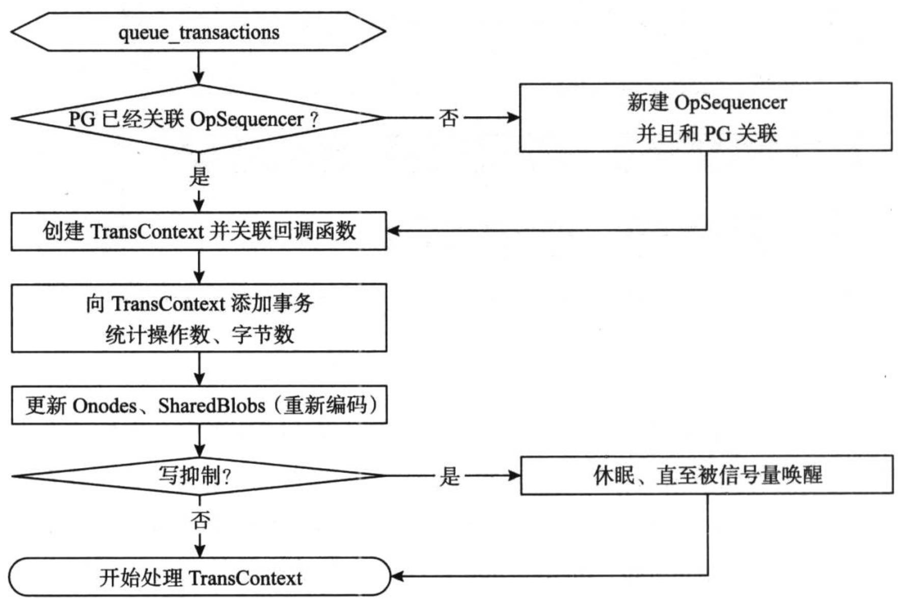


图2-13 通过queue_transactions向BlueStore提交事务


上述流程中，OpSequencer 的作用已经在本章第 1 节中介绍，主要用于对同一个 PG 提交的多个事务组进行保序。针对同一个事务组中的多个操作，BlueStore 会创建一个事务上下文——TransContext，将每个修改操作顺序添加至 TransContext，然后进行批量处

理。所有修改操作添加完成后（此时修改操作对应的内存版本完成），通过 TransContext 汇总操作数以及波及的字节数，再提交至 Throttle（顾名思义，这是 BlueStore 内部的一种流控机制），判断是否需要进行写抑制。如果没有过载，即不需要进行写抑制，则开始执行 TransContext。所有通过 queue_transactions 提交的事务组都是异步执行的，因此需要指定若干种类型的回调上下文，当相应的事务组执行到某个特定的阶段后，通过执行对应的回调上下文来唤醒上层应用执行相应操作。常见的回调上下文共有两种：

# (1) on_readable

因为 ObjectStore 默认需要使用日志，所以所有修改操作都会先写入速度较快的日志设备。写日志阶段完成后，即可向前端返回写日志完成应答，此时可以确保对应的修改操作涉及的数据不会丢失。

# (2) on_commit

也称为on_disk或者on_safe，顾名思义，指对应的数据已经成功写入主要存储设备。

FileStore 的实现中，普遍使用 SSD 充当日志盘，HDD 充当主要存储设备（也称为数据盘，下同），写日志一般而言比写数据速度要快，因此通常情况下上层应用会先后收到 on_readable 和 on_commit 通知。某些特殊情况下，如果 on_commit 先于 on_readable 到达，则上层应用可以跳过 on_readable 的执行。BlueStore 则不同，因为 BlueStore 每个写操作只会产生少量的 WAL 日志，并且 WAL 日志本身也作为元数据的一种，直接和其他元数据一并使用 kvDB 保存，所以 BlueStore 写日志要先于写数据完成，因此在对应的事务组完成后，BlueStore 会先执行 on_commit，然后才执行 on_readable（这实际上是出于兼容性考虑，原则上 BlueStore 不需要 on_readable）。

将write操作加入TransContext的流程如图2-14所示。

如果本次write操作范围内没有任何已有数据，则将对应的write操作称为新写；反之称为覆盖写。新写的处理逻辑相较覆盖写简单很多，按照数据的逻辑地址范围是否进行了MAS（最小可分配空间，参见表2-28）对齐，可以分为头尾非MAS对齐写和中间MAS对齐写。对应MAS对齐部分，其处理逻辑如图2-15所示。

上述流程中，对应一次写入数据量比较大的情况，之所以要分成多个新的Extent写入，原因之前已经分析过了，主要是防止生成的校验数据过大，影响其在kvDB中的索引效率。非MAS对齐写和上述流程类似，区别在于：

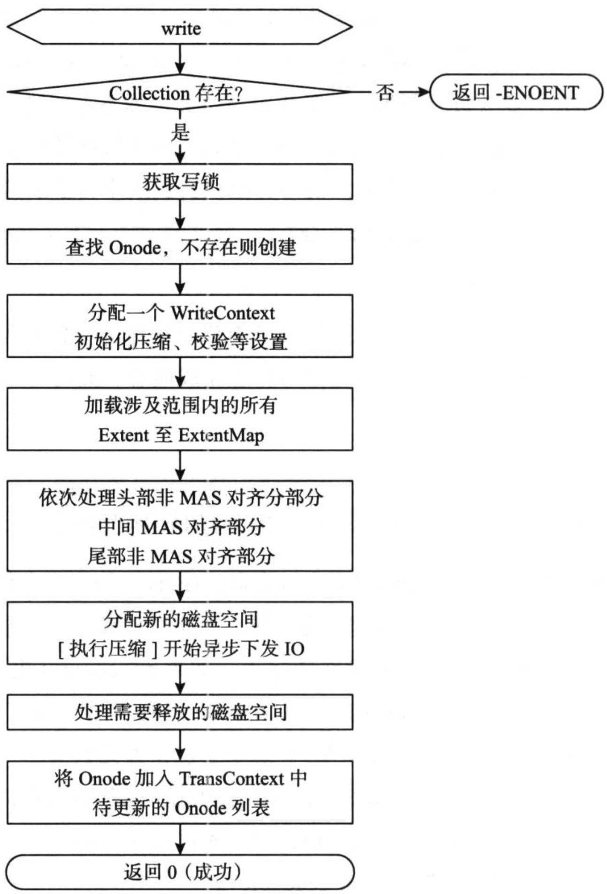


图2-14 write


□每次至多需要分配一个Extent。

□ Extent中blob_offset不再为0（参考表2-7）。

□待写入数据需要执行块对齐，无效部分使用全0填充，防止干净数据被污染。

对于覆盖写，如前所述，因为BlueStore对于MAS对齐部分总是执行COW，所以其处理逻辑也和新写类似，不同之处在于此时需要找出所有波及范围内已经存在的Extent和它们占有的空间（当然也需要更新对应Onode的ExtentMap，比如移除老的Extent，然后加入新的Extent等），等待事务组同步完成后一并释放。对于头尾非MAS对齐的覆盖写，情况则比较复杂，需要额外考虑以下几个因素：

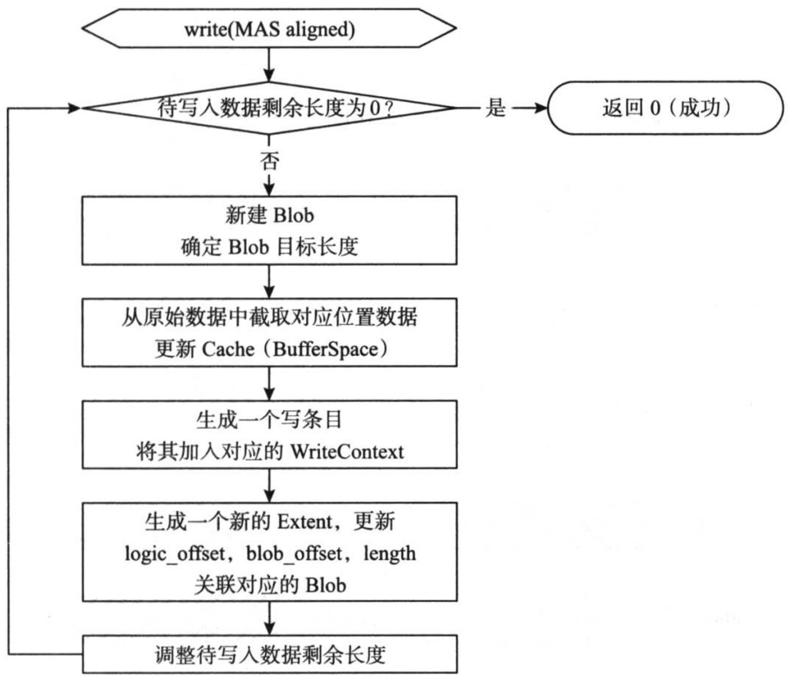


图2-15 MAS对齐写（新写）


# (1) 能否直接跳过, 执行 COW

这种情况常见于对应的Extent被压缩过，因为此时执行RMW代价太大，所以直接采用COW策略。

# （2）能否直接复用已有Extent的unused块

参考2.2.2节，如果设置的MAS大于基本块大小，那么Extent当中有可能产生以基本块大小为粒度的空穴，这些空穴会被BlueStore标记为unused。因为块是磁盘操作的一个原子单位，所以针对这些状态为unused的块进行操作不会对Extent中的其他内容造成影响——例如写的过程中掉电，因为之前这部分内容本身就是无效的，所以即使写入了新的垃圾数据也不会造成任何负面影响。

当然如果新写入的内容不足一个unused块，那么无效部分（显而易见，无效部分在块的头部和/或尾部）仍然需要使用全0进行填充处理。

# （3）是否需要执行WAL写

如果既不能执行COW，也不能复用已有Extent的unused块，那么此时RMW操作已经不可避免，为了避免将已有数据写坏，此时需要使用WAL。图2-16展示了WAL写

常见的几种情况（这里假定MAS为基本块大小。如果MAS不为基本块大小，则任何WAL写都可以分为头部非基本块对齐部分、中间基本块对齐部分和尾部非基本块对齐部分，其中头、尾非基本块对齐部分的处理逻辑和图2-16类似）：

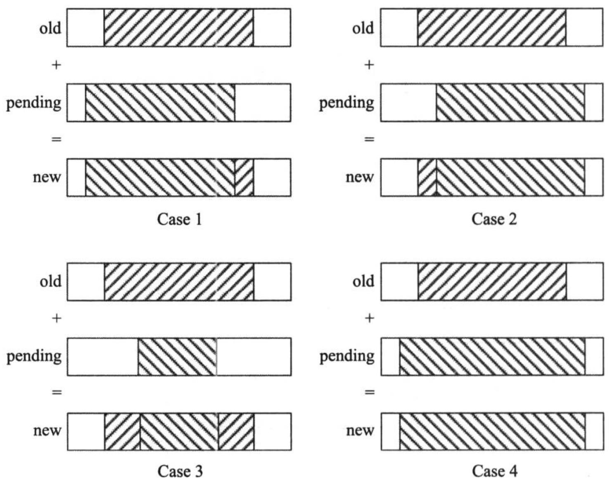


图2-16 WAL写


由图2-16可见，WAL写的标准流程包括补齐读、合并、（使用全0）填充3个步骤，完成填充后，最终得到一份新的待写入原有位置的数据，BlueStore随后基于此数据生成一个日志事务，并将其加入对应的TransContext。如前所述，此日志事务和BlueStore当中的其他元数据一样，是用kvDB保存的，只有对应的日志事务成功写入kvDB之后，才能开始对原有区域的数据执行覆盖写，加上之前的补齐读过程耗费了大量时间，所以WAL写效率实际上是非常低下的。

当所有的修改操作都被添加至 TransContext 时，就可以开始处理 TransContext 了，其处理过程可以分为如下 3 个泾渭分明的阶段：

# （1）等待所有在途的写I/O完成

这一部分写I/O主要是所有非WAL写通过COW产生的I/O，将被直接写入新的磁盘地址空间，因此可以在产生事务的过程中就开始同步执行。容易理解，如果此过程未完成即掉电，因为此时新的已分配出去的空间和老的待释放的空间尚未在kvDB中更新，

那么下次上电时不会产生任何影响。

# （2）同步所有涉及的元数据修改至kvDB

同一个事务组中所有修改所波及的元数据，包括已申请的空间和待释放的空间（如前所述，实际上只需要固化FreelistManager)，都会通过一个事务同步提交至kvDB。由数据库的ACID属性，我们知道这个阶段要么全部完成，要么没有任何影响，从而可以保证数据一致性。

# （3）通过WAL对应的日志事务执行覆盖写

至此阶段，因为对应WAL日志事务已经写入数据库，所以可以通过执行WAL日志重放安全的执行覆盖写。等待覆盖写的I/O完成之后，再次（在同步线程中同步）生成一个用于释放WAL日志事务条目的事务，并将其同步提交至kvDB等待其完成，最后将该事务组所有待释放磁盘空间加入Allocator（如前所述，这是常驻内存的可分配磁盘空间列表），供后续事务组使用。需要注意的是，本阶段是可选的，如果没有WAL写，那么空间可以在（2）阶段完成后即释放至Allocator。

如前所述，queue_transactions接口被设计成异步的，因此上述所有涉及等待磁盘I/O完成的过程，都通过注册回调函数实现。后端块设备通过执行回调函数再次将对应的TransContext加入到BlueStore的同步线程，从而继续处理TransContext，直至TransContext最终处理完成。

# 2.7 使用指南

至此，我们已经完整介绍了BlueStore的基本设计思想和主要实现细节，本节介绍如何部署BlueStore，同时我们也列出了一些和BlueStore相关的配置参数，供高级用户进行性能调优时参考。

# 2.7.1 部署BlueStore

如前所述，BlueStore 实现上非常灵活，一共可以支持 Slow、DB 和 WAL 3 种类型的块设备，其中 Slow 设备直接用于保存对象数据，DB 和 WAL 设备则用于保存和数据库相关的元数据。BlueStore 虽然实现上要比 FileStore 复杂，但是两者的部署却是类似的一一例如 BlueStore 中的 DB 和 WAL 设备和 FileStore 当中的 Journal 设备类似，也是通过符号链接的形式在上电时挂载到 OSD 的当前工作目录下；每个 OSD 的主设备，除

为了用于直接存储对象数据之外，还需要预留少量空间用于承载OSD启动时的引导数据，例如集群的fsid，OSD的id（即序号）、fsid、keyring等，这部分空间仍然需要依赖系统自带的本地文件系统接管（因为此时后端的ObjectStore还未正常上电，所以无法直接通过ObjectStore访问），因此如果使用BlueStore，每个OSD的主设备还要在部署时再次划分为容量一大一小两个分区，其中较小的分区使用本地文件系统格式化，用于保存OSD启动时的引导数据；较大的分区则以裸设备的形式由BlueStore直接接管，充当Slow设备。据此，我们得到一个完整的基于BlueStore的OSD模型，如图2-17所示。

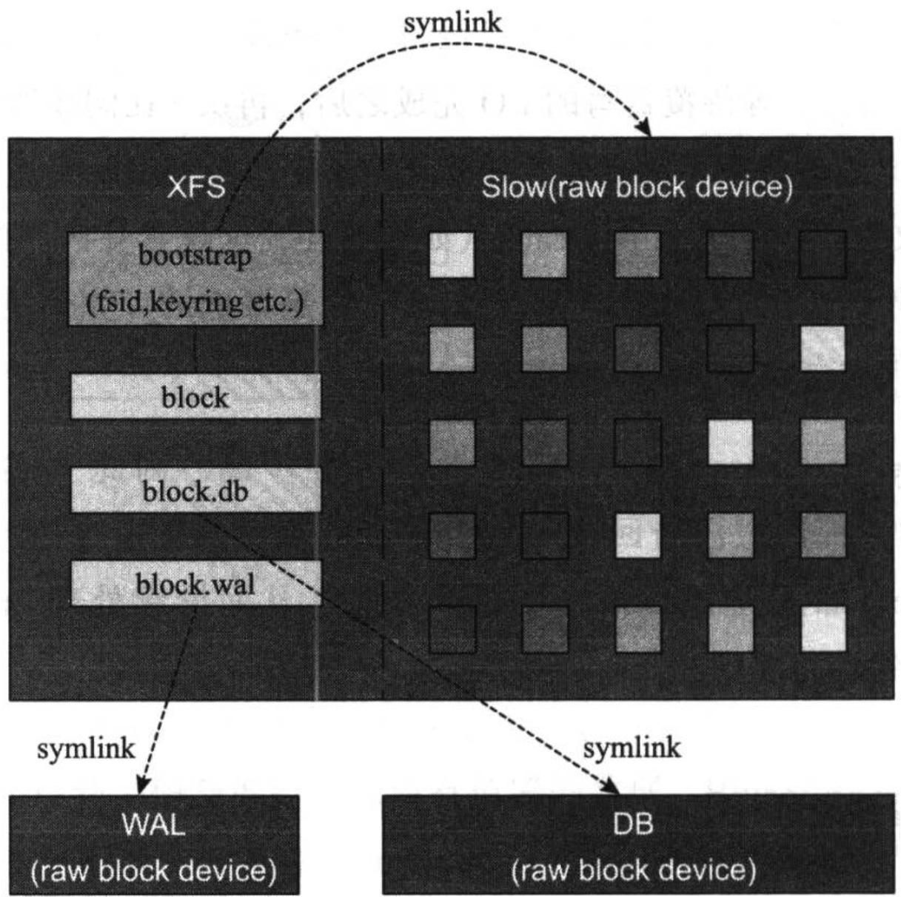


图2-17 基于BlueStore的OSD组成模型


由图2-17可见，我们部署BlueStore时，首先将主设备划分为一大一小两个分区，其中小的分区（例如容量为100MB）和FileStore类似，直接使用本地文件系统格式化后用于存放OSD的启动引导数据，同时作为OSD启动后的工作目录；大的分区直接作为一个裸的块设备，和另外两个裸块设备（或分区）一起通过符号链接的形式挂载到OSD的工作目录下。当然如果是全SSD阵列或者测试需要，也可以使用同一个块设备的4个分区完成BlueStore的部署。

如果所有分区或者块设备已经准备就绪，那么简单通过修改对应的ceph.conf文件即可完成BlueStore的部署：

[osd.0]   
host $=$ ceph-01   
osd data $=$ /var/lib/ceph/osd/ceph-0/   
bluestore block path $=$ /dev/disk/by-partlabel/osd-device-0-block   
bluestore block db path $=$ /dev/disk/by-partlabel/osd-device-0-db   
bluestore block wal path $=$ /dev/disk/by-partlabel/osd-device-0-wal 

这样后续BlueStore上电时，将首先在OSD当前工作目录下，创建3个文件：

```txt
block  
block.db  
block.wal 
```

然后通过读取ceph.conf配置文件，将这3个文件通过符号链接的形式指向对应分区或者块设备所在的真实路径。

当然也可以通过ceph-disk来自动完成BlueStore部署，为此，首先需要规划各个分区大小，同样可以通过ceph.conf文件指定，例如：

```ini
[global]  
bluestore block db size = 67108864  
bluestore block wal size = 134217728  
bluestore block size = 5368709120 
```

然后执行：

```txt
sudo ceph-disk prepare --bluestore /dev/sdb 
```

上述命令将在sdb上创建4个分区，对应关系如下：

```batch
sudo sgdisk -p /dev/sdb  
...  
Number Start (sector) End (sector) Size Code Name  
1 2048 206847 100.0 MiB FFFF ceph data  
2 206848 337919 64.0 MiB FFFF ceph block.db  
3 337920 600063 128.0 MiB FFFF ceph block.wal  
4 600064 11085823 5.0 GiB FFFF ceph block 
```

当然也支持使用多个块设备，例如：

```txt
sudo ceph-disk prepare --bluestore /dev/sdb --block.db /dev/sdc --block.wal /dev/sdc 
```

上述命令将在sdb上创建两个分区，然后通过符号链接，将block指向sdb的第2个分区；将block.db指向sdc的第1个分区；将block.wal指向sdc的第2个分区。或者更

进一步地通过：

```shell
sudo ceph-disk prepare --bluestore /dev/sdb --block.db /dev/sdc1 \
--block.wal /dev/sdd1 
```

将block.db和block.wal分离，分别指向不同块设备sdc和sdd的第1个分区。

需要注意的是，DB和WAL设备的容量配置并非一成不变，而是需要根据Slow设备的容量、读写速率以及RocksDB本身的参数综合进行规划，目前推荐按照Slow：DB：WAL=100:1:1进行配置，当然设置更大的DB和WAL设备容量效果更佳。

最后，因为目前BlueStore和RocksDB仍然被标记为实验性质，不推荐作为默认的ObjectStore后端，所以还需要额外增加如下全局配置才能正常启用BlueStore：

```ini
[global]  
enable experimental unrecoverable data corrupting features = bluestore rocksdb  
osd objectstore = bluestore 
```

# 2.7.2 配置参数

本节按照类别汇总截至目前所有和BlueStore相关的配置参数，如表2-29～表2-36所示。


表 2-29 BlueStore 配置参数——部署


<table><tr><td>配置项</td><td>含义</td></tr><tr><td>bluestore_block_path</td><td>Slow 类型块设备所在路径</td></tr><tr><td>bluestore_block_db_path</td><td>DB 类型块设备所在路径</td></tr><tr><td>bluestore_block_wal_path</td><td>WAL 类型块设备所在路径</td></tr><tr><td>bluestore_blues</td><td>如果采用 RocksDB 作为默认的 kvDB 引擎,是否使用 BlueFS 作为 RocksDB 的本地文件系统,默认为 true</td></tr><tr><td>bluestore Kvfrontend</td><td>采用的 kvDB 引擎,默认为 “rocksdb”</td></tr><tr><td>bluestore_rocksdb_options</td><td>RocksDB 相关的配置选项</td></tr></table>


表 2-30 BlueStore 配置参数——extent map


<table><tr><td>配置项</td><td>含义</td></tr><tr><td>bluestoreextent_map在线.shard_prealloc_size</td><td>如果整个extent map编码后的长度比较小,那么可以直接将extent map作为一个整体进行存储(即不进行分片),此时可以将编码后的extent map直接在内存中进行缓存,本参数用于对相应的缓存进行预分配(亦即此类extent map编码后的期望长度)</td></tr><tr><td>bluestoreextent_map_shard_max_size</td><td rowspan="2">如果extent map中任意一个分片编码后的实际长度不在此范围内,则触发重新分片</td></tr><tr><td>bluestoreextent_map_shard_min_size</td></tr><tr><td>bluestoreextent_map_shard_target_size</td><td>单个extent map分片编码后的期望长度</td></tr><tr><td>bluestoreextent_map_shard_target_size_slop</td><td>当某个Blob跨越两个分片时，通过此系数对 bluestoreExtent_map_shard_target_size进行调整（以使得 Blob不再跨越两个分片）</td></tr></table>


表 2-31 BlueStore 配置参数——Cache


<table><tr><td>配置项</td><td>含义</td></tr><tr><td>bluestore_2q_cache_kin_ratio</td><td rowspan="2">参考2.3.1节，如果Cache类型为2Q，bluestore_2q_cache_kin_ratio用于控制A1in/Am队列容量比例；bluestore_2q_cache_kout_ratio用于间接控制“热度保留间隔”</td></tr><tr><td>bluestore_2q_cache_kout_ratio</td></tr><tr><td>bluestore_cache_meta_ratio</td><td>缓存中元数据所占比重</td></tr><tr><td>bluestore_cache_size</td><td>单个BlueStore实例配置Cache大小，默认为1GB</td></tr><tr><td>bluestore_cache_trim_interval</td><td>针对Cache执行淘汰的时间间隔</td></tr><tr><td>bluestore_cache_type</td><td>缓存类型，包含如下选项：
——2q（默认）
——lru</td></tr></table>


表 2-32 BlueStore 配置参数——磁盘空间管理


<table><tr><td>配置项</td><td>含义</td></tr><tr><td>bluestore_allocator</td><td>Allocator 类型,包含如下选项: —— bitmap (默认) ——stupid (本质上是 extent)</td></tr><tr><td>bluestore_bitmapallocator_blocks_per-zone</td><td rowspan="2">参考“2.4.3 BitmapAllocator”,这两个参数用于调整 Bitmap- Allocator 的拓扑结构</td></tr><tr><td>bluestore_bitmapallocator spans_size</td></tr><tr><td>bluestore_freelist_type</td><td>FreelistManager 类型,包含如下选项: —— bitmap (默认) ——extent</td></tr><tr><td>bluestore_freelist_blocks_per_key</td><td>参考“2.4.2 BitmapFreelistManager”,用于调整将空间段以键值对形式写入 kvDB 时的值长度</td></tr><tr><td>bluestore_min_alloc_size</td><td rowspan="2">限制 Allocator 次分配空间的上下限。bluestore_min_alloc_size同时设置了 Allocator 分配空间的基本粒度,即 Allocator 分配的空间必须是 bluestore_min_alloc_size 的整数倍</td></tr><tr><td>bluestore_max_alloc_size</td></tr></table>


表 2-33 BlueStore 配置参数——BlueFS


<table><tr><td>配置项</td><td>含义</td></tr><tr><td>bluefs_allocator</td><td>Allocator 类型，包含如下选项：
—— bitmap（默认）
——stupid（本质上是 extent）</td></tr><tr><td>bluefs_alloc_size</td><td>最小可分配空间</td></tr><tr><td>bluefs_max_prefix</td><td>如果进行预读，每次预读的最大字节数</td></tr></table>


表 2-34 BlueStore 配置参数——校验


<table><tr><td>配置项</td><td>含义</td></tr><tr><td>bluestore_csum_type</td><td>校验算法,包含如下选项:none—xxhash32—xxhash64—crc32c(默认)—crc32c_16—crc32c_8不同的校验算法效率不同。对于同一种校验算法,最后的数字表明产生的校验数据长度,单位为比特。减少校验数据长度可以获得更好的数据库操作性能,但是会增加冲突概率</td></tr></table>


表 2-35 BlueStore 配置参数——压缩


<table><tr><td>配置项</td><td>含义</td></tr><tr><td>bluestore_compression_algorithm</td><td>压缩算法,包含如下选项:——zlib——snappy(默认)</td></tr><tr><td>bluestore_compression_mode</td><td>压缩策略,包含如下选项:——force:强制进行压缩——aggressive:除非前端写请求携带不压缩提示,否则进行压缩——passive:除非前端写请求携带压缩提示,否则不进行压缩——none:不进行压缩(默认)</td></tr><tr><td>bluestore_compression_max_blob_size</td><td rowspan="2">如果允许对写入的数据进行压缩,BlueStore将基于前端给出的不同写入提示设置合适的Blob大小。例如对于顺序写,BlueStore会将Blob的目标大小设置为bluestore_compression_max_blob_size;否则(采用较为保守的策略)将Blob目标大小设置为bluestore_compression_min_blob_size</td></tr><tr><td>bluestore_compression_min_blob_size</td></tr><tr><td>bluestore_compression_required_ratio</td><td>针对数据执行压缩时,要求压缩后与压缩前数据所占用的目标磁盘空间比重必须小于此数值(即减小此数值要求压缩算法执行后取得更高的空间收益),否则放弃压缩</td></tr></table>


表 2-36 BlueStore 配置参数——事务


<table><tr><td>配置项</td><td>含义</td></tr><tr><td>bluestoreClone_cow</td><td>针对clone操作,是否执行COW策略</td></tr><tr><td>bluestore_max_bytes</td><td>流量控制(写抑制)。</td></tr><tr><td>bluestore_maxOps</td><td rowspan="3">bluestore_max OPS用于指定最大并发操作(同事务,一个事务组可能包含多个事务)数;bluestore_max_bytes用于指定最大并发字节数。如果包含WAL写,那么还需要同时满足并发数不得超出bluestore_wal_max_bytes和bluestore_wal_max_bytes的约束。违反上述任一约束条件将触发写抑制</td></tr><tr><td>bluestore_wal_max_bytes</td></tr><tr><td>bluestore_wal_max OPS</td></tr><tr><td>bluestore_wal Threads</td><td rowspan="2">BlueStore使用线程池实现WAL写,这些参数用于调整线程池相关的配置。</td></tr><tr><td>bluestore_wal_thread_suicide_timeout</td></tr><tr><td>bluestore_wal_thread_timeout</td><td>bluestore_wal Threads指定线程池中的服务线程个数。如果单个线程连续占用时间片超过bluestore_wal_thread_timeout,那么对应的OSD进程会被标记为unhealthy;如果超过bluestore_wal_thread_suicide_timeout,那么对应的OSD进程会自杀</td></tr></table>

# 2.8 总结与展望

BlueStore于2015年年中引入，目标是替换已经服役超过10年的FileStore，作为新一代默认的ObjectStore引擎，提升FileStore一直为人诟病的写性能。FileStore存在如下缺陷：

□ 强烈依赖本地文件系统，但是真正能够完美适配FileStore的则几乎没有；默认的XFS仍然过于重量级，很多功能对于FileStore而言不是必须的。

□基于POSIX语义的目录层级结构使得针对PG中的对象进行顺序遍历非常困难。

□数据和元数据分离不彻底。

□日志叠加日志的设计使得写放大现象异常严重，从而严重制约写性能。

□流控机制不完整导致IOPS和带宽抖动（FileStore自身无法控制本地文件系统的刷盘行为）。

□频繁syncfs系统调用导致CPU利用率居高不下。

在定位上，BlueStore期望解决FileStore上述缺陷的同时带来至少2倍的写性能提升和同等的读性能，此外，增加对于未来一些新型存储介质例如NVMe SSD以及诸如数据自校验、数据压缩等热点增值功能的支持也是必选项。基于当前版本的实测数据（测试工具为FIO），这个目标在基于NVMe SSD的全闪存阵列当中已经部分实现，512KB及以上块的顺序读写场景中实现了接近2倍的性能提升，但是BlueStore在主打机械磁盘的传统阵列中的表现仍然差强人意，小粒度例如4KB块的随机读写性能与FileStore相比提升有限，因此针对BlueStore进行性能优化依然任重而道远，好在BlueStore设计得非常灵活，几乎所有关键组件都可定制，可以随时使用更好的方案进行替换，这为BlueStore后续取得长足进步奠定了良好的基础。

# 时空博弈

——纠错码原理与overwrites支持

不同类型的存储系统其组成形态和存储规模各异，然而无论何种类型的存储系统，它们都面临一个相同考验——由于组件失效而导致的数据丢失风险。组件失效的原因多种多样，小到磁盘扇区出现静默数据错误（机械磁盘由于电容老化或者电磁辐射可能导致某些比特出现误翻转从而产生静默数据错误），大到某个主机甚至整个机柜异常掉电。有些组件本身具有容错机制，例如磁盘——实现上会针对每个扇区额外填充一些校验信息，这样即使少数几个比特出错，仍然可以基于校验信息自动对这些出错的比特进行修复，从而保证整个扇区的数据不致损坏。然而上述容错机制在应对诸如磁盘消磁甚至遭受物理损坏这类极端情况依然无能为力，因此还需要在系统层面设计额外的数据保护机制，防止数据因为个别组件完全失效而遭受不可逆转的损坏，导致系统无法正常工作。

起源于通信系统的纠删码（Erasure Coding，EC）是目前在存储系统中广泛使用的一种数据保护机制。纠删码首先针对原始数据进行分片，然后基于分片编码生成备份数据，最后将原始数据和备份数据分别写入不同的存储介质。数据恢复是编码的逆运算（为了能够进行数据恢复，要求编码采用的方法（函数）一定是可逆的），因此也称为解码。纠删码的容错能力取决于生成备份数据的份数，这也是系统中允许同时失效的最大存储介质数目。通常情况下，生成备份数据份数越多，则对应的编码法则越复杂，同时也将消耗更多的额外存储空间。考虑到编解码效率和存储空间成本，生产环境中很少会使用阶数（即备份数据份数）高于2的纠删码。

纠删码最简单的实现方式是完全复制，也称为镜像，即将数据不做任何处理同时写入多个不同的存储介质。这样，只要数据还有一个备份存活，就不必担心数据丢失，代价是会消耗和阶数同等倍数的额外存储空间。为了降低存储空间成本，纠删码也发展出了其他更复杂的实现方式，典型如高阶 RAID（Redundant Array of Independent Disk，这里指 RAID5 或者 RAID6）以及由 RAID 衍生而来、更具一般性的 RS-RAID（Reed-Solomon RAID），它们通过更加复杂的编解码策略建立原始数据和备份数据之间的映射关系，以牺牲计算成本作为代价减少需要备份的数据量，从而降低存储空间成本。

本章按照如下形式组织：首先，我们介绍在传统存储系统（SAN/NAS）中被广泛使用的数据保护机制——RAID；以 RAID 技术为基础，通过分析其背后隐含的数学原理，我们可以推导出更具代表性的 RAID 表现形式——RS-RAID，以及由此发展而来的 Jerasure 标准库；得益于纠删码标准库的日益成熟和丰富，Ceph 社区决定自 Kraken 版本起增加对于纠删码的一些高级特性例如 overwrites（即覆盖写）支持，我们将在 3.3 节中针对这些新增特性重点进行介绍，并借此分析后续将纠删码推广至生产环境时所面临的挑战。

# 3.1 RAID技术概述

数据存储在单个磁盘上，存在一些固有缺陷：

□ 访问速度慢：单一的I/O接口，无法实现并发。

□容量小：尽管（单个）磁盘的容量不断得到提升，但是仍然无法满足呈爆炸式增长的数据存储需求。

□安全性差：容易成为一个单点故障点，安全性较差。

如果单个磁盘无法满足访问速度、容量、安全性等要求，那么可以使用多个磁盘联合起来提供存储服务。这些磁盘应该如何进行组合才能达到最优呢？RAID技术通过对可能的组合方式进行探索，做出了一些有益的尝试。

我们已经知道：单个磁盘上的数据是以扇区为基本单位进行存储和访问的。RAID 抽象出一个类似于扇区的最小数据访问单位——条带（参见图 3-1）。这是一种虚拟化的设计方法，即 RAID 中的条带化，并非将磁盘再次物理格式化为条或者带，而是想办法在多个磁盘之间建立一种逻辑映射关系，通过这种逻辑映射关系，RAID 可以将多个物理磁盘抽象为一个容量更大、I/O 并发能力更高的虚拟磁盘，以条带作为基本单位进行管理。

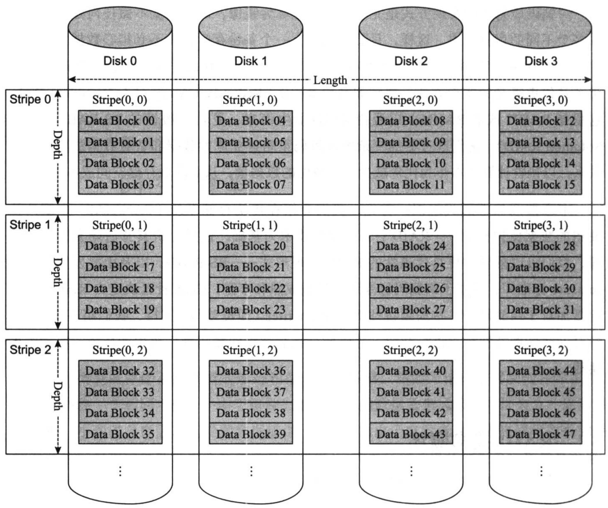


图3-1 条带


图中单个条带（Stripe）所跨过的磁盘个数，称为条带宽度（或者条带长度）；单个条带在单个磁盘上分配的字节数，称为条带深度；


条带深度一般为磁盘基本块（指访问磁盘的最小粒度，例如扇区）的整数倍


目前主流的RAID技术有如下几种基本模式：

# (1) RAID0

RAID0将多个磁盘（这里假定所有磁盘规格相同，下同）以条带为单位重新划分，形成一个地址空间在逻辑上连续的虚拟磁盘，其I/O能力以及可用存储空间是所有磁盘之和，但是不具备容错能力。一个典型的RAID0系统如图3-2所示。

# (2) RAID1

RAID1将同一份数据重复写入两个或多个磁盘，即每个磁盘存储的内容都是完全相

同的，因此RAID1也称为镜像，能够提供的I/O能力以及可用存储空间只有所有磁盘之和的 $1 / \mathrm{N}$ ，其中N为镜像个数。因为只要任意一个镜像存活，就可以确保数据不会丢失，所以RAID1的容错能力和镜像个数成正比。图3-3是一个仅包含两个磁盘的RAID1系统：

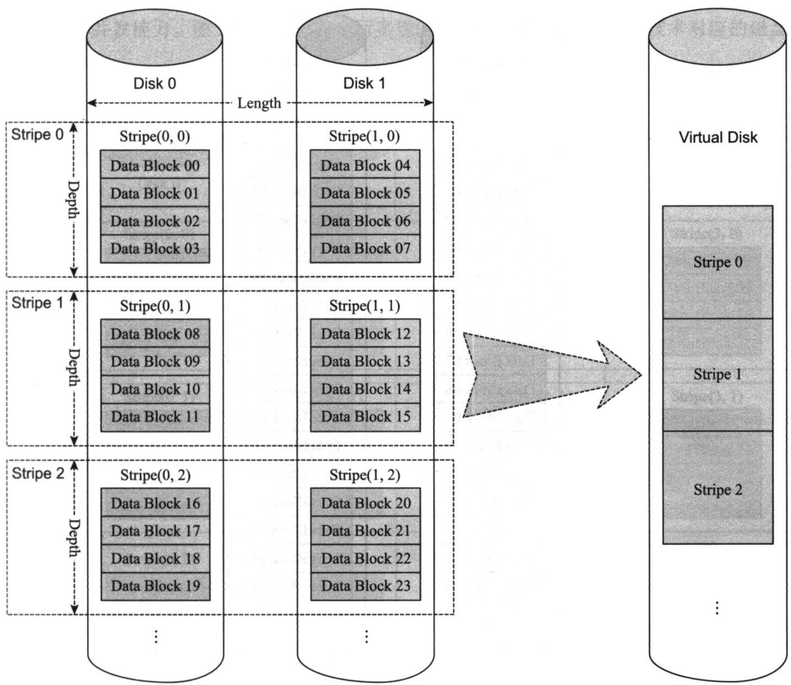


图3-2 RAID0系统


# (3) RAID5

RAID5 以一个或多个基本块作为条带深度均分数据，同时基于异或运算生成一个与数据块同等大小的校验块，因此 RAID5 能够提供的 I/O 能力以及可用存储空间为所有磁盘的 $(N - 1) / N$ ，其中 $N$ 为组成 RAID5 的磁盘个数，亦即 RAID5 的条带宽度。由异或运算性质，如果条带中任意一个数据块出错，都可以通过其他仍然正常的数据块和校验块

执行异或操作进行数据恢复，因此RAID5具有一定的容错能力，至多允许一块磁盘异常。此外，因为正常情况下并不需要读取校验块，所以为了避免读带宽浪费，RAID5条带中校验块的位置不是固定不变的，而是不停地在不同磁盘之间跳动。图3-4展示了一个条带宽度为4、条带深度为4个基本块的RAID5系统。

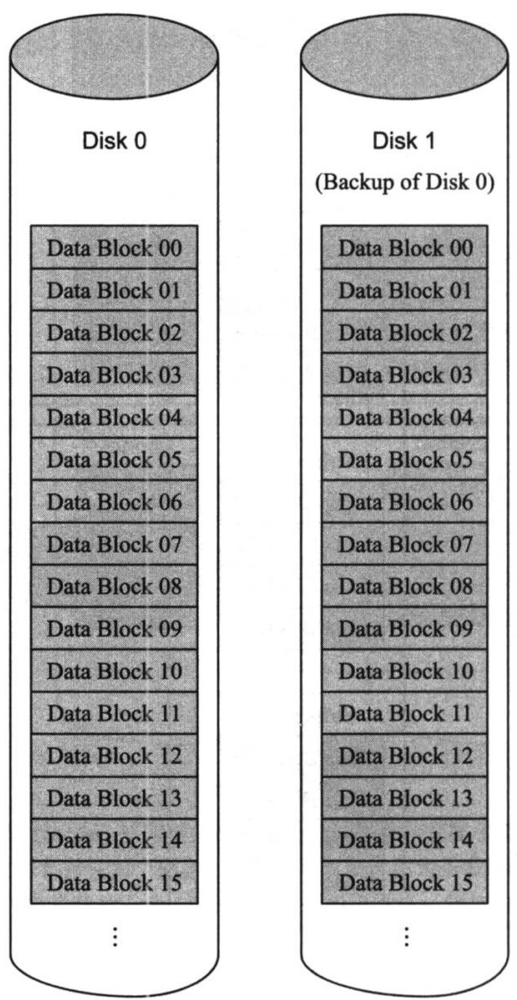


图3-3 RAID1系统


两个磁盘保存的内容完全一致，互为镜像


在一般的RAID5设计中，条带宽度和深度都是固定的（这样比较简单），但是也有特例，例如ZFS自带的RAID5技术（ZFS称为RAIDZ）将条带宽度和深度设计得都不固定，而是会随着前端下发的I/O大小动态进行调整，这样做可以避免空间浪费和提升I/O并发能力——假定条带宽度和深度固定，分别为5（即4个数据块+1个校验块）和4KB，

那么容易验证这种形式的RAID5最适合处理大小固定为16KB的I/O；反之，如果I/O大小发生了变化，例如变为4KB，那么此时条带中将存在3个空穴，只能使用全0的数据填充（由异或运算性质—— $1^{\wedge}0 = 1$ ； $0^{\wedge}0 = 0$ ，可见任何数据与全0执行异或之后结果不变），此时将浪费12KB的存储空间和3个磁盘的I/O能力。RAIDZ针对后面这种情况会自动将条带深度调整为1KB，从而避免空间浪费，同时最大程度的利用RAID组内磁盘的I/O并发能力。图3-5展示了ZFS所实现的、基于可变条带RAID5技术对应的磁盘条带分布。

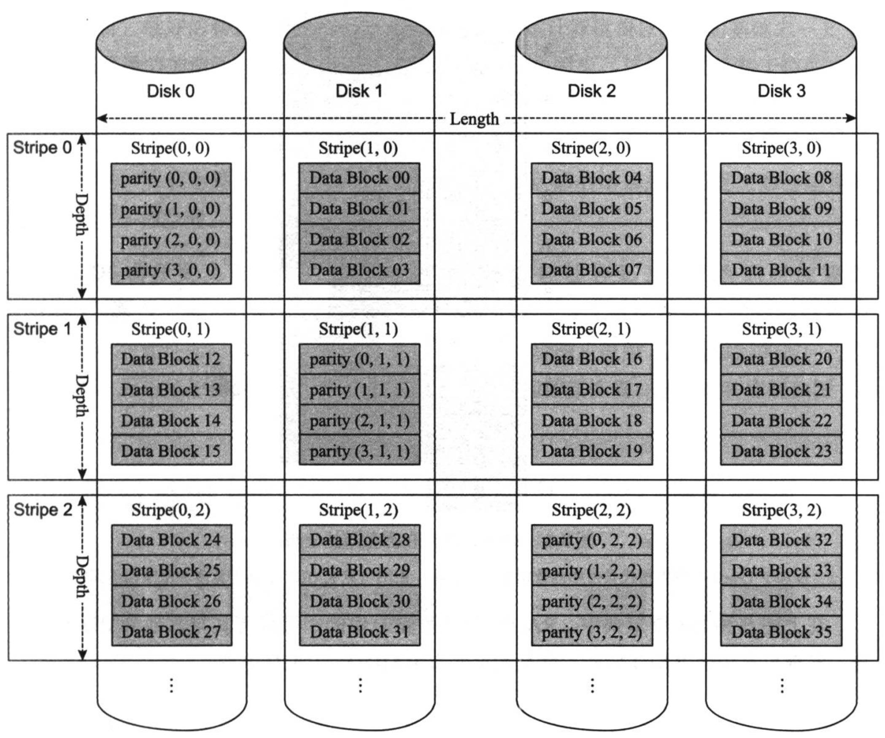


图3-44个磁盘构成的RAID5系统


# (4) RAID6

RAID6在RAID5的基础上进一步提升了容错能力，允许RAID阵列中同时有两块磁盘故障。相对RAID5而言，RAID6的代价是每个条带增加了一个校验块，即每个条带

同时包含两个校验块，因此空间和I/O利用率都比RAID5要低，同时生成校验块的算法也更加复杂。

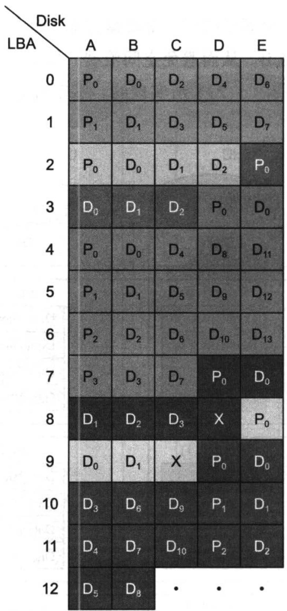


图3-5 RAIDZ条带在磁盘间的分布


D 和 P (Parity) 分别指代条带中的数据块和校验块, 由图可见 RAIDZ 的条带宽度和深度都不固定


在上述几种 RAID 形式中，RAID0 的速度是最快的，可以将其与其他 RAID 形式组合，实现更高级的 RAID 形式，常见的组合有 RAID10、RAID50 等。

# 3.2 RS-RAID和Jerasure

我们已经了解了 RAID 的相关概念，本节我们分析高阶 RAID（RAID5 及以上）技术隐含的数学原理，并尝试将其推广至一般形式。

RAID5 基于条带将数据均匀切分成多个数据块 $d_{i} (i = 1,2,\dots,n)$ ，然后尝试建立这些数据块之间的联系，例如使用普通的加法：

$$
d _ {1} + d _ {2} + d _ {3} + \dots + d _ {n} = c
$$

上式中， $c$ 为基于加法生成的校验块。这样，如果任意一个数据块损坏（此时等式中的某个 $d_{i}$ 变为未知），都可以通过求解上述一元一次方程进行数据恢复。然而上面这个方法却不会在实际中应用，原因在于普通的加法容易产生进位，因此为了记录所有数据块之和，校验块占用的存储空间一般情况下要大于参与计算的任一数据块的存储空间。对计算机而言，最好的替代方案就是采用布尔运算（这是计算机得以发明的基础之一），具体要替代普通的加法运算，则应该使用异或运算，这是因为：首先异或是基于位的运算（简单并且是计算机最高效的运算方式）；其次，为了求解上述方程，需要对应算法的逆运算存在并且结果唯一，而异或运算的逆运算不但存在而且与正向运算完全相同；最后也最重要的是，异或运算不会产生进位，因此存储异或运算的结果并不需要比参与运算的任一对象更多的空间。

RAID6或者更高阶的RAID（例如ZFS实现了能够容忍3块磁盘同时故障的RAIDZ3）原理上和RAID5类似，实际上是利用条带中 $n$ 个数据块通过编码得到 $m$ 个校验块（ $m$ 为允许同时故障的最大磁盘数目），如果出现磁盘故障，通过编码的逆向过程（称为解码）可以还原得到所有缺失的数据块，从而实现数据恢复，这个过程图解如图3-6所示。

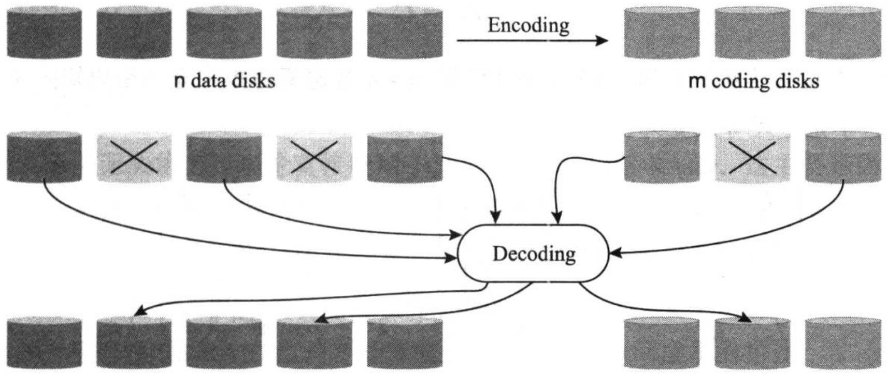


图3-6 高阶RAID实现图解


从数学上来说，上述问题可以转化为更一般的描述形式，即：如何基于 $n$ 个可变输

入，构造 $m$ 个等式，使得对应的 $m$ 元一次方程组有唯一解（当磁盘故障时，对应的输入变为未知数；容易理解这 $m$ 个等式中至多包含 $m$ 个未知数，否则对应的方程组可能有无穷多解，而不是唯一解）。Irving S. Reed 和 Gustave Solomon 最早针对上述问题进行了研究，其结果是产生了一系列具有普遍意义、广泛应用于通信领域纠正信息传输过程中静默数据错误的 Reed-Solomon codes。1997 年，James S.Plank 将 Reed-Solomon codes 引入存储系统，用于实现高阶 RAID，对应的 RAID 技术也称为 RS-RAID，后者随之成为了 RAID 技术工业上的规范。简言之，RS-RAID 具体实现包含如下 3 个方面：

□基于范德蒙德矩阵计算校验和。

□基于高斯消元法进行数据恢复。

□基于伽罗华域执行编解码过程中所要求的算术运算。

我们接下来分别予以介绍。

# 3.2.1 计算校验和

假定当前有 $n$ 个数据块，分别为 $d_{1}, d_{2}, \dots, d_{n}$ ；定义 $F_{i}$ 为所有数据块的线性组合，则根据 $F_{i}$ 可以计算得到校验块 $c_{i} (i = 1, 2, \dots, m)$ ：

$$
c _ {i} = F _ {i} \left(d _ {1}, d _ {2}, \dots , d _ {n}\right) = \sum_ {j = 0} ^ {n} d _ {j} f _ {i, j}
$$

换言之，如果我们使用向量 $\pmb{D}$ 和 $C$ 分别表示所有数据块和校验块的集合， $F_{i}$ 表示矩阵 $\pmb{F}$ 中的每一行，则整个编码的过程可以采用如下等式表示：

$$
\boldsymbol {F D} = \boldsymbol {C}
$$

因此， $F$ 也称为编码矩阵。RS-RAID使用 $m \times n$ 范德蒙德矩阵充当编码矩阵 $F$ ，即有： $f_{i,j} = j^{i - 1}$ ，于是上述等式变为：

$$
\left( \begin{array}{c c c c} f _ {1, 1} & f _ {1, 2} & \dots & f _ {1, n} \\ f _ {2, 1} & f _ {2, 2} & \dots & f _ {2, n} \\ \vdots & \vdots & \vdots & \vdots \\ f _ {m, 1} & f _ {m, 2} & \dots & f _ {m, n} \end{array} \right) \left( \begin{array}{l} d _ {1} \\ d _ {2} \\ \vdots \\ d _ {n} \end{array} \right) = \left( \begin{array}{c c c c} 1 & 1 & \dots & 1 \\ 1 & 2 & \dots & n \\ \vdots & \vdots & \vdots & \vdots \\ 1 ^ {m - 1} & 2 ^ {m - 1} & \dots & n ^ {m - 1} \end{array} \right) \left( \begin{array}{l} d _ {1} \\ d _ {2} \\ \vdots \\ d _ {n} \end{array} \right) = \left( \begin{array}{l} c _ {1} \\ c _ {2} \\ \vdots \\ c _ {m} \end{array} \right)
$$

# 3.2.2 数据恢复

为了进行数据恢复，我们定义矩阵 $\mathbf{A}$ 和向量 $\pmb{E}$ ，满足 $A = \left(\frac{I}{F}\right)$ （ $\pmb{I}$ 为单位矩阵）并且

$\pmb{E} = \begin{pmatrix} \pmb{D} \\ \pmb{C} \end{pmatrix}$ , 于是有如下等式成立 ( $AD = E$ ):

$$
\left( \begin{array}{c c c c} 1 & 0 & \dots & 0 \\ 0 & 1 & \dots & 0 \\ \vdots & \vdots & \vdots & \vdots \\ 0 & 0 & \dots & 1 \\ 1 & 1 & \dots & 1 \\ 1 & 2 & \dots & n \\ \vdots & \vdots & \vdots & \vdots \\ 1 ^ {m - 1} & 2 ^ {m - 1} & \dots & n ^ {m - 1} \end{array} \right) \left( \begin{array}{c} d _ {1} \\ d _ {2} \\ \vdots \\ d _ {n} \end{array} \right) = \left( \begin{array}{c} d _ {1} \\ d _ {2} \\ \vdots \\ d _ {n} \\ c _ {1} \\ c _ {2} \\ \vdots \\ c _ {m} \end{array} \right)
$$

此时对于任意一个块（包括数据块和校验块），矩阵 $A$ 和向量 $\pmb{E}$ 都有一行与之对应，所以 $\pmb{A}$ 也被称为分布矩阵（distribution matrix，James 后来承认这个命名不符合编码学规范，应该改为 generator matrix，即生成矩阵，这里和论文保持一致，仍称为分布矩阵）。假定某个数据块失效，则相应的，我们将其对应的行从矩阵 $\pmb{A}$ 和向量 $\pmb{E}$ 中删除，于是得到一个新的等式：

$$
\boldsymbol {A} ^ {\prime} = \boldsymbol {D E} ^ {\prime}
$$

如果恰好有 $m$ 个数据块失效（即向量 $\pmb{D}$ 中存在 $m$ 个未知数），那么可知此时 $\pmb{A^{\prime}}$ 为一个 $n\times n$ 矩阵。因为 $\pmb{F}$ 是范德蒙德矩阵，所以分布矩阵 $\pmb{A}$ 的任意 $n$ 行都是线性独立的，即 $\pmb{A}$ 为非奇异矩阵，进而可知 $\pmb{A^{\prime}}$ 是可逆的，于是 $\pmb{D}$ 中所有未知数都可以通过高斯消元法求解，即所有数据块都可以被修复。

# 3.2.3 算术运算

然而实际上无法将上述理论直接应用于计算机来实现RS-RAID，这主要是因为数据恢复所依赖的高斯消元法需要用到除法运算，因此这个解虽然在实数域一定存在，但是由于计算机只能实现有限精度的除法运算，所以会导致该方法失效。另一个潜在的问题在于普通的乘法运算容易产生进位，这使得存储校验块通常情况下要花费比任一数据块更多的空间，也有违RS-RAID以消耗计算能力来降低存储空间成本的初衷。

考虑到计算机基于二进制，并且只能进行有限精度运算的特性，我们定义一个整型集合：

$$
\{0, 1, 2, \dots , 2 ^ {w - 1} \}
$$

易见上述集合一共包含 $2^{w}$ 个元素，例如当 $w = 8$ 时，该集合即对应计算机一个字节（Byte）所能存储的数值范围；同时我们定义一套基于该集合的运算法则，该运算法则只包含加减乘除四则基本运算（高斯消元法只需要用到这四种基本运算），并且在集合内封闭（即执行任一运算后的结果仍然在集合内，这样可以保证执行加法或者乘法运算不会产生进位操作，从而保证存储校验块不需要比任一数据块更多的空间）。我们将满足上述约束条件的集合称为伽罗华域（GaloisField)，也称为有限域（顾名思义，域（集合）中所包含的元素个数是有限的），其数学表达形式为 $GF(2^{w})$ 。

在RS-RAID的实现中， $GF(2^{w})$ 中的加法运算非常简单，就是异或运算。因为加法和减法互为逆运算，而异或运算的逆运算为自身，所以 $GF(2^{w})$ 中的减法运算与加法运算相同，也是异或运算。以 $GF(2) = \{0,1\}$ 为例，容易验证（ $x$ 表示未知数）：

$$
\begin{array}{l} 0 \wedge x = 0 \rightarrow x = 0 \wedge 0 = 0 \\ 0 \wedge x = 1 \rightarrow x = 1 \wedge 0 = 1 \\ 1 \wedge x = 0 \rightarrow x = 0 \wedge 1 = 1 \\ 1 \wedge x = 1 \rightarrow x = 1 \wedge 1 = 0 \\ \end{array}
$$

可见，异或运算及其逆运算在 $GF(2)$ 内是封闭的。

为了推导 $GF(2^{w})$ 中乘法运算的一般形式，我们首先定义基于 $GF(2)$ 的多项式基本运算规则：

□多项式系数全部来自 $GF(2)$ （即只能取0或者1）。

□多项式中次数相同的项，可以基于 $GF(2)$ 中的加法（即异或运算）进行合并。

例如假定：

$$
\begin{array}{l} r (x) = x + 1 \\ s (x) = x \\ \end{array}
$$

则：

$$
r (x) + s (x) = x + 1 + x = (1 + 1) x + 1 = (1 \wedge 1) x + 1 = 0 + 1 = 0 \wedge 1 = 1
$$

基于上述规则，我们可以定义多项式的模运算规则如下：

如果 $r(x) = q(x)t(x) + s(x)$ ，其中：

$s(x)$ 和 $t(x)$ 为任意多项式并且 $s(x)$ 的次数小于 $q(x)$ 

则：

$$
r (x) \bmod q (x) = s (x) _ {\circ}
$$

例如假定：

$$
r (x) = x ^ {2} + x
$$

$$
q (x) = x ^ {2} + 1
$$

因为：

$$
r (x) = \left(x ^ {2} + x\right) = \left(x ^ {2} + x\right) + 1 + 1 = x ^ {2} + 1 + x + 1 = q (x) + x + 1
$$

所以：

$$
r (x) \bmod q (x) = x + 1
$$

进一步的，如果多项式 $q(x)$ 满足：

□次数为 $w_{\circ}$ 

□所有项的系数都来自 $GF(2)$ 

□不能被因式分解。

那么可以基于 $q(x)$ 生成 $GF(2^{w})$ 中所有元素，过程如下：

1）前三个元素固定为0、1、 $x$ 

2）将前一个元素乘以 $x$ ，然后针对 $q(x)$ 取模。

3）重复步骤2），直至最终结果为1。

因此，满足上述条件的多项式 $q(x)$ 也被称为 $GF(2^{w})$ 的生成多项式，记做：

$$
G F (2 ^ {w}) = G F (2) [ x ] / q (x)
$$

常见的生成多项式如下：

$$
\begin{array}{l} w = 4: x ^ {4} + x + 1 \\ w = 8: x ^ {8} + x ^ {4} + x ^ {3} + x ^ {2} + 1 \\ w = 1 6: x ^ {1 6} + x ^ {1 2} + x ^ {3} + x + 1 \\ \end{array}
$$

$$
\begin{array}{l} w = 3 2: x ^ {3 2} + x ^ {2 2} + x ^ {2} + x + 1 \\ w = 6 4: x ^ {6 4} + x ^ {4} + x ^ {3} + x + 1 \\ \end{array}
$$

例如针对 $w = 4$ ，使用 $q(x) = x^4 + x + 1$ 生成 $GF(2^4)$ 中所有元素的过程如下：

0 

1 

x 

$$
\begin{array}{l} x ^ {2} = x \cdot x \\ x ^ {3} = x \cdot x ^ {2} \\ x ^ {4} = x \cdot x ^ {3} = x ^ {4} + x + 1 + x + 1 = q (x) + x + 1 = x + 1 \\ x ^ {5} = x \cdot x ^ {4} = x (x + 1) = x ^ {2} + x \\ x ^ {6} = x \cdot x ^ {5} = x (x ^ {2} + x) = x ^ {3} + x ^ {2} \\ x ^ {7} = x \cdot x ^ {6} = x \left(x ^ {3} + x ^ {2}\right) = x ^ {4} + x + 1 + x ^ {3} + x + 1 = q (x) + x ^ {3} + x + 1 = x ^ {3} + x + 1 \\ x ^ {8} = x \cdot x ^ {7} = x (x ^ {3} + x + 1) = x ^ {4} + x + 1 + x ^ {2} + 1 = q (x) + x ^ {2} + 1 = x ^ {2} + 1 \\ x ^ {9} = x \cdot x ^ {8} = x (x ^ {2} + 1) = x ^ {3} + x \\ x ^ {1 0} = x \cdot x ^ {9} = x \left(x ^ {3} + x\right) = x ^ {4} + x + 1 + x ^ {2} + x + 1 = q (x) + x ^ {2} + x + 1 = x ^ {2} + x + 1 \\ x ^ {1 1} = x \cdot x ^ {1 0} = x (x ^ {2} + x + 1) = x ^ {3} + x ^ {2} + x \\ x ^ {1 2} = x \cdot x ^ {1 1} = x (x ^ {3} + x ^ {2} + x) = q (x) + x ^ {3} + x ^ {2} + x + 1 = x ^ {3} + x ^ {2} + x + 1 \\ x ^ {1 3} = x \cdot x ^ {1 2} = x \left(x ^ {3} + x ^ {2} + x + 1\right) = x ^ {4} + x + 1 + x ^ {3} + x ^ {2} + 1 = q (x) + x ^ {3} + x ^ {2} + 1 \\ x ^ {1 4} = x \cdot x ^ {1 3} = x \left(x ^ {3} + x ^ {2} + 1\right) = x ^ {4} + x + 1 + x ^ {3} + 1 = q (x) + x ^ {3} + 1 = x ^ {3} + 1 \\ x ^ {1 5} = x \cdot x ^ {1 4} = x (x ^ {3} + 1) = x ^ {4} + x + 1 + 1 = q (x) + 1 = 1 \\ \end{array}
$$

为了在RS-RAID中使用 $GF(2^{w})$ ，需要将 $GF(2^{w})$ 中的每个元素与一个 $\mathbf{w}$ 位的二进制数对应起来，为此只需要将上述多项式表示中每个 $x^{i}(i\in 0,1,2,\dots ,w - 1))$ 项的系数和对应二进制数的第 $i$ 个比特对应起来即可。表3-1汇总了 $GF(2^{4})$ 中元素的各种表示方式及其对应关系：


表 3-1 $GF(2^{4})$ 中所有元素及其不同的表示方式


<table><tr><td>原生多项式</td><td>多项式表示</td><td>二进制表示</td><td>十进制表示</td></tr><tr><td>0</td><td>0</td><td>0000</td><td>0</td></tr><tr><td>x⁰</td><td>1</td><td>0001</td><td>1</td></tr><tr><td>x¹</td><td>x</td><td>0010</td><td>2</td></tr><tr><td>x²</td><td>x²</td><td>0100</td><td>4</td></tr><tr><td>x3</td><td>x3</td><td>1000</td><td>8</td></tr><tr><td>x4</td><td>x+1</td><td>0011</td><td>3</td></tr><tr><td>x5</td><td>x2+x</td><td>0110</td><td>6</td></tr><tr><td>x6</td><td>x3+x2</td><td>1100</td><td>12</td></tr><tr><td>x7</td><td>x3+x+1</td><td>1011</td><td>11</td></tr><tr><td>x8</td><td>x2+1</td><td>0101</td><td>5</td></tr><tr><td>x9</td><td>x3+x</td><td>1010</td><td>10</td></tr><tr><td>x10</td><td>x2+x+1</td><td>0111</td><td>7</td></tr><tr><td>x11</td><td>x3+x2+x</td><td>1110</td><td>14</td></tr><tr><td>x12</td><td>x3+x2+x+1</td><td>1111</td><td>15</td></tr><tr><td>x13</td><td>x3+x2+1</td><td>1101</td><td>13</td></tr><tr><td>x14</td><td>x3+1</td><td>1001</td><td>9</td></tr><tr><td>x15</td><td>1</td><td>0001</td><td>1</td></tr></table>

据此，我们可以定义基于 $GF(2^{w})$ 的乘法运算规则：

1）将被乘数和乘数的二进制（十进制）表示转换为其对应的多项式表示。

2）执行多项式乘法，将得到的结果针对 $q(x)$ 取模。

3）将步骤2）得到的结果转换为其对应的二进制（十进制）表示。

例如：

$$
\begin{array}{l} 3 \times 7 = (x + 1) (x ^ {2} + x + 1) = x ^ {3} + x ^ {2} + x + x ^ {2} + x + 1 = x ^ {3} + 1 = 9 \\ 1 3 \times 1 0 = (x ^ {3} + x ^ {2} + 1) \times (x ^ {3} + x) = (x ^ {2} + x + 1) (x ^ {4} + x + 1) + x ^ {3} + x + 1 = 1 1 \\ \end{array}
$$

或者更简单的，根据表3-1我们有：

$$
\begin{array}{l} 3 \times 7 = x ^ {4} \times x ^ {1 0} = x ^ {1 4} = 9 \\ 1 3 \times 1 0 = x ^ {1 3} \times x ^ {9} = x ^ {2 2} = x ^ {1 5} \times x ^ {7} = x ^ {7} = 1 1 \\ \end{array}
$$

由对数运算性质：

$$
\begin{array}{l} \log_ {x} M N = \log_ {x} M + \log_ {x} N \\ \log_ {x} \frac {M}{N} = \log_ {x} M - \log_ {x} N \\ \end{array}
$$

可见，引入对数运算可以将普通的乘法、除法运算转化为加法、减法运算。因此，

如果以 $g f l o g$ 和 $g f i l o g$ 分别表示 $G F(2^{w})$ 中的对数运算和其逆运算（易见 $G F(2^{w})$ 中的元素不连续，所以 $g f l o g$ 是一种离散对数），则其乘法运算和除法运算可以简化为（其中 $\mod (2^{w} - 1)$ 等价于对生成多项式 $q(x)$ 取模）：

$$
M N = g f i l o g (g f l o g (M N)) = g f i l o g ((g f l o g (M) + g f l o g (N)) \mod (2 ^ {w} - 1))
$$

$$
\frac {M}{N} = \operatorname {g f i l o g} \left(g f l o g \left(\frac {M}{N}\right)\right) = \operatorname {g f i l o g} \left(\left(g f l o g (M) - g f l o g (N)\right) n o d \left(2 ^ {w} - 1\right)\right)
$$

因此，如果能够预先计算出 $GF(2^{w})$ 中所有元素的 $gflog$ 和 $gfilog$ 表，就可以基于这两张表快速执行域中任意两个元素的乘法和除法运算。注意到 $GF(2^{w})$ 的每个元素都由原生多项式 $x^{i}(i\in (0,1,2,\dots ,w - 1))$ 得来，又因为：

$$
\log_ {x} x ^ {i} = i
$$

所以：

$$
g f l o g (x ^ {i}) = i
$$

同时有：

$$
g f i l o g (i) = x ^ {i}
$$

例如针对 $GF(2^4)$ ，结合表3-1我们有：

$$
g f l o g \left(x ^ {0}\right) = g f l o g (1) = 0 \quad g f i l o g (0) = x ^ {0} = 1
$$

$$
g f l o g \left(x ^ {1}\right) = g f l o g (2) = 1 \quad g f i l o g (1) = x ^ {1} = 2
$$

$$
g f l o g \left(x ^ {2}\right) = g f l o g (4) = 2 \quad g f i l o g (2) = x ^ {2} = 4
$$

$$
g f l o g \left(x ^ {3}\right) = g f l o g (8) = 3 \quad g f i l o g (3) = x ^ {3} = 8
$$

·· 

表3-2展示了据此计算得到的完整 $gflog$ 和 $gfilog$ 表。


表 3-2 ${GF}\left( {2}^{4}\right)$ 对应的 ${gflog}$ 和 ${gfilog}$ 表


<table><tr><td>i</td><td>0</td><td>1</td><td>2</td><td>3</td><td>4</td><td>5</td><td>6</td><td>7</td><td>8</td><td>9</td><td>10</td><td>11</td><td>12</td><td>13</td><td>14</td><td>15</td></tr><tr><td>gflog[i]</td><td>-</td><td>0</td><td>1</td><td>4</td><td>2</td><td>8</td><td>5</td><td>10</td><td>3</td><td>14</td><td>9</td><td>7</td><td>6</td><td>13</td><td>11</td><td>12</td></tr><tr><td>gfilog[i]</td><td>1</td><td>2</td><td>4</td><td>8</td><td>3</td><td>6</td><td>12</td><td>11</td><td>5</td><td>10</td><td>7</td><td>14</td><td>15</td><td>13</td><td>9</td><td>-</td></tr></table>

根据表3-2我们可以方便的进行 $GF(2^{4})$ 中任意两个元素的乘法和除法运算，例如：

$$
3 \times 7 = g f i l o g (g f l o g (3) + g f l o g (7)) = g f i l o g (4 + 1 0) = g f i l o g (1 4) = 9
$$

$$
\begin{array}{l} 1 3 \times 1 0 = g f i l o g (g f l o g (1 3) + g f l o g (1 0)) = g f i l o g (1 3 + 9) = g f i l o g (7) = 1 1 \\ 3 \div 7 = g f i l o g (g f l o g (3) - g f l o g (7)) = g f i l o g (4 - 1 0) = g f i l o g (9) = 1 0 \\ 1 3 \div 1 0 = g f i l o g (g f l o g (1 3) - g f l o g (1 0)) = g f i l o g (1 3 - 9) = g f i l o g (4) = 3 \\ \end{array}
$$

至此，我们已经完整实现了基于 $GF(2^{\mathsf{w}})$ 的四则运算，据此可以完成RS-RAID编解码过程中所需的全部算术运算。

# 3.2.4 缺陷与改进

上述基于范德蒙德矩阵和 $GF(2^{w})$ 有限域的RS-RAID理论研究公开发表在1997年的《A Tutorial on Reed-Solomon Coding for Fault-Tolerance in RAID-like Systems》一文当中。6年之后，James发现了原文中的一个致命缺陷，即分布矩阵 $\pmb{A}$ 在 $GF(2^{w})$ 并不具备像其所宣称的那样具有“删除任意 $m$ 行所得到 $n\times n$ 子矩阵仍然可逆”的特性，并通过《Note Correction to the 1997 Tutorial on Reed-Solomon Coding》一文进行了修正。修正后的分布矩阵（为了进行区分，称为分布矩阵 $\pmb{B}$ ）总是可以通过如下的 $(n + m)\times n$ 范德蒙矩阵经过有限步的初等变换、将前 $n$ 行转化为单位矩阵之后得到：

$$
\left( \begin{array}{c c c c} 0 ^ {0} (= 0) & 0 ^ {1} (= 0) & \dots & 0 ^ {n - 1} (= 0) \\ 1 ^ {0} & 1 ^ {1} & \dots & 1 ^ {n - 1} \\ 2 ^ {0} & 2 ^ {1} & \dots & 2 ^ {n - 1} \\ \vdots & \vdots & \vdots & \vdots \\ (n + m - 1) ^ {0} & (n + m - 1) ^ {1} & \dots & (n + m - 1) ^ {n - 1} \end{array} \right)
$$

可以证明上述矩阵删除任意 $m$ 行都是可逆的，又因为初等变换不改变矩阵的秩，所以由此得到的分布矩阵 $\pmb{B}$ 仍然具有此特性。

然而直接采用范德蒙德矩阵作为编码矩阵的代价在于编解码的复杂度太高，尤其是当 $n$ 和 $m$ 比较大时，编解码时延一般无法满足生产环境的苛刻要求。1995年，Blomer等人在《An XOR-Based Erasure-Resilient Coding Scheme》一文中介绍了一种改进方案，其思路主要集中在两个方面：一是通过引入位矩阵（bit matrix）将编码过程中的乘法运算进一步转化为异或运算，因此生成校验块的速度更快（实际上这还取决于所选取的编码矩阵）；二是使用性质更好的柯西矩阵取代范德蒙德矩阵作为编码矩阵（可以证明可用作编码矩阵的柯西矩阵在 $GF(2^{w})$ 中不是唯一的），因为范德蒙德矩阵求逆运算的时间复杂度为 $O(n^{3})$ 而柯西矩阵求逆运算的时间复杂度仅为 $O(n^{2})$ ，所以采用柯西矩阵理论上解码

速度可以提升一个数量级。

2005年，James通过进一步的研究发现如何选择上述柯西矩阵会对编码性能造成显著影响，“好”的柯西矩阵与“坏”的柯西矩阵导致的性能差异平均在 $10\%$ ，极端情况下可达 $83\%$ ，与此同时他也给出了如何生成一个“好”的柯西矩阵的一般性算法。上述研究结论发表在《Optimizing Cauchy Reed-Solomon Codes for Fault-Tolerant Storage Applications》一文当中，其中有优化前后详细的性能对比数据，这里不再赘述。

# 3.2.5 Jerasure

参考前言，纠删码是一类具有数据保护能力的编解码方法的统称，因此RS-RAID也是纠删码的一种具体实现。2007年，James基于上述理论研究给出了RS-RAID的一个开源实现，称为Jerasure $\Theta$ 。

Jerasure所实现的纠错码是水平方式的，即需要同时使用 $\mathbf{k} + \mathbf{m}$ 块不同的磁盘分别承载数据和校验数据（对应的磁盘分别称为数据盘和校验盘）。如果对应的存储系统能够容忍任意 $\mathrm{m}$ 块磁盘同时故障，那么称此时采用的纠错码为MDS（Maximum Distance Separable）类型的纠错码。

除上述两个参数之外，Jerasure库所实现的大部分纠删码还用到了一个额外的参数w，称为字长，即一次编码的长度，例如假定 $\mathrm{w} = 8$ ，则每次至多完成k个字节原始数据的编码； $\mathrm{w} = 16$ ，则每次至多完成 $\mathrm{k}^{*}2$ 个字节原始数据的编码等。还有一些低阶的纠删码，如RAID5，因为整个编解码过程中只用到异或运算，所以可以直接采用机器的天然字长（可以通过sizeof(long)得到）作为运算的基本单位，此时每次编码的单位为包（packet），包大小（packetsize）为机器字长的整数倍即可。当然如果定义的包过大，导致编码时切分到某些数据盘上的数据不足一个包，由异或运算的性质，此时不足部分需要使用全0填充。表3-3汇总了Jerasure中的常见参数及其含义：


表 3-3 Jerasure 标准库中的常见参数及其含义


<table><tr><td>参数名称</td><td>含义</td></tr><tr><td>k</td><td>数据盘个数</td></tr><tr><td>m</td><td>校验盘个数</td></tr><tr><td>w</td><td>字长</td></tr><tr><td>packetsize</td><td>包大小。经过James验证,包大小(以及编码过程中使用的缓存大小)对于编码性能有巨大影响①,需要根据具体业务场景进行测试和选择</td></tr><tr><td>size</td><td>每个盘待编码或者解码的字节数,必须是机器字长(sizeof(long))的整数倍(例如针对一个大文件进行编码,则此文件会被均匀切分成k份,每份大小即为size)。如果使用位矩阵,要求size是packetsize*w的整数倍。不足此长度时,不足部分需要使用全0进行填充</td></tr><tr><td>matrix</td><td>编码矩阵。所有元素只能从GF(2")选取</td></tr><tr><td>bitmatrix</td><td>二进制编码矩阵,即将编码矩阵中每个元素都转化为对应的位矩阵表示。矩阵中只包含0和1两类元素</td></tr><tr><td>data ptrs</td><td>二维数组。包含k个指针,每个指针指向长度为size的待编码的数据</td></tr><tr><td>coding ptrs</td><td>二维数组。包含m个指针,每个指针指向长度为size的缓存空间,用于存放编码后的数据</td></tr><tr><td>erasures</td><td>一维数组,保存故障磁盘编号(磁盘编号范围为0~k+m-1)。假定有e个磁盘故障,则数组长度为e+1,其中前e个条目用于保存故障磁盘编号,最后一个元素满足erasures[e]=-1,用于标识数组结束</td></tr><tr><td>erased</td><td>一维数组,erasures的另一种表达形式。数组长度为k+m,如果某个磁盘正常,则设置数组中对应元素的值为0;否则设置为1</td></tr><tr><td>schedule</td><td>二维数组,包含若干个五元组,用于优化基于位矩阵的编码运算。例如包含o个五元组,则schedule[o][0]=-1标识数组结束</td></tr><tr><td>cache</td><td>三维数组,保存一系列缓存地址,用于对RAID6的解码过程进行优化</td></tr><tr><td>row k ones</td><td>布尔类型,用于对满足m&gt;1的解码过程进行优化。解码时,如果对应编码矩阵第一行全部为1或者对应二进制编码矩阵前w行构成k个单位矩阵,则设置此标志有助于提升解码速度</td></tr><tr><td>decoding matrix</td><td>解码矩阵</td></tr><tr><td>dm ids</td><td>一维数组,用于指定仍然正常的磁盘编号,帮助生成解码矩阵</td></tr></table>


$①$ http://jerasure.org/jerasure-2.0/,11.1 Judicious Selection of Buffer and Packet Sizes 


值得一提的是：除了实现一般形式的RS-RAID，针对“ $m = 2$ ”（即RAID6）这种业界目前使用最普遍同时也最具性价比的情形，Jerasure特别进行了两类优化：一类优化针对仍然采用范德蒙德作为编码矩阵的RS-RAID，因为此时其编码矩阵中只包含1和2两类元素，所以可以针对乘2运算进行优化，使其编码速度加快；另一类优化则是直接对编码矩阵进行改造，其结果是产生了一簇被称为最小密度RAID6（Minimal Density RAID6）的编码方法集——和柯西RS-RAID类似，最小密度RAID6也使用位矩阵作为编码矩阵，但是其构成元素（指转换为位矩阵之前的原始编码矩阵）没有必须来自于

$GF(2^{w})$ 的限制，并且要求其中包含的非0元素尽可能少（反过来这意味着要求编码矩阵中的0尽可能地多，亦即要求编码矩阵尽可能的稀疏，这解释了这类编码方式为什么会被冠以“最小密度”的头衔)，从而减少计算量，提升编解码性能。Jerasure目前支持三种类型的最小密度RAID6，分别是：

□ Liberation：要求w必须是素数。

□Blaum-Roth：要求 $\mathrm{w} + 1$ 必须是素数。

□Liber8tion：要求w必须等于8。

这三种方式的编解码效率相当（参见《A New Minimum Density RAID-6 Code with a Word Size of Eight》），其中Liber8tion因为w固定为一个字节，所以相较其他两种方式的计算机实现天然有对齐优势。

作为本节的结束，我们汇总Jerasure目前所支持的编解码方式如表3-4所示。


表 3-4 Jerasure 标准库 (jerasure-2.0) 所支持的编解码技术


<table><tr><td>technique</td><td>含义</td></tr><tr><td>reed_sol_van</td><td>基于范德蒙德矩阵的RS-RAID</td></tr><tr><td>reed_sol_r6_op</td><td>基于范德蒙德矩阵的RAID6（优化）</td></tr><tr><td>cauchy_orig</td><td>基于原生柯西矩阵的RS-RAID</td></tr><tr><td>cauchy_good</td><td>基于最佳柯西矩阵的RS-RAID</td></tr><tr><td>liberation</td><td rowspan="3">最小密度RAID6，含义参考上文</td></tr><tr><td>blaum_roth</td></tr><tr><td>liber8tion</td></tr></table>

# 3.3 纠删码在Ceph中的应用

Ceph基于存储池存储数据，按照数据保护方式可以将存储池分为两类——多副本和纠删码。在Ceph的实现中，纠删码是以插件的形式提供服务的。除了前面我们提到的Jerasure，Ceph也支持其他类型的纠删码实现，典型如ISA（Intel Storage Acceleration），后者是Intel专门为使用x86系列CPU（特别是Xeon系列CPU）的存储系统专门开发的加速库，提供类似于加密/解密、压缩/解压、纠删码等CPU密集型任务的优化解决方案。为了在Ceph中使用纠删码，首先需要指定纠删码的详细配置模板，然后将其与对应的存储池进行绑定，该模板包含的参数如表3-5所示。


表 3-5 erasure-code-profile (Kraken)


<table><tr><td>参数</td><td>说明</td></tr><tr><td>directory</td><td>字符类型，默认为“/usr/lib/ceph/erasure-code”。指定所采用纠删码插件的加载路径</td></tr><tr><td>plugin</td><td>字符类型。用于指定所采用的纠删码插件，包含如下选项：——jerasure（默认）——lrc——shec——isa</td></tr><tr><td>key=value</td><td>键值对，用于指定每种类型纠删码的具体配置参数，典型如数据盘和校验盘个数、选用的编解码技术等。不同类型的纠删码可以有不同类型的键值对</td></tr><tr><td>ruleset-failure-domain</td><td>字符类型。对应CRUSH模板中的容灾域，例如为“host”，则要求纠删码的数据盘和校验盘分别位于不同主机之下</td></tr><tr><td>--force</td><td>字符类型。如果携带，覆盖任何已经存在的同名模板</td></tr></table>

其中，不同类型的纠删码插件实现的算法不尽相同，因此上表中的键值对部分（主要与具体算法相关）还需要根据官方文档进一步进行详细配置，例如Jerasure可以配置的参数如表3-6所示。


表 3-6 Jerasure 可配置参数 (Jerasure-2.0)


<table><tr><td>参数</td><td>说明</td></tr><tr><td>k</td><td>数据盘个数</td></tr><tr><td>m</td><td>校验盘个数</td></tr><tr><td>technique</td><td>Jerasure 当前所支持的编码方式，具体选项参考表 3-4，默认为 reed_sol_van</td></tr><tr><td>packetsize</td><td>包大小，具体含义参考“3.2.5 Jerasure”，默认为 2048</td></tr></table>

了解各个参数的含义之后，可以通过如下命令创建一个纠删码模板：

```txt
ceph osd erasure-code-profile set my-ec-profile plugin=jerasure \
k=4 m=2 technique=liber8tion ruleset-failure-domain=host 
```

上述命令创建了一个采用liber8tion算法（注意：此时 $\mathrm{m}$ 必须为2）、容灾域为主机级别（注意：因为 $\mathbf{k} + \mathbf{m} = 6$ ，此时必须有6台主机才能使得容灾域配置正常生效）的纠缠码模板，可以使用如下命令查看和确认：

```txt
ceph osd erasure-code-profile get my-ec-profile  
k=4  
m=2  
packetsize=2048 
```

plugin $\equiv$ jerasure   
ruleset-failure-domain $\equiv$ host   
ruleset-root $\equiv$ default   
technique $=$ liber8tion $w = 8$ 

最后，可以基于上述纠删码模板创建一个纠删码类型的存储池：

```txt
ceph osd pool create my-ec-pool 128 erasure my-ec-profile 
```

其中，命令中的128为关联存储池中的PG数目。

纠错码存储池创建完成之后，上层应用（例如RBD）可以通过librados接口正常读写池中的对象。为了理解上述过程，我们首先介绍与之相关的术语。

# 3.3.1 术语

# (1) 块 (chunk)

将对象基于纠删码进行编码时，每次编码将产生若干大小相同的块（参考上文，纠删码要求这些块是有序的，否则后续无法解码），Ceph通过数量相等的PG将这些块分别存储至不同的OSD(磁盘）之中。每次编码时，序号相同的块总是由同一个PG负责存储。通过拼接所有数据块可以还原得到原始对象，通过校验块可以修复损坏的数据块。

# (2)条带(stripe)

如果待编码的对象太大，编码无法一次完成，那么可以分多次进行，每次完成编码的部分称为一个条带。同一个对象内的条带是有序的，按照生成条带的顺序从0开始编号。

# (3) 分片 (shard)

同一个对象中所有序号相同的块位于同一个PG之上，它们组成对象的一个分片，分片的编号亦即块的序号。

块、条带以及分片之间的关系如图3-7所示。

# （4）其他

□k：条带中数据块个数。

□m：条带中校验块个数。

□n：条带中块个数， $n = k + m$ 

□ rate：指空间利用率，可以通过 $k / n$ 得到，例如 $k = 9, m = 3$ ，则空间利用率为 $9 / 12 = 75\%$ 。

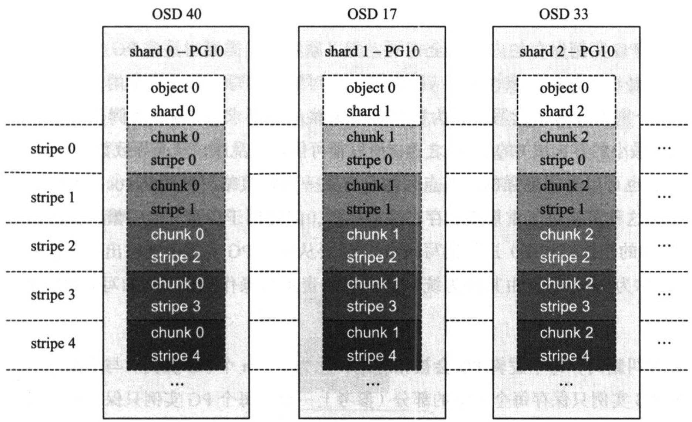


图3-7 块、条带、分片


# 3.3.2 概述

我们已经知道，存储池中对象到OSD的映射是通过PG来完成的。一方面，存储池中PG的数目决定了其并发处理多个对象的能力；另一方面，过多的PG会消耗大量CPU资源，同时容易使得磁盘长期处于过载状态（经验数据表明：磁盘利用率保持在 $70\%$ 左右可以使其I/O并发能力和平均响应时延均处于最佳状态。如果进一步提升利用率，则磁盘的I/O并发能力上升幅度有限（例如通常情况下将磁盘利用率从 $50\%$ 提升至 $100\%$ 并不会等价的将磁盘I/O并发能力提高2倍），但是平均响应时延会成倍上升，同时长期工作在过负荷状态也会影响磁盘寿命），反而不利于充分发挥集群的整体性能。因此，在创建存储池时，需要合理的指定PG数目，一般情况下，将集群中每个OSD上的平均PG数目限制在100左右是比较推荐的选择。

需要注意的是，创建存储池过程中指定的PG数目实际上指的是逻辑PG数目。为了进行数据保护，Ceph会将每个逻辑PG转化为多个PG实例（即一个逻辑PG实际上对应一个PG实例组），由它们负责将对象的不同备份（对应多副本）或者部分（对应纠删码）写入不同的OSD。上述过程是受控的，体现在以下两个方面：

1）每个逻辑PG具体被转化为多少个PG实例，由相应的数据保护策略决定。

例如使用多副本，那么每个逻辑PG会被转化为与副本个数相等的PG实例，因为此时每个PG实例保存的内容完全相同，所以原则上不需要对这些PG实例的身份进行区分。但是出于数据一致性考虑（针对同一个对象的读写一般是有序的，如果由不同的PG实例分别处理这些读写，因为数据备份策略一般要求这些PG实例分别位于不同主机（这是最小的容灾域）的OSD之上，所以很可能产生乱序，从而导致数据一致性问题；当然我们也可以采用更强的、节点间的分布式一致性策略，例如Paxos，来解决上述问题，不过这种策略过于重量级，存在性能瓶颈，只适用于少量、非频繁、关键性的数据（例如集群的拓扑结构图）进行读写同步），需要从这些PG实例中选举出一个起主导作用的PG，称为Primary，由其作为统一的入口负责进行操作分发（例如写）和集中（例如peering）。

针对纠删码，每个逻辑PG会被相应地转化为 $k + m$ 个PG实例。与多副本不同，因为这些PG实例只保存每个对象的部分（参考上一节，每个PG实例只保存对象的一个分片），所以此时需要针对每个PG实例的身份进行严格区分，为其分配一个PG实例组内唯一的ID，称为Shard ID。和多副本类似，出于数据一致性考虑，也需要从这 $k + m$ 个PG实例中选举出一个“首领”PG，称为Primary Shard。

2）同一个逻辑PG产生的多个实例，通过存储池关联的CRUSH模板受控地分布在位于不同容灾域的OSD之上，以实现指定级别的数据隔离和保护策略。

因为纠删码进行数据映射时对于PG的顺序有严格要求，所以如果使用纠删码，则CRUSH返回的选择结果总是有序的，即使选不出足够的OSD完成PG映射亦是如此（此时对应的位置使用无效的OSD编号进行填充）。按照约定，Primary或者PrimaryShard固定由位于CRUSH返回的OSD序列中、第一个OSD上的PG实例充当。

# 3.3.3 新写

了解上述基本概念之后，我们以典型的读写过程来分析纠错码的具体实现。我们首先介绍最简单的情形，即向存储池中写入一个全新的对象，为此，我们假定存在如下规格的纠删码存储池： $k = 3$ ， $m = 2$ ，图3-8展示了将一个名为“NYAN”的全新对象写入该存储池的过程。

图3-8展示的是写操作最简单的一种情形，称为满条带写（Whole Stripe Write），即写入的数据范围正好覆盖对象的一个或者多个完整条带。需要注意的是，针对同一个逻

辑PG，将对象切分为多个分片分别写入不同的PG实例，以及从不同的PG实例读取所需要的分片最终拼凑出指定范围内的内容，都是由PrimaryShard完成的，其他PG实例并不感知，这意味着每个PG实例都认为自己保存的是一个完整而独立的对象，因此其保存的内容在逻辑上是连续的，以块大小为单位，从0开始编址。仍然以图3-8为例，假定块大小为1个字节、条带大小为3个字节（条带大小总是等于 $\mathbf{k}^{*}$ 块大小），则5个OSD最终都向名为“NYAN”的对象（但是对象的ShardID不同）写入了3个字节，它们在对象内的逻辑地址范围相同，都是[0,2]。

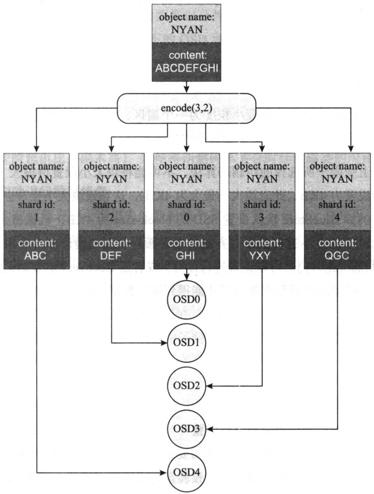


图3-8 向纠删码存储池（ $k = 3$ ， $m = 2$ ）写入一个全新对象


# 3.3.4 读

读操作与满条带写类似——Primary Shard 收到客户端的读请求，首先将请求的逻辑地址范围进行条带对齐，据此计算得到每个 PG 实例需要读取的数据范围然后分别读取，最后再由 Primary Shard 统一汇总后向客户端应答。除此之外，针对读操作还有如下几个关键因素需要额外考虑：

# （1）是否进行条带对齐

理论上正常情况下的读操作并不需要条带对齐，只要求每个PG实例能够读取指定范围内的数据即可。例如针对图3-8，假定块大小为1KB，待读取的数据范围为[512, 2560)，则正常情况下的读请求序列可能为：

```txt
PG(shard id = 0): [512, 1024)  
PG(shard id = 1): [0, 1024)  
PG(shard id = 2): [0, 512) 
```

假定PG从后端读取数据的最小粒度为一个扇区，可见此时不进行条带对齐可以使得开始和最后一个PG实例有机会少读部分数据。

然而实际上受限于所选择的纠删码算法，不可能将块大小设置得很大（例如 Ceph 默认将条带大小设置为 4KB，此时块大小最大为 4KB），这导致块大小经常会小于磁盘的最小访问粒度（例如 BlueStore 默认设置 SSD 的 block-size 为 4KB，机械磁盘的 block-size 为 64KB），因此实际上不进行条带对齐能够取得额外收益的情形非常有限。同时，如果 PG 处于降级状态（此时仍然可以正常进行读写）或者是 Recovery 触发的读操作，都有可能导致需要读取校验块进行数据修复后才能得到原始数据，而这个过程（即解码）必须以块为基本单位进行。考虑到上面两个因素，在读操作真正开始之前，由 Primary Shard 预先进行条带对齐是合适的，因此上面这个例子中实际产生的读请求序列为：

```txt
PG(shardid = 0): [0, 1024)  
PG(shardid = 1): [0, 1024)  
PG(shardid = 2): [0, 1024) 
```

# （2）是否需要对校验块的位置进行调整

前面已经提及：因为正常情况下并不需要读取校验块，所以RAID5需要对条带中校验块的位置进行动态调整，避免使用固定校验盘造成读带宽浪费。回到Ceph的纠删码实现：所有被映射到同一个逻辑PG下的对象，其每个分片总是被写入具有相同编号（Shard ID）的PG实例，因为正常情况下PG实例并不会在OSD之间迁移，这意味着针对同一

个逻辑 PG 而言，其数据盘和校验盘的位置几乎总是固定的。为什么 Ceph 可以采用这种方式而不必担心读带宽浪费呢？原因在于整个集群中不是只有一个而是存在大量逻辑 PG，而每个逻辑 PG 被转化为 PG 实例并最终分散至各个 OSD 的过程是随机的，这导致最终每个 OSD 既是一些逻辑 PG 的数据盘，同时也是另外一些逻辑 PG 的校验盘，因而不会造成读带宽浪费。

# （3）是否仍然采用同步读

多副本实现中，因为副本间保存的内容相同，并且由 Primary 进行读写操作的数据一致性保证，所以所有读操作都由 Primary 直接在本地完成，这个过程是同步的。然而纠删码则不同，因为此时同一个对象的数据以分片的形式分布在多个 PG 实例之间，而这些 PG 实例一般由位于不同容灾域之下的 OSD 承载，这导致前端的单个读操作经常会被转化为节点之间的多个读操作，所以出于性能考虑，纠删码无法继续沿用同步读的方式。采用异步读虽然提升了读操作之间的并发度，有助于提升整体读带宽，但是因为涉及跨节点的读以及报文组装，所以原理上纠删码的读操作响应时延要比多副本高（同时，与多副本相比，因为纠删码的写过程需要耗费大量的时间进行编码，所以一般而言纠删码的写操作响应时延也比多副本高），这使得纠删码不适合时延敏感类的应用。

# （4）是否自动进行数据修复

纠删码的实现原理表明：当损失的数据块个数小于等于 $m$ 时，总是可以通过解码还原得到所损失的全部数据块。因此，如果读的过程中检测到条带中的某些块（要求个数小于等于 $m$ ）产生了数据错误，理论上也可以在读的过程中针对这些坏掉的块同步进行修复，这个过程称为自动修复（auto-repair）。实现上能否执行自动修复主要取决于是否存在数据自校验机制，能否实时捕获静默数据错误，这是因为诸如链路不稳定、能耗变迁、负荷积压等因素都有可能导致磁盘短暂性的返回I/O错误，而只有产生静默数据错误时磁盘仍然工作在正常状态（按照定义，静默数据错误指磁盘自身无法感知的数据错误，因此静默数据产生时，磁盘仍然有可能处于“正常”状态），这是自动修复能够实施的基本条件。当前的纠删码实现中，因为作为默认对象存储引擎的FileStore不具备数据自校验功能，所以默认不会进行自动修复（事实上，如果出现数据错误，那么Ceph采用的手段是直接终止相应的OSD进程，经过一段时间后如果OSD仍然没有恢复正常（即Ceph总是寄希望于通过人工干预来及时识别错误、解决错误），则将其踢出集群，同时将其承载的数据整体迁移至其他仍然正常的OSD。这种处理方式虽然简单粗暴，但是符合Ceph的设计理念，即Ceph是为管理大规模分布式集群而生，在这样的集群规模中，

OSD 乃至节点故障是一种常态，完全在意料之中因而是可接受的）。作为 FileStore 替代品的 BlueStore 意识到了这个问题，因此在 BlueStore 达到商用条件后，社区有望同步推出基于 BlueStore 的自动修复方案，以减少不必要的群体（OSD 级别的）数据迁移。

# 3.3.5 覆盖写

基于上述基本读写流程，我们可以着手来分析一种更复杂的情形——覆盖写（overwrite）。顾名思义，覆盖写是针对对象的已有内容进行改写。对多副本而言，PG处理新写和覆盖写并无区别，然而纠删码则不然，纠删码通过引入条带的概念，将条带变成了更新对象数据的最小单位（这里指逻辑PG以条带为单位更新对象内的数据，对应到每个PG实例，则是以块为单位更新。纠删码的实现要求数据更新必须以条带为单位进行，即更新条带中任意数据块的同时必须同步更新校验块，否则后续无法进行数据恢复，或者说恢复的是错误的数据），因此如果覆盖写的起始或者结束地址没有进行条带对齐，那么对于不足一个完整条带的部分，其写入只能通过“读取完整条带 $\rightarrow$ 修改数据 $\rightarrow$ 基于条带重新计算校验数据 $\rightarrow$ 写入（被修改部分和校验和）”这样的步骤来进行，这个过程被称为RMW（Read Modify Write）。RMW过程中的R，即读是为了和待改写的内容一起，再次拼凑出一个完整的条带，以完成纠删码所要求的重新编码计算（目的是更新校验块），因此这个读也称为补齐读，容易理解整个RMW过程中补齐读阶段最为耗时，因此为了提升覆盖写的性能，通常有两种思路：一是尽量减少RMW数量；二是如果RMW不可避免，则需要尽量减少补齐读所读取的数据量。

引入写缓存是减少RMW数量的一种常见方法。仍以图3-8为例，假定块大小为1KB，条带大小为3KB，并且存在如下的覆盖写序列：

```txt
write1:[0，4096) write2:[4096,8192) write3:[8192,12288) 
```

如果不做任何处理，那么结果是上述序列中的每3个原始写请求都将被转化为2个满条带写和4个RMW写，如图3-9所示。

反之，如果引入缓存，通过对所有仍然驻留在缓存中的写操作进行合并，我们可以有效减少RMW数目。例如假定每个写操作在缓存中驻留的时间足够长，则上面这个例子中类似write1、write2、write3这样的三个写操作最终会被聚合成为一个单独的写请求：

```txt
write:[0, 12288) 
```

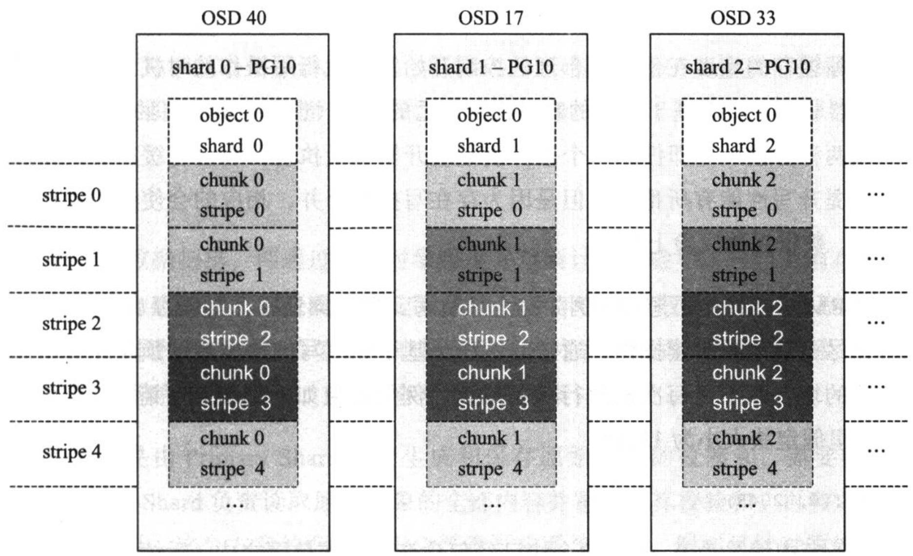


图3-9 覆盖写——引入缓存前


（图中块大小为1KB，条带大小为3KB，这里忽略了校验块的处理）


从而通过一次满条带写即可完成，如图3-10所示。

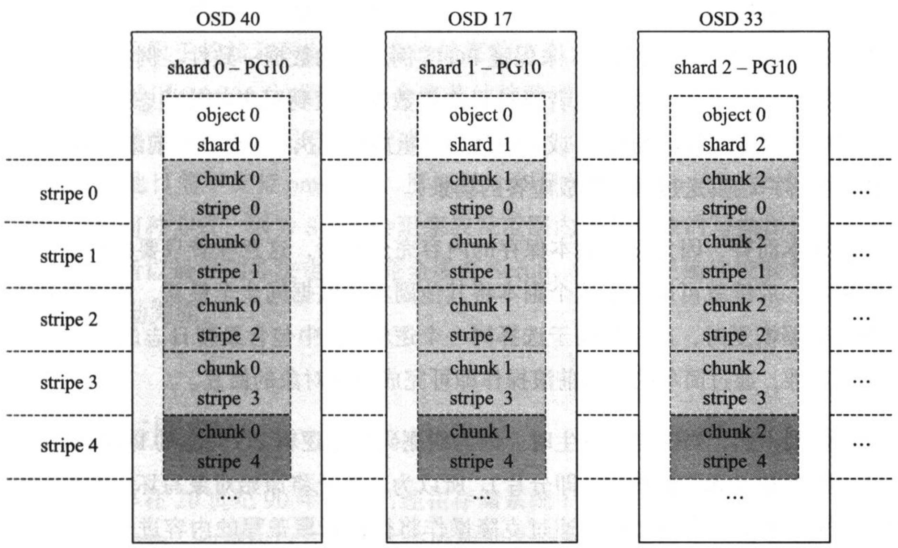


图3-10 覆盖写——引入缓存后


（图中块大小为1KB，条带大小为3KB，这里忽略了校验块的处理）


显然，纠删码中的写缓存应该被设计为对象级别（不同对象的写无法进行合并），实现中引入写缓存的难度在于如何合理的控制开始批量执行写操作的时机。常见的思路是使用定时器驱动，或者基于缓存的容量设定合适的阈值（也称为水位）驱动，也可以综合使用上面两种方法——即任意一个条件满足就开始批量执行。引入写缓存后，虽然通常情况下对提升写性能有所帮助，但是因为存在写操作合并，相应的会使得写操作的平均时延增加，数据丢失风险上升。

如果RMW操作不可避免（例如完全随机写，那么即便引入写缓存也无济于事），那么也需要尽可能地减少读操作，通常的做法是基于被改写的数据范围预先计算出需要执行补齐读的块，而不是每次都执行满条带读，例如对应如下的覆盖写请求（参考上面的例子，这里假定块大小为1KB）：

write:[0,2048) 

因为条带中编号为0、1的两个块已经包含在写请求范围之内（后续将被新的内容完全覆盖），所以这种情况下只需要读取编号为2的数据块即可。

# 3.3.6 日志

针对纠删码而言，无论是新写还是覆盖写，本质上都是一种分布式写，因此需要使用日志（这里指PG级别的日志）来保证PG实例之间的数据一致性。例如当系统整体掉电时如果还有写尚未完成，则或者通过日志将数据回滚到写之前的状态（对应尚未向客户端发送写入完成应答的场景），或者通过日志重放继续执行（也称为前滚（rollforward），对应已经向客户端发送过写入完成应答的场景）。

对多副本而言，因为每个副本保存的内容完全相同，这意味着只要任意一个副本数据更新成功，后续就可以基于这个副本将其他副本的数据同步至最新，所以多副本基于日志进行数据恢复时，总是倾向于选择同一个逻辑PG中包含最新日志的那个PG实例，以此作为基准，通过简单的日志前滚操作即可完成损坏对象的修复。

纠删码则不然，当覆盖写发生时，因为纠删码每个逻辑PG对应的PG实例中保存的都是原始对象独一无二的内容（即分片），所以为了防止将原始对象写坏，实现上需要每个PG实例在覆盖写发生之前先通过克隆操作将待执行覆盖写的内容进行备份，等待后续覆盖写真正完成之后再删除备份。相应的，纠删码日志需要如实记录上述数据备份过程，以便系统从异常中恢复后，如果判定某些写操作无法通过数据修复继续完成（例如

采用 $4 + 2$ 模式，假定某次写操作仅成功写入3个分片，由纠删码的特性我们知道基于这3个存活的分片并不足以还原出完整的、待写入的原始数据用于后续执行数据修复)，则通过日志将对象回滚至前一个原子状态以保证数据一致性。

# 3.3.7 Scrub

$\mathbf{Scrub}^{\ominus}$ 指数据扫描，即通过读取对象数据并重新计算校验和，再与之前存储在对象属性中的校验和进行比对，以此来判定对象中是否存在静默数据错误。多副本实现中，因为同一个逻辑PG中不同PG实例所有同名对象的内容都相同，所以可以由每个PG实例自行扫描。针对纠删码而言，Scrub有两种可选方案：

一种方案是由 Primary Shard 负责生成和保存原始对象的校验和，需要执行 Scrub 时，由 Primary Shard 负责读取原始对象的全部内容并重新计算校验和，再和之前保存的校验和进行比对。这个方案的坏处在于会严重影响系统性能，例如只针对原始对象部分内容进行修改，也需要由 Primary Shard 读取全部对象的内容重新计算校验和；此外执行 Scrub 的过程中也会产生大量跨节点的读流量，因此基本上不可行。

另一种方案和多副本类似，即每个PG实例都只需要保证自身对象内容（即分片）的正确性，这样自然能够保证原始对象内容的正确性。这种方案是社区目前倾向于采用的方式，但是受限于校验和暂时没有合适的存储方案（例如以对象大小为4MB计，每4KB原始数据采用CRC32生成固定4个字节的校验和，则整个对象的校验和最大可能为4KB，这显然无法直接使用对象的扩展属性存储，而只能使用对象的omap存储，但是纠删码存储池目前不支持omap！），所以整个纠删码的Scrub机制暂时是被禁止的。然而无论采用何种方式，因为Scrub会阻塞波及范围内所有对象的写操作从而造成严重的业务卡顿，所以最好的办法也许是完全废弃Scrub，将数据正确性校验交由底层例如BlueStore来自动完成。

# 3.4 总结与展望

作为一种早在20世纪90年代就已经在存储系统中普及的数据保护技术，纠错码并非是一种新生事物。纠错码以其灵活多变的数据备份策略（理论上可以支持任意数目的

备份）、较高的存储空间收益深受“廉价”存储系统的青睐，非常适合于存储大量对时延不敏感的“冷”数据（例如备份数据）。

Ceph最初的设计中，并未考虑支持纠删码。然而由于Ceph随机分布数据的特性，加上多副本策略本身居高不下的备份数据量，使得Ceph的存储空间利用率一直为人诟病（典型如采用3副本策略，一般情况下集群实际能用于存储用户数据的空间比例在 $70\% / 3 = 23\%$ 左右）。自Emperor版本起，Ceph引入了一种全新的存储池——纠删码存储池。顾名思义，这种存储池使用纠删码替代多副本作为数据备份策略，社区希望借助于纠删码能够以消耗计算资源为代价换取更高存储空间收益的能力，进一步提升Ceph作为分布式统一存储解决方案的性价比。然而事与愿违，这种被寄予厚望的新型存储池一直迟迟未能达到商用水准，究其原因，无外乎有以下两个：

1）相较多副本而言，纠删码实现更复杂。

纠删码以条带为单位，通过数学变换，将采用任意 $\mathrm{k} + \mathrm{m}$ 备份策略所消耗的额外存储空间都成功控制在1倍以内（与之相比，具有同等安全系数的多副本策略则要消耗 $\mathrm{m}$ 倍的额外存储空间），代价是大大增加了系统的复杂性。对Ceph而言，与多副本类似，纠删码条带中的每个块都需要通过PG存储至位于不同容灾域中的OSD之上来保证数据可靠性，这意味着在纠删码类型的存储池中，为了获得同样的可靠性，一般每个逻辑PG映射出来的PG实例数目要比多副本存储池多，从而给基于PG的数据同步和一致性带来了更大的挑战。

2）相较多副本而言，纠删码性能更差。

在存储系统中，读性能的表现至关重要。Ceph基于CS的访问模式使得其I/O路径相较传统存储本来就偏长，而其分布式的天性进一步的使得任何客户端的读都会被纠错码转化为集群内多个跨节点的读，并且产生跨节点读的个数和k值成正比。因为跨节点的传输时延和协同消耗使得纠错码的读性能必然要比同等条件下的多副本差，再加上生产环境中为了取得更高的空间收益（对应更大的k值）和更高的安全系数（对应更大的m值，因为纠错码要求 $\mathrm{k}\geqslant \mathrm{m}$ ，所以 $\mathbf{m}$ 值增加的同时也意味着要求配置更高的k值）往往要求我们配置更大的k值和 $\mathrm{m}$ 值，这反过来又会使读性能变得更差，所以一般而言纠错码的读性能（例如I/O平均时延）很少能满足生产环境的要求。此外，纠错码在设计上使用条带作为数据更新的最小单位，而出于编解码效率考虑，我们无法将条带设计得很小，因此针对覆盖写的场景，纠错码非常容易产生大量的RMW操作，这使得纠错码的综合

写性能也比多副本要差。兴许纠删码最适合的应用场景是永远只进行追加写或者删除，这也是早期社区开发者的思路，因此在纠删码存储池初期版本中，一切直接覆盖写行为都是被禁止的，而是要通过一个中间的全SSD缓存池进行加速和过渡。

尽管前路漫漫，但是在最新释出的Kraken版本中，社区还是为纠删码存储池增加了overwrites支持。虽然仍然被标记为实验性质，并且还有大量功能需要继续完善，但仍是自纠删码加入Ceph以来，社区所迈出的具有非凡意义的一步，表明了社区后续坚定不移推出真正能够满足生产环境级别纠删码解决方案的决心。

# 迁移之美

—PG读写流程与状态迁移详解

在 Ceph 的设计和实现中，PG 是最复杂和难于理解的概念之一，PG 的复杂源于其定位的复杂：首先，在架构层次上，PG 位于 RADOS 层的中间——往上负责接收和处理来自客户端的请求，往下负责将这些请求翻译为能够被本地对象存储所能理解的事务，考虑到 RADOS 在 Ceph 中的核心地位，PG 无疑是核心中的核心；其次，PG 是组成存储池的基本单位，存储池（本质上是一组约束条件的集合）中的很多特性，都是直接依托于 PG 实现的一一典型如我们可以基于 PG 来实现多副本和纠删码等截然不同的数据备份策略；最后，Ceph 面向容灾域的备份策略使得一般而言 PG 需要执行跨节点的分布式写，因此数据在不同节点之间的同步、灾难恢复时的数据修复也需要依赖 PG 来完成，众所周知，与节点内的数据一致性问题相比（一般可以基于事务，通过独占式的使用 CPU 加以解决），跨节点的数据一致性问题（也称为分布式数据一致性）要复杂得多。

在PG为数众多的优秀特性中，兴许最重要也最引人注目的是它可以在OSD之间（根据CRUSH的实时计算结果）自由进行迁移，这是Ceph赖以实现自动数据恢复、自动数据平衡等高级特性的基础。

本章按照如下形式进行组织：首先，我们介绍PG的基本概念、引入PG的必要性和PG相关的术语；其次，我们以读写流程为例，介绍客户端如何通过PG来访问OSD中的数据，以及PG如何在副本之间通过日志系统来保证数据强一致性；最后，通过PG

状态机及相关状态迁移分析，我们将得以了解 Ceph 如何基于 PG 自动进行数据修复及平衡，从而在生产环境中更加灵活、高效的使用 Ceph。

# 4.1 PG概述

面向分布式的设计使得 Ceph 可以轻易管理拥有成百上千个节点、PB 级及以上存储容量的大规模集群。一般而言，对象大小是固定的，考虑到 Ceph 随机分布数据（对象）的特性，为了最大程度的实现负载均衡，不可能将对象粒度设计得很大，因此即使一个普通规模的 Ceph 集群，通常也有数以百万计的对象（假定集群容量为 100TB，每个对象大小默认为 4MB，以三副本为例，整个集群可以存储约 100TB/（ $3 \times 4\mathrm{MB}$ ）=8738133个对象！），这使得直接以对象为粒度进行数据管理代价过于昂贵并且不够灵活。

简言之，PG是一些对象的集合——基于这些对象名称（以及诸如命名空间在内的其他对象位置描述信息）生成的哈希值，针对对象归属存储池的PG数目执行stable_mod后，其结果等于PG在存储池内的唯一编号。

将对象以PG为单位进行二次组织可以获得如下收益：

1）集群的PG数目经过人工规划因而严格可控（反之，集群中的对象数目则时刻处于动态变化之中），这使得基于PG精确控制单个OSD乃至整个节点的资源消耗（典型如CPU、内存、网络带宽等）成为可能。

2）因为集群中PG数目远小于对象数目（例如仍然假定集群容量为100TB，每个磁盘容量为1TB，按典型值每个磁盘分布100个PG计，则整个集群的PG数目为10000），并且PG数目和每个PG的身份（即PG的唯一标识）都相对固定，因此以PG为单位应用数据备份策略和进行数据同步、迁移等，相较直接以对象为单位而言，难度更小并且更加灵活。

实际上，即使通过引入PG，将数据管理的粒度间接增大了几个数量级，要在一个全分布式系统中实现诸如高可扩展、高可靠、高性能等优秀特性的同时保证数据强一致性仍然是一项极富挑战性的工作。表4-1介绍了PG内部常用的一些术语和概念，它们是理解后续复杂流程和设计的基础。

# 表 4-1 常用术语

表中涉及的PG状态相关的术语和其他个别术语（例如Log、Info等）将在下文中作展开介绍。本章中，如果未做特殊说明，术语PG意味着将PG作为一个整体进行处理，亦即对应逻辑上的PG

<table><tr><td>术语</td><td>含义</td></tr><tr><td>Acting Set</td><td>指一个有序的 OSD 集合,当前或者曾在某个 Interval 负责承载对应 PG 的 PG 实例</td></tr><tr><td>Authoritative History</td><td>指权威日志。权威日志是 Peering 过程中执行数据同步的依据,通过交换 Info 并基于一定的规则从所有 PG 实例中选举产生。通过重放权威日志,可以使得 PG 内部就每个对象的应有状态(主要指版本号)再次达成一致</td></tr><tr><td>Backfill</td><td>Backfill 是 Recovery 的一种特殊场景,指 Peering 完成后,如果基于当前权威日志无法对 Up Set 当中的某些 PG 实例实施增量同步(例如承载这些 PG 实例的 OSD 离线太久,或者是新的 OSD 加入集群导致的 PG 实例整体迁移),则通过完全拷贝当前 Primary 所有对象的方式进行全量同步</td></tr><tr><td>Epoch</td><td>一般情况下指 OSDMap 的版本号,由 OSDMonitor 负责生成,总是单调递增。Epoch 变化意味着 OSDMap 发生了变化,需要通过一定的策略扩散至所有客户端和位于服务端的 OSD。因此,为了避免 Epoch 变化过于剧烈导致 OSDMap 相关的网络流量和集群存储空间显著增加,同时也导致 Epoch 消耗过快(EPOCH 为无符号 32 位整数,假定每秒产生 13 个 Epoch,那么 10 年时间就会耗光),一个特定时间段内所有针对 OSDMap 的修改会被折叠进入同一个 Epoch</td></tr><tr><td>Eversion</td><td>由 Epoch 和 Version 组成。Version 总是由当前 Primary 负责生成,连续并且单调递增,和 Epoch 一起唯一标识一次 PG 内的修改操作</td></tr><tr><td>Log</td><td>PG 使用 Log 并基于 Eversion 顺序记录所有客户端发起的修改操作的历史信息,为后续提供历史操作回溯和数据同步的依据</td></tr><tr><td>Info</td><td>指 PG 的基本元数据信息。Peering 过程中,通过交换 Info,可以由 Primary 选举得到权威日志,这是后续进行 Log 同步和数据同步的基础</td></tr><tr><td>Interval</td><td>指 OSDMap 的一个连续 Epoch 间隔,在此期间对应 PG 的 Acting Set、Up Set 等没有发生变化。Interval 和具体的 PG 绑定,这意味着即使针对同一个 OSDMap 的 Epoch 变化序列,不同的 PG 也可能产生完全不同的 Interval 序列。每个 Interval 的起始 Epoch 也称为 same_interval_since</td></tr><tr><td>OS</td><td>ObjectStore,指 OSD 后端使用的对象存储引擎,例如 FileStore 或者 BlueStore</td></tr><tr><td>Peering</td><td>指(当前或者过去曾经)归属于同一个 PG 所有的 PG 实例就本 PG 所存储的全部对象及对象相关的元数据状态进行协商并最终达成一致的过程。Peering 基于 Info 和 Log 进行。此外,这里的达成一致,即 Peering 完成之后并不意味着每个 PG 实例都实时拥有每个对象的最新内容。事实上,为了尽快恢复对外业务,一旦 Peering 完成,在满足条件的前提下 PG 就可以切换为 Active 状态继续接受客户端的读写请求,后续数据恢复(即Recovery)可以在后台执行</td></tr><tr><td>PGBackend</td><td>PGBackend 负责将针对原始对象的操作转化为副本之间的分布式操作。按照副本策略的不同,目前有两种类型的 PGBackend,分别是 ReplicatedBackend (对应多副本)和 ECBackend (对应纠删码)</td></tr><tr><td>PGID</td><td>PG的身份标识,由pool-id+PG在pool内唯一编号+shard(仅适用于纠错码类型的存储池)组成</td></tr><tr><td>PG Temp</td><td>Peering过程中,如果当前Interval通过CRUSH计算得到的Up Set不合理(例如Up Set中的一些OSD新加入集群,根本没有PG的任何历史信息),那么可以通知OSDMonitor设置PG Temp来显式指定一些仍然具有相对完备PG信息的OSD加入Acting Set,使得Acting Set中的OSD在完成Peering之后能够临时处理客户端发起的读写请求,以尽可能地减少业务中断时间。上述过程会导致Up Set和Acting Set出现临时性的不一致。注意:1)之所以需要(通过PG Temp的方式)修改OSDMap,是因为需要同步通知到所有客户端,让它们后续(Peering完成之后)将读写请求发送至新的Acting Set而不是Up Set中的Primary;2)PG Temp生效后,PG将处于Remapped状态;3)Peering完成后,Up Set中与Acting Set不一致的OSD将在后台通过Recovery或者Backfill方式与当前Primary进行数据同步;数据同步完成后,PG需要重新修改PG Temp为空集合,完成Acting Set至Up Set的切换(使得Acting Set和Up Set的内容再次变得完全一致),此时PG可以取消Remapped标记</td></tr><tr><td>PGPool</td><td>PG关联存储池的概要信息。如果是存储池快照模式,PGPool中包含当前存储池所有的快照序列</td></tr><tr><td>Primary</td><td>指Acting Set中的第一个OSD,负责处理来自客户端的读写请求,同时也是Peering的发起者和协同者。容易理解Primary不是固定不变的,而是可以在不同的OSD之间切换</td></tr><tr><td>Pull/Push</td><td>Recovery由Primary主导进行,期间Primary通过Pull或者Push的方式进行对象间的数据同步。如果Primary检测到自身有对象需要同步,可以通过Pull方式从Replica获取最新数据(Peering成功完成后可以感知到哪些Replica包含这些最新数据);如果Primary检测到某些Replica需要进行数据同步,可以通过Push方式主动向其推送最新数据</td></tr><tr><td>Recovery</td><td>指针对PG某些实例进行数据同步的过程,其最终目标是(结合Backfill)将PG重新变为Active+Clean状态。Recovery是基于Peering的结果进行的,一旦Peering完成,并且PG内有对象不一致,Recovery就可以在后台进行。Recovery也称为数据修复,视语境不同,本章存在数据同步和数据恢复混用的情况</td></tr><tr><td>Replica</td><td>指当前Acting Set中除Primary之外的所有成员</td></tr><tr><td>Stray</td><td>PG实例所在的OSD不是PG当前Acting Set中的成员(但是过去某个或者某些Interval曾是)。如果对应的PG已经完成Peering,并且处于Active+Clean状态,那么这个PG实例稍后将被删除;如果对应的PG尚未完成Peering,那么这个PG实例仍然有可能转化为Replica</td></tr><tr><td>Up Set</td><td>指根据CRUSH计算出来的、有序的OSD集合,当前或者曾在某个Interval负责承载对应PG的PG实例。一般而言,Acting Set和Up Set总是相同的;但是也有一些特殊情况,此时需要在OSDMap中通过设置PGTemp来显式指定Acting Set,这会导致Up Set和Acting Set出现不一致</td></tr><tr><td>Watch/Notify</td><td>用于客户端之间进行状态同步的一种（简单）机制/协议，基于一个众所周知的对象进行，例如对RBD而言，这个对象通常是image的header对象。通过向指定对象发送Watch消息，客户端注册成为对象的一个观察者（ Watcher），这些（ Watch相关的）信息将被固化至对象的基本属性之中，此后该客户端将收到所有向该对象发送的Notify消息，并通过NotifyAck进行应答。该Watch链路有超时限制，需要客户端周期性的发送Ping消息进行保活；超时后链路将被断开，客户端需要重连。通过向指定对象发送Notify消息，客户端成为对象的一个通知者（Notifier）。在收到所有观察者响应（NotifyAck）或者超时之前，通知者（的后续行为）将被阻塞</td></tr></table>

# 4.2 读写流程

处理来自客户端的读写请求是PG最基本的功能，也是理解Peering、Recovery等其他复杂流程的基础。所有读写请求都以对象为基本单位进行，为此我们首先需要理解PG当中与对象相关的术语和管理结构。

# (1) head 对象、克隆对象和 snapdir 对象

head对象即原始对象。

在没有引入快照机制之前，针对原始对象的修改操作非常简单，直接修改原始对象即可。引入快照功能之后，针对原始对象的修改操作变得复杂——为了支持快照回滚操作，一般而言可以通过COW机制将原始对象预先克隆出来一份，然后再真正执行针对原始对象的修改操作，但是有两个特殊场景需要额外考虑——删除原始对象和重新创建原始对象。

如果原始对象被删除，但是仍然被有效的快照引用，显然此时需要借助一个临时对象来保存原始对象相关的历史信息，以便后续进行快照回滚（同时又不能影响原始对象已经不存在这个事实！）。这个临时对象称为snapdir对象，顾名思义，它仅仅用于保存和原始对象历史快照及克隆相关的信息。

同样的道理，如果原始对象重新被创建并且关联的snapdir对象存在，则需要执行snapdir对象清理，并将其存储的快照及克隆历史信息同步转移回原始对象。

对象有两个关键属性（对前端应用不可见），分别用于保存对象的基本信息和快照信息，称为OI（Object Info）和SS（Snap Set）属性。

# (2) object_info_t

对象OI属性的磁盘结构，保存对象除快照之外的元数据，具体成员如表4-2所示。


表 4-2 object_info_t


<table><tr><td colspan="2">成员</td><td>含义</td></tr><tr><td colspan="2">alloc_hint_flags</td><td>由特定应用(客户端)下发的对象特征及访问提示,例如连续读写、随机读写、仅进行追加写、是否建议进行压缩等等</td></tr><tr><td colspan="2">data_digest</td><td>数据校验和(当前基于CRC32生成)</td></tr><tr><td colspan="2">expected_object_size</td><td>由特定应用(客户端)下发的对象大小提示</td></tr><tr><td colspan="2">expected_write_size</td><td>由特定应用(客户端)下发的写请求大小提示</td></tr><tr><td rowspan="3">flags</td><td>FLAG_DATA_DIGEST</td><td rowspan="3">用于指示对象当前是否包含数据校验和、是否使用了omap、是否包含omap校验和</td></tr><tr><td>FLAG_OMAP</td></tr><tr><td>FLAG_OMAP_DIGEST</td></tr><tr><td colspan="2">last_reqid</td><td>上一次客户端修改本对象时,由客户端生成的唯一请求标识</td></tr><tr><td colspan="2">local_mtime</td><td>上一次客户端修改本对象时,PG响应此请求的本地时间。说明:主要用于解决客户端和服务端时钟产生偏移时(特别是客户端时间超前于服务端),CacheTier无法正常执行flush操作的故障</td></tr><tr><td colspan="2">mtime</td><td>上一次客户端修改本对象时,所携带的本地时间</td></tr><tr><td colspan="2">omap_digest</td><td>omap校验和(当前基于CRC32生成)</td></tr><tr><td colspan="2">prior_version</td><td>上上次修改本对象时,PG生成的版本号;如果为空 (eversion_t ),表明上上次修改动作为创建或者克隆(即对象从无到有)</td></tr><tr><td colspan="2">snaps</td><td>对象关联的快照集,仅当对象为克隆对象时有效</td></tr><tr><td colspan="2">size</td><td>对象大小</td></tr><tr><td colspan="2">soid</td><td>对象唯一标识。如果soid.snap为CEPH_NOSNAP,说明为head对象;如果soid.snap为CEPH_SNAPDIR,说明为snapdir对象;否则为克隆对象,此时soid.snap为克隆对象关联的最新快照序列号</td></tr><tr><td colspan="2">user_version</td><td>客户端(可见)版本号</td></tr><tr><td colspan="2">version</td><td>上一次修改本对象时,PG生成的版本号</td></tr><tr><td colspan="2">watchers</td><td>成功注册过Watch本对象的所有客户端信息</td></tr></table>

# (3) ObjectState

object_info_t 的内存版本，在其基础上增加了一个 exists 字段，用于指示对象当前（逻辑上）是否存在，具体成员如表 4-3 所示。


表 4-3 ObjectState


<table><tr><td>成员</td><td>含义</td></tr><tr><td>exists</td><td>指示关联的对象是否存在</td></tr><tr><td>oi(object_info_t)</td><td>OI属性（参见表4-2）</td></tr></table>

# (4) SnapSet

对象SS属性的磁盘结构，保存对象快照及克隆信息，具体成员如表4-4所示。


表 4-4 SnapSet


<table><tr><td>成员</td><td>含义</td></tr><tr><td>clones</td><td>对象关联的所有克隆对象，使用每个克隆对象关联的最新快照序列号（一个克隆对象可以关联多个快照）进行标识，升序排列</td></tr><tr><td>clone_overlap</td><td>当前克隆对象与前一个克隆对象（与它们在 clones 中的位置相对应）之间的重叠部分</td></tr><tr><td>clone_size</td><td>克隆对象大小</td></tr><tr><td>head_exists</td><td>指示当前 head 对象是否存在</td></tr><tr><td>seq</td><td>对象当前（指上一次修改操作完成时）关联的最新快照序列号</td></tr><tr><td>snaps</td><td>对象当前（指上一次修改操作完成时）关联的所有快照序列号（包含 seq）</td></tr></table>

# (5) SnapSetContext

SnapSet 的内存版本，主要增加了引用计数机制，便于 SS 属性在 head 对象、克隆对象以及 snapdir 对象之间共享，具体成员如表 4-5 所示。


表 4-5 SnapSetContext


<table><tr><td>成员</td><td>含义</td></tr><tr><td>exists</td><td>指示 SnapSet 是否存在</td></tr><tr><td>ref</td><td>引用计数，SnapSetContext 可能被同一个对象的多个相关对象（head 对象、克隆对象、snapdir 对象）关联</td></tr><tr><td>oid</td><td>对象关联的 snapdir 对象标识</td></tr><tr><td>registered</td><td>是否已经将 SnapSetContext 加入缓存</td></tr><tr><td>snapshot(SnapSet)</td><td>SS 属性（参见表 4-4）</td></tr></table>

# (6) SnapContext

如果是前端应用自定义快照模式（例如RBD，可以针对每个image执行快照操作），那么由前端应用下发的请求（op）会携带SnapContext，指示当前应用的快照信息；如果是存储池快照模式，那么PGPool中的SnapContext会指示当前存储池的快照信息（PG每次更新OSDMap的同时会同步更新PGPool)，具体成员如表4-6所示。


表 4-6 SnapContext


<table><tr><td>成员</td><td>含义</td></tr><tr><td>seq</td><td>最新快照序列号</td></tr><tr><td>snaps</td><td>当前所有快照序列号（包含 seq 并且降序排列，亦即总有 snaps[0] == seq）</td></tr></table>

# (7) ObjectContext

对象上下文保存了对象的OI和SS属性，此外，内部实现了一个属性缓存（主要用

于缓存用户自定义属性对）和读写互斥锁机制，用于对来自客户端的op进行保序。

op 操作对象之前，必须先获得对象上下文；在进行读写之前，则必须获得对象上下文的读锁（对应 op 仅包含读操作）或者写锁（对应 op 包含写操作）。原则上，op_shardedwq 的实现原理可用于对访问同一个 PG 的 op 进行保序（参见“4.2.1 消息接收与分发”），但是由于写是异步的（纠删码存储池的读也是异步的），即写操作在执行过程如果遇到堵塞会让出 CPU，所以需要在对象上下文中额外引入一套读写互斥锁机制来对 op 进行保序。

Object Context 的具体成员如表 4-7 所示。


表 4-7 ObjectContext


<table><tr><td>成员</td><td>含义</td></tr><tr><td>attr_cache</td><td>属性（指用户自定义属性）缓存</td></tr><tr><td>obs(ObjectState)</td><td>对象状态（参见表4-3）</td></tr><tr><td>rwstate</td><td>读写锁，用于对来自客户端的op进行排队，以保证数据一致性。共有三种类型：RWREAD、RWWRITE和RWEXCL。与常见的读写锁实现逻辑不同，上述三种类型中，只有RWEXCL是真正的互斥锁，其他两种都可以被重复加锁（RWWRITE也可以被强制重复加锁）。rwstate内部维护了一个op等待队列，如果加锁失败，对应的op会进入等待队列进行等待，被唤醒后，按入队顺序依次重试以获取所请求类型的锁。注意：除上述读写锁之外，为了防止Ceph内部诸如Cache Tier、Recovery/Backfill等机制产生的本地读写请求（这类请求不会创建OpContext。事实上，如果对应的对象处于Recovery/Backfill过程之中，相应的客户端请求会被阻塞）与客户端产生的（分布式）读写请求产生冲突，ObjectContext还实现了另一套读写互斥锁，称为ondisk_read/write_lock，供PG访问本地数据时使用</td></tr><tr><td>ssc(SnapSetContext)</td><td>SS上下文（参见表4-5）</td></tr></table>

# (8) Log

日志用于解决PG副本之间的数据一致性问题，使用PG元数据对象的omap保存，单条日志结构如表4-8所示。


表 4-8 pg_log_entry_t


<table><tr><td colspan="2">成员</td><td>含义</td></tr><tr><td rowspan="3">op</td><td>MODIFY</td><td>除删除之外的修改对象操作（注意：创建对象也会归结为 MODIFY 操作，此时 prior_version 为 0）</td></tr><tr><td>CLONE</td><td>PG 当前并不支持由客户端直接发起的克隆操作，这里指 PG 在处理 head 对象时受快照影响基于 COW 机制内部产生的克隆（head 对象）操作</td></tr><tr><td>DELETE</td><td>删除对象</td></tr><tr><td rowspan="2">op</td><td>LOST_REVERT</td><td rowspan="2">Peering 完成后,如果 PG 仍然存在 unfound/unrecoverable 对象,并且确认所有可能包含这些对象有效数据的 OSD 当前都已经被探测 (Probe) 过,那么可以通过如下命令:ceph pg &lt;pgid&gt; mark_unfound Losing revert|delete以回滚/删除的方式对这些对象进行修复。上述命令执行后将触发 PG 针对所有 unfound/unrecoverable 对象进行遍历,并依次执行:1)如果选项为 revert,则选择对象当前所能获得的最新版本,生成一条新的 LOST_REVERT 日志,并设置日志中的 reverting_to 为该版本,后续将对象回滚至 reverting_to 指向的版本;2)如果选项为 delete,则生成一条新的 LOST DELETE 日志,后续直接删除对象。PG 批量提交上述流程中所有新生成的日志之后(此时命令执行完成),所有unfound/ unrecoverable 对象的修复可以在后台基于更新后的日志进行</td></tr><tr><td>LOST_DELETE</td></tr><tr><td colspan="2">soid</td><td>待修改的对象</td></tr><tr><td colspan="2">version(Eversion)</td><td rowspan="3">version 指本次修改生效之后对象的版本号。prior_version 指本次修改生效之前对象的版本号。reverting_to 指针对 unfound/unrecoverable 对象通过回滚操作进行修复时,待回滚的版本号</td></tr><tr><td colspan="2">prior_version(Eversion)</td></tr><tr><td colspan="2">reverting_to(Eversion)</td></tr><tr><td colspan="2">reqid</td><td>op 携带的唯一标识,由客户端通过 caller_name + incarnation + tid 生成,主要用于对客户端重发的 op 进行识别</td></tr><tr><td colspan="2">mtime</td><td>如果本次修改由客户端发起,那么 op 会携带客户端生成 op 时的本地时间</td></tr><tr><td colspan="2">user_version(Version)</td><td>对象当前的版本号,对客户端可见</td></tr></table>

所有日志在PG中使用一个公共的日志队列进行管理，队列结构如表4-9所示。


表 4-9 pg_log_t


<table><tr><td>成员</td><td>含义</td></tr><tr><td>log</td><td>日志队列，新的日志条目总是从队列尾部追加</td></tr><tr><td>head</td><td>log中包含的最新日志条目（实时指向log尾部）</td></tr><tr><td>tail</td><td>log中包含的最老日志条目（实时指向log头部）</td></tr><tr><td>can_rollback_to(Eversion)</td><td>log中所有version大于等于can_rollback_to的条目都可以回滚（仅纠删码类型的存储池支持）</td></tr></table>

# (9) OpContext

引入OpContext意义如下：

□ 单个 op 可能操作多个对象（例如引入快照后，修改 head 对象之前可能需要先执行克隆，因而会创建和操作克隆对象），需要分别记录相关对象上下文的变化并持续追踪它们的读写互斥锁使用情况。

□如果op涉及修改操作，那么会产生一条或者多条新的日志。

□如果op涉及异步操作，那么需要注册一个或者多个回调函数。

□收集op相关的统计，例如读写次数、读写涉及的字节数等等，后续通过心跳机制上报给Monitor汇总，典型如用于实施存储池的配额管理。

OpContext的具体成员如表4-10所示


表 4-10 OpContext


<table><tr><td>成员</td><td>含义</td></tr><tr><td>at_version(Eversion)</td><td>如果 op 包含修改操作,那么 PG 将为 op 生成一个 PG 内唯一的序列号,该序列号连续且单调递增,用于后续(例如 Peering)对本次修改操作进行追踪和回溯</td></tr><tr><td>clone_abc(ObjectContext)</td><td>克隆对象上下文(参见表 4-7),仅在 op 执行过程中产生了新的克隆,或者 op直接针对快照对象或者克隆对象进行操作时加载</td></tr><tr><td>lock_type</td><td>读写锁类型(参见表 4-7)</td></tr><tr><td>lockmanager(ObcLockManager)</td><td>指向多个 ObjectContext 的 rwstate (参见表 4-7),用于同时访问多个对象(同一个对象的克隆对象、snapdir 对象等)的读写锁</td></tr><tr><td>log</td><td>PG 基于当前 op 产生的所有日志集合。注意: 日志是基于对象的。针对原始对象(例如 head 对象)的所有修改操作只会产生一条单一的日志记录,但是快照机制的存在使得 PG 在执行 op 过程中有可能创建克隆对象、创建或者删除 snapdir 对象。因为后面这些操作是针对不同的对象,所以需要为其生成单独的日志记录。这解释了这里为什么使用日志集合</td></tr><tr><td>modifiedRanges</td><td>op 本次修改操作波及的数据范围</td></tr><tr><td>new_obs(ObjectState)</td><td>op 执行之后(准确地说,是在 Primary 完成 op 事务封装之后),新的对象状态(参见表 4-3)</td></tr><tr><td>new_snapshot(SnapSet)</td><td>op 执行之后(准确地说,是在 Primary 完成 op 事务封装之后),新的 SS 属性(参见表 4-4)</td></tr><tr><td>obc(ObjectContext)</td><td>对象上下文(参见表 4-7)</td></tr><tr><td>obs(ObjectState)</td><td>op 执行之前,对象状态(参见表 4-3)</td></tr><tr><td>on_applied</td><td>回调上下文,OS 将事务写入日志后执行</td></tr><tr><td>on_committed</td><td>回调上下文,OS 将事务写入磁盘后执行。注意:对 BlueStore 而言,写日志和写磁盘是同时完成的</td></tr><tr><td>on_finish</td><td rowspan="2">on_finish 典型操作为删除 OpContext;on_success 典型操作为执行 Watch/Notify 相关的操作。因此一般而言,这两个操作需要保证在 op 真正完成后(即 op 在所有副本之间都完成之后)执行,执行顺序为 on_success -&gt; on_finish</td></tr><tr><td>on_success</td></tr><tr><td>op</td><td>关联的客户端请求</td></tr><tr><td>snapc(SnapContext)</td><td>对象当前最新的快照上下文(参见表 4-6),每次收到 op 时,基于 op 或者PGPool 更新</td></tr><tr><td>snapset(SnapSet)</td><td>op 执行之前,对象关联的 SS 属性(参见表 4-4)</td></tr><tr><td>snapset_abc(ObjectContext)</td><td>snapdir 对象上下文(参见表 4-7),仅在 op 涉及 snapdir 对象操作时加载</td></tr></table>

# (10) RepGather

如果 op 包含修改操作，那么需要由 Primary 主导在副本之间执行分布式写。顾名思义，当 op 涉及的事务由 Primary 完成封装后，会由 RepGather 接管，在副本之间进行分发和同步。

RepGather的具体成员如表4-11所示


表 4-11 RepGather


<table><tr><td>成员</td><td>含义</td></tr><tr><td>all_applied</td><td>Primary 成功收到了所有副本（包括自身）已经成功将基于 op 生成的本地事务写入日志的应答</td></tr><tr><td>all_committed</td><td>Primary 成功收到了所有副本（包括自身）已经成功将基于 op 生成的本地事务写入磁盘的应答</td></tr><tr><td>hoid</td><td>op 关联的对象标识</td></tr><tr><td>lock管理水平(ObcLockManager)</td><td>同 OpContext 中的 lock管理水平</td></tr><tr><td>on_applied</td><td>同 OpContext 中的 on_applied</td></tr><tr><td>on_committed</td><td>同 OpContext 中的 on_committed</td></tr><tr><td>on_finish</td><td>同 OpContext 中的 on_finish</td></tr><tr><td>on_success</td><td>同 OpContext 中的 on_success</td></tr><tr><td>op</td><td>RepGather 和 op——对应</td></tr><tr><td>queue_item</td><td>负责将 RepGather 挂入 PG 全局的 repop_queue</td></tr><tr><td>rep_aborted</td><td>RepGather 被终止，例如 PG 收到新的 OSDMap 并且需要切换到一个新的 Interval</td></tr><tr><td>rep_done</td><td>RepGather 正常完成</td></tr><tr><td>rep_tid</td><td>RepGather 在 OSD 内的全局唯一标志</td></tr></table>

了解上述预备知识后，我们可以着手对客户端读写流程进行详细分析，其大体上可以分为如下几个阶段：

1）OSD收到客户端发送的读写请求，将其封装为一个op并基于其携带的PGID转发至相应的PG。

2）PG收到op后，完成一系列检查，所有条件均满足后，开始真正执行op。

3）如果 op 只包含读操作，那么直接执行同步读（对应多副本）或者异步读（对应纠删码），等待读操作完成后向客户端应答。

4）如果 op 包含写操作，首先由 Primary 基于 op 生成一个针对原始对象操作的事务及相关日志，然后将其提交至 PGBackend，由 PGBackend 按照备份策略转化为每个 PG

实例（包含 Primary 和所有 Replica）真正需要执行的本地事务并进行分发，当 Primary 收到所有副本的写入完成应答之后，对应的 op 执行完成，此时由 Primary 向客户端回应写入完成。

# 4.2.1 消息接收与分发

OSD 绑定的 Public Messenger 收到客户端发送的读写请求后，通过 OSD 注册的回调函数——ms_fast_dispatch 进行快速派发（OSD 本身是 Dispatcher 的一个子类，后者负责对 Messenger 中的消息进行派发），这个阶段主要包含以下处理：

□基于消息（message）创建一个op（除非特殊说明，本节中的op均指客户端发起的读写请求，下同)，用于对消息进行跟踪，并记录消息携带的Epoch；

□查找OSD关联的客户端会话上下文（OSD会为每个客户端创建一个独立的会话上下文)，将op加入其内部的waiting_on_map队列（该队列为FIFO队列)，获取当前OSD所持有的OSDMap，并将其与waiting_on_map队列中的所有op逐一进行比较——如果OSD当前OSDMap的Epoch不小于op携带的Epoch，则进一步将其派发至OSD的op_shardedwq队列；否则直接终止派发；

□如果会话上下文中的waiting_on_map不为空，说明至少存在一个op，其携带的Epoch比OSD当前所持有OSDMap的Epoch更新，此时将其加入OSD的全局session Waiting_for_map集合，该集合中汇集了当前所有需要等待OSD更新完OSDMap之后才能继续处理的会话上下文（这里的处理指继续派发会话上下文中的op）；否则将对应的会话上下文从session Waiting_for_map中移除。

op 进入 op_shardedwq 队列之后，开始排队并等待处理。顾名思义，op_shardedwq 是 OSD 内部的 op 工作队列（Work Queue），“sharded”关键字则表明其内部实际上存在多个队列（称为 shard_list，因为 op_shardedwq 对外呈现为一个队列，所以这些内部队列也可以理解为原始队列的分片）。

op_shardedwq 最终关联一个线程池——osd_op_tp，负责对 op_shardedwq 中的 op 真正进行处理。osd_op_tp 包含多个服务线程，具体数目可以根据需要配置，例如假定 op_sharedwq 中实际工作队列数目为 s（受配置项 osd_op_num_shards 控制），每个工作队列需要安排 t 个服务线程（受配置项 osd_op_num Threads_per_shard 控制），则最终 osd_op_tp 总的服务线程数目为 $s^{*}t$ 。

op_shardedwq中的每个工作队列与osd_op_tp中的服务线程通过如下方式进行绑定：

□将osd_op_tp中的所有服务线程依次从0开始编号： $0,1,2,\dots ,s^{*}t - 1$ 

□将opshardedwq中的所有工作队列依次从0开始编号： $0,1,2,\dots ,s - 1$ 

□ 将服务线程编号针对s取模，得到一个 $[0,1,2,\dots ,s - 1]$ 范围内的结果，将其直接作为op_shardedwq中某个工作队列的索引（即shard_list数组的下标）。

按照上面的分析，因为 op_shardedwq 存在多个工作队列并且每个工作队列的服务线程固定，出于负载均衡的考虑，应该采取何种方式来确保所有 op 尽可能均匀地分布到每个工作队列之中呢？注意到每个 op 最终需要交由某个特定的 PG 处理，而 PG 基于其 PGID（经过 CRUSH 计算之后）在所有 OSD 之间随机、均匀分布，所以使用 op 关联的 PGID（参见表 4-1，实际上只使用了 PGID 在 pool 内的编号部分）对 op_shardedwq 中总的队列个数取模后，最终可以得到 op 需要加入的工作队列索引。此外，这种映射方式因为间接的将 PG 和特定的工作队列进行绑定，所以能够保证针对同一个对象操作的所有 op 都进入同一个工作队列排队并被 PG 依次处理，从而避免乱序。

op_shardedwq 的内部工作队列可以采用多种实现方式，默认为 WeightedPriority-Queue。顾名思义，这是一种基于权重的优先级调度队列——当 op 携带的优先级大于等于设置的阈值时（受配置项 osd_op_queue-cut_off 控制），队列工作在纯优先级模式（也称为严格优先级模式）：队列内部首先按照优先级被划分为多个优先级队列，然后每个优先级队列按照 op 携带的不同客户端地址再次划分为若干个会话子队列。入队时，按照每个 op 携带的优先级，首先找到对应的优先级队列，其次按 op 携带的客户端地址找到其归属的会话子队列，然后从队尾加入；出队时，则总是查找当前优先级最高的优先级队列，并从当前指针指向的会话子队列队头出列（会话子队列是严格的 FIFO 队列），为了避免同一优先级有来自不同客户端的 op 饿死，每次有 op 成功出队后，其内部指针会从当前会话子队列自动指向下一个会话子队列。当 op 携带的优先级小于设置的阈值时，队列工作在基于权重的 Round-robin 调度模式，其与纯优先级模式的区别在于：出队时，选择哪个优先级队列是完全随机的，但是选择结果与每个优先级队列的优先级强相关：优先级越高，则被选中的概率越大；反之优先级低的队列其被选中的概率也低。容易理解后面这种模式的好处在于永远不会饿死来自某些低优先级客户端的 op，同时能基于优先级（此时优先级充当了权重的角色）对 op 的处理速度进行量化控制——例如两个客户端的优先级分别为 1:2，那么在此模式下理论上它们能够获得的 IOPS（假定 I/O 大小相同）也为 1:2。

当 op 成功加入 op_shardedwq 中的某个工作队列后，相应的服务线程会被唤醒，通过 OSD 注册的回调函数，找到关联的 PG，由其针对 op 真正执行处理。整个 op 在 PG 中的处理过程最终形成了一个十分冗长的函数调用链，我们接下来依次介绍（本节如无特殊说明，默认忽略 Cache Tier 相关的处理）。

# 4.2.2 do_request

do_request 作为 PG 处理 op 的第一步，主要完成一些全局（PG 级别的）检查：

1）Epoch——如果 op 携带的 Epoch 完新，那么需要等待 PG 完成 OSDMap 同步之后才能进行处理。

2）op能否被直接丢弃——一些可能的场景有：

□ op 对应的客户端链路已经断开。

□收到op时，PG当前已经切换到一个更新的Interval（即PG此时的same_intervalsince比op携带的Epoch要大，后续客户端会进行重发）。

□op在PG分裂之前发送（后续客户端会进行重发）。

3）PG自身状态——如果PG不是Active状态，op同样会被堵塞（这里指来自客户端的op会被堵塞。PG内部产生的一些op，典型如Pull/Push，可以在非Active状态下被PG直接处理)，需要等待PG变为Active状态之后才能被正常处理。

具体处理逻辑如图4-1所示。

参考图4-1，因为op可能因为各种各样的原因需要被推迟处理，所以PG内部维护了多种不同类型的op重试队列，用于对不同场景进行区分，这些队列如表4-12所示。

为了保证 op 之间不会产生乱序，上述队列都被设计成 FIFO 队列并且队列之间也严格有序，入队时必须从上往下，出队时亦然。当对应的限制解除后，PG 会触发关联的 op 重新进入 op_shardedwq 工作队列排队，等候再次被 PG 执行。

# 4.2.3 do_op

通过do_request校验之后，PG可以对op做进一步的处理。进一步的，如果确认是来自客户端的op，那么PG通过do_op对op进行处理，逻辑如图4-2所示。

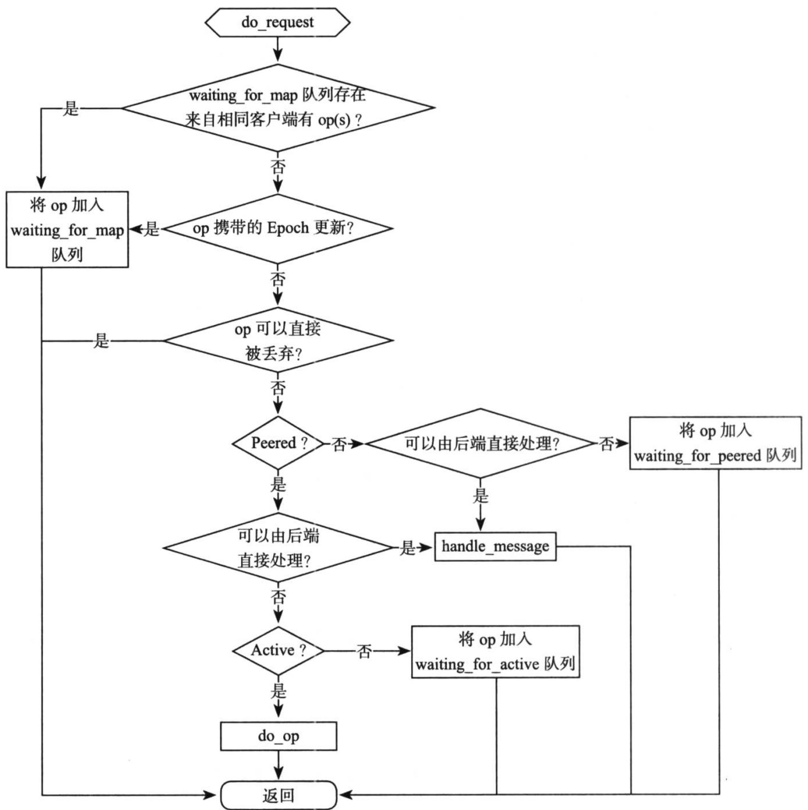


图4-1 do_request


表 4-12 PG 内部的 op 队列


<table><tr><td>队列名称</td><td>入队条件</td></tr><tr><td>waiting_for_map</td><td>1)收到 op 时,之前已经有来自同一个客户端的 op 已经存在于队列之中(同一个客户端的 op 必须要顺序处理);2)op 携带的 Epoch 大于 PG 当前的 Epoch</td></tr><tr><td>waiting_for_peered</td><td>PG 状态不是 Peered 或者 Active 状态(例如 PG 处于 Down 或者 Incomplete 状态)</td></tr><tr><td>waiting_for.Active</td><td>PG 状态不是 Active 状态(例如 PG 处于 Peered 状态)</td></tr><tr><td>waiting_for_unreadable_object</td><td>op 操作的本地对象待修复(指对象位于当前 PG 实例的 missing 列表之中)</td></tr><tr><td>waiting_for_degraded_object</td><td>op 操作的对象处于降级状态(指对象位于 Primary 的 missing 列表之中)</td></tr><tr><td>waiting_for_scrub</td><td>op 操作的对象正在被 scrub。
注意：因为 PG 能够执行 scrub 的前提是 PG 处于 Active + Clean 状态，所以 PG 总是最后检查此队列</td></tr></table>

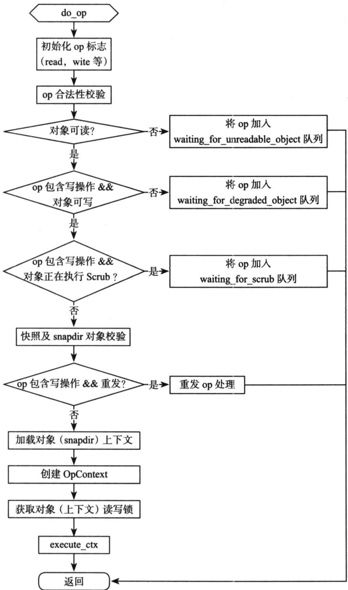


图4-2 do_op


参考图4-2，do_op主要进行一些对象级别的检查：

1）按照 op 携带的操作类型（单个 op 可以包含多个操作），初始化 op 中的各种标志位，典型如：

□CEPH_OSD_RMW_FLAG_READ：说明op中携带读操作。

□CEPH_OSD_RMW_FLAG_WRITE：说明op中携带写操作。

□CEPH_OSD_RMW_FLAG_RWORDERED：说明需要对op进行读写保序。

2）完成对op的合法性校验，出现以下情况之一，op将被认为不合法：

PG 不包含 op 所携带的对象（将 op 关联 head 对象的全精度 32 位 hash 值针对 PG 的 bits 取模（关于 bits 的确切含义，参考“第 2 章 性能之巅”中的“2.2.1 PG”），结果等于 PGID 的 PS 部分（Placement Seed，即 PG 在存储池内的唯一编号），说明对象归属于 PG；反之说明对象不属于 PG）。

□op 携带了CEPH_OSD_FLAG_PARALLELEXEC标志，指示op之间可以并发执行。

□ op 携带了CEPH_OSD_FLAG_BALANCE[LOCALIZE]_READS标志，指示op可以被Primary/Replica执行，但是当前处理op的PG既不是Primary也不是Replica（例如Stray）。

□ op 对应的客户端未被授权执行 op 所要求操作的能力 / 权限（例如客户端仅被授予可读权限，但是 op 携带了写操作）。

□op 携带对象名称、key 或者命名空间长度超过最大限制（说明：这主要是在使用传统的 FileStore 引擎时，受底层本地文件系统限制，例如 XFS，所能保存的扩展属性对长度有限制；将 OS 切换至 BlueStore 时则无此限制）。

□op对应的客户端被列入黑名单。

□op在集群被标记为Full之前发送（PG通过比对op携带的Epoch和集群标记为Full时的Epoch感知）并且没有携带CEPH_OSD_FLAG_FULL FORCE标志。

PG所在的OSD可用存储空间不足。

□op包含写操作并且企图访问快照对象。

□op包含写操作并且一次写入的数据量过大（超过配置项osd_max_write_size）。

3）检查 op 携带的对象是否不可读或者处于降级状态或者正在被 Scrub，是则加入对应的队列进行排队。

4）检查 op 是否为重发（基于 op 携带的 reqid 在当前 Log 中查找，如果找到，说明为重发）。

5）获取对象上下文，创建OpContext对op进行追踪，并通过executectx真正开始执行op（显然这里的executectx中的ctx指OpContext）。

此外，上述流程中涉及两个比较复杂的处理，这里补充说明如下：

# 1. 关于可用存储空间控制

Ceph一共使用了四个配置项对可用存储空间进行校验并实施控制，如表4-13所示。


表 4-13 与可用存储空间相关的配置项


<table><tr><td>配置项名称</td><td>含义</td></tr><tr><td>mon_ osd_full_ratio</td><td>集群中的任一 OSD 空间使用率大于等于此数值时, 集群将被标记为 Full, 此时集群将停止接受来自客户端的写入请求</td></tr><tr><td>mon_ osd_nearfull_ratio</td><td>集群中的任一 OSD 空间使用率大于等于此数值时, 集群将被标记为 NearFull, 此时集群将产生告警, 并提示所有已经处于 NearFull 状态的 OSD</td></tr><tr><td>osd_backfill_full_ratio</td><td>OSD 空间使用率大于等于此数值时, 拒绝 PG 通过 Backfill 方式迁入或者继续迁入本 OSD</td></tr><tr><td>osd_failsafe_full_ratio</td><td>PG 执行包含写操作的 op 时, 防止所在 OSD 磁盘空间被 100% 写满的最后一道屏障, 超过此限制时, op 将被直接丢弃</td></tr></table>

每个OSD通过心跳机制周期性的检测自身空间使用率，并上报至Monitor。当Monitor检测到任一OSD的空间使用率突破预先设置的安全屏障时，或者产生告警（超过mon_osd_nearfull_ratio)，或者将集群设置为Full（超过mon_osd_full_ratio）并阻止所有客户端继续写入。

osd_backfill_full_ratio 配置项存在的意义在于有些数据迁移是集群内部自动触发的，例如数据恢复或者自动平衡过程中以 Backfill 方式进行的 PG 实例整体迁移；而 osd_failsafe_full_ratio 配置项存在的意义则在于如果 mon_osd_full_ratio 设置得过高（因为从 OSD 上报空间使用统计到 Monitor 将集群标记为 Full 并真正阻止客户端写入有滞后，所以如果 mon_osd_full_ratio 设置不合理，仍然存在在此期间客户端继续产生大量写请求将 OSD 写满的可能）或者某些客户端使用了某些特殊的手段突破集群为 Full 状态时客户端不能继续写入的限制（例如携带 CEPH OSD_FLAG_FULL FORCE 标志），此时 osd_failsafe_full_ratio 可以作为防止产生将磁盘空间彻底写满从而导致 OSD 永久性的变成只读（FileStore 使用本地文件系统（XFS、ext4、ZFS 等）接管磁盘，例如 ZFS 在磁盘空间使用率超过一定门限时，整个文件系统将永久性的变成只读）这类灾难性后果的最后一道屏障。

上述这种空间控制策略虽然看上去有些极端（例如将整个集群标记为Full时，其实际整体空间利用率可能还不到 $70\%$ ！），但却是基于哈希策略分布数据的必要举措——因

为我们无法预料客户端的写入最终会落到哪个OSD之上；其次，对OSD本地空间利用率进行控制的必要性在于大部分本地文件系统在磁盘空间使用率超过 $80\%$ 时都会变得极其缓慢，此时集群可能无法再满足时延敏感类应用的需求。

# 2. 关于对象上下文

对象上下文主要保存了对象的 OI 和 SS 属性，同时表明对应的对象是否仍然存在，因此查找对象上下文是 op 真正开始执行之前的必经之路。查找 head 对象上下文相对简单，如果没有在缓存中命中（每个 PG 包含单独的对象上下文缓存，其大小受 osd_pg_object_context_cache_count 控制），直接从磁盘中读取即可；然而如果 op 直接操作快照对象或者克隆对象，这个过程将变得十分复杂，具体如图 4-3 所示。

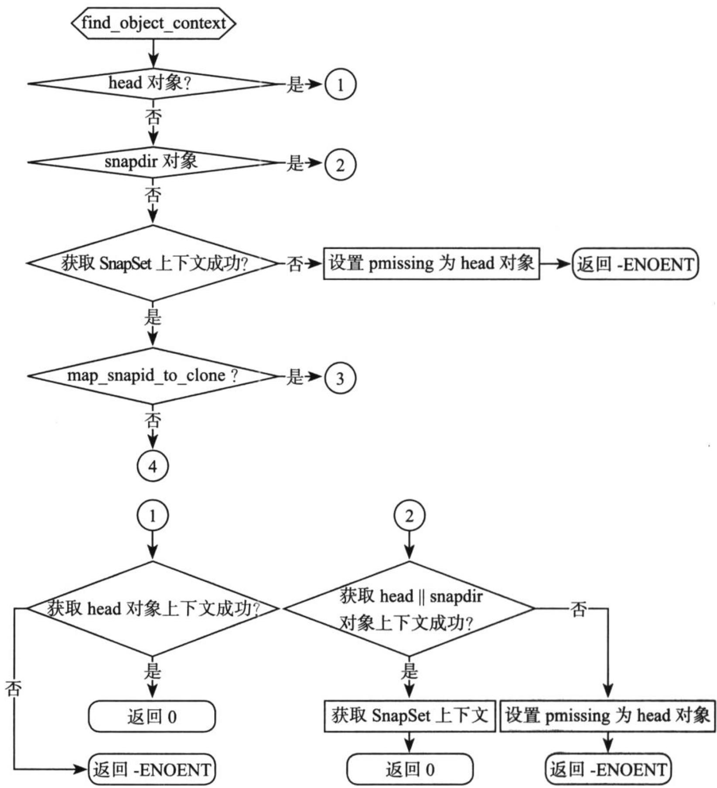


图4-3 find_object_context


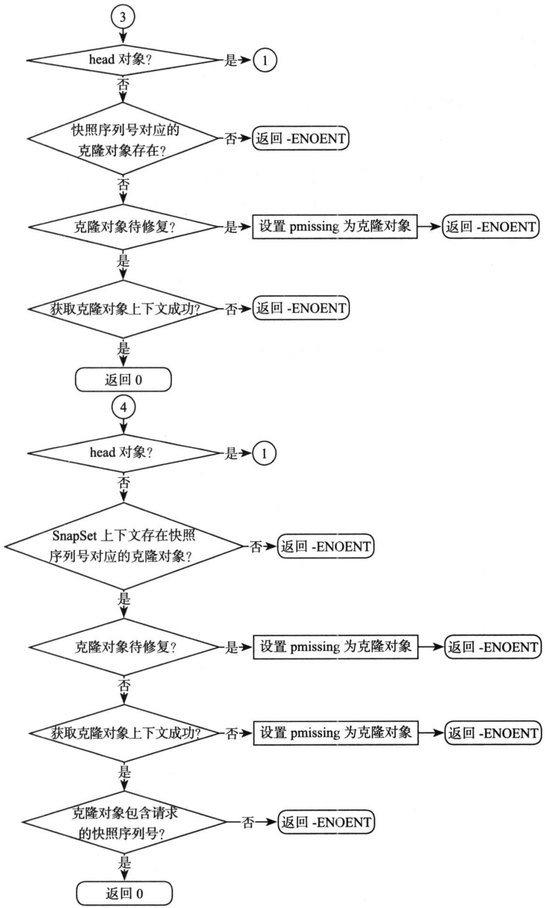


图4-3（续）


与直接查找 head 对象相比，按照快照序列号查找快照对象（实际上会被映射为克隆对象）的难度在于一个克隆对象可以对应多个快照，因此此时首先需要根据快照序列号定位到某个特定的克隆对象，然后通过分析其位于 OI 中的 snaps 属性才能进一步判定对应的快照序列号是否确实包含于克隆对象之中。

通过快照序列号定位克隆对象的具体过程如下：因为对象的SS属性中，clones集合保存了本head对象所关联的所有克隆对象，并且该集合按照每个克隆对象所对应的最新快照序列号进行升序排列，所以查找过程可以总结为——从clones集合中的第一个元素开始顺序遍历，直至找到第一个满足大于等于指定快照序列号的克隆对象为止。这个过程如图4-4所示。

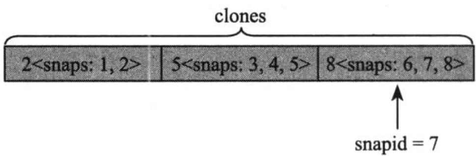


图4-4 通过快照序列号查找特定的克隆对象


clones[2](=8)对应的克隆对象实际上关联6，7，8三个快照，因此snapid $= 7$ 包含于其中

find_object_context 最终可能产生 0, -ENOENT 和 -EAGAIN 三种结果。如果返回 0, 表明查找成功; 如果返回 -ENOENT, 表明查找的对象不存在; 如果返回 -EAGAIN, 表明查找的对象待修复, 需要等待对象修复完成后重试 op。

# 4.2.4 executectx

至此，我们已经完成了操作对象前的全部准备工作，接下来可以通过executeCtx正式执行op，执行过程如图4-5所示。

executeCtx 首先基于当前快照模式，更新 OpContext 中的快照上下文（SnapContext）——如果是自定义快照模式，直接基于 op 携带的快照信息更新；否则基于 PGPool 更新。为了保证数据一致性，所有包含修改操作的 op 会预先由 Primary 通过 prepare_transaction 封装成一个 PG 事务，然后由不同类型的 PGBackend 负责转化为 OS 能够识别的本地事务，最后在副本之间进行分发和同步。需要注意的是，如果 op 包含读操作，那么在 prepare_transaction 中会同步去磁盘读取相应的内容（指多副本，纠删码备份方式下将执行异步读），因此需要在执行 prepare_transaction 之前预先获取对象上下文中的 ondisk_

read_lock（参见表4-7），并在prepare_transaction之后释放。

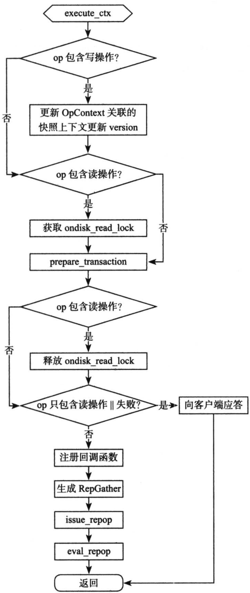


图4-5 executectx


# 1. 事务准备

针对多副本而言，因为每个副本保存的对象完全相同，所以由 Primary 生成的 PG 事务也可以直接作为每个副本的本地事务直接执行。引入纠删码之后，因为每个副本保存的都是原始对象独一无二的分片，所以需要对原始对象的整体操作（对应 PG 事务）和每个分片操作（对应 OS 事务）加以区分。

本节介绍如何基于 op 生成 PG 级别的事务，这个过程通过 prepare_transaction 完成，共分为三个阶段：

1）通过do_osdOps生成原始op对应的PG事务。

2）如果 op 针对 head 对象操作，通过 make_writable 检查是否需要预先执行克隆操作。

3）通过finishctx检查是否需要创建或者删除snapdir对象，生成日志，并更新对象的OI和SS属性。

为了更好地理解prepare_transaction的执行过程，我们首先介绍PG事务（PGTransaction）的相关概念。

PGTransaction 是一种抽象数据类型，它记录了一组以原始对象（即从前端应用视角，不考虑备份策略）作为目标的修改操作，后续可以为不同的 PGBackend 翻译成 OS 能够理解的本地事务并执行。与 ObjectStore::Transaction（即 OS 事务）类似，PGTransaction 主要包含一系列操作（修改）原始对象的接口，如表 4-14 所示。


表 4-14 PGTransaction 公共接口


<table><tr><td>接口名称</td><td>含义</td></tr><tr><td>clone</td><td>克隆对象</td></tr><tr><td>clone_range</td><td>在指定对象内执行范围克隆</td></tr><tr><td>create</td><td>创建新对象</td></tr><tr><td>nop</td><td>空操作，例如用于强制对象内的数据存盘</td></tr><tr><td>omap_clear</td><td>删除对象所有omap条目</td></tr><tr><td>omap_rmkeys</td><td>批量删除omap条目</td></tr><tr><td>omap_setheader</td><td>设置omap header</td></tr><tr><td>omap_setkeys</td><td>批量添加omap条目</td></tr><tr><td>remove</td><td>删除对象</td></tr><tr><td>rename</td><td>对原始对象进行重命名。注意:原始对象必须是一个临时对象。rename 操作的典型应用如:针对对象执行修复时,如果通过一次传输(Pull/Push)不能完成,则此时需要借助一个临时对象来进行中转,而不能直接针对原始对象操作,否则存在将原始对象写坏的风险。当全部数据传输完成之后,最终通过将原始对象删除,同时将临时对象重命名为原始对象来彻底完成修复</td></tr><tr><td>rmattr</td><td>删除单个属性</td></tr><tr><td>setattr</td><td>设置单个属性</td></tr><tr><td>setattrs</td><td>批量设置属性</td></tr><tr><td>set_alloc_hint</td><td>可设置的属性包括(参见表4-2):alloc_hint_flags,expected_object_size和expected_write_size</td></tr><tr><td>truncate</td><td>截断对象(也支持truncate-up操作,效果等同于append,但是使用全0填充)</td></tr><tr><td>write</td><td>写</td></tr><tr><td>zero</td><td>擦除对象指定范围内的数据,使用全0填充</td></tr></table>

值得注意的是，针对同一个对象同一种类型的多次操作可能存在重合部分或者可以合并的可能，典型如write和zero，因此实现上将这类操作进行特殊处理，统一使用一类称为interval_map的数据结构进行管理。

顾名思义，interval_map 使用 map 对 interval（对 PGTransaction 而言，这里的 interval 即原始对象中的逻辑地址范围——<offset, length>，map 意味着其中的 interval 是有序的，并且基于每个 interval 的 offset 进行排序）进行追踪，其特别之处在于需要指定两个自定义函数——split 和 merge，分别应对用于向 interval_map 中插入新的 interval 时的去重（去重的过程需要从老 interval 中移除掉重合的部分，因此这个操作称为 split）与合并操作。例如针对 write 操作，split 总是直接将 interval 中的重合部分使用新的待写入数据覆盖，而 merge 则只需要将左右两次写操作进行合并即可（这里的左右写操作分别指满足合并条件时，offset 较小和 offset 较大的写操作）。

除了上述操作原始对象的接口，PGTransaction 还额外提供了一个名为 safe_create_traverse 的接口，用于 PGBackend 将 PG 事务转化为自身能够理解的本地事务。特别的，如果涉及多对象操作，safe_create_traverse 内部能够保证这些事务以合理的顺序执行，例如假定待修改的 head 对象关联了快照，转化为本地事务时依然会先创建克隆对象再修改 head 对象，而不是相反。

下面详细介绍Prepare-transaction的执行过程：

# (1)do_osdOps

do_osdOps直接将op携带的原始操作转化为PG事务，如图4-6所示：

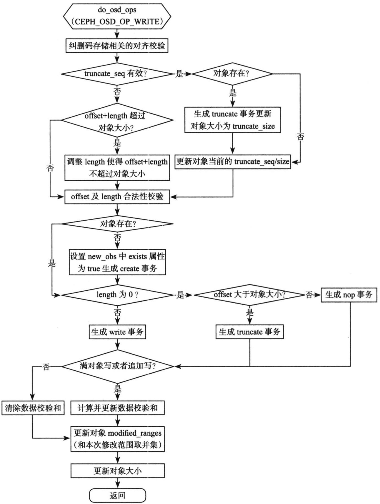


图4-6 do_osdOps(write)


图4-6展示了将op携带的write操作转化为PGTransaction中事务的过程（注意：op中的单个write操作并不一定只转化为PGTransaction中的一个write事务）：

1）检查write操作携带的truncate_seq，并和对象上下文中保存的truncate_seq比较从而判定客户端执行write操作和trimtrunc/truncate操作的真实顺序，并对write操作涉及的逻辑地址范围进行修正。

2）检查本地写入逻辑地址范围是否合法——例如我们当前限制对象大小不超过100GB（受配置项osd_max_object_size控制）。

3）将write操作转化为PGTransaction中的事务。

4）如果是满对象写（包含新写或者覆盖写），或者为追加写并且之前存在数据校验和，则重新计算并更新OI中的数据校验和，作为后续执行深度扫描（Deep Scrub）的依据；否则清除数据校验和。

5）在OpContext中累积本次write修改的逻辑地址范围以及其他统计（例如写操作次数、写入字节数），同时更新对象大小。

当前实现也支持通过 write 操作隐式创建一个新对象，因此如果对应的对象不存在，则默认创建，此时将在 PGTransaction 中额外生成一个 create 事务，同时设置 new_obs.exist 为 true，具体参考图 4-6。

# (2) make_writable

将 op 携带的全部操作都转化为 PGTransaction 中的事务之后，如果 op 针对 head 对象修改，那么通过 make_writable 来判定 head 对象是否需要预先执行克隆，如图 4-7 所示。

make_writable 首先判断 head 对象是否需要执行克隆：取对象当前的 SnapSet，和 OpContext 中 SnapContext 中的内容进行比较——如果 SnapSet 中最新的快照序列号比 SnapContext 中最新的快照序列号小，说明自上一次快照之后，又产生了新的快照，此时不能直接针对 head 对象进行修改，而是需要先执行克隆（默认执行全对象克隆）。如果 SnapContext 携带了多个新的快照序列号（例如自某次快照产生后，很长时间内没有针对本对象执行过任何修改操作，而中间又多次执行了快照操作），那么所有比 SnapSet 中更新的快照序列号都将关联至同一个克隆对象（亦即后续针对这些快照执行回滚时，都将回滚至同一个克隆对象）。

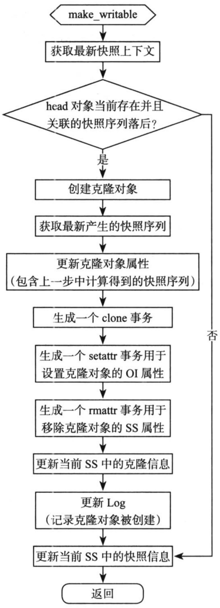


图4-7 make_writable


这里存在一种特殊情况——如果当前操作为删除 head 对象，并且该对象自创建之后没有经历过任何修改（亦即此时 SnapSet 为空），也需要对该 head 对象正常执行克隆后再删除，后续将创建一个 snapdir 对象来转移这些快照及相关的克隆信息。

创建克隆对象时，需要同步更新SS属性中的相关信息：

□在clones集合中记录当前克隆对象中的最新快照序列号。

□在clone_size集合中更新当前克隆对象大小——因为默认使用全对象克隆，所以克隆对象大小为执行克隆时head对象的实时大小。

□在clone_overlap集合中记录当前克隆对象与前一个克隆对象之间的重合部分。

此外，如果确定需要执行克隆，则需要为克隆对象生成一条新的、独立的日志，并同步更新 op 中日志版本号。

最后，我们可以基于SnapContext来更新对象SS属性中的快照信息。

# (3)finishctx

顾名思义，finishctx完成事务准备阶段最后的清理工作，如图4-8所示。

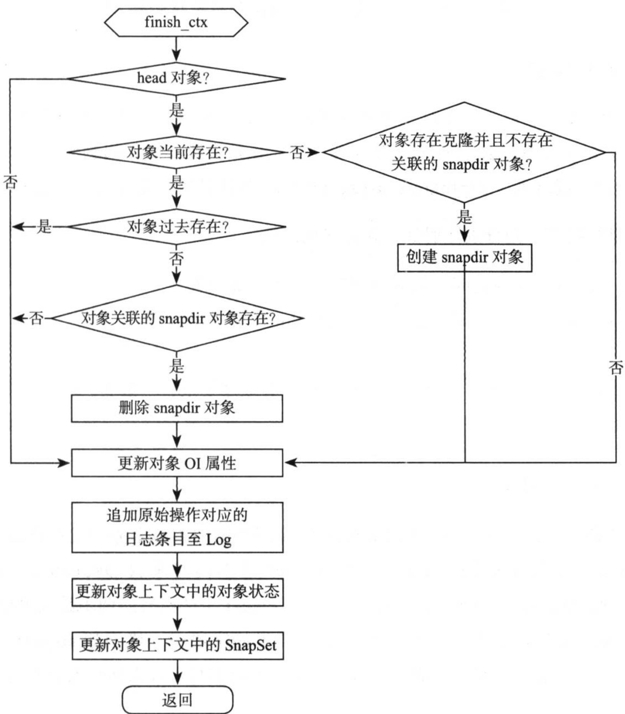


图4-8 finishctx


参考图4-8，finishctx主要完成以下操作：

1）如果创建head对象并且snapdir对象存在，则删除snapdir对象，同时生成一条删除snapdir对象的日志；如果删除head对象并且对象仍然被快照引用，则创建snapdir对象，同时生成一条创建snapdir对象的日志，并将head对象的OI和SS属性使用snapdir对象转存。

2）如果对象存在，更新对象OI属性——例如version、prior_version、last_reqid、mtime、local_mtime等等；进一步的，如果是head对象，同步更新其SS属性。

3）生成一条op操作原始对象的日志，并追加至现有OpContext中的日志集合中。

4）在OpContext关联的对象上下文中应用最新的对象状态和SS上下文。

# 2. 注册回调函数

完成PG事务准备后，针对纯粹的读操作而言，如果是同步读，例如多副本，op已经执行完毕，此时可以直接向客户端应答；如果是异步读，例如纠删码，则将op挂入PG内部的异步读队列（in_progress_async_reads），等待异步读完成之后再向客户端应答。

如果是写操作，则分别注册如下几类回调函数：

□ on_commit——执行时，向客户端发送写入完成应答。

□ on_success——执行时，进行与 Watch/Notify 相关的处理。

□ on_finish——执行时，删除OpContext。

从这些回调函数的内容可见它们之间的执行有顺序要求，一般为：on_commit $\rightarrow$ on_success->on_finish。

# 3. 事务分发和同步

所有准备工作就绪后，可以由 Primary 进行副本间的本地事务分发和整体同步，这个过程通过一个 RepGather 来完成。RepGather 基本内容来自 OpContext（例如基于 OpContext 初始化 RepGather 时会同步转移 OpContext 中的所有回调函数至 RepGather），区别在于 RepGather 增加了用于副本间进行同步的字段——典型如 all_applied 和 all_committed 两个标志，分别用于表示是否收到了所有副本写入日志和写入磁盘的应答。

基于OpContext初始化RepGather之后，可以通过issue_repop将RepGather提交至

PGBackend，由后者负责将PG事务转化为每个副本间的本地事务之后再进行分发。需要注意的是，在PG事务提交至PGBackend之后，本地事务有可能立即开始执行，因此在此之前需要先获取波及对象的对象上下文中的ondisk_write_lock，防止和非客户端触发的本地写操作冲突，这些锁将在本地事务执行完成之后释放。此外，因为后续将由PGBackend接替PG负责对整个事务在副本间的完成情况进行追踪（这是因为副本间的写入日志/磁盘完成应答是由PGBackend直接处理的！），所以将PG事务提交至PGBackend时同样要注册几类回调函数，用于指示事务整体完成之后的后续操作：

1）on_all_applied——PGBackend 收到所有副本应答写入日志完成之后执行，执行后将设置 RepGather 中的 all_applied 标志为 true，同时调用 eval_repop 来评估 RepGather 是否最终完成。

2）on_all_commit——PGBackend 收到所有副本应答写入磁盘完成之后执行，执行后将设置 RepGather 中的 all_commit 标志为 true，同时调用 eval_repop 来评估 RepGather 是否最终完成。

3）on_local_applied_sync——PGBackend 完成本地事务写入日志之后即可同步执行（这里同步的含义取决于 OS 的具体实现，例如 BlueStore 的实现中，通常情况下，on_local_applied_sync 将由 BlueStore 中的同步线程执行，而不用再次提交至其内部的 Finisher 线程异步执行），目前主要用于释放 RepGather 中持有的各类对象上下文中的 ondisk_write_lock。

顾名思义，eval_repop 用于评估 RepGather 是否真正完成。如果真正完成，则依次执行 RepGather 中注册过的一系列回调函数（即“4.2.4 2. 注册回调函数”中的回调函数），最后将 RepGather 从全局的 RepGather 队列中移除同时删除 RepGather。

作为本节的结束，我们简单介绍一下 PGBackend 进行副本间事务分发的过程，这是由 submit_transaction 来完成的。

对多副本而言，因为每个副本保存的内容完全相同，所以通过submit_transaction将PGTransaction转化为每个副本的本地事务无需过多的额外处理（一个重要的例外是需要将日志中的所有条目标记为不可回滚），直接通过safe_create_traverse逐个事务完成参数传递即可（PGTransaction和ObjectStore::Transaction的事务接口基本是重合的），之后构造消息向每个副本进行本地事务分发。

纠删码的情况比较复杂，特别的，当涉及覆盖写（overwrites）时，如果改写的部分不足一个完整条带（指写入的起始地址或者数据长度没有进行条带对齐），则需要执行

RMW，因此这期间会多次调用 safe_create_traverse 分别执行补齐读（Read）、重新生成完整条带并重新计算校验块（Modify）、单独生成每个副本的事务并构造消息进行分发（Write），同时在必要时执行范围克隆和对 PG 日志进行修正，以支持 Peering 期间（可能需要执行）的回滚操作。

# 4.3 状态迁移

很多 Ceph 引以为傲的特性，例如自动数据平衡和自动数据迁移，都是以 PG 为基础实现的。PG 状态的多样性充分反映了其功能的多样性和复杂性，状态之间的变迁则常常用于表征 PG 在不同功能之间进行了切换（例如由 Active+Clean 变为 Active+Clean+Scrubbing+Deep 状态，说明 PG 当前正在或者即将执行数据深度扫描）或者 PG 内部数据处理流程的进度（例如由 Active+Degraded 变为 Active+Clean 状态，说明 PG 在后台已经完成了所有损坏对象的修复）。

上述状态指的是能够为普通用户直接感知的外部状态，实现上，PG 内部通过状态机来驱动 PG 在不同外部状态之间进行迁移，因此，相应的 PG 有内（状态机状态）外（负责对外呈现）两种状态。我们首先介绍 PG 的外部状态，具体如表 4-15 所示，这是普通用户接触和了解 PG 最直观的途径（典型如通过 ceph-s 命令可以实时追踪集群中所有 PG 的外部状态），接下来我们通过几个典型的场景来分析如何通过内部状态机驱动 PG 在外部状态之间进行迁移，即 PG 的一系列复杂功能是如何实现的。


表 4-15 PG 外部状态


<table><tr><td>状态</td><td>含义</td></tr><tr><td>Activating</td><td>Peering 已经完成，PG 正在等待所有 PG 实例同步并固化 Peering 的结果（Info、Log 等）</td></tr><tr><td>Active</td><td>PG 可以正常处理来自客户端的读写请求</td></tr><tr><td>Backfilling</td><td>PG 正在执行 Backfill。
Backfill 总是在 Recovery 完成之后进行的</td></tr><tr><td>Backfill-toofull</td><td>某个需要被 Backfill 的 PG 实例，其所在的 OSD 可用空间不足，Backfill 流程当前被挂起</td></tr><tr><td>Backfill-wait</td><td>等待 Backfill 资源预留</td></tr><tr><td>Clean</td><td>PG 当前不存在待修复的对象，Acting Set 和 Up Set 内容一致，并且大小等于存储池副本数（size）</td></tr><tr><td>Creating</td><td>PG 正在被创建</td></tr><tr><td>Deep</td><td>PG 正在或者即将进行对象一致性扫描。
Deep 总是和 Scrubbing 成对出现，表明将对 PG 中的对象执行深度扫描（同时扫描对象元数据和用户数据）</td></tr><tr><td>Degraded</td><td>Peering完成后，PG检测到任意一个PG实例存在不一致（需要被同步/修复）的对象；或者当前 ActingSet小于存储池副本数</td></tr><tr><td>Down</td><td>Peering过程中，PG检测到某个不能被跳过的Interval中（例如该Interval期间，PG完成了Peering，并且成功切换至Active状态，从而有可能正常处理了来自客户端的读写请求），当前剩余在线的OSD不足以完成数据修复</td></tr><tr><td>Incomplete</td><td>Peering过程中，由于：1）无法选出权威日志2）通过choose Acting选出的Acting Set后续不足以完成数据修复（例如针对纠删码，存活的副本数小于k值）（注意：与Down的区别在于这里选不出来的原因是由于某些副本的日志不完整）等导致Peering无法正常完成</td></tr><tr><td>Inconsistent</td><td>PG通过Scrub检测到某个或者某些对象在PG实例间出现了不一致（主要是静默数据错误导致）</td></tr><tr><td>Peered</td><td>Peering已经完成，但是PG当前ActingSet规模小于存储池规定的最小副本数（min_size）</td></tr><tr><td>Peering</td><td>PG正在进行Peering</td></tr><tr><td>Recovering</td><td>Recovery资源预留成功，PG正在后台根据Peering的结果针对不一致的对象进行同步/修复</td></tr><tr><td>Recovery-wait</td><td>等待Recovery资源预留</td></tr><tr><td>Remapped</td><td>Peering完成，PG当前Acting Set与Up Set不一致</td></tr><tr><td>Repair</td><td>PG在下一次执行Scrub的过程中，如果发现存在不一致的对象，并且能够修复，则自动进行修复</td></tr><tr><td>Scrubbing</td><td>PG正在或者即将进行对象一致性扫描。Scrubbing仅扫描对象的元数据</td></tr><tr><td>Stale</td><td>Monitor检测到当前Primary所在的OSD宕掉；或者Primary超时未向Monitor上报PG相关的统计信息（例如出现临时性的网络拥塞）</td></tr><tr><td>Undersized</td><td>PG当前Acting Set小于存储池副本数</td></tr></table>

需要注意的是，表4-15中这些外部状态并不都是互斥的，某些时刻PG可能处于表中多个状态的叠加态之中，常见的如：Active+Clean，表明PG当前一切正常；Active+Degraded+Recovering，表明PG已经完成了Peering并且存在数据一致性问题，这些不一致的数据（对象）正在后台接受修复；等等。

# 4.3.1 状态机概述

PG外部状态的变化最终通过其内部状态机进行驱动，该状态机为一种基于事件驱动的有限状态机。集群状态的变化，典型如OSD加入和删除、OSD宕掉和恢复、存储池创建等，最终都会转化为一系列状态机中的事件，驱动状态机在不同状态之间进行跳转和执行处理，从而实现我们所期望的功能和行为。

该状态机现有状态如图4-9所示

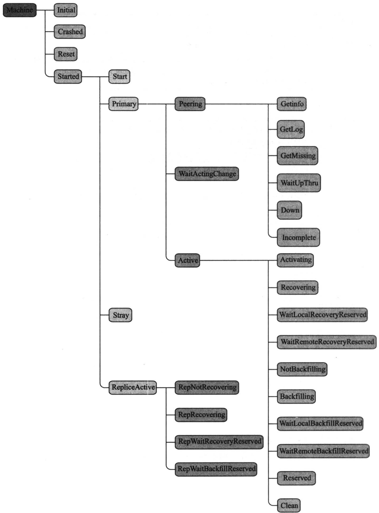


图4-9PG状态机状态汇总


由图4-9可见，该状态机当前一共有四级状态，每一种状态又可以包含若干子状态，所有子状态中第一个状态为其默认状态——例如该状态机初始化时，默认会进入Initial子状态；又比如当该状态机从其他状态，例如Reset状态，跳转至Started状态时，默认会进入Started/Start子状态；等等。

与状态机相关的主要事件如表4-16所示


表 4-16 PG 状态机事件汇总


<table><tr><td>事件</td><td>含义</td></tr><tr><td>Activate</td><td>Peering 即将完成</td></tr><tr><td>ActMap</td><td>OSDMap 同步完成, PG 可以开始 Peering</td></tr><tr><td>AdvMap</td><td>集群 OSDMap 发生变化, OSD 本身完成 OSDMap 同步后,同步推送至所有 PG</td></tr><tr><td>AllBackfillsReserved</td><td>所有需要参与 Backfill 的 PG 实例完成资源预留</td></tr><tr><td>AllReplicasActivated</td><td>Peering 成功完成</td></tr><tr><td>AllReplicasRecovered</td><td>Recovery 完成,并且后续无需执行 Backfill</td></tr><tr><td>Backfilled</td><td>Backfill 完成</td></tr><tr><td>BackfillTooFull</td><td>某个待执行 Backfill 的 PG 实例所在的 OSD 空间不足</td></tr><tr><td>DoRecovery</td><td>Primary 开始进行 Recovery 资源预留</td></tr><tr><td>GoClean</td><td>PG 不存在待修复的对象,也不存在需要执行 Backfill 的 PG 实例</td></tr><tr><td>GotInfo</td><td>Peering 过程中, Primary 成功收到所有请求的 Info</td></tr><tr><td>Initialize</td><td>创建 PG</td></tr><tr><td>Load</td><td>OSD 上电,加载 PG</td></tr><tr><td>LocalBackfillReserved</td><td>Backfill 过程中, Primary 本地预留资源成功</td></tr><tr><td>LocalRecoveryReserved</td><td>Recovery 过程中, Primary 本地预留资源成功</td></tr><tr><td>MInfoRec</td><td>PG 收到 Info</td></tr><tr><td>MLogRec</td><td>PG 收到 Log</td></tr><tr><td>MNotifyRec</td><td>PG 收到 Notify</td></tr><tr><td>NeedUpThru</td><td>等待当前 OSD 完成 up_thru 更新</td></tr><tr><td>NullEvt</td><td>空事件,典型如 OSD 收到 OSDMap 更新通知时,通过本事件将所有 PG 加入内部 peering_wq,逐个检测是否需要重新开始 Peering</td></tr><tr><td>Recovering</td><td>所有参与 Recovery 的 PG 实例完成资源预留</td></tr><tr><td>RemoteBackfillReserved</td><td>Backfill 过程中,收到指定 PG 实例资源预留成功响应</td></tr><tr><td>RemoteRecoveryReserved</td><td>Recovery 过程中,收到指定 PG 实例资源预留成功响应</td></tr><tr><td>RemoteReservationRejected</td><td>Backfill 过程中,收到指定 PG 实例资源预留失败响应,例如因为 OSD 可用空间不足</td></tr><tr><td>RequestBackfill</td><td>Primary 检测到需要执行 Backfill</td></tr><tr><td>RequestRecovery</td><td>Primary 检测到需要执行 Recovery</td></tr></table>

状态机的整体工作流程如图4-10所示

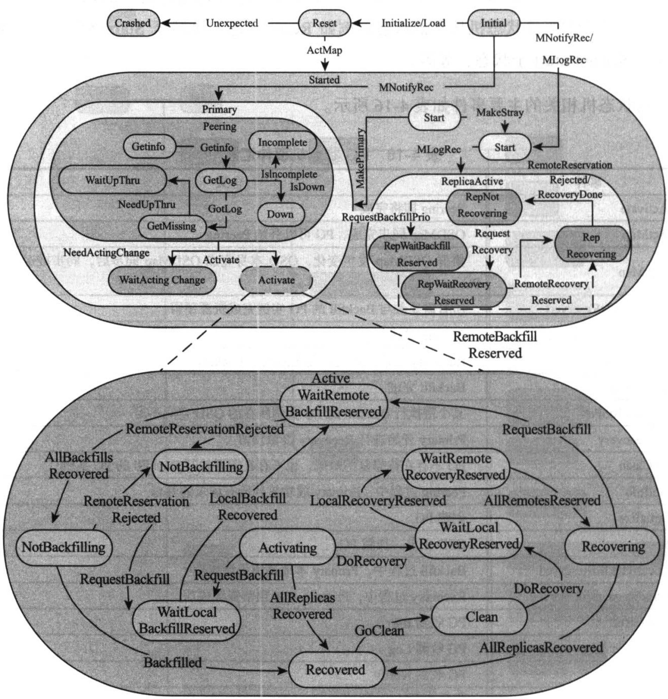


图4-10 PG状态机工作流程


接下来我们结合具体场景来补充此状态机工作中的各种细节。为了叙述方便，我们约定形如“Started/Start”的复合状态指示状态机状态，形如“Active+Clean”的复合状态指示PG外部状态。大部分单独出现的状态，一般指PG外部状态，具体可以参考表4-15。

# 4.3.2 创建PG

OSDMonitor 收到存储池创建命令之后，最终通过 PGMonitor 异步向池中每个 OSD

下发批量创建PG命令。和读写流程类似，PG的创建也是在Primary的主导下进行的，即PGMonitor仅需要向当前Primary所在的OSD下发PG创建请求，Replica会在随后由Primary发起的Peering过程中自动被创建。和读写请求不同，因为创建PG的过程中强烈依赖OSDMap，所以OSD收到该请求后，需要预先获取OSD内部的全局互斥锁，以确保该消息处理过程中，OSD当前关联的OSDMap不会发生变化，并最终通过handle_pg_create进行处理，处理过程如图4-11所示。

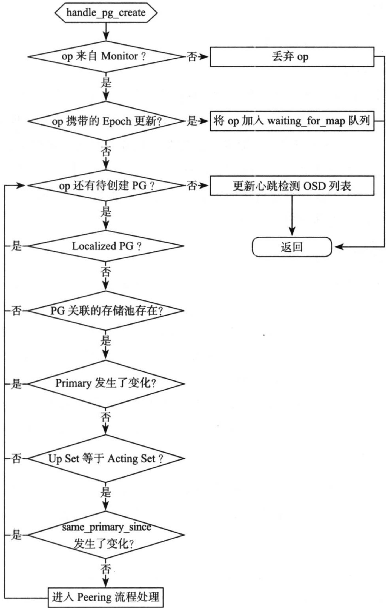


图4-11 handle_pg_create


图4-11中一些关键步骤补充说明如下：

# (1) Epoch检查

因为PG创建必然涉及集群OSDMap更新，所以OSD处理这类消息之前，必须保证当前所持有的OSDMap与消息产生时的OSDMap同步，否则需要将op加入OSD全局的waiting_for_map队列（注意不要和上一节中提到的PG内部的waiting_for_map队列混淆！），同时向Monitor发送一个订阅OSDMap请求，等待自身OSDMap更新之后再对op进行处理。

# (2) 单个 op 可以创建多个 PG

# (3) Localized PG

Localized PG 原本是为了适配类似 Hadoop 的大数据应用所定制的特性，其主旨在于将 PG 和特定的 OSD 进行绑定，并禁止 PG 在 OSD 之间移动，以满足 Hadoop 所要求的计算和存储合一的亲和性需求——即将计算需要引用或者产生的数据就近存储，例如最好使用计算节点的本地存储。容易理解，这种特性与 Ceph 追求高可扩展、基于 CRUSH 计算并随机分布 PG 的设计理念背道而驰，目前已经被废弃，但是出于版本兼容性考虑，仍然保留了这一部分处理逻辑。

# （4）其他常规性检查

例如确认PG关联的存储池是否依然存在、Primary是否发生了变化、UpSet是否和Acting Set相等等。事实上，PGMonitor在向OSD发送PG创建请求之前已经对上述信息进行过确认，之所以还要进行这类检查，主要是因为当OSD收到op时，整个集群拓扑结构可能又发生了变化（例如用户创建存储池之后马上又删除），导致OSD当前持有的OSDMap可能比op产生时的OSDMap更新。一些极端情况下，例如由于网络振荡导致集群短时间内产生了大量OSDMap变化，为了防止PG在多个OSD上被创建（例如PG的Primary由 $\mathrm{A}\rightarrow \mathrm{B}\rightarrow \mathrm{C}\rightarrow \mathrm{A}$ ，即OSD.A收到此PG创建请求时，PG的Primary期间经过多次切换，最终又切回OSD.A)，我们还需要对整个PG的历史信息进行回溯。

对PG历史信息进行回溯的过程称为project_pg_history，基于OSDMap变化列表进行，以PG创建时的OSDMap作为起点，以OSD当前持有的最新OSDMap作为终点，其结果将产生三个属性，分别为：

□ same interval since——标识 PG 最近一个 Interval 的起点。

□ same_up_since——标识自该 Epoch 开始，PG 当前的 Up Set 没有发生过变化。

□ same_primary_since——标识自该 Epoch 开始，PG 当前的 Primary 没有发生过变化。

因此，如果完成 project_pg_history 之后产生的 same_primary_since 大于 op 携带的 Epoch，说明期间 Primary 曾经发生过变化，我们需要放弃执行本次操作，将决策权交给当前的 Primary（对应 PG 已经在别的 OSD 上创建成功的情况）或者 PGMonitor，后续由 Primary 通过 Peering 执行 Primary 切换或者由 PGMonitor 重新发起创建。

# （5）更新心跳检测OSD列表

为了保证PG的分布式写能够正常完成，OSD需要对和本OSD通过PG发生联系的所有OSD通过心跳机制进行监控。

如果满足创建条件，在handle_pg_create的最后一步，OSD将通过向handle_pg_peering_ev t 函数投递一个NullEv t 事件，正式开始着手进行PG创建。该事件没有任何实际作用，仅仅用于初始化创建流程。

顾名思义，handle_pg_peeringevt函数负责处理Peering相关的事件。该函数首先判断对应的PG是否存在，如果存在，则直接从OSD全局的pg_map获取PG内存结构；如果不存在，因为PG删除为异步操作，所以先判断该PG是否位于待删除PG列表之中，如果为是，则尝试终止删除并恢复PG（Ceph称为“拯救”PG，这种方案之所以可行——例如不用担心类似“即使拯救成功，PG中的数据可能也已经残缺不全”这种情况，是因为随后PG将通过Peering重新进行数据同步）；如果为否，或者拯救PG失败（例如已经被彻底删除），则直接创建PG，流程如下：

1）直接调用后端OS事务接口，依次创建Collection和PG元数据对象。

（2）创建PG内存结构，并将其加入OSD的全局pg_map。

3）填充Info，通过OS事务接口将其写入元数据对象的omap。

4）向状态机投递两个事件——Initialize 和 ActMap，用于初始化状态机，参考图 4-10，如果 OSD 当前为 Primary，那么设置 Primary 状态为 Creating，同时状态机进入 Started/Primary/Peering/GetInfo 状态，准备开始执行 Peering。

5）通知OS开始执行上述过程中产生的本地事务，同时派发期间产生的消息（例如Peering相关的消息）。

查找PG成功或者完成PG创建之后，handle_pg_peeringevt会将调用者输入的Peering事件加入PG的peering_queue队列，然后再将PG加入OSD内部的peering_wq队列，由OSD后续统一调度和处理。

# 4.3.3 Peering

和处理客户端发起的读写请求类似，在OSD内部，所有需要执行Peering的PG也会安排一个专门的peering_wq工作队列，该工作队列同样需要绑定一个线程池——osd_tp为其提供具体的服务线程。然而与op_shardedwq不同的是：进入peering_wq的不是op，而是需要处理Peering事件的PG本身；此外，peering_wq为批处理队列，亦即osd_tp中的线程对peering_wq中的条目（即PG）进行处理时，可以一次出列和处理多个条目（受配置项osd_peering_wq_batch_size控制），因此，当osd_tp包含多个服务线程时（受配置项osd_op Threads控制），需要由peering_wq自身实现互斥机制，防止其中的条目同时被多个服务线程处理。

当PG从peering_wq出列时，OSD最终通过process_peering_events进行批量处理，其处理逻辑如下：

1）创建一个RecoveryCtx，用于批量收集本次处理过程中所有PG产生的与Peering相关的消息，例如Query（Info、Log等）、Notify等。

2）逐个PG处理：取OSD最新的OSDMap，通过advance_pg检查PG是否需要执行OSDMap更新操作。如果为否，说明直接由Peering事件触发，将该事件从PG内部的peering_queue队列出列，并投递至PG内部的状态机进行处理；如果为是，则在advance_pg内部直接执行OSDMap更新操作，完成之后将PG再次加入peering_wq队列。

值得注意的是：如果PG当前的OSDMap与OSD的最新OSDMap版本号相差过大，为防止单个PG过多的占用时间片，需要分多次对OSDMap进行同步，因此每处理一定数量的OSDMap后（受配置项osd_map_maxadvance控制），OSD会让出时间片，将该PG重新加入peering_wq，等待下次继续执行OSDMap同步。这样处理的原因首先在于Ceph完全随机分布数据的特性，例如RBD中的一个image，一般情况下其数据最终会分布在所有PG之上，因此我们倾向于让所有PG同时恢复正常，否则任意一个PG长时间堵塞都将导致前端所有应用（例如虚拟机）无法正常工作；其次，我们期望所有PG都同

步进行OSDMap更新，而不希望某个PG的OSDMap版本号落后太多，从而避免OSD需要保存大量的OSDMap，进而浪费存储空间。

3）检查是否需要通知 Monitor 设置本 OSD 的 up_thru（关于 up_thru 的含义我们将在下文中进一步阐述）。

4）批量派发RecoveryCtx中累积的Query、Notify消息。

步骤2）中，如果advance_pg检测到PG需要进行OSDMap更新，那么每更新一次，都会同步向状态机投递一个AdvMap事件，该事件携带新老OSDMap以及PG在这两张OSDMap下的Up/Acting Set等映射结果，供状态机判断是否需要重启Peering。如果为是，那么状态机将进入Reset状态，并对PG进行去活——例如暂停PG内部的Scrub、Recovery操作、丢弃尚未完成的op等，同时清理PG诸如Active、Recovering等状态，准备执行Peering。advance_pg完成或阶段性的完成OSDMap同步之后，最终会向PG状态机投递一个ActMap事件，通知PG可以开始执行Peering。

判断是否需要进行或者重启 Peering 的法则比较简单，只要检查本次 OSDMap 更新之后是否会触发 PG 进入一个新的 Interval 即可。因为 PG 支持对 OSDMap 进行批量同步，所以在正式进行 Peering 之前，PG 在这些历史的 OSDMap 变化序列中可能产生了一系列已经发生过的 Interval，称为 past_intervals。

# 1. past_intervals

单个Interval用于指示一个相对稳定的PG映射周期——在此期间，PG的UpSet和ActingSet没有发生变化，关联存储池的副本数、最小副本数以及PG数目也没有发生过变化，其磁盘数据结构如表4-17所示。


表 4-17 pg_interval_t


<table><tr><td>成员</td><td>含义</td></tr><tr><td>acting</td><td>Acting Set</td></tr><tr><td>first</td><td rowspan="2">Interval的起始和终止 Epoch</td></tr><tr><td>last</td></tr><tr><td>maybe_went_rw</td><td>用于标识本 Interval内，PG 是否可能接受了客户端发起的读写（即 PG 曾经处于 Active 状态）。
如果 maybe_went_rw 为 false，说明本 Interval 内不可能产生过由客户端发起的数据更新，因此后续执行 Peering 的过程中，可以安全的跳过（bypass）本 Interval</td></tr><tr><td>primary</td><td>Acting Primary，即 Acting Set 中的第一个 OSD</td></tr><tr><td>up</td><td>Up Set</td></tr><tr><td>up_primary</td><td>Up Primary, 即 Up Set 中的第一个 OSD</td></tr></table>

由Interval定义可见，Interval中已经保存了针对该Interval后续执行Peering所需要的全部（OSD）信息，因此，每次生成past_intervals之后，PG可以立即将past_intervals作为元数据之一固化至本地磁盘，防止PG持续引用一些较老的OSDMap，进而导致OSD需要存储大量OSDMap，浪费存储空间。

生成Interval的规则比较简单：每次从OSD获取当前待更新的OSDMap时，我们取其中PG关联存储池的副本数、最小副本数和PG数目，并基于CRUSH重新计算PG的Acting Set、Acting Primary、Up Set、Up Primary，然后与前一个相邻的OSDMap进行比较——如果上述属性中任意一个发生变化，说明老的Interval结束，新的Interval开始，此时可以开始填充老Interval中的first、last、acting、primary、up、up_primary等属性，这里的难点在于如何设置maybe_went_rw。

maybe_went_rw 用于标识对应 Interval 中，PG 有无可能变为 Active 状态从而接受客户端发起的读写请求。显然，如果该标志为 true，为了避免潜在的数据丢失风险，我们后续需要通过 Peering 进一步探测此 Interval 中的每个相关的 OSD 来进行确认；反之则可以直接跳过该 Interval。

一种保守的策略是始终设置 maybe_went_rw 为 true，但是相应的会带来额外的 Peering 时间开销，因为大部分情况下 Peering 是 PG 唯一不响应客户端请求的阶段，所以理论上我们应该尽可能地缩短 Peering 时间；此外，触发 OSDMap 变化的原因种类繁多，由此生成的 past_intervals 中，也并非每个 Interval 都需要通过 Peering 去进行数据同步——极端的例子如某个 Interval 中，Acting Set 小于存储池最小副本数，那么显然应该直接忽略掉该 Interval，如果此时错误的设置 maybe_went_rw 为 true，反而可能因为该 Acting Set 中某些 OSD 永久性损坏导致后续 Peering 卡住。

考虑到每个Interval能够接受客户端读写请求的条件实际上十分苛刻（因此需要考虑的场景也就十分有限），合适的做法是尽最大可能找出那些可能发生读写的场景——例如如果某个Interval内，Acting Primary依然存活并且Acting Set大于等于存储池最小副本数，那么就几乎可以断定该Interval内可能接受过客户端的读写请求。然而此时贸然设置

maybe_went_rw 为 true 仍然为时过早，我们接下来通过举例进行说明。

为简单计，假定某个集群只有编号为A和B的两个OSD，考虑如下场景：

1）Epoch 1：A 和 B 正常在线；

2）Epoch 2：A 和 B 同时掉电，但是因为 OSDMonitor 检测 OSD 宕掉有滞后，所以仅有 A 被标记为 Down；

3）Epoch3：OSDMonitor检测到B宕掉，将B标记为Down；

4）Epoch4：A重新上电并被OSDMonitor标记为Up。

上述集群中OSD状态变化过程可以用OSDMap简记为：

```txt
Epoch 1: A, B  
Epoch 2: B  
Epoch 3:  
Epoch 4: A 
```

当集群中某个PG在Epoch4进行OSDMap同步时，上述OSDMap变化序列将被该PG分解为4个Interval（其中每个Interval仅包含一个Epoch，记为Interval(i)， $i = 1,2,$ 3,4），并加入其past_intervals列表，这里的问题在于：因为所有的Interval都是PG事后根据CRUSH计算得到的，所以如果在Epoch2，OSDMonitor错误的将B标记为Up，那么经过计算我们仍然会（错误的）得到Interval(2)的Acting Set为 $\langle \mathbf{B}\rangle$ 这个结论。由于此时Acting Primary存活（为B）并且Acting Set大小等于最小副本数（为1），所以按照前面的结论，我们认为期间可能由B正常完成了Peering并接受了来自客户端的读写操作，从而设置Interval(2)的maybe_went_rw为true。在随后进行的Peering过程中，我们必须针对Interval(2)执行Peering，即我们必须等到B重新上线，但这不是必须的！

为了解决上面这个问题（例如由于B永久性的损坏导致Peering卡住），我们规定PG在切换至新的Interval之后、成功完成Peering并重新开始接受客户端读写请求之前，必须先通知OSDMonitor设置其归属OSD的up_thru参数。针对上面这个例子，新的OSDMap变化序列为：

```txt
Epoch 1: A, B  
Epoch 2: B up_thru[B] = 0  
Epoch 3:  
Epoch 4: A 
```

进一步的，考虑上面这个例子的另一种可能情形，例如A和B分别掉电：

1）Epoch 1：A 和 B 正常在线；

2）Epoch 2：A掉电并被OSDMonitor标记为Down，PG通过B正常完成了Peering；

3）Epoch 3：OSDMonitor 成功设置 B 的 up_thru 为 2；

4）Epoch 4：OSDMonitor 检测到 B 岩掉，将 B 标记为 Down；

5）Epoch 5：A重新上电并被OSDMonitor标记为Up。

则对应的OSDMap变化序列变为：

```txt
Epoch 1: A, B  
Epoch 2: B up_thru[B] = 0  
Epoch 3: B up_thru[B] = 2  
Epoch 4:  
Epoch 5: A 
```

这样，引入与OSD状态相关的up_thru属性后，设置maybe_went_rw为true的条件变为：

□ Acting Primary存在。

□ Acting Set 大于存储池最小副本数（注意：因为最小副本数可以被手动修改，针对纠删码而言，同时要求 Acting Set 大于等于 k 值）。

□该Interval内，PG（Primary）所在的OSD成功更新了up_thru属性。

完成 past_intervals 计算之后，PG 可以正式开始 Peering。但是因为集群的 OSDMap 可能一直处于动态变化之中，如果 PG 在 Peering 的过程中，再次收到 OSDMap 更新通知，那么此时需要重新计算 past_intervals 并重启 Peering 流程（Interval 可以被合并处理的原因在于 PG 对于对象的修改操作是基于日志进行的，而 Peering 总是企图基于日志将所有对象都同步更新到其最新版本，这可以通过针对对象的一系列操作日志进行顺序重放实现）。每次更新 past_intervals 之后，为了防止重复计算（因而大量引用一些老的 OSDMap），PG 会同步更新 Info 中的 same_interval_since 属性，将其指向当前 PG 已经计算得到的最新 Interval，并和生成的 past_intervals 一并写入本地磁盘。

# 2. GetInfo

如果状态机在Reset状态下收到ActMap事件，则意味着可以开始正式执行Peering。

依据PG自身在新OSDMap中的身份，通过向状态机发送MakePrimary或者MakeStray事件，状态机将分别进入Started/Primary/Peering/GetInfo状态或者Started/Stray状态，后者意味着对应的PG实例需要由当前Primary按照Peering的进度和结果进一步确认其身份。

针对 Primary，因为此时执行 Peering 的主要依据——past_intervals 已经生成，可以据此来收集本次需要参与 Peering 的全部 OSD 信息，并最终将其加入一个集合，称为 PriorSet。

简言之，构建PriorSet的过程就是针对past_intervals中的Interval进行逆序遍历，找出所有我们感兴趣的Interval。那么past_intervals中哪些Interval是我们感兴趣的呢？

首先，Interval不能发生在当前Primary的last_epoch_started之前。

当 Peering 接近尾声之时（PG 变为 Active 之前），为了避免由于 OSD 再次掉电导致前功尽弃，我们将在最后一步由 Primary 通知所有副本更新 Info 中的 last_epoch_started，将其指向本次 Peering 成功完成时的 Epoch，和日志以及 Info 中的其他信息一并固化至本地磁盘。因此，如果 Interval 发生在当前 Primary 的 last_epoch_started 之前，说明其在上一次成功完成的 Peering 中已经被处理过，无需再次进行处理。这也解释了为什么我们要针对 past_intervals 进行逆序遍历，因为一旦某个 Interval 发生在 Primary 的 last_epoch_started 之前，那么 past_intervals 中更早的 Interval 必然都可以直接忽略，此时可以直接结束遍历。

需要注意的是，Info当中实际保存了两个last_epoch_started属性，一个位于Info属性之下，另一个则位于Info的History子属性之下；前者由每个副本收到Primary发送的Peering完成通知（Notify）之后更新并和Peering结果一并存盘，后者由Primary收到所有副本Peering完成通知应答之后才能更新和存盘。Primary在更新History中的last_epoch_started属性后，会同步设置PG为Active状态（如果此时Acting Set小于存储池最小副本数，则为Peered状态），因此History中last_epoch_started也用于指示PG最近一次开始接受客户端读写请求时的Epoch。

其次，Interval中的maybe_went_rw属性不能为false。

由前面一节的分析，如果Interval中maybe_went_rw为false，那么该Interval可以直接忽略。

构建 PriorSet 的过程中，如果我们捕获到某个必须要处理（感兴趣）的 Interval 不足以完成 Peering，例如所有 Acting Set 中的 OSD 目前都处于离线状态，或者 Acting Set 中当前剩余在线的 OSD 不足以完成数据修复（由 Ceph 的强一致性设计，针对客户端的写请求，只有当所有副本都完成之后才会向客户端应答，因此，针对多副本，只要任意一个 OSD 存活就足以进行数据修复；针对纠删码，其实现原理要求 Acting Set 中当前存活的 OSD 数目不小于 k 值才能进行数据修复），那么此时可以直接将 PG 设置为 Down 状态，终止 Peering。反之，如果 PriorSet 构建成功，那么可以继续进行 Peering。

由读写流程分析，我们已经知道PG的日志信息中保存了所有修改操作的关键元数据信息，因此通过比对所有past_intervals中那些我们感兴趣的Interval中新产生的日志并最终选取出一个最为完整的日志（称为权威日志），据此即可进行数据同步。为了避免大量重复日志传输从而延长Peering时间，每个PG实例每次进行日志更新时，都会同步更新Info中当前自身所保存的完整日志记录中诸如起始版本号（log.tail）、结束版本号（last_update）等概要信息，并将其（Info）和写请求本身一并存盘。因此，作为Peering的第一步，Primary首先向所有PriorSet中需要探测的OSD（即构造PriorSet时，每个Acting Set那些当前仍然在线的OSD。之所以称为探测，是因为每个Interval即使设置了maybe_went_rw，也未必一定会产生客户端读写请求，因此在未获取确切的日志信息之前，这个举动带有试探性质）发送Query消息，集中拉取Info，以获取概要日志信息。

值得说明的是，Primary 共计会向 Stray 发送三种类型的消息，分别为 Query、Info 和 Log。Query 消息同样可以用于获取 Info 或者 Log，区别在于 Query 消息不会更新 Stray 当前状态，亦即 Query 消息仅用于 Primary 向 Stray 收集信息，并不能确认其后续是否变为 Replica，真正参与到 Peering 流程中来。

# 3. GetLog

当所有 Info 收集完毕之后，Primary 通过向状态机发送一个 GotInfo 事件，跳转至 Started/Primary/Peering⁄GetLog 状态，可以开始着手进行日志同步。为此，Primary 需要首先基于如下原则选取一份权威日志，作为同步的基准（以多副本为例）：

1）优先选取具有最新内容的日志（即Info中的last_update最大）。

（2）如果存在多份满足条件1）的日志，优先选取保留了更多日志条目的日志（即Info

中的log.tail最小）。

3）如果存在多份满足条件2）的日志，优先选取当前的Primary。

上述策略之所以可行，例如不必担心日志产生不连续性的原因在于：为了保证每个Interval切换之后能够正常发生客户端读写，PG必须首先在新的Interval内成功完成Peering，而Peering成功完成必然意味着PG至少已经将全部Acting Set中的日志记录同步到了最新。因此，实际操作时，我们可以进一步缩小权威日志的候选范围，仅从最近一次成功完成过Peering的那些PG当中选取，由前面的分析，即需要查找所有Info当中最大的last_epoch_started，并以此作为基准。

如果选取权威日志失败，那么PG将向状态机发送一个IsIncomplete事件，跳转至Started/Primary/Peering/Incomplete状态，同时将自身状态设置为Incomplete。反之，PG可以开始基于权威日志进行日志同步，为此需要确定PriorSet当中哪些副本需要或者值得去同步，这个过程称为choose Acting，我们仍然以多副本为例进行说明。

理论上，因为我们强烈依赖于CRUSH的伪随机性（这同样意味着公平性）在OSD间平均分配PG及其副本，进而在集群内实现负载均衡，所以一个显而易见的指导原则是尽量选取由当前OSDMap计算得到的UpSet当中的副本。然而，也正由于CRUSH选择UpSet的随机性，某些情况下，UpSet中的某些OSD或者因为没有PG的任何历史信息，或者因为PG版本过于落后（PG能够保存的日志是有限的），导致它们无法通过日志以增量的方式（称为Recovery）同步，而只能通过拷贝其他健康PG中全部内容的方式（称为Backfill，Recovery和Backfill流程我们将在下文中进一步描述）来进行同步，如果这种情况发生在Primary之上，将导致PG长时间无法接受客户端发起的读写请求，这显然不可接受。

一个变通的办法是尽可能选择一些还保留有相对完整内容的 PG 副本进行过渡，对应的 OSD 称为 PG Temp（即这些 OSD 是 PG 的“临时”载体）。进一步的，我们通过在 OSDMap 中设置 PG Temp，并显式替换 CRUSH 的计算结果（为此我们需要对基于 CRUSH“计算”得到的 PG 映射结果进行区分：一种对应原始计算结果，称为 Up Set；另一种称为 Acting Set，其结果依赖于 PG Temp——如果 PG Temp 有效，则使用 PG Temp 填充，否则使用 Up Set 填充。当客户端需要向集群发送读写请求时，总是选择当前 Acting Set 中的第一个 OSD（亦即 Acting Primary）进行发送），可以在 PG Temp 完成 Peering 之后，将客户端的读写请求重定向到新的 Primary 之上，从而缩短对外业务中断

时间。当 Up Set 中的副本在后台通过 Recovery 或者 Backfill 完成数据同步时，此时可以通知 OSDMonitor 取消 PG Temp，使得 Acting Set 和 Up Set 再次达成一致，客户端后续的读写业务也随之切回至老的 Primary（即 Up Primary）。

上述 Acting Set 和 Up Set 不一致的现象，我们称为 Remapped，它同时也是一种 PG 外部状态，表明当前 Up Set 中的某些 OSD 需要或者正在通过 Backfill 进行修复，这些 OSD 和当前 Acting Set 中的所有 OSD 一起组成一个新的集合，我们称为 ActingBackfill。

考虑到我们最终仍然需要将 Acting Set 切回 Up Set，因此，在 Peering 成功完成之后，Acting Set 切回 Up Set 之前，为了避免不必要的数据同步，我们需要针对在此期间由客户端所产生的写请求进行特殊处理。如果该对象正在被 ActingBackfill 集合当中任意一个 OSD 执行 Backfill，则阻塞此请求，等待 Backfill 完成后，按如下方式处理：所有 Acting Set 中的 OSD 和所有已经完成该对象 Backfill 的 OSD，正常执行事务；所有尚未完成该对象 Backfill 的 OSD，则直接执行一个空事务（因为这些 OSD 上还不存在这些对象！），仅用于更新日志、统计等元数据信息。

至此，我们已经能够理解choose Acting名称的由来——它的目的即用于为PG选出一组新的OSD充当Acting Set。为了和CRUSH计算的结果进行区分，我们将choose Acting选择的结果称为want Acting（这是因为，如果choose Acting选出来的Acting Set和CRUSH计算出来的Up Set不一致，由前面的分析，我们还需要通过PG Temp的方式告知Monitor去同步修改，让它在新的OSDMap中生效，才能在后续的CRUSH计算结果中生效变为真正的Acting Set，为客户端所感知并临时承担客户端的读写请求，所以在此之前只能被称为want Acting)，选择过程中的指导原则需要修正为：

□首先选取Primary。如果当前Up Set中的Primary能够基于权威日志修复或者自身就是权威日志，则直接将其选为Primary；否则选择权威日志所在的OSD作为Primary。选中的Primary同步加入want Acting列表。

其次，依次考虑 Up Set 所有不在 want Acting 列表中的 OSD，如果其还能够基于权威日志修复，则加入 want Acting 列表，等待后续通过日志修复；反之，将其加入 Backfill 列表，等待后续通过 Backfill 方式修复。

□如果当前want Acting列表大小等于存储池副本数，则终止；否则继续从当前Acting Set中依次选择能够基于日志修复的OSD加入want acting列表；

□如果当前want Acting列表大小等于存储池副本数，则终止；否则继续从所有返回过Info的OSD中选取能够基于日志修复的OSD加入want Acting列表，直至当前want Acting大小等于存储池副本数，或者所有返回过Info的OSD遍历完成。

如果choose Acting选不出来足够的副本完成数据同步（例如针对纠删码而言，要求存活的副本数不小于k值才能进行数据修复），那么PG将进入Incomplete状态；如果choose Acting选出来的want Acting和当前的Acting Set不一致，说明需要借助PG Temp临时进行过渡，Primary将首先向Monitor发送设置PG Temp请求，随后向状态机投递一个Need Acting Change事件，将状态机设置为Started/Primary/Wait Acting Change状态，等待PG Temp在新的OSDMap生效后继续。

自Jewel版本开始，为了进一步缩短Peering流程，Ceph引入了一种对PGTemp进行预填充的机制，称为Prime PG Temp，其主要设想在于每次OSDMonitor在新的OSDMap生效之后，同步计算基于当前OSDMap产生的所有PG映射结果，然后赶在下一个OSDMap生效之前，判定本次OSDMap变化是否有可能会导致某些PG发生Remapping。如果有可能，例如下一个OSDMap变化是由某些OSD宕掉触发，则基于下一个即将生效的OSDMap实时计算新的PG映射结果，并与基于当前OSDMap计算得到的PG映射结果相比较，预先填充那些即将受到影响PG的PG Temp并使之在下一个OSDMap中一并生效，从而避免这些PG在后续Peering过程中再次向OSDMonitor请求更新PG Temp。需要注意的是，这种预填充带有猜测性质，如果PG后续通过Peering选出来的PG Temp与之不相符，仍然可以通过发送PG Temp请求至OSDMonitor进行修改。

当 PG Temp 生效之后或者 Acting Set 本身和 Up Set 一致，Primary 接下来将进行日志同步。如果 Primary 自身没有权威日志，那么需要通过发送 Query 消息去权威日志所在的 OSD 拉取权威日志至本地。为了尽可能地减少日志传输，Primary 会预先计算待拉取的日志量，即计算待拉取日志的起点（终点就是权威日志最新日志条目对应的版本号），这从所有 Acting Set 中选择最小的 last_update 即可（由 last_update 定义，它是 PG 所拥有最新日志对应的版本号）。

成功获取到权威日志之后，Primary可以将其和本地日志进行合并，生成新的权威日志，过程如下：

1）考虑拉取过来的日志中是比Primary更老的日志条目。

因为 Primary 后续需要对所有 Acting Set 中的副本通过日志进行修复，所以为了防止某些副本需要用到较老的日志而 Primary 当前又没有（比如这些副本最新日志版本号比 Primary 最老日志版本号还小），则只能从权威日志所在的 OSD 上去获取。

因为日志能够删除的前提是对应的操作必然在当时的副本之间已经完成同步，所以这部分日志和 Primary 自身不存在一致性问题，无需进行特殊处理，直接追加在 Primary 本地日志尾部即可。

2）考虑拉取过来的日志中是比Primary更新的日志条目。

原则上，仅需要将新的日志条目按顺序依次追加到当前 Primary 日志头部即可，但是需要考虑一种特殊情况，即 Primary 最后更新的那条日志如何处理。

在读写流程中，我们已经分析过，日志使用Eversion进行标识和排序。Eversion包含两个部分：一是产生日志时OSDMap对应的Epoch，二是由Primary负责生成的版本号——Version。现在考虑Primary本地和权威日志分别存在如表4-18和表4-19所示的日志条目。


表 4-18 Primary 日志


<table><tr><td>Eversion</td><td>操作类型</td><td>对象名</td></tr><tr><td>10&#x27;4</td><td>MODIFY</td><td>foo</td></tr><tr><td>10&#x27;5</td><td>MODIFY</td><td>foo</td></tr><tr><td>10&#x27;6</td><td>MODIFY</td><td>foo</td></tr></table>


表 4-19 权威日志


<table><tr><td>Eversion</td><td>操作类型</td><td>对象名</td></tr><tr><td>10&#x27;4</td><td>MODIFY</td><td>foo</td></tr><tr><td>10&#x27;5</td><td>MODIFY</td><td>foo</td></tr><tr><td>11&#x27;6</td><td>MODIFY</td><td>foo</td></tr></table>

对比两者最后一条日志，容易发现它们的 Version 相同但是 Epoch 不同（这种现象通常由于 PG 的 Interval 发生了切换导致），即这两条日志产生了分歧，那么此时应该如何处理这种分歧呢？

一种自然的想法是先将 Primary 本地与权威日志产生分歧的日志进行回退，即先解决分歧，然后再执行合并。考虑到这些产生分歧的日志仍然可能操作同一个对象，也可以先将 Primary 本地有分歧的日志取出，待和权威日志完成合并之后，再集中解决分歧，具体的方法我们将在下一节中介绍。

和权威日志合并的过程中，如果 Primary 发现本地有对象需要修复，那么会将其加入 missing 列表，完成合并之后（或者 Primary 自身就拥有权威日志），Primary 通过向状态机发送一个 GotLog 事件，切换至 Started/Primary/Peering/GetMissing 状态，同时固化合并后的日志及 missing 列表至本地磁盘，开始向所有能够通过 Recovery 恢复的 OSD（后续称为 Peer）发送 Query 消息，以获取它们的日志。同理，收到每个 Peer 的完整日志后，通过和本地日志比对（此时 Primary 已经完成了和权威日志同步），Primary 可以构建所有 Peer 的 missing 列表，作为后续执行 Recovery 的依据。

# 4. GetMissing

每个PG实例的missing列表记录了自身所有需要通过Recovery进行修复的对象信息。以对象为单位，为了后续能够被Primary正确的修复，missing列表中每个条目仅需要记录如下两个重要信息：

# (1) need

need指对象需要被同步至此版本号，亦即目标版本号。

# (2) have

have指对象当前归属PG实例的本地版本号。

当 Primary 收到每个 Peer 的本地日志后，可以通过日志合并的方式得到每个 Peer 的 missing 列表，这一过程和上一节中我们提到的 Primary 自身和权威日志合并的过程类似，最终也是通过解决分歧日志得到的。

为了解决分歧日志，我们首先将所有分歧日志按照对象进行分类——即所有针对同一个对象操作的分歧日志都使用同一个队列进行管理，然后逐个队列（对象）进行处理。我们假定针对同一个对象操作中的一系列分歧日志中，最老的那条分歧日志生效之前对象的版本号为prior_version，则针对每个队列（对象）的处理都可以归结为以下五种情形之一：

1）本地存在比分歧日志条目更新的日志。

典型如表4-18和表4-19所示的例子，此时仅包含一条分歧日志，其版本号为 $10^{\prime}6$ ，更新的日志条目（来自权威日志）版本号为 $11^{\prime}6$ ，两者操作同一个对象foo。为了防止两者执行完全不同的操作（例如一个改写foo的内容，另一个改写foo的omap)，此时直接将本地对象删除，将其加入missing列表，同时设置其need为 $11^{\prime}6$ ，have为0（即本地没有）。

2）对象之前不存在（例如prior_version为0，或者最老的分歧日志操作类型为CLONE）。

此时直接删除对象。

3）对象当前位于 missing 列表之中（例如上一次 Peering 完成之后，Primary 刚刚更新了自身的 missing 列表，但是其中的对象还没来得及修复，系统再次发生掉电）。

因为 missing 列表中, have 指示对象当前在本地 (这里指日志所有者对应的 PG 实例) 的版本号, 所以如果 have 等于 prior_version, 说明所有分歧日志针对该对象的操作尚未生效 (因此也就无需执行回滚), 此时可以直接将对象从 missing 列表中移除; 反之, 则说明至少有部分分歧日志操作已经生效, 此时需要将对象回滚至最老的分歧日志操作之前的版本, 即 prior_version, 这通过修改对象在 missing 列表中的 need 为 prior_version 实现。

4）对象不在 missing 列表之中同时所有分歧日志都可以回滚。

此时将所有分歧日志按照从新到老的顺序依次执行回滚。

5）对象不在 missing 列表之中并且至少存在一条分歧日志不可回滚。

此时将本地对象直接删除，将其加入 missing 列表，同时设置其 need 为 prior_version，have 为 0。

当 Primary 成功收集到所有 Peer 日志并据此生成各自的 missing 列表之后，通过向状态机投递一个 Activate 事件，进入 Started/Primary/Active/Activating 状态，开始执行激活 PG 之前的最后处理。

# 5. Activate

随着Peering逐渐接近尾声，在PG正式变为Active状态接受客户端读写请求之前，

还必须先固化本次 Peering 的成果，以保证其不致因为系统掉电而前功尽弃，同时需要初始化后续在后台执行 Recovery 或者 Backfill 所依赖的关键元数据信息，上述过程称为 Activate。

# (1) last_epoch_started

我们已经知道last_epoch_started用于指示上一次Peering成功完成时的Epoch，但是因为Peering涉及在多个OSD之间进行数据和状态同步，所以同样存在进度不一致的可能。为此，我们设计了两个last_epoch_started，一个用于标识每个参与本次Peering的PG实例本地Activate过程已经完成，直接作为本身Info的子属性存盘；另一个保存在Info的History子属性下，由Primary在检测到所有副本的Activate过程都完成后统一更新和存盘。

同时，因为 ActingBackfill 中的成员已经全部确定，此时可以按照每个成员的实际情况，分别发送 Info 或者 Log 消息，将它们转化为 Started/ReplicaActive 状态，并参与到后续客户端读写、Recovery 或者 Backfill 流程中来，具体有以下几种情形（以下将 ActingBackfill 中每个成员简称为 Peer）：

□ Peer 不需要进行数据恢复，例如 Peer 是权威日志所在的 OSD，则直接向其发送 Info 消息，通知其更新 last epoch started 即可。

- Peer 需要重新开始 Backfill，此时设置 Info 中的 last_backfill 为空，同时向其发送 Log 消息，指示后续需要执行 Backfill。

□ Peer 可以通过 Recovery 进行修复，此时直接向其发送 Log 消息，携带 Peer 缺少的那部分日志。

如果 Peer 收到 Log 消息，首先检测自身是否需要重启 Backfill，是则初始化 Backfill 设置；否则说明仍然可以通过日志恢复，因此本地通过日志合并的过程重新生成完整日志并构建自身的 missing 列表。此后通过向状态机投递一个 Activate 事件，Peer 可以将自身状态机从 Started/Stray 状态切换为 Started/ReplicaActive 状态，同时调用本地 OS 接口开始固化 Info 和日志信息（也包含自身的 missing 列表）。

如果 Peer 收到 Info 消息，说明自身数据已经和权威日志同步（实际上，此时 Peer 仍然可能包含了比权威日志更新的日志，这可能产生分歧日志，因而需要优先解决分歧日志），此时直接向状态机投递 Activate 事件，同样进入 Started/ReplicaActive 状态并开

始固化自身 Info。

本地事务成功之后，Peer需要向Primary回应一个Info消息，表明Peering成果固化成功。

# (2) needs_recovery_map 和 missing_location

在上一阶段中我们已经得到了所有 PG 实例（包含 Primary 自身）的 missing 列表，但是该列表中仅记录了每个待修复对象的目标版本号，后续 Primary 还需要了解这些目标版本所在的确切位置信息才能完成修复。因此在进行 Recovery 之前，我们必须首先引入一种同时包含所有 missing 条目和它们（目标版本）所在位置信息的全局数据结构，称为 MissingLoc。

MissingLoc 内部可以细分为两张表，分别称为 needs_recovery_map 和 missing_location，顾名思义，它们分别保存当前 PG 所有待修复的对象，以及这些对象的目标版本具体存在于哪些 PG 实例之上。需要注意的是，某些待修复对象的目标版本可能同时存在于多个 PG 实例之上，因此 missing_location 中每个待修复对象的位置信息不是单个 PG 而是一些 PG 的集合。

因为Recovery和Backfill必须由Primary主导（这和为什么必须由Primary来主导客户端发起的读写请求原因一致），所以MissingLoc也必须由Primary来负责统一生成。

对应生成 needs_recovery_map 和 missing_location 的顺序，生成完整的 MissingLoc 也分为两步：首先将所有 Peer missing 列表中的条目依次加入 needs_recovery_map 之中；其次，以每个 Peer 的 Info 和 missing 列表作为输入，针对 needs_recovery_location 中的每个对象逐个进行检查，以进一步确认其目标版本的位置信息并填充 missing_location，具体原则如下：

□如果待修复对象的目标版本号（即need）比Peer的最新日志版本号（即last_update）还大，说明Peer不可能存在该目标版本，直接跳过。

□ 如果 Peer 需要执行或者继续执行 Backfill，并且待修复对象在上一个已经完成过 Backfill 的对象之后（通过 Info 中的 last_backfill 指示），即该对象尚未被 Backfill 过，则直接跳过。

□待修复对象也位于Peer的missing列表之中，则直接跳过。

□否则将对象加入 missing loc，同时更新其位置列表（增加当前的 Peer 身份信息）。

成功生成 MissingLoc 之后，如果 needs_recovery_map 不为空，即存在任何需要被 Recovery 的对象，则 Primary 设置自身状态为 Degraded + Activating（事实上每个 PG 实例都可以独立设置自身的状态，但是 Monitor 只收集 Primary 当前上报的状态作为 PG 的整体状态）；进一步的，如果 Primary 检测到当前 Acting Set 小于存储池副本数，则同时设置 Undersized 状态。之后，Primary 通过本地 OS 接口开始固化 Peering 结果，并等待其他 Peer 确认 Peering 完成。

当 Primary 检测到自身以及所有 Peer 的 Activate 操作都完成时，通过向状态机投递一个 AllReplicasActivated 事件来清除自身的 Activating 状态和 Creating 状态（如有），同时检测 PG 此时的 Acting Set 是否小于存储池的最小副本数，如果为是，则将 PG 状态设置为 Peered 并终止后续处理；如果为否，则将 PG 状态设置为 Active，同时将之前堵塞的来自客户端的 op 重新入列。

随着PG进入Active状态，Peering流程正式宣告完成，此后PG可以正常处理来自客户端的读写请求，Recovery或者Backfill可以切换至后台进行。

# 4.3.4 Recovery

如果 Primary 检测到自身或者任意一个 Peer 存在待修复的对象，将通过向状态机投递一个 DoRecovery 事件，切换至 Started/Primary/Active/WaitLocalRecoveryReserved 状态，准备开始执行 Recovery，此时 PG 进入 Recovery_wait 状态。

为了防止集群中大量PG同时执行Recovery从而严重拖累客户端响应速度，需要对集群中Recovery相关的操作进行限制，这类限制均以OSD作为基本实施对象，以配置项形式提供，如表4-20所示，方便根据实际需要进行动态调整。


表 4-20 与 Recovery 相关的配置项


<table><tr><td>配置项</td><td>含义</td></tr><tr><td>osd_max_backfills</td><td>单个 OSD 允许同时执行 Recovery 或者 Backfill 的 PG 实例个数（包含 Primary 和 Replica）。注意：虽然单个 PG 的 Recovery 和 Backfill 流程不能并发，但是不同 PG 的 Recovery 和 Backfill 流程可以并发</td></tr><tr><td>osd_max.push_cost/osd_max.push Objects</td><td>指示通过 Push 操作执行 Recovery 时，以 OSD 为单位，单个请求所能够携带的字节数 / 对象数</td></tr><tr><td>osd_recovery_max.active</td><td>单个 OSD 允许同时执行 Recovery 的对象数</td></tr><tr><td>osd_recovery_oppriority</td><td>指示Recovery op默认携带的优先级，这类op默认进入op_shardedwq处理，即需要和来自客户端的op进行竞争。因此，设置更低的osd_recovery_oppriority将使得Recovery op在和客户端op竞争中处于劣势，从而起到抑制Recovery，降低其对客户端业务所产生的影响的作用</td></tr><tr><td>osd_recovery_sleep</td><td>Recovery op每次在op_sharedwq中被处理前，设置此参数将导致对应的服务线程先休眠对应的时间。
容易理解这种方式可以显著拉长Recovery op执行的间隔，从而有效抑制由Recovery产生的流量</td></tr></table>

这其中，osd_max_backfills 用于显式控制每个 OSD 上能够同时执行 Recovery 的 PG 实例个数，为此我们需要首先向 Primary 所在的 OSD 申请 Recovery 资源预留，这通过将对应的 PG 加入 OSD 的全局异步资源预留队列来实现。

顾名思义，该队列对OSD现有资源（例如此处的Recovery资源）进行统筹，按PG入队顺序进行分配。如果已经达到资源上限限制（例如可用资源数为0），则后续入队的资源预留请求需要排队，等待已占有资源的PG释放资源之后重新申请；反之，则将资源直接分配给当前位于队列头部的PG（同时减少可用资源数），同时执行该PG入队时指定的回调函数，以唤醒PG继续执行后续操作。

如果 Primary 本地 Recovery 资源预留成功，Primary 通过向状态机投递一个 LocalRecoveryReserved 事件，切换至 Started/Primary/Active/WaitRemoteRecoveryReserved 状态，同时通知所有参与 Recovery 的 Peer（为 ActingBackfill 集合当中除 Primary 之外的所有副本）进行资源预留。每个 Peer 执行本地 Recovery 资源预留的过程和 Primary 类似，这里不再赘述。当 Primary 检测到所有 Peer 资源预留成功后，通过向状态机投递一个 AllRemotesReserved 事件，进入 Started/Primary/Active/Recovering 状态，正式开始执行 Recovery，相应的，PG 状态也随之由 Recovery_wait 切换至 Recovering。

考虑到集群总的 IOPS 和带宽有限，为了实现这些有限资源的合理分配，例如用户通常会要求集群的 Recovery 操作尽量不影响来自客户端的正常业务，因此在实现上让所有需要执行 Recovery 的 PG 也进入 OSD 全局的 op_shardedwq 工作队列，和来自客户端的 op 一同参与竞争。这样，或者通过降低 Recovery op 的权重，或者通过 QoS 对 Recovery 总的 IOPS 和带宽施加限制，我们可以有效控制集群中 Recovery 行为的资源消耗，避免对正常业务造成显著冲击。

取决于待修复对象当前所处的PG实例位置，当前Recovery一共有两种方式：

# (1) Pull

指 Primary 自身存在待修复对象，由 Primary 按照 missing_location 选择合适的副本去拉取待修复对象目标版本至本地，然后完成修复的方式。

# (2)Push

指 Primary 感知到一个或者多个 Replica 当前存在待修复对象，主动推送每个待修复对象目标版本至相应 Replica，然后由其本地完成修复的方式。

容易理解，为了修复 Replica，Primary 必须先完成自我修复，亦即通常情况下总是先执行 Pull 操作，然后再执行 Push 操作。另一个必须这样做的原因在于：客户端的读写都是由 Primary 统一处理的，为了及时响应客户端的读请求，也必须优先恢复 Primary 的本地数据。因此，我们接下来首先介绍 Primary 如何进行自我修复。

Primary 本地对象的修复是基于日志进行的，具体如下：

1）日志中last_request（注意其类型是Version，而不是Eversion）用于指示本次Recovery的起始版本号，在Activate过程中生成。因此，我们首先将所有待修复对象按照日志版本号进行顺序排列，找到版本号不小于last_request的第一个对象，记录其真实日志版本号——v（满足 $\mathrm{v} \geqslant$ last_request），同时记录其待修复的目标版本号。

2）如果不为head对象，那么检查是否需要优先修复head对象或者snapdir对象。

3）根据具体 PGBackend 生成一个 Pull 类型的 op。

4）更新last_requested，使其指向 $\mathbf{V}$ 

5）如果尚未达到单次最大修复对象数目限制，则顺序处理队列中下一个待修复对象；否则开始批量发送Pull消息，并返回。

需要注意的是，Primary 自我修复过程中，可能会存在多个副本都拥有待修复对象目标版本（典型如多副本），出于负载均衡的目的此时可以随机选择副本。完成自我修复之后，Primary 可以着手修复各个 Replica 中的损坏对象。因为此前 Primary 已经为每个 Replica 生成了完整的 missing 列表，可以据此通过 Push 的方式逐个完成 Replica 的修复。

需要注意的是，不同的数据修复策略对于整个Recovery的效率存在巨大影响。仍以多副本为例，因为PG日志信息中并未记录任何关于修改的详细描述信息，所以Ceph目前都是简单的通过全对象拷贝进行修复。容易想见，这在绝大多数情况下都远不是一种最优的数据修复策略，这也是Ceph的Recovery性能一直为人所诟病的地方。

当所有对象修复完成后，Primary 首先通知所有 Replica 释放占用的 Recovery 资源（避免堵塞同一个 OSD 上其他需要执行 Recovery 的 PG 实例），如果后续需要继续执行 Backfill，那么 Primary 无需释放自身占用的 Recovery 资源，直接向状态机投递一个 RequestBackfill 事件，清除自身的 Recovering 状态，同时将状态机切换至 Started/Primary/Active/WaitRemoteBackfillReserved 状态，准备开始执行 Backfill。

# 4.3.5 Backfill

和Recovery类似，如果Primary确定ActingBackfill集合当中还有副本需要通过Backfill才能修复，那么需要通知所有参与Backfill的PG实例进行Backfill资源预留，等待资源预留过程中，PG进入Backfill_wait状态。

如果所有资源预留成功，则可以开始 Backfill，通过向状态机投递一个 AllBackfills-Reserved 事件，Primary 将自身内外部状态都切换至 Backfilling；反之，如果检测到任意一个需要 Backfill 的 PG 实例，其所归属的 OSD 空间不足，则将当前 Backfill 流程挂起，释放之前申请成功的全部 Backfill 预留资源，同时进入 Backfill_tofull 状态。后面这种情况，为了防止 Backfill 流程被永久挂起，Primary 同时向定时器注册一个回调函数，每隔一段时间后唤醒一次再次由 Primary 发起资源预留申请，直至重新满足 Backfill 条件为止。

Backfill 强烈依赖于“PG中的所有对象可以基于其全精度哈希值排序”这一事实，因此理论上 Backfill 的过程就是按照一定的顺序（例如按照哈希值从小到大）对 Primary 中当前所有对象进行遍历，并依次将它们通过全对象拷贝的方式写入待 Backfill 的 PG 实例。这个过程中的难点在于会和客户端的修改操作产生冲突，其处理原则我们已经在 4.3.3 节中介绍过，这里不再赘述。此外，因为 Backfill 需要同步的数据量比较大，所以需要在每次完成一个对象同步之后，通过同步更新 Info 中一个名叫 last_backfill 的属性来追踪 Backfill 当前的进度，方便在掉电恢复后继续（如果可能）。

Backfill 完成之后，Primary 将向状态机投递一个 Backfilled 事件，将状态机切换至

Started/Primary/Active/Recovered状态，此时将完成如下处理：

1）清除Backfilling状态。

2）向Monitor发送一个空的PGTemp消息，用于将ActingSet调整回UpSet。

3）向状态机发送一个GoClean事件，用于将状态机切换至Started/Primary/Active/Clean状态。

当（空）PG Temp 在新的 OSDMap 生效之后，PG 关联的 Acting Set 和 Up Set 重新变得一致，再次经过 Peering 后 PG 将最终进入 Active + Clean 状态，此时 PG 一切恢复正常，可以删除不必要的副本（Stray）。

# 4.4 总结与展望

在Ceph中，PG的定位或者说主要职责如下：

□作为存储池的基本组成单位，负责执行存储池所绑定的副本策略。

□以OSD作为单位，进行副本分布，将前端应用任何针对PG中原始对象的操作，转化为OSD本地对象存储所能理解的事务操作，并保证副本之间数据的强一致性。

一般而言，作为一个商用存储系统，数据强一致性是必备特性，Ceph的分布式天性使得这种数据强一致性进一步的要在不同节点之间仍然加以保持，而PG能够“随心所欲”在节点之间迁移这个特性使得要做到这一点难上加难，为此不得不在复杂度和效率之间进行妥协，典型如：

作为副本间数据一致性的主要依据，PG的日志系统整体设计得比较简单，并没有记录任何关于修改操作本身的详细信息，因此一般而言，后续进行数据恢复（同步）时，只能简单通过全对象数据拷贝完成，这在绝大部分情况下都会导致比按照“详细”日志执行增量修复要多得多的节点间数据传输流量和本地磁盘读写流量。容易理解，这种做法一方面会严重影响前端正常业务，另一方面会导致数据恢复效率变低、时间变长，进而导致更高的数据损坏风险，因此无论如何都难以称为一种优秀的数据恢复方案。

此外，PG Temp 以及 Backfill 机制的引入虽然缩短了业务中断的时间和风险，但是当集群规模较小或者 PG 数目较少时，容易导致 PG（临时）占用大量额外空间和产生大

量额外读写流量，这一方面会使得 Ceph 本身就不高的空间利用率雪上加霜，另一方面也会反过来严重制约 PG 整体数据恢复速度和效率。进一步的，因为 PG 可以在 OSD 之间进行自由迁移，如果集群状态发生振荡，容易导致 PG 在多个 OSD 之间频繁进行切换，残留大量“过时”副本，进一步地使 Peering 过程中的数据一致性协商变得困难，Peering 流程长时间不能收敛。

无限风光在险峰，征服RADOS特别是PG这座Ceph中的珠穆朗玛无疑是众多Cepher心目中的终极理想。相信随着Ceph开发者队伍的日益壮大，特别是核心开发者的不断涌现，上述缺陷在不久的将来都能够被一一攻克。

# 第5章

# Chapter 3

# 控制先行

# ——存储服务质量 QoS

伴随着云计算、虚拟化技术的逐渐兴起，为了避免资源浪费，最大化资源利用率，传统的计算机及其相关的硬件资源，例如CPU、内存、网络以及存储介质等等，都被抽象为虚拟资源，纳入资源池进行池化管理，并在此基础上统一以虚拟机的形式对外提供可定制的计算和存储服务。虚拟机的出现给后端存储系统提出了更高的要求，存储系统需要在保证性能、可靠性等不受影响的前提下，对有限的存储空间和I/O资源更加合理地按需分配，以应对灵活多变的虚拟机应用场景。Ceph作为一个开源的高可靠、高可扩展性的分布式统一存储系统，由于其同时支持文件系统接口、块设备接口、对象存储接口及其他的优良特性，近年来受到各大存储厂商的热切关注与追捧，而随着其应用场景越来越广泛，并逐渐成为私有云事实上的标准——OpenStack的块存储的默认后端，它也同样遇到I/O资源分配的问题——比如，生产环境中可能出现由于个别虚拟机侵占了整个集群的绝大部分I/O资源，导致其他虚拟机操作时延较大、用户体验不友好等问题；此外，某些应用场景下需要为一些重要客户预留更多的I/O资源，以便提供更加优质的服务。基于上述因素，Ceph社区正在积极地引入QoS（Quality of Service，即服务质量）特性。QoS最早起源于网络通信，是指一个通信网络能够利用各种基础技术，为特定应用提供更好的服务的能力。对一个存储系统而言，QoS旨在更加合理地统筹系统有限的I/O资源，从而实现资源按需分配，对外提供更好的存储服务。

dmClock是一种用于分布式系统的I/O调度算法，由2010年发表在OSDI上的一篇

学术论文中首次提出，它起源于mClock（Handling Throughput Variability for Hypervisor IO Scheduling）算法。dmClock是目前I/O调度方面公认比较优秀的算法，Ceph也采用它来优化内部I/O调度策略并实现QoS特性。

本章将从以下几个方面进行阐述：首先介绍Ceph社区对QoS特性的研究和开发概况；其次阐述mClock和dmClock算法的基本原理及它们之间的差异，包括mClock算法中时间标签的概念及其计算方法，以及dmClock算法如何实现分布式系统的I/O资源调度；然后介绍Ceph对于QoS功能的设计考虑和实现，对比了已有的优先级队列和权重的优先级队列，并重点介绍了目前社区采用dmClock算法的实现机制；最后总结了QoS功能目前存在的一些问题及后续的重点关注方向。

# 5.1 研究现状

我们已经知道作为一个基于对象的分布式存储系统，Ceph 与传统存储系统存在很多不同，其中最重要的一点是：传统存储系统一般而言存在中心控制点，而 Ceph 为了最大程度地追求可扩展性和高并发性，允许客户端通过 CRUSH 直接与集群中的 OSD 通信。Ceph 这种去中心化的架构设计使得其 QoS 实现机制与传统存储系统存在本质的不同——传统存储 QoS 实现位置首选中心节点，而 Ceph 的 QoS 设计指导原则是不丢失系统原有的优良特性，引入集中的 QoS 控制模块（虽然这样做可能更加简单和精确）显然与 Ceph 去中心化的设计理念相悖。考虑到 Ceph 自身的特征，较为合理的做法是将 QoS 机制直接嵌入每个 OSD 中来实现。

早在 Ceph 刚被设计出来不久，Sage 及其同门就在考虑 QoS 的支持问题了，并于 2007 年提出了一个称为 Bourbon 框架的 QoS 解决方案，该框架在 EBOFS（Extent and B-tree based Object FileSystem，即基于 Extent 和 B 树的对象文件系统，也称为 BTRFS，是 Ceph 最初采用的本地文件系统）的基础上设计出一个可以感知 QoS 特性的 Q-EBOFS 系统。该方案的基本原理是，在 BTRFS 原有的磁盘调度队列中，引入了一层客户端级别的新队列，采用基于权重的轮询机制，将不同客户端队列中的请求分发至磁盘调度队列，从而在单个 OSD 层面实现对不同客户端按其权重分配 I/O 资源的目标。然而这种方式存在一定的局限性，这可能也是其最终并未被 Ceph 采用的原因：

□ Ceph的组件采用非常灵活的插件模式，包括后端的本地文件系统都是支持多种选择的。事实上，除了设计之初的一段时间使用的是BTRFS，Ceph后续基本上都默认使用XFS，以后其将被Sage新开发的高性能存储引擎BlueStore所取代。因此，这种将QoS的实现置于本地文件系统内部的方案不具备通用性。

□该方案主要用于不同权重客户端之间的I/O分配，无法解决客户端I/O资源预留以及最大I/O资源的限制问题。

随着Ceph开源社区的稳步发展，许多新的特性被逐步引入和完善，后端RADOS功能也越来越丰富，整个系统因而变得更加复杂，通过QoS功能保障集群的存储服务质量显得越来越重要。特别是Ceph块设备接口被广泛应用于云存储领域之后，其块存储的QoS控制需求变得更加紧迫，因而近两年以来，社区正在计划基于dmClock算法开发QoS功能。

# 5.2 dmClock算法原理

dmClock算法是一种分布式的mClock算法。为了更好地理解dmClock，我们首先介绍mClock的基本概念和原理。

# 5.2.1 mClock

mClock 是一种基于时间标签的 I/O 调度算法，最先被 VMware 提出来的用于集中式管理的存储系统。它使用了 reservation（预留，表示客户端获得的最低 I/O 资源）、weight（权重，表示客户端所占共享 I/O 资源的比重，所谓共享 I/O 资源是指满足预留之后剩余的系统 I/O 资源）以及 limit（上限，表示客户端可获得的最高 I/O 资源）作为一套模板（称为 QoS spec），作用于不同的客户端，再由服务器依据 QoS 模板为每个客户端分配预期的 I/O 资源。一个典型的 mClock 应用模型如图 5-1 所示。

从逻辑组成结构来划分，mClock包括client和server两部分：client表示某个或某类客户端，可以驻留在实际的客户端或者服务器端，主要负责下发QoS模板参数值、收集请求的完成信息等；server为mClock的服务端，是实现I/O调度功能的核心部分。本章后续部分使用客户端表示mClock的client部分，使用服务端表示mClock的server部分。mClock基本原理主要包含以下三个方面：

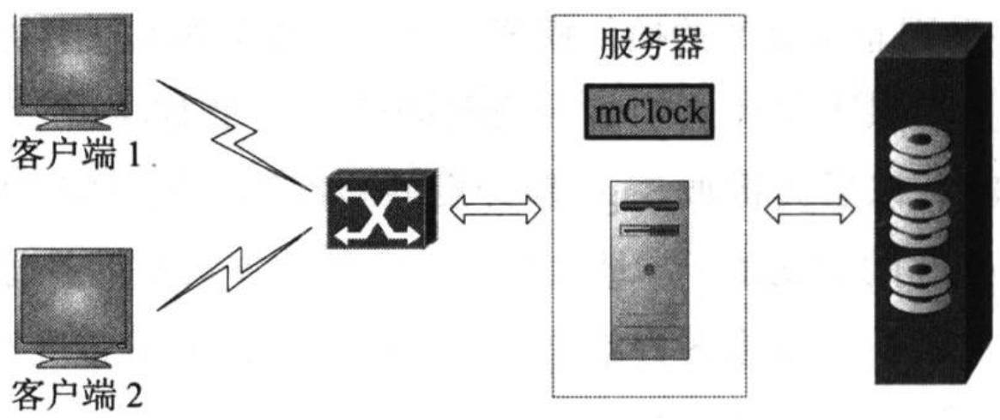


图5-1 mClock典型应用模型


□为每个客户端设置一套QoS模板参数，包括预留（r）、权重（w）和上限（l）三个维度，服务端据此计算出I/O请求预期被处理的时间标签，其中预留和上限标签为绝对时间，权重标签为相对时间。

□服务端分两个阶段来处理I/O请求：一是基于强制的Constraint-based阶段，只处理满足预留时间标签的请求；二是基于权重的Weight-based阶段，处理满足上限时间标签的权重标签请求。

□服务端优先工作于Constraint-based阶段，处理完所有满足预留时间标签的请求后，再转入Weight-based阶段处理权重标签请求。请求在哪个阶段处理，由哪个条件优先满足而定。

这里的时间标签是指某个请求预期被服务端处理的时间戳，如果用 $q_{i}$ 表示 client i 的 QoS 模板值， $Q_{i}^{r}$ 表示来自 client i 的第 $r$ 个请求的时间标签，则其计算公式如下：

$$
\begin{array}{l} Q _ {i} ^ {r} = \max  \left\{Q _ {i} ^ {r - 1} + 1 / q _ {i}, \text {c u r r e n t t i m e} \right\}, \\ q _ {i} \in \left\{r _ {i}, w _ {i}, l _ {i} \right\}, Q _ {i} ^ {r} \in \left\{R _ {i} ^ {r}, W _ {i} ^ {r}, L _ {i} ^ {r} \right\} \\ \end{array}
$$

以第一个请求的到达时间作为初始基准标签，后续标签依据预设的模板参数值，对单位时间进行均匀切分计算而来（以 $1 / r$ ， $1 / w$ ， $1 / l$ 为步长）。以预设预留值100为例，期望服务端1秒内处理100个请求，则时间被切分的粒度为0.01s，即每个请求期望在0.01s之后得到处理。对权重而言情况比较特殊，只有当多个client同时存在时它才有意义，其标签为相对时间值，并不是预期被处理的时间，而是作为与其他client竞争时优先被服务端处理的依据（权重标签较小者被优先处理）。另外，并非所有竞争胜出的权重请求都被处理，而必须满足上限时间标签的限制（上限时间标签小于当前时间）。

由于权重标签是相对时间值的，因而需要对其进行校准。这是由于当有新的 client 加入时，其权重的基准标签与之前的 client 不同，而且之前的 client 运行一段时间后，权重标签的漂移（与真实时间之差）通常会很大，导致新老两类 client 在参与权重竞争时，

根本不在同一起跑线上，从而出现其中一类 client 一直竞争胜出，另一类却长时间得不到权重处理，甚至可能被饿死（如果未设置预留）的情况，一直持续到前者的标签值追上了后者。从 I/O 统计层面来看，会发现有突发性的增大或减小的剧烈波动现象。为解决这个问题，需要调整新老 client 的权重标签（以新 client 的权重时间标签为基准，为老的 client 的权重时间标签都添加一个补偿值，反之亦可）。

此外，mClock工作于动态轮转的两个阶段，并期望请求尽量在Constraint-based阶段被处理（减少竞争）。当一个请求在Weight-based阶段被处理，随后的请求的预留时间标签需要往前调整，减去一个步长 $1 / r$ 值，以填补在Weight-based阶段被处理掉的请求所带来的空缺，调整过程如图5-2所示。

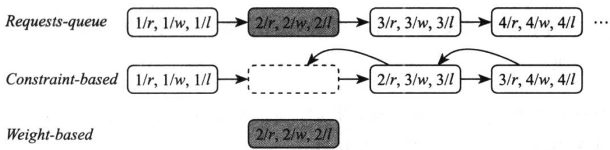


图5-2 时间标签值调整过程


第二个请求在Weight-based阶段被处理后，如不对预留标签进行调整，则第三个请求的原始标签（ $3 / r$ ）将更难以满足预留条件（预留时间标签小于当前时间），极端情况下可能出现请求一直在Weight-based阶段处理，无法达到预留的效果。

# 5.2.2 dmClock

dmClock 是 mClock 算法的分布式版本，两者的基本原理相同。dmClock 在分布式系统的每个服务器上运行一个 mClock 服务端，在客户端记录并调整每个服务器的 I/O 请求负载。每个请求的时间标签计算公式如下：

$$
\begin{array}{l} R _ {i} ^ {r} = \max  \left\{R _ {i} ^ {r - 1} + \rho_ {i} / r _ {i}, \text {c u r r e n t t i m e} \right\} \\ W _ {i} ^ {r} = \max  \left\{W _ {i} ^ {r - 1} + \delta_ {i} / w _ {i}, \text {c u r r e n t t i m e} \right\} \\ L _ {i} ^ {r} = \max  \left\{L _ {i} ^ {r - 1} + \delta_ {i} / l _ {i}, \text {c u r r e n t t i m e} \right\} \\ \end{array}
$$

dmClock与mClock的差别主要体现在以下几个方面：

□分布式系统具有多个服务器，服务器回应每个I/O请求时，返回其在哪个阶段被

处理完成（即Constraint-based阶段或Weight-based阶段）。

□ 客户端记录每个服务器完成的请求个数，在向服务器下发请求时，携带距上次下发请求以来，收到完成的请求个数的增量值，并且是除目标服务器之外，其他服务器完成的请求数之和，分别用 $\rho$ （rho）和 $\delta$ （delta）表示两个阶段的增量个数。

□服务端计算请求的时间标签时，使用 $\rho$ 和 $\delta$ 作为调整因子，不再以 $1 / q$ 均匀递增，而是以其 $n$ 倍增加（即 $n * 1 / q$ ，其中 $n \in \{\rho, \delta\}$ ），因而减少了每个服务器处理的请求个数。

同样以前面的例子来说，当某客户端的预留值设置为100，之前mClock一个服务器1秒内需处理的100个请求，交由dmClock多个服务器共同承担，每个服务器的处理能力可能不同，通过 $\rho$ 和 $\delta$ 调整服务器处理请求的个数，达到整体对外提供每秒完成100个I/O请求的效果。

目前，社区已初步完成了dmClock算法本身的代码实现，并已合入最新的主干分支，后续重点工作是基于此开发系统的QoS特性。

# 5.3 QoS的设计与实现

前面已经提到，由于Ceph架构的特殊性，通常将QoS的实现置于每个OSD中。与之前BTRFS的设计方案的不同之处在于：首先，考虑通用性，将QoS驻留在OSD进程的请求调度部分，而不是在后端本地文件系统中；其次，由于RADOS功能和其实现逻辑越来越复杂，存在大量内部触发的I/O操作，因此QoS功能不仅要处理来自客户端的I/O请求，还需要考虑系统内部I/O操作。

通过上一章的介绍，我们知道每个OSD通过一个称为ShardedOpWQ的工作队列，对来自客户端以及系统内部产生的I/O操作进行管理。这是一个虚拟复合队列，为了提高I/O处理的并发度，它通常包含多个真实的子队列，每个子队列由多个线程处理，子队列的类型、个数以及线程数都可以通过Ceph的配置项进行调整。I/O请求从ShardedOpWQ队列出队之后，通过ObjectStore的接口（为屏蔽不同本地文件系统的差异而封装的统一接口）与磁盘进行交互。OSD的内部结构如图5-3所示。

OSD支持多种不同类型的子队列，目前主要包括优先级队列（prio）和基于权重的优

先级队列（wpq）两种，在Jewel及之前的版本中默认使用pri0队列，从Luminous版本开始默认采用wpq队列。无论采用哪种队列类型，其处理逻辑都是根据不同的I/O类型确定请求出队的时机或概率，与此相关的主要I/O类型如表5-1所示。

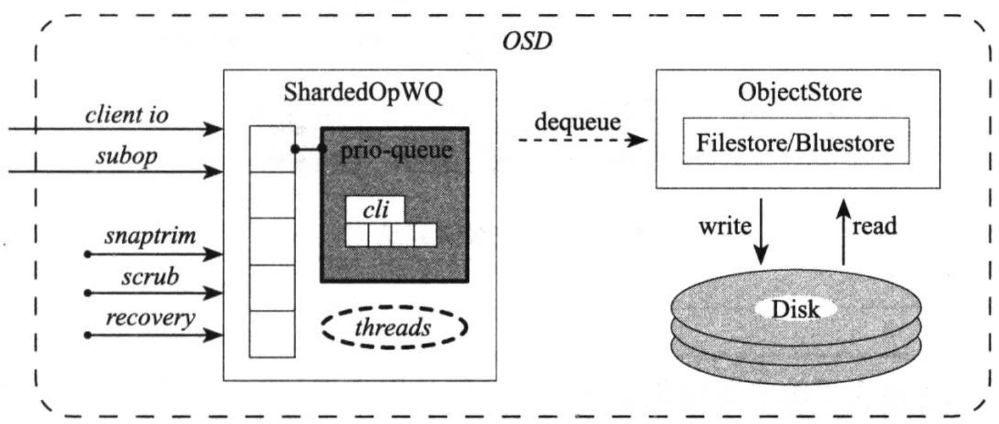


图5-3 OSD内部结构示意图


表 5-1 I/O 操作类型


<table><tr><td>操作类型</td><td>说明</td></tr><tr><td>ClientOp</td><td>来自客户端的读写I/O请求</td></tr><tr><td>SubOp</td><td>OSD之间的I/O请求。主要包括由客户端I/O产生的副本间数据读写请求，以及由数据同步、数据扫描、负载均衡等引起的I/O请求</td></tr><tr><td>SnapTrim</td><td>快照数据删除。从客户端发送快照删除命令后，删除相关元数据便直接返回，之后由后台线程删除真实的快照数据。按快照对象逐个删除，每个snaptrim操作对应多个对象，通过控制snaptrim的速率间接控制快照数据删除速率</td></tr><tr><td>Scrub</td><td>Scrub用于发现对象的静默数据错误，包括只扫描对象元数据的Scrub，及针对对象整体扫描的deep Scrub</td></tr><tr><td>Recovery</td><td>数据恢复和迁移。集群扩容、OSD失效或重新加入、手动进行数据重平衡等操作都有可能触发recovery过程</td></tr></table>

采用dmClock实现系统QoS的关键是在ShardedOpWQ中再派生出一种dmClock队列，下面将分别对原有prio队列、wpq队列以及新增的dmClock队列加以分析。

# 5.3.1 优先级队列（prio）

PrioritizedQueue（简称 prio）是一个基于令牌桶的优先级队列，由三个级别组成：第一级是I/O类型的优先级pri0；第二级是客户端级别的client队列；第三级是真实的list请求队列。每个元素包含请求 $r$ 及请求数据的大小cost，其队列结构如图5-4所示。

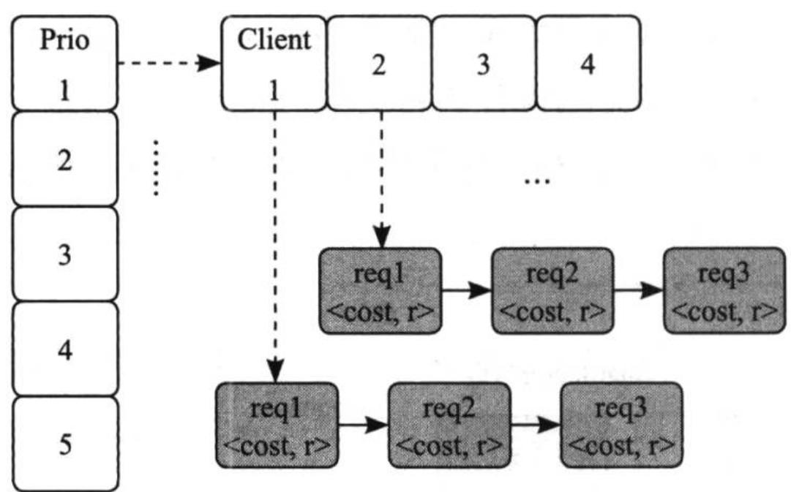


图5-4 优先级队列结构


入队：

每个请求都包含了消息的优先级 prio、归属的客户端 client、请求消息的大小及消息本身的数据等信息，依据以上信息依次逐级入队，最终挂入请求链表 list 尾部。每个 prio 队列，在其第一个请求入队时被创建，并分配一个大小为 max_tokens 的令牌桶。

出队：

依次逐级选择合理的出队元素的过程，出队的策略是整个队列的核心，主要包含以下几点规则：

1）选择合理的 prio：从小到大轮询所有 prio，只要满足条件则被选中。即，该 prio 队列的令牌桶中剩余的令牌数足够多，可以容纳将被选中的请求（每个请求出队时，必须拿到与其大小 cost 相当的令牌个数）。

2）选择合理的 client：对同优先级下的 client 进行轮询，即第一个 client 出队一个请求后，将请求的出队权转交给第二个 client，该优先级再次被选中时，从第二个 client 出队请求。

3）选择合理的请求：从被选中的 client 的请求 list 表中出队一个请求（FIFO 策略）。

当某个优先级prio队列被选中，出队一个请求时，从其令牌桶中拿掉（减去）与请求大小cost相当的令牌个数，随后再将拿掉的令牌数分发、交还至所有prio队列，使令牌总数维持不变。令牌分发的原则是，按各自prio值的占用比重，每个prio队列可回收的令牌个数tokens计算如下：

$$
\text {t o k e n s} = \frac {\text {p r i o}}{\text {t o t a l} \_ \text {p r i o}} \times \text {c o s t}
$$

因而，prio值较大的队列其令牌桶恢复得更快，出队时被选中的概率就越大。根据上述的规则1）可知，prio较小的队列将被优先考虑，从而避免低优先级请求饿死的情况；如果所有prio队列都不满足出队条件，则选择从prio最大的队列出队请求。

I/O类型的优先级可通过配置参数修改，配置项及默认值如表5-2所示。


表 5-2 I/O 请求消息优先级参数


<table><tr><td>优先级配置参数</td><td>默认值</td></tr><tr><td>osd_client_op_priority</td><td>63</td></tr><tr><td>osd_snapshot trimming_priority</td><td>5</td></tr><tr><td>osd_scrub_priority</td><td>5</td></tr><tr><td>osd_recovery_op_priority</td><td>3</td></tr></table>

通过上面的分析，我们得知PrioritizedQueue倾向于优先处理priority较大的请求，这也是其被称为优先级队列的原因。作为ShardedOpWQ长期的默认工作队列，PrioritizedQueue能够满足系统的绝大部分场景，但它也存在一些局限性：比如，社区有人发现当集群中的某个OSD分布了比其他OSD更多的PG或Object对象时，在系统超负荷工作的情况下，该OSD由于需要处理更多的副本请求（副本请求RepOp通常比客户端请求优先级更高），将导致其客户端请求长时间得不到处理，而这又使得其他OSD上的副本请求减少，从而出现该OSD的CPU使用率很高，而其他OSD的CPU使用率较低的不平衡问题。为此，社区引入了一种权重的优先级队列WeightedPriorityQueue，并已被设置为系统的默认配置。

# 5.3.2 权重的优先级队列（wpq）

基于权重的优先级队列与PrioritizedQueue的队列结构类似，同样分为优先级prio、客户端client以及真实的请求list三个级别。除了不需要创建令牌桶之外，其请求的入队方式也与优先级队列相同，不同之处在于请求的出队机制：

1）采用权重概率的方式确定prio级别，每个队列的优先级prio值作为其权重，该prio队列被选中的概率即为其权重在总权重（即total_prio，所有prio队列的权重之和）中所占的比重。通过随机数对total_prio取余的方式（即，rand( $\%$ total_prio）得到在[0, total_prio-1]范围内的完全随机分布，如图5-5所示，随机分布落入prio值较大的区间的概率更大。

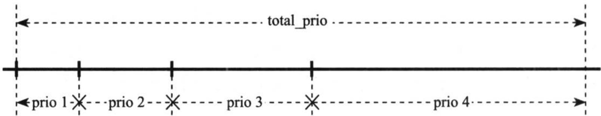


图5-5 权重的优先级概率分布


2）被选中的prio队列并不一定能出队请求，还需要根据将要出队的请求大小来确定，即是否满足如下条件：

rand( $\%$ max_cost $< =$ (max_cost - ((request_size \* 9) / 10)) 

其中，max_cost指该prio队列中最大的请求的大小。由此可知，较小的请求对应不等式右边的值更大，因而出队的概率更高，相反较大的请求出队的概率更低。在不满条件的情况下，则重新进行一轮新的prio队列选择。

3）client级别和真实请求的选择采用与PrioritizedQueue相同的方式，分别为轮询和FIFO策略。

由于wpq基于权重计算的概率选择出队请求，不受系统负荷轻重的影响，不管系统工作在轻负荷（入队速率低于出队速率）、超负荷（入队速率高于出队速率）还是稳定状态，wpq都始终保持一致。这样即使系统工作在超负荷状态，分布了较多PG的OSD中的客户端请求依然能够按照其权重概率及时得到响应。而且，由于较小的请求出队的概率较高，当客户端请求中包含了大量的小请求，将更有利于缓解这种现象。

综上所述，这两种队列都是对不同类型的I/O操作进行调度，但无法满足QoS特性的需求，为了使得OSD能够感知QoS特性，社区开发了dmClock队列。

# 5.3.3 dmClock 队列

dmClock 是一个两级映射队列，第一级为客户端的 client 队列，第二级为真实的请求队列，每个请求包含三个时间标签 $<R_{i}, W_{i}, L_{i}>$ ，其中 $i$ 表示其归属的 client 编号，没有使用优先级 prio，如图 5-6 所示。

由于涉及大量的动态数据处理，所以dmClock采用完全二叉树来组织管理。分别构建预留时间标签、权重时间标签和上限时间标签二叉树，树结点为每个client对应的请求队列，结点在二叉树中的位置，则根据其队首元素（即每个请求队列的第一个元素，

后续所有判断均基于队首元素的时间标签值）的三个时间标签值确定，总体原则是父结点的时间标签小于子结点，二叉树的结构如图5-7所示。

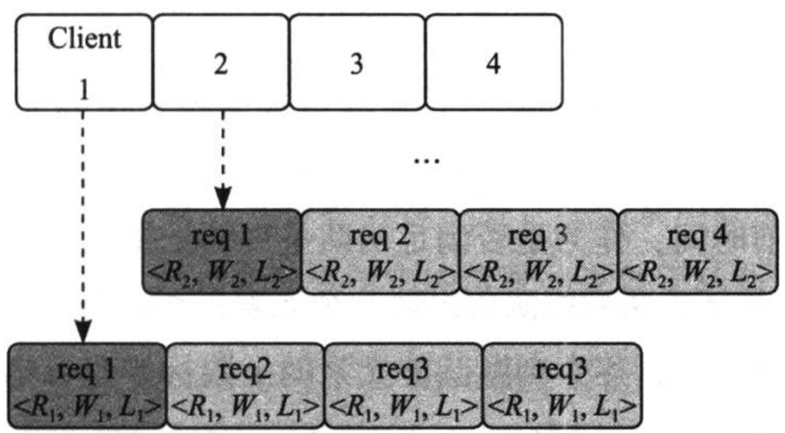


图5-6 dmClock队列结构


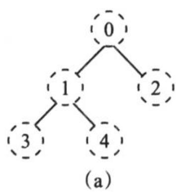


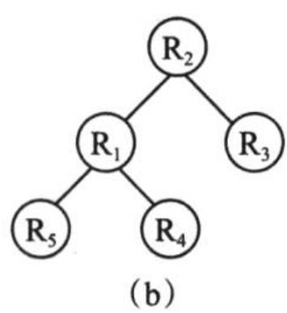


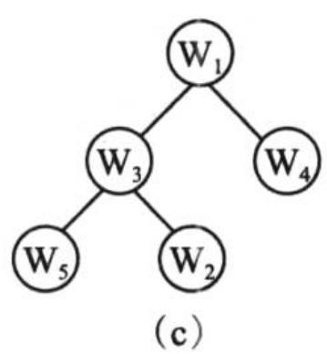


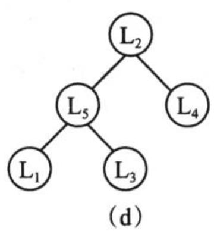


图5-7 时间标签二叉树结构


入队：

对于已存在的 client，将请求直接挂入请求队列的尾部；对于新增 client，除了新创建一个对应的请求队列，将请求入队之外，还需要将队列作为一个新结点加入标签二叉树。根据完全二叉树的特点，采用顺序的变长数组结构存储，新结点先加入二叉树的尾部，再调整至合适的位置，标签二叉树的调整规则如下：

□预留标签二叉树：以结点的队首元素的预留标签为依据，值小的结点调整至树的上层，反之调整至下层，最终根结点的预留标签值最小。

□ 权重标签二叉树：该树的结点中的请求有两种状态，一种满足出队条件，其上限标签小于或等于当前时间，ready标记被置为true；另一种不满足出队条件，ready标记被置为false。对结点位置调整时，根据请求队列队首元素的ready状态，满足出队条件的结点调至上层，不满足出队条件的调至下层；相同状态的结点再由权重标签大小决定，标签值较小的往上调整，反之往下调整。

□上限标签二叉树：用于判决权重二叉树结点中的请求是否满足出队条件，也使用

ready 标记区分。但与权重二叉树不同，ready 标记为 true 的结点往下层调整，反之则往上层调整，ready 相同的结点则依据上限标签值大小决定。

出队：

在 client 队列中选择合理的 client，并从其请求队列中出列元素的过程。首先进入 Constraint-based 阶段，取预留标签二叉树的根结点的请求队列，判断其队首元素的预留标签是否小于等于当前时间，作为是否满足出队条件的依据。如条件满足，则选取该根结点对应的 client，从其请求队列的队首出队一个元素；否则进入 Weight-based 阶段，从上限标签二叉树根结点开始，逐个判断队首元素的上限标签是否小于等于当前时间，并设置满足条件的请求的 ready 标记为 true，以决定其是否可参与随后的权重竞争。所谓的权重竞争，是指对所有满足上限条件的 clients，依据其队首元素的权重标签值，调整自身在权重二叉树中的位置的过程，最终位于根结点的 client 竞争胜出。最后，从竞争胜出者（根结点）的请求队列的队首出队请求。请求出队的流程如图 5-8 所示。

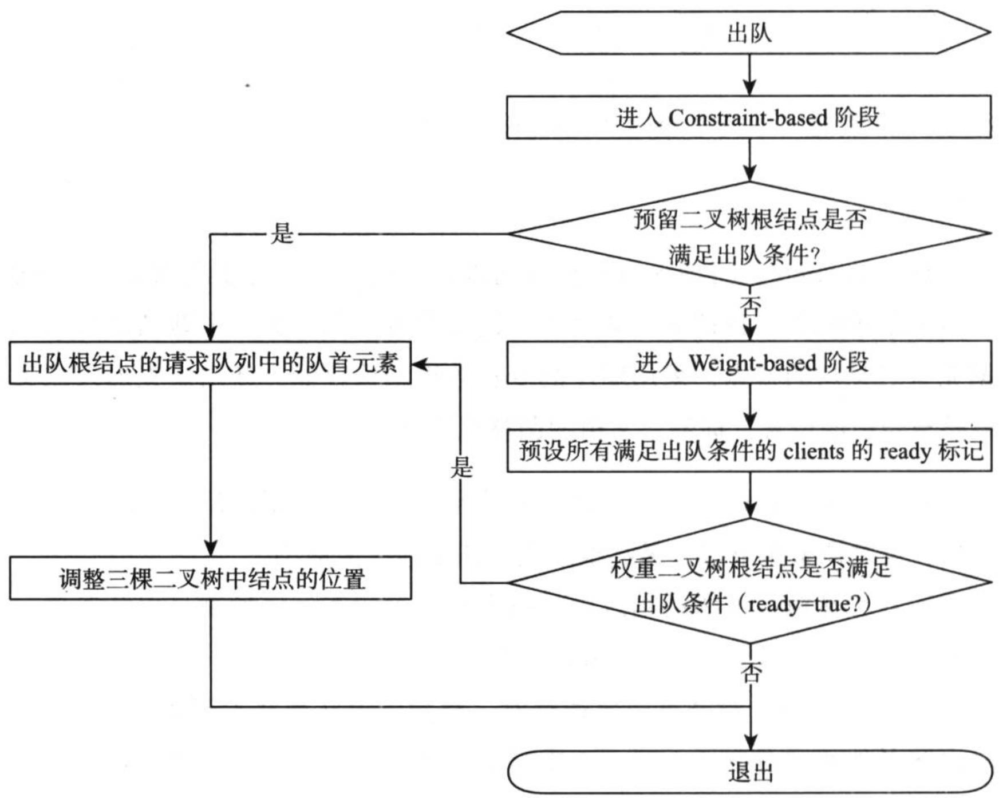


图5-8 请求出队流程


三棵标签二叉树的结点不是孤立的，而是指向同一个client队列。任何一个client

出队一个请求后，由于队首元素改变导致时间标签发生变化，都可能影响其在所有二叉树中的位置。因而，从根结点出队一个请求后，除了调整其在当前二叉树中的位置，还需同步调整对应结点在其他两棵树中的位置。位置调整包括两个方向：一个是上移（sift up），即以冒泡的方式，逐层往上尽量移动至根节点位置；一个是下移（sift down），选择较小的子结点，逐层往下尽量移动至最底层位置。每个新结点在加入三棵二叉树时，都是先加入树的尾部，再通过上移方式分别调整位置；在请求出队的过程中，通过上移和下移方式调整至合适的位置，结点在三棵树中的位置一直处于动态调整状态。

以某个系统中存在5个clients为例，当clients在某个相近时间内发送大量请求，即假设clients的基准时间标签 $T_{i}$ 都大致相同（为方便计算忽略其时间差）。用 $[r, w, l]$ 的形式表示一套QoS模板，每个client请求队列中有3个请求，那么每个请求的时间标签值可以根据： $T_{i} + n^{*}1 / Q_{i}$ （其中， $n = 1,2,3$ ）公式计算出来，由此得出的时间标签与 $T_{i}$ 的差值如表5-3所示。


表 5-3 clients 请求时间标签差值


<table><tr><td>clients</td><td>QoS 模板</td><td colspan="3">Req 1</td><td colspan="3">Req 2</td><td colspan="3">Req 3</td></tr><tr><td>1</td><td>[10,5,20]</td><td>0.1,</td><td>0.2,</td><td>0.05</td><td>0.2,</td><td>0.4,</td><td>0.1</td><td>0.3,</td><td>0.6,</td><td>0.15</td></tr><tr><td>2</td><td>[20,1,60]</td><td>0.05,</td><td>1.0,</td><td>0.017</td><td>0.1,</td><td>2.0,</td><td>0.034</td><td>0.15,</td><td>3.0,</td><td>0.051</td></tr><tr><td>3</td><td>[40,2,50]</td><td>0.025,</td><td>0.5,</td><td>0.02</td><td>0.05,</td><td>1,</td><td>0.04</td><td>0.075,</td><td>1.5,</td><td>0.06</td></tr><tr><td>4</td><td>[30,4,40]</td><td>0.033,</td><td>0.25,</td><td>0.025</td><td>0.066,</td><td>0.5,</td><td>0.05</td><td>0.099,</td><td>0.75,</td><td>0.075</td></tr><tr><td>5</td><td>[50,3,90]</td><td>0.02,</td><td>0.33,</td><td>0.011</td><td>0.04,</td><td>0.66,</td><td>0.022</td><td>0.06,</td><td>0.99,</td><td>0.033</td></tr></table>

以预留时间标签为例（ $R_{i}$ 表示来自 $\mathrm{client}_{i}$ 的首个请求的预留标签），二叉树的生成过程如图5-9所示。如图5-9中 $(\mathbf{a})\rightarrow (\mathbf{b})\rightarrow (\mathbf{c})\rightarrow (\mathbf{d})$ 的过程，新结点（图中使用虚线框表示）都从树的尾部尝试上移，最后时间标签较小的 $R_{3}$ 调整至根结点位置；继续加入新结点如图5-9中 $(\mathbf{e})\rightarrow (\mathbf{f})\rightarrow (\mathbf{g})$ 的过程，时间标签值最小的新结点 $R_{5}$ ，加入后经过连续两次上移，最终调整至最顶层根结点位置，从而形成了一颗按时间标签值排序的二叉树。权重标签及上限标签二叉树生成过程类似，最终都达到一个初始状态，如图5-10中(a1)、(b1)及(c1)所示。

Clients 后续的请求直接挂入队列尾部，不会改变标签二叉树的状态，直到有请求出队。使用 $Q_{i}^{j}$ 表示来自 client 的第 $j$ 个请求的时间标签（其中， $Q \in \{R, W, L\}$ ）。假设某时刻 $T_{i} + 0.021s$ 需要出队一个请求，根据请求出队的流程将首先进入 Constraint-based 阶段，如图 5-10 所示。

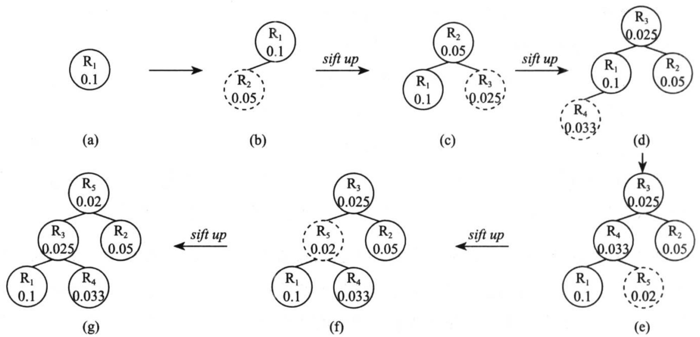


图5-9 预留标签二叉树生成过程


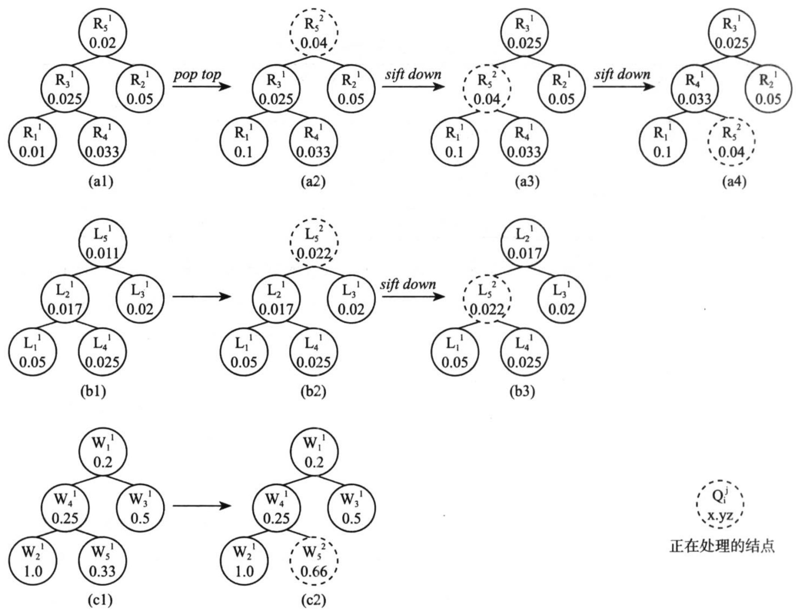


图5-10 Constraint-based阶段请求出队过程


图5-10中 $(\mathrm{a}1)\rightarrow (\mathrm{a}2)\rightarrow (\mathrm{a}3)\rightarrow (\mathrm{a}4)$ 表示预留标签二叉树的状态变化，图5-10中 $(\mathrm{b}1)\to (\mathrm{b}2)\to (\mathrm{b}3)$ 及图5-10中 $(c1)\rightarrow (c2)$ 分别表示出队一个请求对上限和权重标签二叉树带来的影响。首先，初始状态图(a1)的根结点满足出队条件（即 $T_{i} + 0.02 < T_{i}+$ 0.021），出队其队首请求；随后client5的第2个请求成为队首元素，相应三棵二叉树中的时间标签都发生了变化，从而结点的位置可能需要调整，如图5-10中(a2)、(b2)及(c2)所示。在预留标签二叉树中，对应图5-10中 $(\mathrm{a}2)\rightarrow (\mathrm{a}3)\rightarrow (\mathrm{a}4)$ 的变化，根节点被调整至最底层，同时client3被调至根结点位置；上限标签二叉树如图中 $(\mathrm{b}2)\rightarrow (\mathrm{b}3),L_5^2$ 从根结点下移至合适位置；对于权重标签二叉树，其结点本身已在最底层，则无需再调整。

假设下一时刻 $T_{i} + 0.022\mathrm{s}$ 需再次出队一个请求，此时预留标签二叉树的根结点不满足出队条件（ $R_3^I = T_i + 0.025\mathrm{s}$ ），则进入Weight-based阶段。首先，根据上限标签二叉树查找出所有满足出队条件的clients，设置其ready标记为true，如图5-11中(a1)→(a2)→(a3)→(a4)所示；然后在权重标签二叉树中将其上移调整，并在调整完成后得到可优先出队请求的client3，如图5-11中(b1)→(b2)→(b3)→(b4)所示。

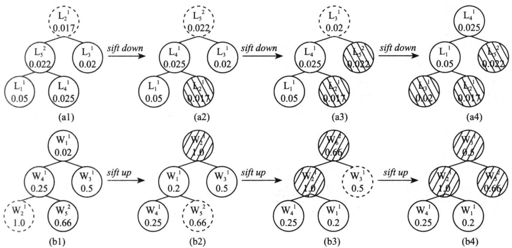


图5-11 权重标签二叉树调整过程


如图5-11中 $(\mathrm{a}1)\rightarrow (\mathrm{a}2)\rightarrow (\mathrm{a}3)\rightarrow (\mathrm{a}4)$ 的查找过程，每次从根结点进行判决，满足条件则标记其队首请求ready为true，并下移至底层不再参与判决。根结点的下移调整，促使时间标签次小的结点成为新的根结点，循环逐个判决直至不满足条件为止。每个在上限二叉树中满足条件的结点，对应在权重二叉树中的结点的位置都需同步调整，如图5-11中 $(\mathrm{b}1)\rightarrow (\mathrm{b}2)\rightarrow (\mathrm{b}3)\rightarrow (\mathrm{b}4)$ 所示，最终所有被标记为true的结点都上移至上层。

通过以上调整后，便可从权重标签二叉树根结点中出队元素，此处为 client 3 的第 1 个请求。整个出队过程及树的状态变化如图 5-12 所示：图 5-12 中 $(a1) \rightarrow (a2) \rightarrow (a3)$ 的过程表明，client 3 的队首请求出队后，第 2 个请求便成为队首元素，但其 ready 为默认的 false，不满足出队条件，因而需对该结点进行下移调整；同样，其对应在上限标签二叉树中的结点需要进行上移调整，重新参与后面的出队条件判决，如图 5-12 中 $(b1) \rightarrow (b2) \rightarrow (b3)$ 所示。在 Weight-based 阶段出队一个请求，也会对预留标签二叉树产生影响，如图 5-12 中 $(c1) \rightarrow (c2) \rightarrow (c3)$ 所示， $R_3^2$ 被调整至最底层，而且这个调整会产生副作用，体现在 client 3 的请求更难以满足 Constraint-based 阶段的出队条件，影响预留功能。为消除在 Weight-based 阶段出队该请求所带来的影响，需将 client 3 后续的请求的预留标签减去（reduce）一个时间间隔 $I / R3$ ，并调整该结点至适当的位置，如图 5-12 中 $(c3) \rightarrow (c4)$ 所示。注意，此时图 5-12 中 $(c4)$ 中 client 3 的预留时间标签依然是 0.025（即 $R_3^2$ ），与调整之前图 5-12 中 $(c1)$ 的预留时间标签 $R_3^1$ 相等，这便是此次调整需要达到的目标。

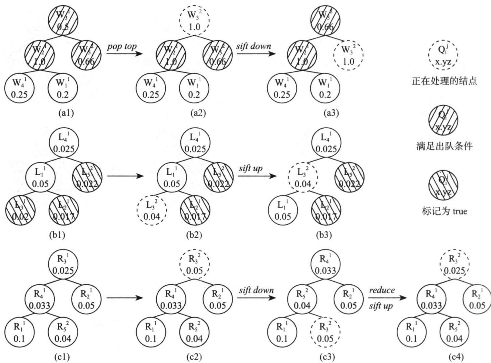


图5-12 Weight-based阶段请求出队过程


# 5.3.4 Client的设计

目前社区正在收集来自客户的应用场景和需求，OSD侧的实现不会有太大的变化，尚未明确的是客户端client的设计方案，主要有以下三种初步的方案：

1）使用mClock作为一种分配调度策略，控制客户端的I/O请求和Ceph内部产生的I/O操作之间的优先次序。

2）使用dmClock以存储池或者卷为粒度，为其设置QoS模板参数。

3）使用dmClock为每个真实客户端设置一套QoS模板。

三者的区别在于对 client 的定义不同，第一种将所有不同真实客户端作为同一个抽象的 client，内部的每一类 I/O 操作分别作为一个 client，重点考虑各类不同 I/O 之间的资源平衡分配；第二种则将每个存储池或存储池中的卷（或称为 image）作为一个 client；第三种将每个真实的客户端作为一个 client。前两种方案社区正在着手考虑和实现，对于第一种方案，每一类 I/O 操作对应一种 client，为每类 I/O 设置一套 QoS 模板，如表 5-4 所示。


表 5-4 QoS 模板配置参数


<table><tr><td>QoS 模板配置参数</td><td>默认值</td><td>QoS 模板配置参数</td><td>默认值</td></tr><tr><td>osd_op_queue_mclock_client_op_res</td><td>1000.0</td><td>osd_op_queue_mclock_snapshot_lim</td><td>0.001</td></tr><tr><td>osd_op_queue_mclock_client_op_wgt</td><td>500.0</td><td>osd_op_queue_mclock_recovery_res</td><td>0.0</td></tr><tr><td>osd_op_queue_mclock_client_op_lim</td><td>0.0</td><td>osd_op_queue_mclock_recovery_wgt</td><td>1.0</td></tr><tr><td>osd_op_queue_mclock_osd_subop_res</td><td>1000.0</td><td>osd_op_queue_mclock_recovery_lim</td><td>0.001</td></tr><tr><td>osd_op_queue_mclock_osd_subop_wgt</td><td>500.0</td><td>osd_op_queue_mclock_scrub_res</td><td>0.0</td></tr><tr><td>osd_op_queue_mclock_osd_subop_lim</td><td>0.0</td><td>osd_op_queue_mclock_scrub_wgt</td><td>1.0</td></tr><tr><td>osd_op_queue_mclock_snapshot_res</td><td>0.0</td><td>osd_op_queue_mclock_scrub_lim</td><td>0.001</td></tr><tr><td>osd_op_queue_mclock_snapshot_wgt</td><td>1.0</td><td></td><td></td></tr></table>


注：该功能目前还处于开发阶段，以上默认值并不是最优配置。


该方案的 Client 和服务端都驻留在 OSD 中，在投递每类 I/O 操作的请求时，根据不同类型设置每个请求的 QoS 模板值。由于所有的真实客户端都作为同一类 client，多个客户端同时进行 I/O 访问时，无法区分它们之间的优先次序。

第二种方案主要考虑以存储池或卷作为客户端，这类客户端I/O请求以消息的方式发送至OSD，消息通过信使Messenger对象收发，根据消息的不同类型，Messenger有

两种处理方式：

□紧急消息通过快速派发的方式，直接发送至目标对象：比如来自客户端的读写请求、来自其他OSD的副本操作等。

□普通消息使用一定的策略（优先级、FIFO队列等）统一分发：比如客户端的状态查询命令、来自其他OSD的心跳检测等。

客户端的I/O请求属于前者，从Messenger接收后以快速派发的方式进入Sharded-OpWQ队列。Ceph的客户端大都是通过RadosClient与集群进行通信，一种可能的实现是将dmClock-client放在RadosClient中，这样在实现RBD块存储QoS的同时，也考虑以后对RGW和CephFS的兼容。设计框架如图5-13所示。

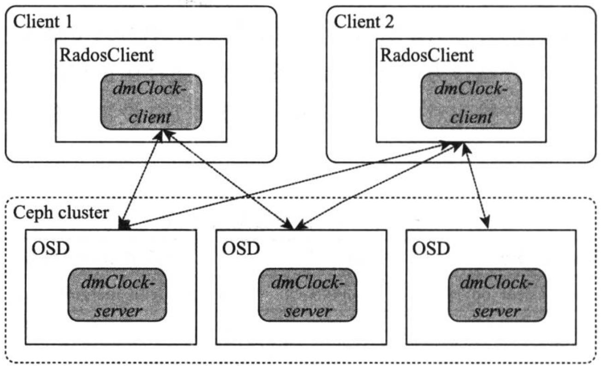


图5-13 dmClock设计框架图


这种实现方式将 QoS 模板参数值携带在每个下发的请求消息中，在随后请求完成的回应消息中，将请求在哪个阶段被处理的信息返回给 client。

# 5.4 总结与展望

分布式系统的 QoS 是一个复杂的功能，社区为此前后投入了一年多时间，目前主要实现了 dmClock 的服务端部分。这部分作为 ShardedOpWQ 队列的一个子队列，虽然已经具备了基本的 I/O 调度功能，但是作为平衡后端 I/O 资源的调度策略，特别是作为一个完备的 QoS 功能，则还有大量工作要做，可能的改进方向包括以下几个方面：

# 1. 合理模板参数的设置

如何设置合理的 QoS 模板值，使得客户端能满足实际的应用场景需求，并且系统的 I/O 资源利用率达到最高，或者内部各类 I/O 操作之间达到平衡和最优状态，这些都是后续需要重点考虑的问题。对于预留这个维度，需要保证所有 client 设置的预留之和处于系统的 I/O 处理能力之内，所以需要预先对系统的处理能力进行评估，对每个 client 的预留值进行合理的规划，并要考虑后续增加 client 时对预留的影响。另外，与传统的分布式系统不同，Ceph 是一个基于计算的分布式存储系统，不存在集中的控制点，这对于我们期望通过权重控制来解决多个客户端对 I/O 资源的占用比重问题是一个不利的影响。由于 Ceph 客户端的 I/O 请求直接与 OSD 通信，在极端情况下，当两个客户端分别与不同的 OSD 通信时，它们的权重起不到什么作用。社区已有相关的研究表明，当 OSD 的负荷不足时（指请求入队速率低于出队处理速率），不同权重的客户端的 IOPS 大致相等，处于平分系统 I/O 资源的状态；只有当客户端请求足够分散，请求压力足够大，使得集群所有的 OSD 都达到超负荷时（即请求入队速率高于出队速率），权重的效果才能体现出来。这是由于负荷不足时，可认为客户端的请求都已经得到了及时的处理，不需要在队列中排队进行权重竞争；而超负荷时请求都随机分布到了所有 OSD 中，每个 OSD 都通过权重分配 I/O 资源，从而整体上能够达到预设的权重效果。

# 2. I/O带宽的限制

目前QoS功能主要从IOPS的角度设计，没有直接对I/O带宽进行限制。系统的IOPS通常以小块数据（典型的如4KB）来评估，而实际I/O操作的数据块大小不定，dmClock将大块数据的I/O操作转化为以小块为单位的I/O操作，以间接的方式来限制I/O带宽，但这种方式对I/O带宽的控制不太准确。

# 3.突发I/O的处理

在原始的dmClock算法当中，考虑了对突发I/O的处理。这里的突发I/O是指某个客户端突然有很高的IOPS需求，即短时间内下发了很多I/O请求的情况。如果按照不考虑突发I/O情况的处理逻辑，由于客户端的QoS模板没有改变，系统依然以自己的节奏处理这些I/O请求，感知不到客户端的紧迫需求。为此，dmClock的做法是为每个client预先设置一个可调整的参数 $\sigma$ （sigma），当出现突发I/O的情况时，减少该client的权重

时间标签值（调整其基准标签至 $t - \sigma_i / w_i$ ），从而让其在权重竞争时更具优势，这样在不影响预留的情况下，可以短时间内在 Weight-based 阶段响应该 client 的大量 I/O 请求，从而及时处理突发情况。但这里存在一个问题，即服务端如何判断客户端出现了突发 I/O 访问？目前的做法比较简单，当一个客户端一段时间未产生 I/O 请求，则把它的状态置为空闲状态，再次有 I/O 请求到来时变为活跃状态，服务端记录了客户端的状态，当检测到客户端状态从空闲变为活跃时，则认为客户端将出现突发 I/O 访问。然而不幸的是，这仅仅是突发 I/O 可能出现的其中一种情况。

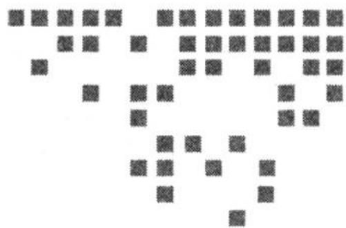


第6章


Chapter 6 

# 无心插柳

# ——分布式块存储RBD

自2007年SageA.Weil正式发布Ceph以来，Ceph实际上已经存在并发展了超过10年时间。Ceph在设计之初被定位为一个纯粹的分布式文件系统（CephFS)，但随着虚拟化逐渐成为信息时代的主旋律和以OpenStack为代表的云计算技术闪电崛起，社区果断调整重心，开始着力发展新型分布式块存储服务组件——RBD（RADOSBlockDevice），并使其逐渐成长为OpenStack等IaaS云计算环境中虚机、镜像、云盘等服务不可或缺的块设备存储后端。可以说，Ceph能够在为数众多的同类软件竞争中脱颖而出，并逐渐成长为最炙手可热的分布式统一存储系统，很大程度上得益于收获了OpenStack的青睐，而RBD取代CephFS伴随OpenStack先一步进入公众视野则是意料之外、情理之中。

本章主要对RBD的存储组织形式以及包括快照和克隆在内的两个关键功能特性进行解读。

# 6.1 RBD架构

RBD是Ceph对外的三大存储服务组件之一，也是当前Ceph最稳定、应用最广泛的存储接口。上层应用访问RBD块设备有两种途径：librbd和krbd。其中librbd是一个基于 librados的用户态接口库（支持 $\mathrm{C / C + + }$ 接口以及Python等高级语言的绑定），而krbd是集成在GNU/Linux内核中的一个内核模块，通过用户态的rbd命令行工具，可以将

RBD块设备映射为本地的一个块设备文件。RBD的架构如图6-1所示。

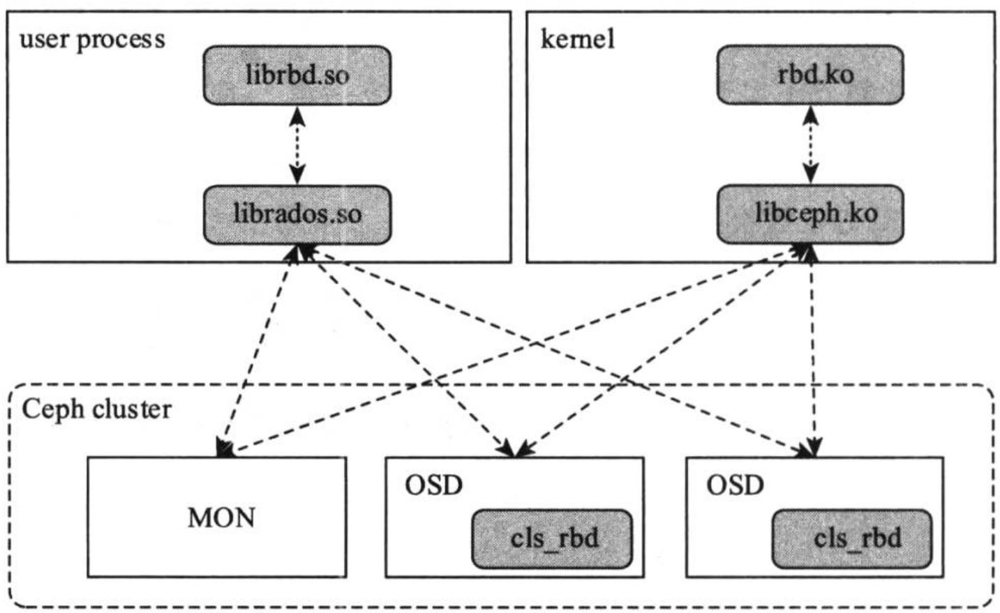


图6-1 RBD架构


从图6-1可以看到，RBD的架构与Ceph另外两大存储服务组件RGW和CephFS的架构有很大不同，RBD块设备由于元数据信息非常少，且访问不频繁，因此RBD在Ceph集群中不需要daemon守护进程将元数据加载到内存进行元数据访问加速，所有的元数据和数据操作直接与集群中的MON服务和OSD服务交互。

# 6.2 存储组织

RBD块设备在Ceph中被称为image。image由元数据和数据两部分组成，其中元数据存储在多个特殊的RADOS对象中，而数据被自动条带化成多个RADOS对象进行存储。除了image自身的元数据之外，在image所属的存储池中都还有一组特殊的RADOS对象记录image关联关系或附加信息等相关的RBD管理元数据。所有的数据对象和元数据对象都依据CRUSH规则存储在底层的OSD设备上，因此RBD块设备自动继承了RADOS对象的数据冗余保护机制和一致性策略。RBD内部各RADOS对象之间的关系如图6-2所示。

RBD支持两种格式的image，其中v1格式由于支持的功能特性极少且难于扩展，当前基本处于待废弃状态，因此图中的对象特指v2格式的image，后文对image的解读也仅针对v2格式。

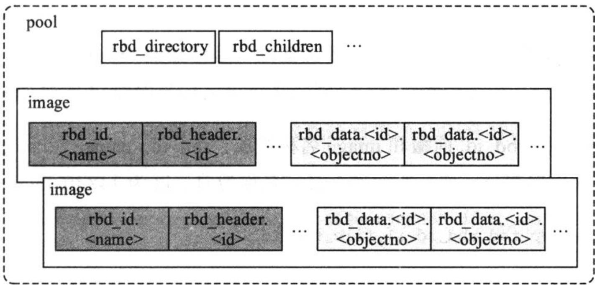


图6-2RBDRADOS对象关系


# 6.2.1 元数据

RBD中的元数据在RADOS对象中有三种存储方式：第一种将元数据编码后以二进制文件的形式存储在RADOS对象的数据部分，后面将该类型标示为data；第二种将元数据以键值对的形式存储在RADOS对象的扩展属性中，后面将该类型标示为xattr；第三种将元数据以键值对的形式存储在RADOS对象omap中，后面将该类型标示为omap。

根据RBD所支持或启用的功能特性的改变，RBD用于存储元数据的RADOS对象会有所增减，而所存储的元数据信息也会有所变化。下面将对image元数据和RBD管理元数据两类元数据分别进行介绍。

# 1. image 元数据对象

image需要一些核心的元数据对象用于保存自身的容量、条带参数、快照等基本信息，在此基础上，新的功能特性的加入可能会新增一些元数据对象，比如为了支持object-map特性会增加rbd_object_map对象。当前image的三个关键元数据对象如表6-1所示。


表 6-1 image 元数据对象


<table><tr><td>RADOS 对象名</td><td>元数据类型</td><td>备注</td></tr><tr><td>rbd_id.&lt;name&gt;</td><td>data</td><td>记录 image 名称到 image id 的单向映射关系</td></tr><tr><td>rbd_header.&lt;id&gt;</td><td>omap/xattr</td><td>记录 image 所支持的功能特性、容量大小等基本信息以及配置参数、自定义元数据、锁信息等</td></tr><tr><td>rbd_object_map.&lt;id&gt;</td><td>data</td><td>记录组成 image 的所有数据对象的存在状态</td></tr></table>

# (1) rbd_id

image 内部元数据和数据的名称以 id 为基础，这样即使 image 重命名，内部的结构也基本不用发生改变。image 通过 rbd_id 对象来记录名称与内部 id 的映射关系。

rbd_id对象名由rbd_id.前缀和image名称组成：rbd_id.<name>，image id信息保存在rbd_id对象的数据部分，如下所示的image名称为i1，id为148df643c9869：

```txt
-rados get -p rbd rbd_id.i1 file_rbd_id  
-r# cat file_rbd_id  
148df643c9869 
```

对该 image 改名为 i1_new 后，id 仍然保持不变：

```txt
-rados get -p rbd rbd_id.i1_new file_rbd_id  
-r# cat file_rbd_id  
148df643c9869 
```

# (2) rbd_header

rbd_header对象是image最主要的元数据对象，除了记录容量大小等基本信息之外，为单个image配置的参数、用户自定义的元数据以及为了支持image互斥访问所记录的锁信息等也都记录在该对象中，如表6-2所示。

rbd_header对象名由rbd_header.前缀和image id组成：rbd_header.<id>，其中<id>是rbd_id对象所记录的内部id。


表 6-2 rbd_header 元数据记录


<table><tr><td>key</td><td>type</td><td>备注</td></tr><tr><td>data_pool_id</td><td>omap</td><td>指定将数据对象存储在与元数据对象不同的存储池</td></tr><tr><td>features</td><td>data</td><td>已启用的功能特性</td></tr><tr><td>object_prefix</td><td>omap</td><td>数据对象名称前缀</td></tr><tr><td>order</td><td>omap</td><td>组成 image 的数据对象容量大小，以2为底的指数</td></tr><tr><td>parent</td><td>omap</td><td>当存在克隆关系时，克隆image记录的关联的父image快照信息</td></tr><tr><td>size</td><td>omap</td><td>容量大小</td></tr><tr><td>snap_seq</td><td>omap</td><td>最近一次创建的快照的快照id</td></tr><tr><td>snapshot&lt;snap_id&gt;</td><td>omap</td><td>id为snap_id的快照的基本信息</td></tr><tr><td>stripe_count</td><td>omap</td><td>条带宽度，数据对象间进行条带化的参数</td></tr><tr><td>stripe_unit</td><td>omap</td><td>条带大小，数据对象间进行条带化的参数</td></tr><tr><td>lock.rbd_lock</td><td>xattr</td><td>控制image互斥访问的锁信息</td></tr></table>

data_pool_id所记录的元数据是一个64位的整型数据，用于记录数据对象所属的存

储池，通常情况下 image 的数据和元数据存储在同一个存储池下，此时 rbd_header 对象中不存在 data_pool_id 元数据记录。由于当前 EC 纠删码存储池不支持 omap，为了解决 RBD 支持 EC 纠删码存储的问题，必须将数据对象和元数据对象进行分离存储，因此需要一个独立的 data_pool_id 元数据用于记录数据对象所在的存储池。如下所示 image 的数据存储使用的是 id 为 1 的存储池：

```txt
-rados getomapval -p rbd rbd_header.1489e643c9869 data_pool_id value (8 bytes) : 00000000 01 00 00 00 00 00 00 00 /............/ 00000008 
```

features所记录的元数据是一个64位的整型数据，用于记录image已启用的功能特性。每个特性占用整型中的一位，如表6-3所示。


表 6-3 image 特性


<table><tr><td>特性</td><td>bit 位</td><td>备注</td></tr><tr><td>layering</td><td>1 &lt;&lt; 0</td><td>是否支持 image 克隆操作，克隆 image 与关联的父 image 快照之间通过 COW 实现数据共享</td></tr><tr><td>striping</td><td>1 &lt;&lt; 1</td><td>是否进行数据对象间的数据条带化，类似于 RAID 0，在创建 image 时如果指定了条带化参数，数据会在多个 image 数据对象之间进行条带化</td></tr><tr><td>exclusive-lock</td><td>1 &lt;&lt; 2</td><td>是否支持分布式锁，即 image 自带互斥访问锁机制以限制同时只能有一个客户端访问image，主要应用于虚机的热迁移</td></tr><tr><td>object-map</td><td>1 &lt;&lt; 3</td><td>是否记录组成 image 的数据对象存在状态位图，通过查表加速类似于导入、导出、克隆分离、已使用容量计算等操作，同时有助于减小 COW 机制带来的克隆 image 的 I/O时延，依赖于 exclusive-lock 特性</td></tr><tr><td>fast-diff</td><td>1 &lt;&lt; 4</td><td>用于计算快照间增量数据等操作加速，依赖于 object-map 特性</td></tr><tr><td>deep-flatten</td><td>1 &lt;&lt; 5</td><td>克隆分离时是否同时解除克隆 image 创建的快照与父 image 之间的关联关系。该特性只是为了阻止老的 RBD 客户端访问 image 而设置，从 Ceph I 版本开始 librbd 的内部克隆分离实现已经不区分是否启用该特性</td></tr><tr><td>journaling</td><td>1 &lt;&lt; 6</td><td>是否记录 image 修改操作到日志对象，用于远程异步镜像功能，依赖于 exclusive-lock特性</td></tr><tr><td>data-pool</td><td>1 &lt;&lt; 7</td><td>是否将数据对象存储于与元数据不同的存储池，用于支持将 image 的数据对象存储于EC 纠删码存储池</td></tr></table>

从 Ceph J 版本开始，使用默认参数创建的 image 默认开启 layering、exclusive-lock、object-map、fast-diff、deep-flatten 等五个特性，该默认值可通过 rbd_default_features 参数进行控制。

如下所示，image的特性为0xbd，对应的二进制表示为b1011101，表示该image启用了data-pool、deep-flatten、fast-diff、object-map、exclusive-lock、layering这6个特性：

```txt
-rados getomapval -p rbd rbd_header.1489e643c9869 features value (8 bytes) : 00000000 bd 00 00 00 00 00 00 00 1 
```

object_prefix 所记录的元数据是一个字符串，组成该 image 的所有数据对象都以该元数据所记录的字符串作为前缀命名。当组成 image 的数据对象存储在与元数据对象相同的存储池时，也即未启用 data-pool 功能特性的情况下，该字符串前缀由 rbd_data. 前缀和 image_id 组成：rbd_data.<id>。如下所示 image 的数据对象前缀为 rbd_data.148df643c9869（前面的 4 个字节表示该字符串的长度为 0x16）：

```html
-rados getomapval -p rbd rbd_header.148df643c9869 object_prefix value (26 bytes) : 00000000 16 00 00 00 72 62 64 5f 64 61 74 61 2e 31 34 38 |...rbd_data.148/ 00000010 64 66 36 34 33 63 39 38 36 39 |df643c9869/ 0000001a 
```

当image启用了data-pool特性时，object_prefix前缀的组成会加上元数据对象所在的存储池id：rbd_data.<pool_id>.<id>。如下所示，image的数据对象和元数据对象存储在不同的存储池中，且元数据对象所在的存储池id为0：

```txt
~# rados getomapval -p rbd rbd_header.ac812ae8944a object_prefix  
value (27 bytes) :  
00000000 17 00 00 00 72 62 64 5f 64 61 74 61 2e 30 2e 61 |...rbd_data.0.a/  
00000010 63 38 31 32 61 65 38 39 34 34 61 |c812ae8944a/  
0000001b 
```

order所记录的元数据是一个8位的整型数据，用于计算数据对象的容量大小，这是一个以2为底的指数。使用librbd API创建image时可以指定order的值，order的默认值为22，也就是说默认的数据对象大小为4MB。如下所示，image的order值为0x16，用十进制表示就是22，因此该image的数据对象大小使用的是默认值：

```txt
~# rados getomapval -p rbd rbd_header.148df643c9869 order value (1 bytes):
00000000 16
00000001 
```

当使用rbd命令行创建image时可以使用order或object-size指定数据对象的大小，如果同时指定这两个参数，则order具有更高优先级。如以下代码片段所示，object-size参数指定的数据对象大小会通过取对数然后四舍五入得到order值，最终的数据对象大小仍然由 $1 << \text{order}$ 计算得到：

order $=$ std::round(std::log2(object_size)); 

parent所记录的元数据是一个cls_rbd_parent结构体的实例，只有从快照克隆出来的image才有该元数据记录，用于记录克隆image所关联的父image的快照信息。一旦对克隆image进行克隆分离，由于解除了父子关系，该元数据记录会被清除。如下所示即是一个克隆image所关联的快照信息，该父image快照所属的存储池id为0，image id为ac8c2ae8944a，快照id为4：

```txt
~# rados getomapval -p rbd rbd_header.acb63d1b58ba parent file_parent Writing to file_parent   
\~# ceph-dencoder type cls_rbd_parent import file_parent decode dump_json   
{ "pool":0, "id":"ac8c2ae8944a", "snapid":4, "overlap":1073741824 
```

cls_rbd_parent中的overlap字段表示克隆image能够读取的父image快照数据区间，该值只能单调变小，初始值为克隆image的初始容量大小，也就是关联的父image快照的大小。对克隆image执行resize操作，当容量缩小时，overlap值会相应的调整为克隆image调整后的容量大小，当容量扩大时overlap值维持不变。如下所示，对上面的1GB大小的克隆image调整为512MB之后overlap相应的调整为536870912，即512MB：

```jsonl
~# ceph-dencoder type cls_rbd_parent import file_parent decode dump_json  
{ "pool": 0, "id": "ac8c2ae8944a", "snapid": 4, "overlap": 536870912} 
```

size所记录的元数据是一个64位的整型数据，用于记录image的容量大小。如下所示，image的容量为 $0\mathrm{x}40000000$ ，也就是1GB：

```txt
~# rados getomapval -p rbd rbd_header.148f3238e1f29 size  
value (8 bytes) :  
00000000 00 00 00 40 00 00 00 00  
00000008 
```

snap_seq所记录的元数据是一个64位的整型数据，用于记录image最后一次创建的快照的快照id，没有创建任何快照的image该字段为默认值0，该id通过向Monitor注册得

到，在单个存储池范围内单调递增。如下所示 image 最后一次创建的快照 id 为 $0 \times 28$ ：

```txt
~# rados getomapval -p rbd rbd_header.148f074b0dc51 snap_seq value (8 bytes) : 00000000 28 00 00 00 00 00 00 00 1(......) 00000008 
```

snapshot_<snap_id>所记录的元数据是一个cls_rbd_snapshot结构体的实例，用于记录快照的名称、id等基本信息，每创建一个快照都会增加一个这样的元数据记录。与image id类似，快照id也是内部维护的信息，用以支持快照重命名，例如前面cls_rbd_parent结构体记录的快照信息就是通过快照id进行引用。如下所示image创建的快照s1所对应的id为0x28，而image_size、features、protection_status三个字段主要用于克隆相关的操作：

```jsonl
~# rados getomapval -p rbd rbd_header.148f074b0dc51 \ snapshot_0000000000000028 file_snapshot_000000000000028 Writing to file_snapshot_000000000000028  
~# ceph-dencoder type cls_rbd_snapshot import \ file_snapshot_000000000000028 decode dump_json  
{ "id": 40, "name": "s1", "image_size": 1073741824, "features": 61, "protection_status": "protected" } 
```

与普通的 image 不同，克隆 image 在创建时不能指定容量大小，而是由 image_size 决定克隆 image 的初始容量大小。features 是父 image 在创建快照时的 features 元数据记录，创建克隆 image 时如果不显式指定需要启用的功能特性，则默认会使用 features 所记录的值。protection_status 用于标示快照的被保护状态，处于被保护状态（protected）的快照不能删除，克隆 image 必须基于被保护的快照进行创建，这主要是为了防止克隆 image 所引用的父 image 快照被误删除。

stripe_count、stripe_unit 所记录的元数据都是一个 64 位的整型数，用于记录 image 的条带化信息。image 数据可以在多个数据对象间（object set，数据对象集）进行条带化，对象集内的数据对象个数 stripe_count 即为条带宽度，stripe_unit 为条带大小。创建 image 时如果不指定条带参数，则默认 stripe_count 为 1，stripe_unit 为 order 元数据所定义的对象大小，也就是在数据对象之间不再进行条带化。如下所示 image 的条带大小为


0x020000也就是128KB，条带宽度为8：


```txt
~# rados getomapval -p rbd rbd_header.148ff74b0dc51 stripe_unit value (8 bytes) : 00000000 00 00 02 00 00 00 00 00 /............/ 00000008 ~# rados getomapval -p rbd rbd_header.148ff74b0dc51 stripe_count value (8 bytes) : 00000000 08 00 00 00 00 00 00 00 /............/ 00000008 
```

lock.rbd_lock所记录的元数据是一个lock_info_t结构体的实例，用于记录锁类型、上锁的客户端等信息，从而实现image的分布式锁机制。如下所示的image有一个拿到锁的客户端，客户端id为client.84229，地址为192.168.133.31:0/4172127016：

```txt
~# rados getxattr -p rbd rbd_header.148ff74b0dc51 lock.rbd_lock > file_rbd_lock
~# ceph-dencoder type rados::cls::lock::lock_info_t import \
file_rbd_lock decode dump_json
{
    "lock_type": 1,
    "tag": "", 
    "lockers": [
        {"id": {"locker": "client.84229"},
        "cookie": "my_lock"},
    "info": {"expiration": "0.000000"},
    "addr": "192.168.133.31:0/4172127016",
    "description": {}
    }
} 
```

lock_type有两种类型：LOCK_EXCLUSIVE、LOCK_SHARED，两者的区别是LOCK_SHARED允许多个客户端同时对image上锁，而LOCK_EXCLUSIVE在同一时刻只允许一个客户端对image上锁。

当前针对 image 的互斥访问有两种锁机制：advisory lock 和 exclusive lock，两者的内部实现原理一致，但是对 image 互斥访问的控制有所不同，需要注意的是 advisory lock 和 exclusive lock 的内部实现使用的都是 LOCK_EXCLUSIVE 类型的锁。advisory

lock 对应 librbd API 中的 rbd_lock_shared/rbd_lock_exclusive/rbd_unlock，以及 rbd 命令行中的 lock_add/remove 命令，advisory lock 对 image 的数据访问没有任何互斥保护，仅为协调多个客户端对同一个 image 的互斥访问提供了一种辅助的手段。exclusive lock 对应 librbd API 中的 rbd_lock_acquire/rbd_lock_release，exclusive lock 可以为 image 的互斥访问提供完整的保护，在启用 exclusive-lock 特性的情况下，如果不显式地调用 rbd_lock_acquire 接口，RBD 客户端内部会根据需要自动实现锁资源的争抢和释放，而 lock.rbd_lock 中记录的当前拿到锁的客户端信息也会随着锁资源的转移而自动发生变化；而显式地调用 rbd_lock_acquire 接口拿到锁的客户端必须显式地调用 rbd_lock_release 接口释放锁，RBD 客户端内部在接收到其他客户端的锁请求时不再自动释放锁资源。

# (3) rbd_object_map

image 以精简配置（thin provisioning）的形式对存储空间进行分配，新创建的 image 只存在少量的元数据对象，上层的文件系统或块设备应用对 image 进行数据写入时才会真正去创建写入操作所覆盖区间内的数据对象。

在支持 object-map 特性之前，组成 image 的各数据对象的存在状态是未知的，针对克隆 image 数据对象的一个 I/O 操作可能需要拆分成两个步骤：第一步，尝试直接访问克隆 image 自身的数据对象，如果返回 -ENOENT 错误，表明此次 I/O 操作所关联的克隆 image 的数据对象不存在；第二步，需要从关联的父 image 快照中读取相应的数据并做相应的处理，然后才能继续完成刚才的 I/O 操作。如果在 I/O 操作前就知道数据对象不存在，则可以跳过第一步，即直接从关联的父 image 快照读取数据，这对于降低克隆 image 的 IO 时延有很大的帮助。此外当需要做一些遍历 image 所有数据对象的操作时，即使组成 image 的真实存在的数据对象非常稀疏，执行类似于导入、导出、克隆分离、已使用容量计算等操作时仍然需要遍历整个 image 的所有数据对象，导致执行时间较长，用户体验并不友好。

Ceph H 版本引入的 object-map 特性可以有效地缓解上述问题。其实现原理非常简单，核心思想就是将 image 中所有数据对象的存在状态记录在一个独立的元数据对象中，也即 rbd_object_map 对象。每个数据对象的状态使用两个比特位进行表示，因此总共有四种状态：b00 对象不存在、b01 对象存在、b10 对象待删除、b11 对象存在且从上一次快照创建后没有对这个数据对象进行过写操作（未创建 clone 对象，请参考“6.3.1 快照”）。

下面以一个1GB大小的image作为示例，分别演示rbd_object_map对象在image初次创建、写入数据、创建快照、再次写入部分数据等四种情况下rbd_object_map对象数据所记录的对象的存在状态的变化。为简单起见，image的数据对象使用默认值4MB，且未设置任何条带化参数。

如下所示为一个新创建的 image，此时 rbd_object_map 对象记录的内容为 0x00，所有比特位都为 0，说明此时没有创建任何数据对象：

~# rados get -p rbd rbd_object_map.5e572ae8944a file_rbd_objectmap.5e572ae8944a
~# ceph-dencoder type 'BitVector $< 2>$ import file_rbd_object_map.5e572ae8944a \
decode dump_json | head
{
    "size": 256,
    "bit_table": [
        "0x00",
        "0x00",
        "0x00",
        "0x00",
        "0x00",
        "0x00",
        "0x00",
        "0x00",
        "0x00",
        "0x00",
        "0x00",
        "0x00",
        "0x00",
        "0x00",
        "0x00",
        1
    ]
}; 

对 image 写入 10MB 数据，此时 rbd_object_map 对象记录的内容为 0x54，二进制表示为 b01010100，每两个比特位记录一个数据对象的存在状态，说明该 image 当前存在三个数据对象：

~# rados get -p rbd rbd_object_map.5e572ae8944a file_rbd_objectmap.5e572ae8944a
~# ceph-dencoder type 'BitVector $< 2>$ import file_rbd_object_map.5e572ae8944a \
decode dump_json | head
{
    "size": 256,
    "bit_table": [
        "0x54",
        "0x00",
        "0x00",
        "0x00",
        "0x00",
        "0x00",
        "0x00",
        "0x00",
        "0x00",
        "0x00",
        "0x00",
        "0x00",
        "0x00",
        "0x00",
        "0x00",
        "0x00",
    ]
}; 

对 image 创建快照且不进行任何写操作，此时 rbd_object_map 对象记录的内容为

0xFC，二进制表示为b11111100，因此说明该image当前存在三个数据对象，且在创建快照后未对这些数据对象进行写操作：

~# rados get -p rbd rbd_object_map.5e572ae8944a file_rbd_objectmap.5e572ae8944a
~# ceph-dencoder type 'BitVector $< 2>$ import file_rbd_object_map.5e572ae8944a \
decode dump_json | head
{
    "size": 256,
    "bit_table": [
        "0xFC",
        "0x00",
        "0x00",
        "0x00",
        "0x00",
        "0x00",
        "0x00",
        "0x00",
        "0x00",
        "0x00",
        "0x00",
        "0x00",
        "0x00",
        "0x00",
        "0x00",
        "0x00",
    ]
} 

在 image 偏移为 0 的位置写入 2MB 数据，此时 rbd_object_map 对象记录的内容为 0x7C，二进制表示为 b01111100，说明该 image 当前存在三个数据对象，且在创建快照后对第一个数据对象进行过写操作：

```shell
~# rados get -p rbd rbd_object_map.5e572ae8944a file_rbd_object_ map.5e572ae8944a
~# ceph-dencoder type 'BitVector<2>' import file_rbd_object_map.5e572ae8944a \
decode dump_json | head
{
    "size": 256,
    "bit_table": [
        "0x7C",
        "0x00",
        "0x00",
        "0x00",
        "0x00",
        "0x00",
        "0x00",
        "0x00",
        "0x00",
        "0x00",
        "0x00",
        "0x00",
        "0x00",
        "0x00",
        "0x00",
        "0x00",
    ]
}; 
```

# 2.RBD管理元数据对象

image 的元数据对象只用来记录单个 image 的元数据信息，但是存储池级别还需要一些独立的元数据对象用于记录和管理多个 image，而且与 image 元数据类似，随着 RBD 所支持的功能特性的增加，管理元数据对象也有可能增加。当前两个关键的元数据对象如表 6-4 所示。


表 6-4 RBD 管理元数据对象


<table><tr><td>RADOS 对象名</td><td>元数据类型</td><td>备注</td></tr><tr><td>rbd_directory</td><td>omap</td><td>记录存储池中所有的 image 列表</td></tr><tr><td>rbd_child</td><td>omap</td><td>记录父 image 快照到克隆 image 之间的单向映射关系（parent -&gt; children）</td></tr></table>

# (1) rbd_directory

每个创建了 image 的存储池下都有一个 rbd_directory 元数据对象用于记录当前存储池中的 image 列表。image 列表信息以键值对的形式记录在 rbd_directory 对象的 omap 中，如表 6-5 所示。


表 6-5 rbd_directory 元数据记录


<table><tr><td>key</td><td>type</td><td>备注</td></tr><tr><td>name_&lt;name&gt;</td><td>omap</td><td>记录 image 名称所对应的 image id</td></tr><tr><td>id_&lt;id&gt;</td><td>omap</td><td>记录 image id 所对应的 image 名称</td></tr></table>

rbd_directory 所记录的元数据有两个主要的作用，一是列出存储池下的 image，通过遍历以 name_ 或 id_ 为前缀的 omap 键值对，可以得到该存储池下的所有 image 列表；二是通过 image 名称查询 image_id（rbd_id 元数据对象之外的另外一条途径）或通过 image_id 反查 image 名称。

如下所示的存储池中记录了4个image，image名称分别为c2、i1_new、i2、i3，对应的image id分别为148f3238e1f29、148df643c9869、148f074b0dc51、148ff74b0dc51：

```txt
-rados listomapvals -p rbd rbd_directory
id_148df643c9869
value (10 bytes):
00000000 06 00 00 00 69 31 5f 6e 65 77
0000000a
id_148f074b0dc51
value (6 bytes):
00000000 02 00 00 00 69 32
0000006
id_148f3238e1f29
value (6 bytes):
00000000 02 00 00 00 63 32
0000006
id_148ff74b0dc51
value (6 bytes):
00000000 02 00 00 00 69 33
0000006
name_c2 
```

```asm
value (17 bytes) :  
00000000 0d 00 00 00 31 34 38 66 33 32 33 38 65 31 66 32 /...148f3238e1f21  
00000010 39  
00000011  
name_i1_new  
value (17 bytes) :  
00000000 0d 00 00 00 31 34 38 64 66 36 34 33 63 39 38 36 /...148df643c9861  
00000010 39  
00000011  
name_i2  
value (17 bytes) :  
00000000 0d 00 00 00 31 34 38 66 30 37 34 62 30 64 63 35 /...148f074b0dc51  
00000010 31  
00000011  
name_i3  
value (17 bytes) :  
00000000 0d 00 00 00 31 34 38 66 66 37 34 62 30 64 63 35 /...148ff74b0dc51  
00000010 31  
00000011 
```

# (2) rbd_child

当 image 之间具有克隆关系时，rbd_child元数据对象用于记录记录父image快照到克隆 image之间的单向映射关系（parent->children），每个存在克隆 image的存储池下面都有一个这样的元数据对象，如表6-6所示。


表 6-6 rbd_child元数据记录


<table><tr><td>key</td><td>type</td><td>备注</td></tr><tr><td>&lt;parent&gt;</td><td>omap</td><td>记录当前存储池下基于父image快照创建的一个或多个克隆image id列表</td></tr></table>

关键字<parent>由<pool_id, image_id, snap_id>三个字段组成，用于表示克隆image所关联的父image快照，而元数据内容为克隆image的id集合。如下所示的rbd_child元数据记录表示基于pool id为0x0000000000000000，image id为ac8c2ae8944a(image id前面的 $0\mathrm{x}0000000\mathrm{c}$ 表示image id字符串长度)，snap id为 $0\mathrm{x}0000000000000004$ 的父image快照创建了两个克隆image，这两个克隆image id分别为acb63d1b58ba和ad153d1b58ba(image id前面的 $0\mathrm{x}0000000\mathrm{c}$ 表示image id字符串长度）：

```txt
~# rados listomapvals -p rbd rbd_children  
key (32 bytes):  
00000000 00 00 00 00 00 00 00 00 0c 00 00 00 61 63 38 63 |.....ac8c/  
00000010 32 61 65 38 39 34 34 61 04 00 00 00 00 00 00 12ae8944a..../  
00000020  
value (36 bytes) : 
```

```txt
00000000 02 00 00 00 0c 00 00 00 61 63 62 36 33 64 31 62 |.....acb63d1b/   
00000010 35 38 62 61 0c 00 00 00 61 64 31 35 33 64 31 62 |58ba....ad153d1b/   
00000020 35 38 62 61   
00000024 
```

需要注意的是，基于同一个父 image 快照创建的克隆 image 可以与父 image 快照处于不同的存储池（因为 data-pool 特性的存在 image 的数据对象可能与元数据对象分离存储，因此这里特指 image 的元数据对象处于不同存储池），如果多个克隆 image 分别处在不同的存储池，那么这些不同存储池下面的 rbd_children 元数据对象会以相同的 <parent> 关键字分别记录各自存储池下的克隆 image 列表。如下所示的 rbd_children 元数据记录表示在存储池 p1 中还有一个基于与上面相同的父 image 快照创建的克隆 image，该克隆 image id 为 ad243d1b58ba:

```txt
~# rados listomapvals -p p1 rbd_children  
key (32 bytes):  
00000000 00 00 00 00 00 00 00 00 0c 00 00 00 61 63 38 63 |.....ac8c/  
00000010 32 61 65 38 39 34 34 61 04 00 00 00 00 00 00 00 12ae8944a....|  
00000020  
value (20 bytes) :  
00000000 01 00 00 00 0c 00 00 00 61 64 32 34 33 64 31 62 |.....ad243d1b/  
00000010 35 38 62 61 |58ba|  
00000014 
```

# 6.2.2 数据

image 的数据对象的存储组织相对元数据对象而言非常简单，将 image 数据划分成相同大小的数据对象并进行有序编号即可。

# 1. 数据对象

如rbd_header的定义，在创建image时可以通过参数控制数据对象的容量大小，默认为4MB，image数据以该大小为单元进行等量划分，例如1GB的image由256个数据对象组成（1GB/4MB=256），如下所示为一个默认大小的数据对象：

```txt
~# rados stat -p rbd rbd_data.1017238e1f29.000000000000000 p1/rbd_data.1017238e1f29.000000000000000 mtime 2017-01-10 15:46:15.000000, size 4194304 
```

为了标识组成 image 的所有数据对象，每个数据对象的名称由 rbd_header 元数据对象中记录的 object_prefix 前缀与数据对象序号组成：object_prefix.<object_no>，其

中 object_no 是一个 64 位整型，且从 0 开始编号。如下所示为某个 image 的前两个数据对象：

```txt
~# rados ls -p rbd | grep rbd_data.1017238e1f29 | sort rbd_data.1017238e1f29.000000000000000  
rbd_data.1017238e1f29.000000000000001  
... 
```

由于 image 的精简配置特性，没有数据写入的区间可能并没有真实的数据对象存在，如下所示，1GB 容量大小的 image 只在起始和结束的位置写入了少量的数据，因此只在这两个位置存在少量的数据对象：

```sql
~# rados ls -p rbd | grep rbd_data.add974b0dc51 | sort  
rbd_data.add974b0dc51.000000000000000  
rbd_data.add974b0dc51.00000000000000fe  
rbd_data.add974b0dc51.00000000000000ff 
```

需要注意数据对象实际大小与 order 元数据所限定的数据对象容量大小（1 << order）之间的差异。数据对象的实际大小由写操作覆盖的区间 [offset ~ offset + length] 决定（offset 特指数据对象内部的偏移），新创建的数据对象的实际大小可能远小于元数据所限定的数据对象容量大小（1 << order），后续除非截断操作，否则数据对象的实际大小总是由最大的写操作区间 [offset ~ offset + length] 决定，即：

```txt
size = min(1 << order, max(size, offset + length)) 
```

以一个新创建的 image 为例，默认数据对象容量大小为 4MB，所有的写操作限定在 $[0 \sim 4\mathrm{MB}]$ 范围，即第一个数据对象内。初始时写入 4KB 数据至 $[1\mathrm{KB}, 1\mathrm{KB} + 4\mathrm{KB}]$ 区间，此时数据对象的实际大小为 $1\mathrm{KB} + 4\mathrm{KB} = 5\mathrm{KB} = 5120\mathrm{B}$ ：

```txt
~# rados stat -p rbd rbd_data.aded74b0dc51.000000000000000  
rbd/rbd_data.aded74b0dc51.000000000000000 mtime 2017-05-27 16:42:17.000000, size 5120 
```

写4KB数据至[3072KB, 3072KB + 4KB]区间，数据对象实际大小将增大为 $\max(5\mathrm{KB}, 3072\mathrm{KB} + 4\mathrm{KB}) = 3076\mathrm{KB} = 3149824\mathrm{B}$ 

```txt
~# rados stat -p rbd rbd_data.aded74b0dc51.000000000000000  
rbd/rbd_data.aded74b0dc51.000000000000000 mtime 2017-05-27 16:48:37.000000, size 3149824 
```

写4KB数据至[1024KB, 1024KB + 4KB]区间，数据对象实际大小仍然保持不变 $\max (3076\mathrm{KB},1024\mathrm{KB} + 4\mathrm{KB}) = 3076\mathrm{KB} = 3149824\mathrm{B}$ 

```batch
~# rados stat -p rbd rbd_data.aded74b0dc51.000000000000000
rbd/rbd_data.aded74b0dc51.000000000000000 mtime 2017-05-27 16:53:15.000000, size 3149824 
```

写4KB数据至数据对象的末尾，即[4092KB, 4092KB + 4KB]，此时数据对象实际大小将达到4MB最大值 $\max (3076\mathrm{KB}, 4092\mathrm{KB} + 4\mathrm{KB}) = 4096\mathrm{KB} = 4194304\mathrm{B}$ 

```txt
~# rados stat -p rbd rbd_data.aded74b0dc51.000000000000000  
rbd/rbd_data.aded74b0dc51.000000000000000 mtime 2017-05-27 17:01:55.000000, size 4194304 
```

# 2. 数据条带化

默认创建的 image 没有启用数据对象间的条带化特性，数据在 image 数据对象内以非常朴素的形式（平铺）进行存储（striping v1）。但在创建 image 时可以通过指定非默认的条带化参数使得数据以类似 RAID 0 的方式在数据对象集内进行条带化（striping v2）。

# 6.3 功能特性

RBD块设备支持自动精简配置、快照、克隆等常见的企业存储特性。从上一节对RBD存储组织的分析可知，只有写入操作所覆盖的范围才会有对象真正被创建，因此自动精简配置特性由RBD的数据存储方式天然支持。RBD快照特性建立在RADOS的对象快照功能之上，而克隆在快照的基础上由RBD客户端的COW机制实现。下面将对RBD快照和克隆两个重要的功能特性进行介绍。

# 6.3.1 快照

RBD快照的实现主要基于RADOS层所提供的对象快照功能。在对RBD快照进行介绍之前，先对RADOS快照进行简单介绍。

# 1. RADOS 快照

RADOS层支持对单个RADOS对象的快照操作，由于快照的存在，一个RADOS对象由一个head对象和可能的多个克隆（clone）对象组成。在OSD端使用SnapSet结构体来保存对象的快照信息，其中clone_overlap字段记录clone对象与head对象的数据内容重叠的区间，该字段可用于对象数据恢复时减少OSD之间的数据传输。

RADOS 对象创建快照后的数据读取流程实际上非常简单，RADOS 客户端在读操作中需要携带需要读取的 RADOS 对象的 snapid，通过 snapid 定位到 clone 对象或 head 对象即可读到相应的数据。因此下面以图示来描述对 RADOS 对象创建快照后的数据写流程，具体的实现可参考 4.2.4 节中关于 make_writable 的解读。

假设初始时head对象是一个完整的使用默认4MB大小的对象，且之前未有过COW操作。如6.2.2中所述，如果之前的写操作从未覆盖至4MB的位置，则对象大小会小于4MB，此处以完整大小的对象为例，非完整对象的COW操作没有任何区别。

对该对象做快照snap1，然后写数据至 $[512\mathrm{K}\sim 1\mathrm{M}]$ 区间，此时会触发COW，通过底层的克隆操作生成一个clone对象clone1，然后将新数据写入head对象。写操作会同步更新这个head对象上记录的clone_overlap[snap1]，对于一个新的快照对象一开始这个重叠区间是整个对象的 $[0\sim 4\mathrm{M}]$ ，然后每个新的写入操作会在这个区间里减去新写的区间，比如刚才的写操作会减去区间 $[512\mathrm{K}\sim 1\mathrm{M}]$ ，得到clone_overlap[snap1]的区间就是 $[0\sim 512\mathrm{K},1\mathrm{M}\sim 4\mathrm{M}]$ ，如图6-3所示。

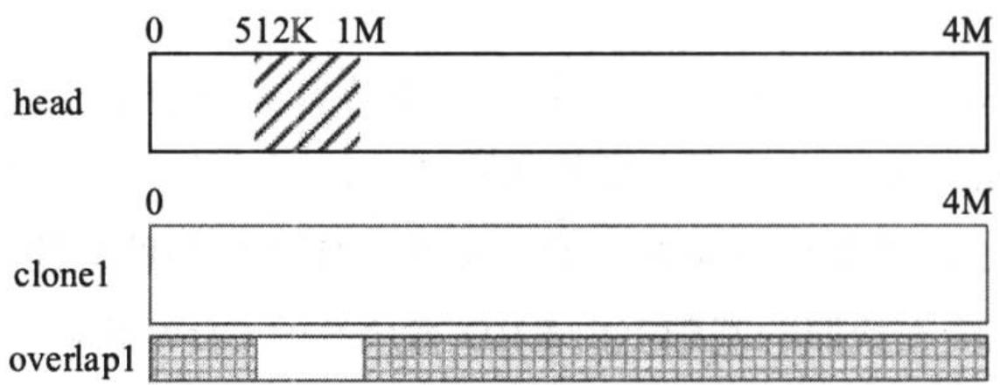


图6-3 创建快照snap1并写数据区间[512K~1M]


如果继续写512KB的数据至区间 $[1.5\mathrm{M}\sim 2\mathrm{M}]$ ，由于未新建快照，因此不需要COW，只需要将数据写入head对象即可。虽然该次写操作未触发COW操作，但由于又往head对象新的区间写入了数据，因此clone对象clone1与head对象数据相同的部分又减少了区间 $[1.5\mathrm{M}\sim 2\mathrm{M}]$ ，因此clone_overlap[snap1]需要同步更新为 $[0\sim 512\mathrm{K},1\mathrm{M}\sim$ $1.5\mathrm{M},2\mathrm{M}\sim 4\mathrm{M}]$ 。如图6-4所示。

然后创建第二个快照snap2，再新写入数据至区间 $[3\mathrm{M}\sim 4\mathrm{M}]$ ，同样的，快照之后的第一次写入会进行COW操作，拷贝生成一个clone对象clone2。与前面写区间 $[512\mathrm{K}\sim$ 1M]类似，新创建的快照对象所对应的重叠区间为整个对象大小 $[0\sim 4\mathrm{M}]$ ，然后减去触发此次COW的写操作的区间，因此clone_overlap[snap2]为[0,3M]，如图6-5所示。

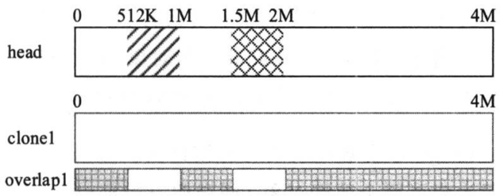


图6-4写数据区间 $[1.5\mathrm{M}\sim 2\mathrm{M}]$


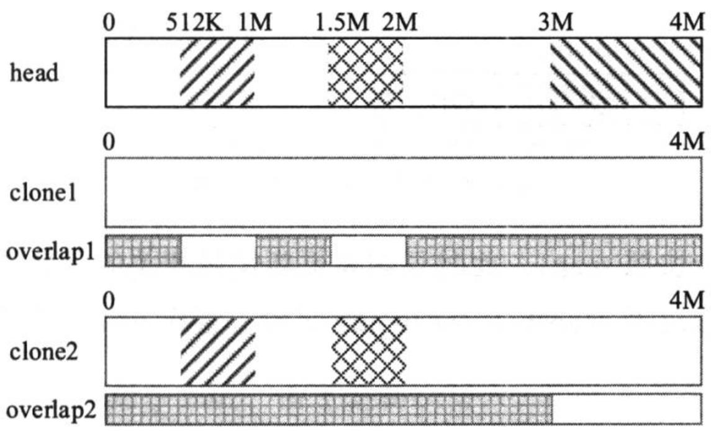


图6-5 创建快照snap2并写数据区间[3M~4M]


需要注意的是如果多次的写操作覆盖所有的重叠区间，那么重叠区间最终会变为空[]，如图6-6所示。

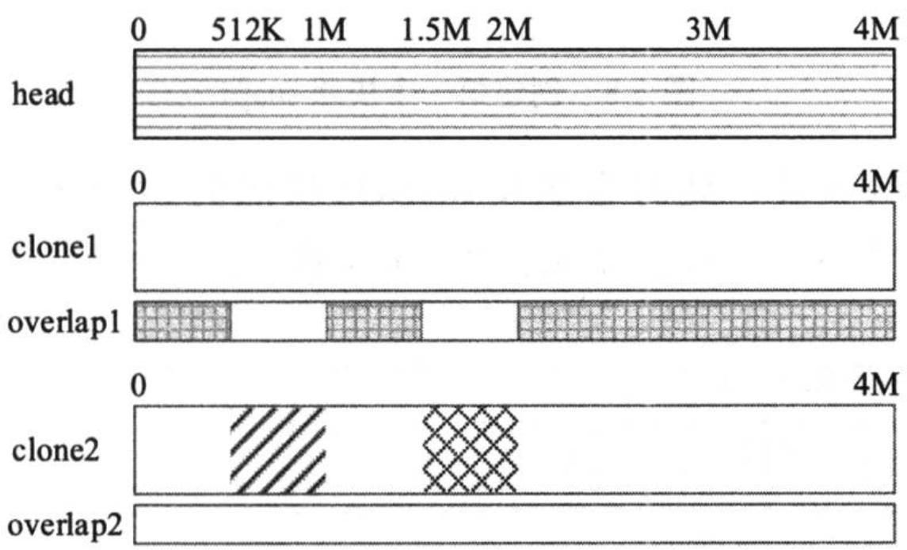


图6-6 写入操作覆盖了所有的重叠区间


# 2.RBD快照

RBD image 快照只需要保存少量的快照元数据信息，其底层数据 I/O 的实现完全依

赖于RADOS快照实现，数据对象克隆生成快照对象的COW过程对RBD客户端而言完全不感知，RADOS层根据RBD客户端发起的数据对象I/O所携带的SnapContext信息决定是否要进行COW操作。下面同样以图示来讲解RBD image在创建快照后的写流程。

如6.2.2节所述，image的数据对象是写时创建的，假设初始时image只写入了前8MB的数据，因此只生成了两个数据对象（同样假设数据对象大小为4MB），如图6-7所示。


图6-7 初始image数据对象


然后创建第一个快照snap1，此时只需要更新快照相关的元数据，即rbd_header元数据对象中的snap_seq及snapshot_id>字段，组成image的数据对象不会有任何变化，如图6-8所示。

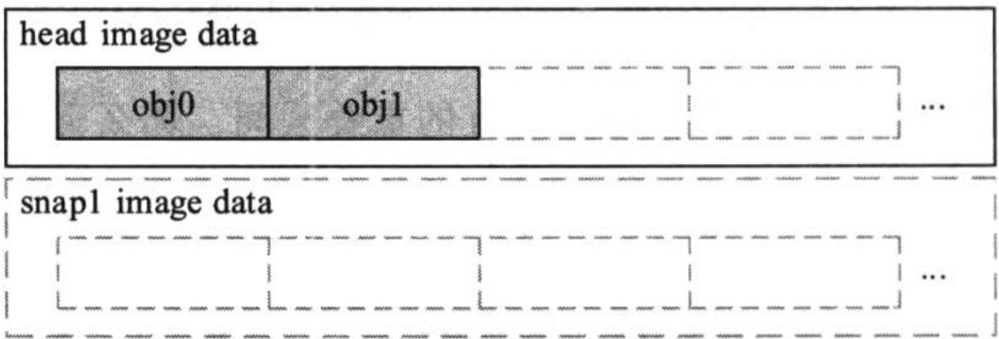


图6-8 创建第一个快照snap1


再对obj0进行写操作，此时会触发RADOS快照的COW机制，克隆生成obj0-clone1对象，然后将数据写入head对象，如图6-9所示。

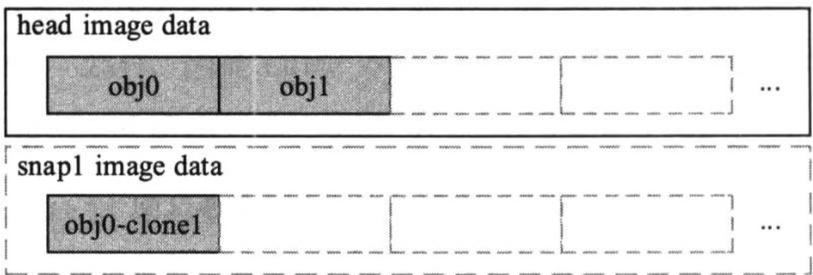


图6-9 对第一个数据对象obj0写入数据


创建第二个快照snap2，仍然只需要更新快照相关的元数据，数据对象没有任何变

化，如图6-10所示。

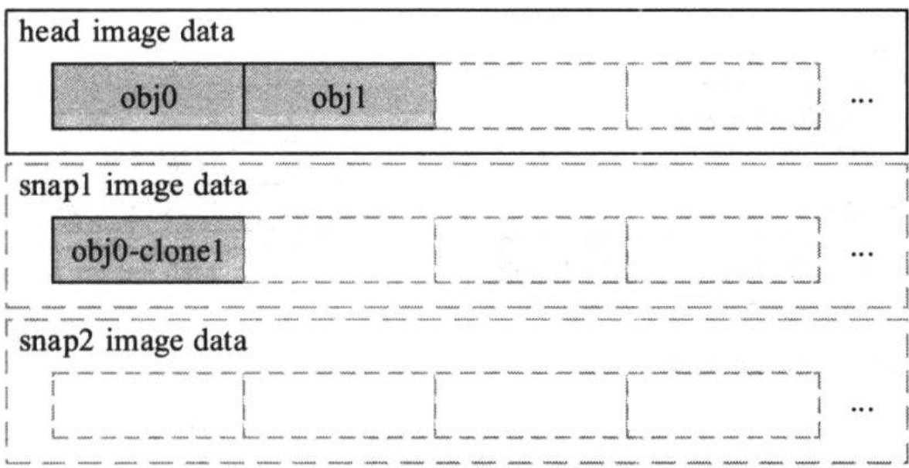


图6-10 创建第二个快照snap2


然后对 obj0、obj1、obj2 进行写操作，同样的在写之前先根据需要进行 COW 操作克隆生成 clone 对象，然后再将数据写入 head 对象。对于 obj0 克隆生成 obj0Clone2 对象，对于 obj1，由于 snap1 和 snap2 两次快照之间这个数据对象没有数据写入，因此只需克隆生成 obj1Clone2 对象，对于 obj2，由于是初次写入，因此无须生成 clone 对象，如图 6-11 所示。

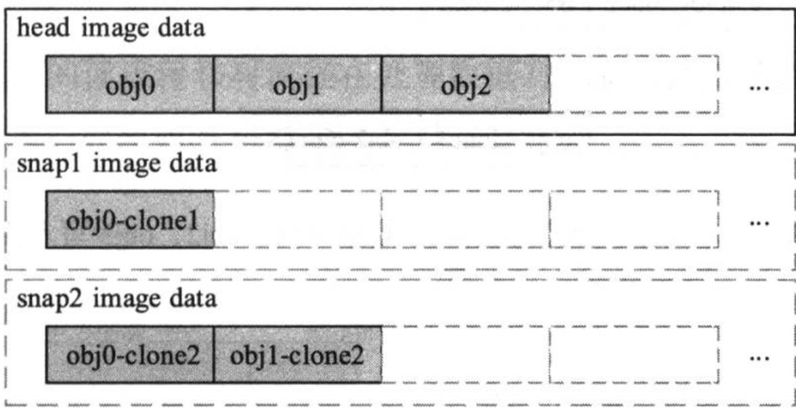


图6-11 对前三个对象obj0、obj1、obj2写入数据


继续创建第三个快照snap3，同样只需要更新快照相关的元数据，数据对象无任何变化，如图6-12所示。

紧接着对obj1、obj2、obj3进行写操作，在写之前同样根据需要进行COW操作克隆生成clone对象obj1-clone3、obj2-clone3，然后写入新数据至相应的head对象，如图6-13所示。

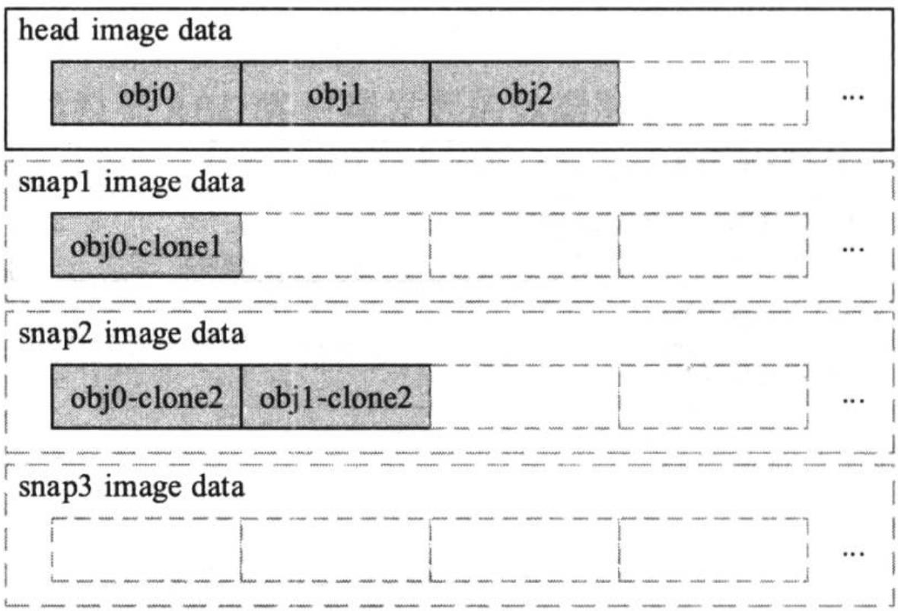


图6-12 创建第三个快照snap3


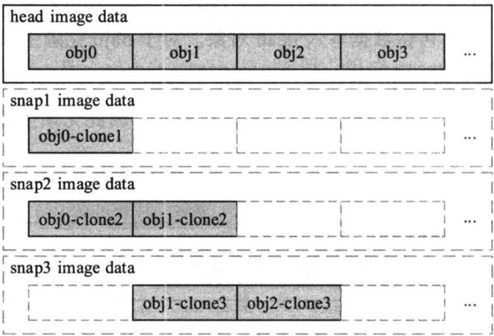


图6-13 对第二、第三及第四个对象obj1、obj2、obj3写入数据


# 6.3.2 克隆

RBD克隆是在RBD快照的基础上实现的可写快照，与RBD快照功能类似，RBD克隆的实现使用的也是COW机制，但是与快照功能不同的是，COW实现的层次并不相同。快照功能依赖于RADOS层的对象快照实现，但是克隆功能完全在RBD客户端实现，RADOS层完全不感知image之间的克隆关系。

创建克隆 image 的过程基本上就是创建一个新 image 的过程，但是在 image 的元数据中会记录一个 parent 的键值对，也就是记录克隆 image 与关联快照的父子关系，与创建新 image 类似，由于只需要创建元数据对象，因此 image 的克隆操作也非常快速，如


图6-14所示。


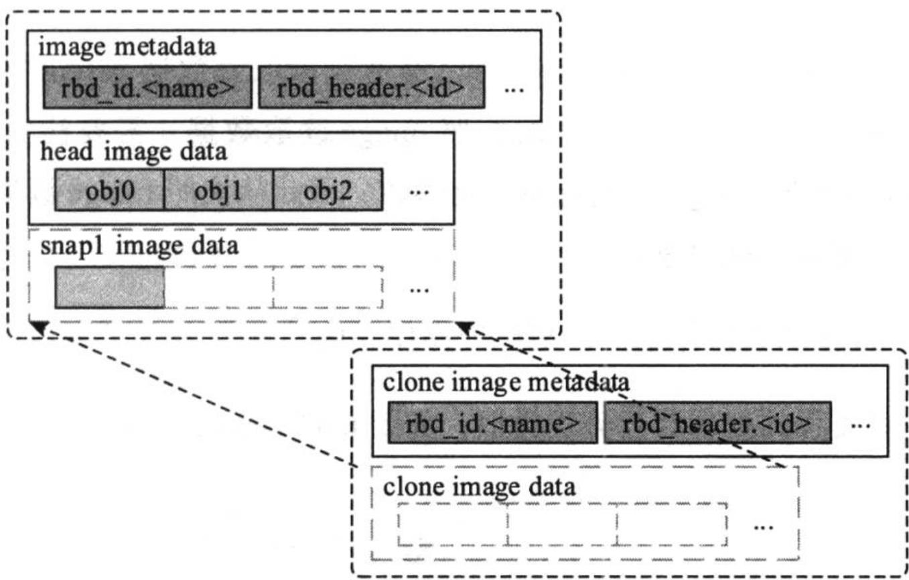


图6-14 克隆image引用关联快照


当RBD客户端打开克隆image时，会读取到parent元数据，从而构建出image之间的依赖关系，对克隆image数据对象的访问，会先访问克隆image的数据对象，如果返回的结果显示数据对象不存在，即返回-ENOENT，则会尝试访问依赖的关联快照的数据对象，由于克隆关系可能存在多层，因此该过程可能会一直回溯到最顶层的parent。

对于克隆 image 的读流程和写流程在处理数据对象不存在的错误码时会有不同的处理逻辑，其读取流程的处理如图 6-15 所示。

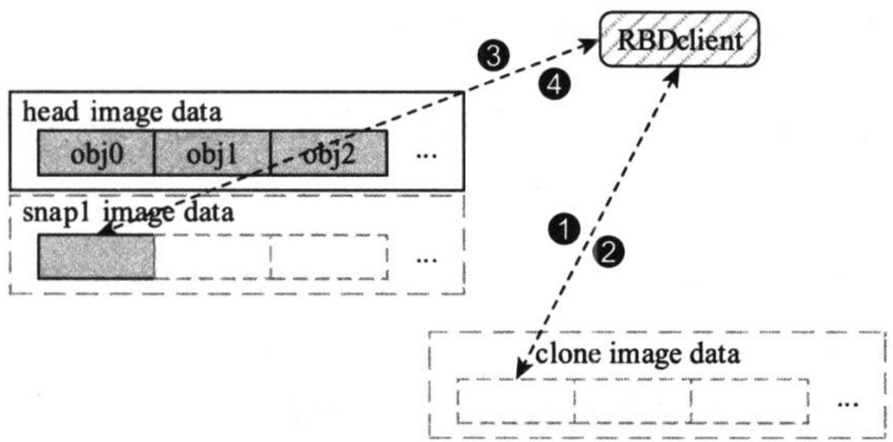


图6-15 克隆image读流程


由上图可知：

1）RBD 客户端读取指定区间的数据，假设该区间最终落到第一个数据对象；

2）由于此时克隆 image 的第一个数据对象不存在，因此步骤一中的读取操作会返回对象不存在的错误；

3）RBD客户端在打开该克隆image时已经通过读取元数据parent字段得到了关联的快照信息，因此会继续尝试从关联的快照image读取数据，需要注意的是创建克隆image时可以指定与快照image不同的条带化参数，因此从快照image读取数据的区间可能落到与第一步不同的数据对象；

4）对快照image的读操作返回，最终读操作完成。

克隆 image 写流程的处理与读流程类似，如图 6-16 所示。

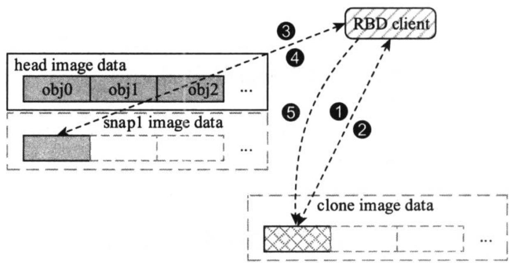


图6-16 克隆image写流程


由上图可知：

1）RBD 客户端写入指定区间的数据，假设该区间最终落到第一个数据对象；

2）由于此时克隆 image 的第一个数据对象不存在，因此步骤一中的写入操作会返回对象不存在的错误；

3）与读取操作类似，RBD客户端会尝试从关联的快照image读取数据，但此处与读取操作不同的是，读取操作只会从快照image读取与原始的请求区间一致的数据，但写入操作需要从快照image读取克隆image第一个数据对象整个对象区间的数据；

4）对快照 image 的读操作返回；

5）将从快照 image 读取的数据写入克隆 image 的第一个数据对象（自动创建对象），然后重新执行原始的针对克隆 image 第一个数据对象的写操作，最终写操作完成。

# 6.4 总结与展望

虚拟化是现代云计算IaaS服务的基础，越来越多的企业基于虚拟化技术来建设新一代的云数据中心，以降低成本、提升资源的利用率及使用效率。在大规模的虚拟化环境中，传统的SAN块存储由于采购和维护成本较高，在线性扩展、跨域容错、并行性能等方面存在瓶颈，难以满足存储虚拟化的要求。RBD构建于Ceph优秀的RADOS分布式对象存储引擎之上，可以较好地应对传统块存储在虚拟化环境下所面临的挑战，更由于与OpenStack等云计算平台的紧密结合而在虚拟化领域得到了大规模的应用和验证，但传统SAN块存储所具有的一些企业存储的特性，如卷迁移、远程同步/异步镜像、QoS等功能特性，RBD还有非常多的工作要做。此外为了支持传统的非虚拟化应用，兼容iSCSI/FC传统块存储接口也会是RBD接下来的重要工作。RBD作为一个分布式块存储服务当前还处在快速的发展过程中，相信通过社区的努力，RBD将会在未来得到更广泛的应用，为更多的业务领域提供支撑。

# 第7章

# 应云而生

# 对象存储网关RGW

对象存储是一种新型的存储形态，主要面向海量非结构化数据的存储，常用于静态数据、备份归档、流媒体等场景。与传统的块、文件存储访问方式不同，对象存储通常情况下提供HTTP访问接口，非常方便数据通过互联网进行传输，因此，对象存储成为了云存储领域中的一种常见的存储形态。从狭义上讲，对象存储即云存储。

Ceph 核心模块 RADOS 是一个基于对象的存储系统（注意：这里的对象是指 RADOS 内部的一种数据存储单元，与对象存储中的对象概念有所区别），通常情况下应用通过 RADOS 抽象库 librados 提供的对象接口访问 RADOS 集群，但是 librados 只提供私有接口，并不支持 HTTP 协议访问。Ceph 为了支持通用的 HTTP 接口设计了 RGW（RADOS Gateway，即对象存储网关）系统。然而，如果 RGW 只提供通用的 HTTP 访问接口，应用需要花费较大的代价才能开发出适配 RGW 访问接口的软件，这不利于 Ceph 在云存储领域中迅速普及，因此 RGW 选择适配云存储领域中应用最广泛的 Amazon S3 和 OpenStack Swift 接口，使得现有的 S3 和 Swift 用户可以以很小的代价接入到 Ceph 提供的对象存储系统中。

在 Ceph 的组织架构中，RGW 位于 librados 之上，RGW 数据最终保存到 RADOS 之中，RADOS 的高可靠性、高扩展性使得 RGW 可以非常方便地支持日益增长的非结构化数据的存储需求。事实上，从 RGW 模块在社区的活跃程度可以看出，近一两年，RGW

在各个行业都得到了广泛的应用，除了现有的S3和Swift接口更加完善之外，RGW也逐渐增加了自己的新特性，比如数据压缩、多站点多活、作为插件将数据从RADOS备份到第三方系统中、通过NFS协议访问等。本章旨在帮助RGW使用者或者开发者了解RGW的实现原理，以便更好地使用和完善它。

本章按照如下形式组织：首先，我们对RGW进行总体介绍——包括RGW需要解决的问题、期望具有的特性、在系统中的位置及相关重要组件等等。其次，RGW实际上是Ceph专门为类似S3的对象存储应用采用RESTful接口访问集群构建的一个通道，因此建立RGW应用数据与Ceph自身数据之间的转换关系是RGW设计的基础。我们从对象存储的基本概念和数据模型出发，分析RGW对外接口中的三个基础实体（用户、存储桶和对象）所包含的基本信息和数据组织形式，并最终建立它们与Ceph自身RADOS对象之间的映射关系。最后，通过剖析以存储桶创建、对象上传下载为代表的关键流程，我们简要探讨RGW的内部实现。

# 7.1 总体架构

随着非结构化数据日益增长（IDC，即International Data Corporation，在2014年调查分析报告中显示，预计2017年， $79\%$ 的存储容量用于存储非结构化数据，存储裸容量为EB级以上），需要具有高扩展性、数据存储位置可以灵活定制的存储系统才能应对这类数据的存储需求，而传统文件存储因为繁重的元数据管理设计导致其在容量扩展上具有一定的局限性，块存储必须依赖于存储硬件架构的特性导致其数据存储位置不够灵活，于是对象存储应运而生。

对象存储以对象作为数据存储单元，舍弃了文件系统元数据管理的特性，将所有对象以扁平方式进行存储。这样的数据管理方式非常便于对象存储系统规模扩展。Ceph 是个分布式对象系统，具有对象存储的以上特征，具备存储海量非结构化数据的能力，然而 Ceph 核心模块 RADOS 提供的访问接口是私有接口，不支持通用的 HTTP 协议访问，而对象存储最常见的应用为互联网应用，互联网应用的主要特点是数据存储位置不一定是在本地或局域网内，数据可以经过 Internet（基于 HTTP 协议）传输，存储在任意一个网络能到达的地方。因此，Ceph 为了支持 HTTP 协议访问，设计了 RGW 存储网关系统。RGW 实际上是 Ceph 专门为对象存储应用提供 RESTful 接口访问 RADOS 集群的一个访问通道，同时为了方便应用使用，其提供的 RESTful 接口兼容目前在云存储领域中应用

最广泛的AmazonS3系统和OpenStackSwift系统所提供的对象访问接口。

RGW 作为对象存储网关系统，一方面扮演 RADOS 集群客户端角色，为对象存储应用提供数据存储的通道；另一方面扮演 HTTP 服务端角色，接收并解析互联网传送的数据。RGW 在 Ceph 存储系统中的位置如图 7-1 所示。

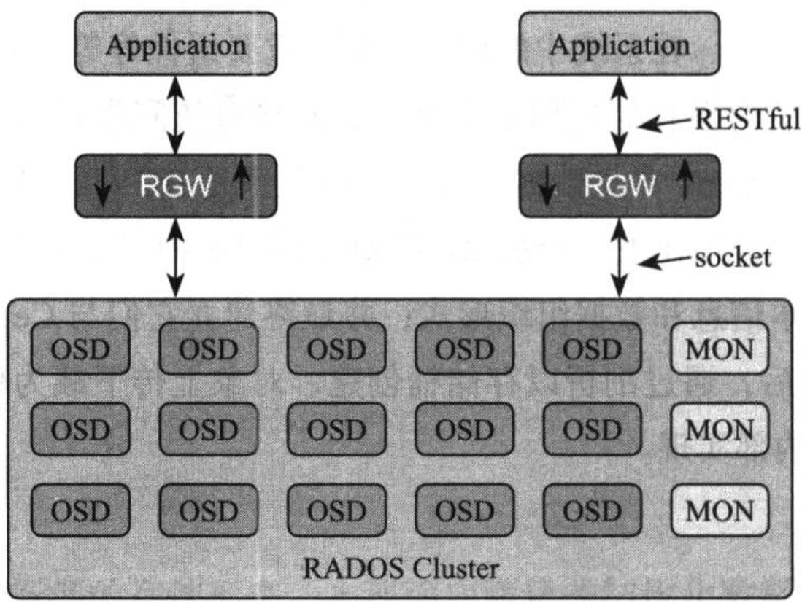


图7-1RGW在Ceph存储系统中的位置


RGW前端与WEB服务器紧密结合，通过HTTP协议与Swift和S3应用通信，后端与librados结合，通过socket与RADOS集群通信。RGW支持目前主流的WEB服务器，包括Civetweb、Apache、Nginx等，其中Civetweb是一个 $\mathrm{C + + }$ 库，可以内嵌到RGW框架中，是RGW默认的WEB服务器；Apache与Nginx需要以独立进程存在，收到应用请求后，通过RGW注册的监听端口号将请求转发到RGW上处理。

# 7.2 数据组织和存储

通常情况下，一个对象存储系统的基础数据实体包括用户、存储桶和对象，三者之间是一种层级关系，下面分别介绍这几个数据实体的概念和基本特征：

□用户：用户指的是对象存储应用的使用者。一个用户拥有一个或多个存储桶。

□存储桶：存储桶是对象的容器，是为了方便管理和操作具有同一属性的一类对象引入的一层管理单元，比如在互联网应用中非常普遍的资源共享，假设一个用户想把自己的资源池中部分对象共享出去，如果用户一次只能针对单个对象进行共

享操作，这个过程将非常烦琐。在对象之上引入存储桶这层管理单元后，共享过程就变得简单多了，只需将需要共享的对象放入同一个存储桶，然后针对该存储桶进行共享操作即可。

□对象：对象是对象存储系统数据组织和存储的基本单位，一个对象包含数据和元数据。数据指的是用户保存的真正的数据，比如一个文本文件的内容或一个视频文件的内容；元数据指的是除了数据外的其他需要保存的信息，一般由KV（Key-Value）键值对组成，通常情况下，除了一些特殊的功能特性要求特定的元数据外，元数据在类型上和数目上不受限制，用户可灵活地自行定义元数据用于保存所需信息。与文件系统层级管理结构不同，对象存储系统中所有的对象以扁平的方式存储，对象之间没有直接关联，这样的特性很容易实现将不同的对象保存在不同的物理位置。此外，对象存储不提供编辑对象部分内容的功能，对象必须作为一个整体单元操作，即使只更新对象中的一个字符，也必须将整个对象从云端下载下来、更新后重新上传。

尽管不同的对象存储系统在设计和实现上有所不同，但是对外呈现的基础数据实体大同小异。比如Amazon S3的基础数据实体包含user、bucket、object，与以上的用户、存储桶、对象完全对应，其数据模型如图7-2所示；而OpenStack Swift将用户的概念细分为account和user，其中account对应一个项目或者租户，每个account可以被多个user共享，其他的基础实体比如container和object与以上的存储桶、对象概念相符，其数据模型如图7-3所示。

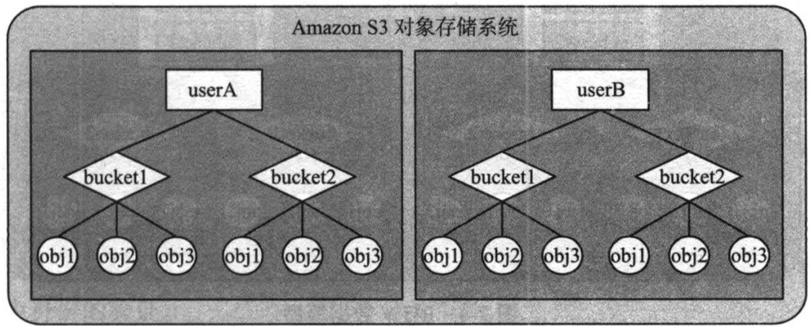


图7-2 AmazonS3数据模型


RGW 为了兼容 Amazon S3 和 OpenStack Swift 接口，在设计上须兼顾两者所涉及的概念，因此 RGW 将用户分为用户（user）和子用户（subuser），其中用户对应 S3 用户、

子用户对应Swift用户。在Jewel版本之前，RGW用户不允许重名且不同用户下的存储桶名称不允许相同，因此，Jewel版本引入了租户（tenant）的概念，目的是为了在不同租户下支持相同名称的用户和存储桶，同时为了兼容Jewel之前的版本，允许创建用户时不指定租户，所有不指定租户的用户默认属于同一个租户。RGW的数据模型如图7-4所示。

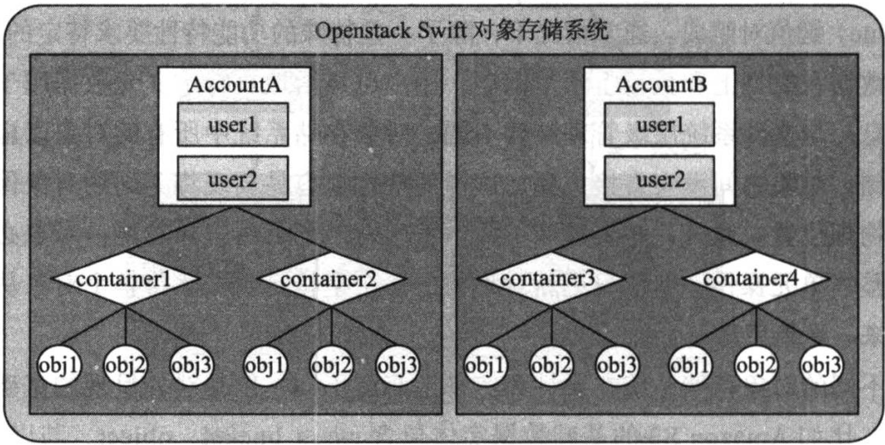


图7-3OpenStackSwift数据模型


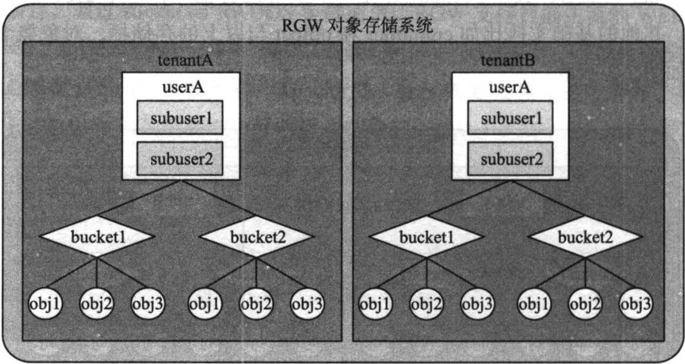


图7-4RGW数据模型


综上所述，RGW应用的基础数据实体包括用户（实际上包括用户和子用户，下文统称为用户）、存储桶、对象，建立RGW应用的这些数据实体与Ceph自身数据之间的转换关系是RGW设计的基础，因此以下几节我们将着重分析这些数据实体所包含的基本

信息和数据组织形式，以及这些数据以什么方式存储在RADOS对象中（我们知道，数据存储在RADOS对象有三种方式，第一种是以二进制文件方式保存在RADOS对象的数据部分；第二种是以键值对的方式保存在RADOS对象的扩展属性（xattr）中；第三种是以键值对的方式保存在RADOS对象的omap中）。

# 7.2.1 用户

用户管理设计主要基于以下几个方面考虑：首先是为了对RESTful API进行请求认证，其次是为了控制用户对资源（存储桶、对象等）的访问权限，最后是为了控制用户的可用存储空间，因此一个用户包含的信息包括用户认证信息、访问控制权限信息和配额信息。

要了解用户认证需要哪些信息，首先需要了解RGW的认证机制，RGW针对S3API和SwiftAPI采用不同的认证机制。

S3用户身份认证兼容Amazon S3的AWS2和AWS4两种认证机制，这两种认证机制都是基于密钥认证。认证过程如下：

1）应用在发送请求前，使用用户私有密钥（secret_key）、请求内容等，采用与RGW网关约定好的算法计算出数字签名后，将数字签名以及用户访问密钥（access_key）封装在请求中发送给RGW网关。

2）RGW网关收到请求后，使用用户访问密钥作为索引从RADOS集群中读取用户信息，并从用户信息中获取到用户私有密钥。

3）使用用户私有密钥、请求内容等，采用与应用约定好的算法计算数字签名。

4）判断RGW生成的数字签名与请求的签名是否匹配，如果匹配，则认为请求是真实的，用户认证通过。

从S3用户的认证过程可以看出，用户信息中必须包含访问密钥和私有密钥信息用于访问过程中身份的验证。

Swift 用户身份认证兼容 OpenStack Swift 认证机制，Swift 用户认证基于令牌认证。认证过程如下：

1）应用在发出真正的操作请求前，向RGW网关请求一个令牌（注：该令牌有有效

期，过了有效期后，需要重新请求新的令牌）。

2）RGW收到令牌请求后，使用子用户ID作为索引从RADOS集群中读取出子用户信息，并使用从子用户信息中获取到的Swift私有密钥（swift_key）生成一个令牌返回给应用。

3）应用在后续的操作请求中携带该令牌，RGW收到操作请求后，采用与步骤（2）相同的方式生成一个令牌，并判断生成的令牌与请求中的令牌是否一致，如果一致，身份验证通过。

从Swift用户身份验证流程可以看出，一个子用户信息必须包含Swift私有密钥。

通过身份验证的请求后，并不意味着用户具有操作资源（bucket、对象等）的权限，针对不同资源的访问，用户必须具备相应的访问权限才能访问对应的资源。对于每个请求，首先检查用户对资源是否具有对应的访问权限（访问权限包括 read、write、delete，分别表示对资源具有读、写、删除权限，比如，只有具有写权限的用户才能创建存储桶）。对于 Swift API 请求，除了针对用户操作权限的检查，还需要另外检查子用户的权限（子用户权限包括 read、write、readwrite、full-control，这里需要注意的是 full-control 权限不同于 readwrite 权限，full-control 除了 readwrite 权限外，还另外包含 read_ACP 和 write_acp 权限，read_acp 和 write_acp 指的是子用户具有获取或设置访问控制列表信息的权限）。

此外，为了防止某些用户占用太多的存储空间导致其他用户无空间使用，以及方便应用根据用户付费情况给不同的用户配置不同的存储空间，RGW允许对用户进行配额限制并且在用户上传/删除对象时做对应的配额检查。

综合上述分析，很容易得知一个用户所包含的关键信息包括用户认证需要的用户ID、密钥信息等，控制资源访问需要用到用户权限信息以及用户配额信息。RGW使用数据结构RGWUserInfo管理用户信息，其关键字段如表7-1所示。


表 7-1 RGWUserInfo 数据结构


<table><tr><td colspan="2">字段</td><td>含义</td></tr><tr><td rowspan="2">user_id</td><td>Tenant</td><td>用户所属租户，创建用户时指定，不指定的情况下，所有不指定租户的用户属于同一个租户</td></tr><tr><td>Id</td><td>用户ID，创建用户时指定</td></tr><tr><td colspan="2">display_name</td><td>用户名</td></tr><tr><td colspan="2">user_email</td><td>用户 email 地址</td></tr><tr><td rowspan="2">access_keys</td><td>Id</td><td>用户访问密钥,用户身份认证时使用</td></tr><tr><td>Key</td><td>用户私有密钥,用户身份认证是使用</td></tr><tr><td rowspan="2">swift_keys</td><td>Subuser</td><td>子用户 ID,创建子用户时指定</td></tr><tr><td>Key</td><td>子用户私有密钥,即Swift 用户私有密钥</td></tr><tr><td rowspan="2">subusers</td><td>Name</td><td>子用户 ID</td></tr><tr><td>perm_mask</td><td>子用户访问权限,包括 read、write、readwrite、full-control</td></tr><tr><td colspan="2">Suspended</td><td>用户被暂停访问</td></tr><tr><td colspan="2">max_buckets</td><td>用户可以创建的存储桶数目</td></tr><tr><td colspan="2">op_mask</td><td>用户操作访问权限,包括 read、write、delete,可设置多个权限的组合,比如{read、write}或{read、write、delete}</td></tr><tr><td colspan="2">Caps</td><td>授权用户权限,授权用户根据授予的权限可以进行特殊的操作。Caps 由一组 &lt;caps-type,perm&gt; 组成:caps-type指的是用户可访问的资源,有效值为:users、buckets、metadata、usage、mdlog、datalog、opstate、bilog;perm指的是用户对该资源具有什么权限,有效值为 read、write、read,write,*。比如一个用户的 caps 设置为“ users=read”,表示该用户具有查询其他用户信息的权限</td></tr><tr><td rowspan="3">bucketquotes</td><td>max_size</td><td>限制单个存储桶下所有对象的总大小</td></tr><tr><td>maxobjects</td><td>限制单个存储桶下对象总数目</td></tr><tr><td>enabled</td><td>该字段为布尔类型,值为 true 时,配额生效</td></tr><tr><td rowspan="3">user mezota</td><td>max_size</td><td>限制该用户下所有对象的总大小</td></tr><tr><td>maxobjects</td><td>限制该用户下对象总数目</td></tr><tr><td>enabled</td><td>该字段为布尔类型,值为 true 时,用户配额生效</td></tr></table>

RGW将用户信息保存在RADOS对象的数据部分，一个用户对应一个RADOS对象。由于大部分情况下，我们需要使用用户ID作为索引获取用户信息，因此该对象以用户ID命名（RADOS通过“pool名 + 对象名”来查询一个对象，在pool名已知的情况下，只需要知道对象名即可索引到对应的对象）。

由于认证过程中需要使用用户访问密钥、子用户作为索引读取用户信息，并且在设置存储桶和对象的访问权限时，允许将存储桶和对象的访问权限授予 email 为 xxx 的用户，在对操作进行鉴权检查时需要使用 email 作为索引获取用户信息，因此需要建立访问密钥、子用户、email 跟用户信息所在的 RADOS 对象的索引关系。针对这种情况，RGW 采用了二级索引的实现方式，即分别创建以用户访问密钥、子用户、email 命名的三个 RADOS 对象（以下称为索引对象），并将用户 ID 保存在对象的数据部分。当需要使

用某个索引查询用户信息时，首先从索引对象读出用户ID，然后使用用户ID作为索引读取用户信息。

# 7.2.2 存储桶

一个存储桶对应一个RADOS对象。一个存储桶包含的信息分为两类，一类是对RGW网关透明的信息，这类信息通常情况下指的是用户自定义的元数据（用户自定义的元数据通常以KV键值对组成，比如用户可自定义type类型用于区分存储桶下保存的对象类型，如当type等于audio表示该存储桶下保存的是音频文件），RGW不关心这些信息的内容，直接将这些信息保存在对象的扩展属性中，一个KV键值对对应一个扩展属性条目；一类是RGW网关关注的信息，这类信息包括存储桶中对象的存储策略、存储桶中索引对象的数目以及应用对象与索引对象的映射关系、存储桶的配额等，此类信息由数据结构RGWBucketInfo管理（如表7-2所示），保存在RADOS对象的数据部分。


表 7-2 RGWBucketInfo 关键字段


<table><tr><td colspan="2">成员</td><td>含义</td></tr><tr><td colspan="2">owner</td><td>存储桶的创建者或拥有者</td></tr><tr><td colspan="2">placement_rule</td><td>存储桶中对象的存储策略，存储策略关联用户上传的对象、bucket索引对象、分段上传对象时产生的中间数据存放的存储池。存储桶的存储策略在创建存储桶时指定，创建后将不能修改</td></tr><tr><td rowspan="2">index_type</td><td>0</td><td>当创建一个存储桶时，同时创建一个或多个索引对象，并且在有应用对象更新时，将对象记录在其中一个索引对象中</td></tr><tr><td>1</td><td>当创建一个存储桶时，同时创建一个或多个索引对象，但是在有应用对象更新时，不记录对象</td></tr><tr><td colspan="2">num_shards</td><td>索引对象数目</td></tr><tr><td colspan="2">quota</td><td>存储桶配额</td></tr><tr><td colspan="2">bucket_index_shard_hash_type</td><td>当一个存储桶对应多个索引对象时，计算某个对象由哪个索引对象保存的算法，目前只支持一种算法：
索引对象=hash(object_name)%num_shards</td></tr></table>

在创建存储桶时，RGW网关会同步创建一个或多个索引（index）对象，用于保存该存储桶下的对象列表，以支持查询存储桶对象列表（ListBucket）功能，因此在存储桶中有新的对象上传或删除时必须更新索引对象。在Hammer版本之前，对于单个存储桶只创建一个索引对象，因此索引对象的更新成为了对象上传或删除的性能瓶颈点。为了解决这个问题，RGW采用了Ceph通常采用的解决方案，将索引对象分片（shard)，把一个索引对象切分成多个（通过配置项rgw_override_bucket_index_max_shards指定）对象，

不同应用对象记录在不同的索引对象上。该解决方案极大地改观了对象写性能，根据我们的测试经验，一个标准的三节点 Ceph 集群，将索引对象的分片从默认不分片改为 32 个分片后，16k 大小的对象写性能提高了 3 倍。但是分片机制带来一个负面影响，分片会影响查询存储桶对象列表操作的性能（分片后，原先只需读取一个索引对象就可以获取存储桶下对象列表变成针对多个索引对象的读，这时，RGW 网关与 RADOS 集群间的网络时延、多个索引对象查询结果的合并对查询存储桶对象列表性能产生很大的影响）。为了降低该负面影响，RGW 网关试图将对多个索引对象的串行读改为并发读（通过 rgw_bucket_index_max_aio 配置项可调整并发数）以降低查询存储桶对象列表操作的处理时间，事实证明这个方法确实有效。但是任何事物都会存在两面性，不能因为有了并发读的机制，就一味的调大索引对象的数目，因为与此同时归并排序所消耗的计算量和缓存也会增加，从而制约了查询效率。索引对象分片机制虽然极大地改观了写性能，但是对性能的改观仍然有限，索引对象依然是对象写性能的瓶颈点。因此，在不需要查询对象列表功能的场景（比如应用有自己的本地数据库保存和跟踪对象列表），可以通过配置选项不跟踪存储桶下对象列表的更新，在一定程度上提高了对象上传的性能。需要注意的是，去掉对象列表的跟踪意味着存储桶的状态不能被准确地监控，并且存储桶下的对象不能被很好地跟踪，从而导致一些特性将不可用，比如多站点环境下数据的复制功能、S3 API 中的对象多版本功能、针对存储桶下对象数目的限制等。

# 7.2.3 对象

应用上传的对象包括数据和元数据两部分，数据部分保存在一个或多个RADOS对象的数据部分，元数据保存在其中一个RADOS对象的扩展属性中。RGW对单个对象提供了两种上传接口：整体上传和分段上传。不同的上传接口应用对象与RADOS对象对应关系不同，下面分别介绍这两种接口下应用对象与RADOS对象的对应关系。

RGW 限制了整体上传一个对象其大小不能大于 5GB（与 Amazon S3 标准相同，也可通过配置项 rgw_max_put_size 调整），当用户上传的对象大于该限制时，必须分段上传对象，否则对象上传失败。为了更好地理解用户上传的对象跟 RADOS 对象的关系，首先介绍两个宏值和一个类：

- rgw_max_chunk_size：该宏值用来表示RGW下发到RADO集群单个I/O的大小，同时决定应用对象分成多个RADOS对象时首对象的大小，以下简称分块大小。

- rgw_obj stripe_size：该宏值用来指定当一个对象被分成多个RADOS对象时中间对象的大小，以下简称条带大小。

Class RGWObjManifest：用来管理用户上传的对象和RADOS对象的对应关系，以下简称manifest。

整体上传一个对象时，当对象小于分块时，用户上传的一个对象只对应一个RADOS对象，该RADOS对象以应用对象名称命名，应用对象元数据也保存在该RADOS对象的扩展属性中；当用户上传的对象大于分块时，被分解成一个大小等于分块大小的首对象，多个大小等于条带大小的中间对象，和一个小于等于条带大小的尾对象，如图7-5所示。其中首对象以应用对象名称命名，在RGW网关中将该对象称为head_obj，该对象的数据部分保存了应用对象前rgw_max_chunk_size字节的数据，扩展属性部分保存了应用对象的元数据信息和manifest信息；中间对象和尾对象保存应用对象剩余的数据，对象名称为“shadow_”+“.”+“32bit随机字符串”+“_”+“条带编号”，其中条带编号从1开始编号。

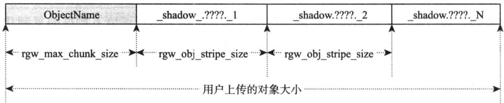


图7-5 整体上传对象


分段上传一个对象时，RGW网关按照条带大小将每个分段分成多个RADOS对象，每个分段的第一个RADOS对象名称为“_multipart_”+“用户上传对象名称”+“分段上传ID“+“分段编号”，其余对象的名称为“_shadow_”+“用户上传的对象名称”+“分段上传ID”+“分段编号”+“_”+“条带编号”，如图7-6所示。当所有的分段上传结束后，RGW会另外生成一个RADOS对象，用于保存应用对象元数据和所有分段的manifest。值得注意的是，用户上传每个分段的大小最好能被条带大小整除，如果不能整除，可能会导致整个对象上传后，RADOS对象数目比每个分段被条带大小整除的对象数多且对象大小分布不均，例如用户要上传一个20M的对象，以s3cmd工具默认分段大小15M为例，那么该对象需分两个分段上传，第一个分段的大小为15M，第二个分段大小为5M，那么整个对象最后被分成4M、4M、4M、3M、4M、1M大小的6个RADOS对象，

如果分段大小设置为 $16\mathrm{M}$ ，同样 $20\mathrm{M}$ 的对象也是分两个分段上传，第一个分段的大小为 $16\mathrm{M}$ ，第二个分段大小为 $4\mathrm{M}$ ，整个文件分成 $4\mathrm{M}$ 、 $4\mathrm{M}$ 、 $4\mathrm{M}$ 、 $4\mathrm{M}$ 、 $4\mathrm{M}$ 大小的 5 个对象，少了一个对象。对于 RADOS 集群来说，对象数越多，对象管理数据越多，管理复杂度越大，对象大小分布不均，对性能可能也会有些影响。

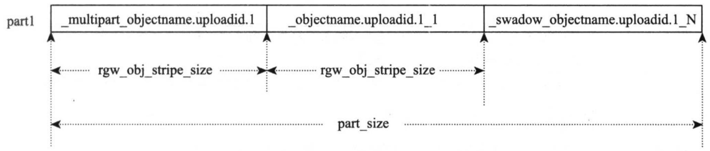


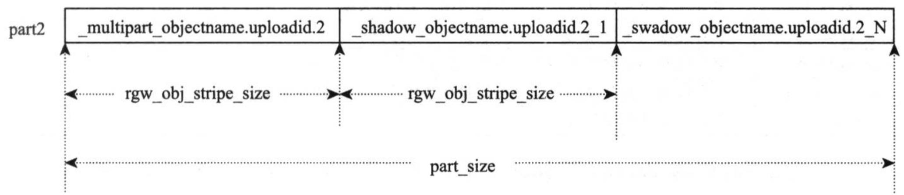


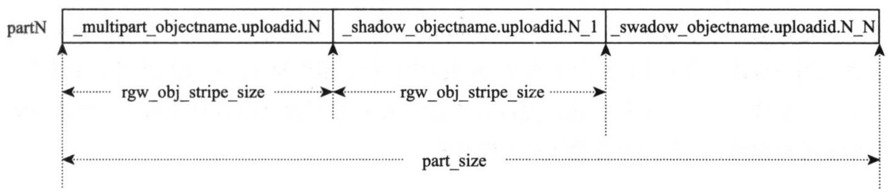


图7-6 分段上传对象


# 7.2.4 数据存储位置

在前文中，我们分析了RGW数据的组织和存储方式，不同的用户数据最终以RADOS对象为单位保存到RADOS集群中。为了实现不同的应用数据存储位置的隔离，RGW使用zone来管理用户数据的存储位置，zone由一组存储池（pool）组成，不同的存储池用来保存不同的数据，RGW使用数据结构RGWZoneParams来管理不同的存储池，定义如表7-3所示。配置一个RGW实例时，需要指定该RGW实例所属的zone以确定数据的存储位置。


表 7-3 RGWZoneParams


<table><tr><td>字段</td><td>含义</td></tr><tr><td>domain_root</td><td>该存储池用来存储存储桶的信息</td></tr><tr><td>metadata_heap</td><td>该存储池用来存储存储桶的信息和用户信息,可不配置</td></tr><tr><td>control_pool</td><td>RGW实例上电时,在该存储池中创建若干个对象用于watch-notify,主要作用为当一个 zone包含多个RGW实例启动了缓存功能时,保证所有RGW实例间数据一致性,其基本原理为利用 librados提供的对象watch-notify功能,当有数据更新时,通知其他RGW实例更新本地缓存</td></tr><tr><td>gc_pool</td><td>RGW实例上电时,在该存储池中创建多个对象,用于记录在后台删除的对象。RGW实例会定期启动gc线程,删除记录的对象</td></tr><tr><td>lc_pool</td><td>S3 API支持对象生命周期(对象生命周期过后,系统会自动删除对象)功能,该存储池用来记录对象生命周期的执行状态</td></tr><tr><td>log_pool</td><td>该存储池用来存储用户操作日志、数据同步日志等</td></tr><tr><td>usage_log_pool</td><td>该存储池用来存储用户操作统计信息,比如对象上传次数、下载次数等</td></tr><tr><td>user_keys_pool</td><td>该存储池用来存储用户访问密钥与用户ID的关系</td></tr><tr><td>user_email_pool</td><td>该存储池用来存储用户email与用户ID的关系</td></tr><tr><td>userswift_pool</td><td>该存储池用来存储子用户与用户ID的关系</td></tr><tr><td>user.uid_pool</td><td>该存储池用来存储用户信息和记录每个用户下存储列表信息</td></tr><tr><td>placement_pools</td><td>应用对象的存储位置</td></tr></table>

这里需要重点强调 placement_pools 字段，该字段由 map<string, RGWZonePlacementInfo> 组成，map 的第一个字段是一个自定义字符串，可以认为是一个对象存储策略，用来唯一定位第二个字段 RGWZonePlacementInfo，第二个字段主要定义了应用对象的存储位置、用户分段上传对象时中间数据的存储位置和存储索引对象的存储位置等，如表 7-4 所示。当创建一个存储桶时，用户可以显式指定 zone 中已存在的存储策略，后续往存储桶中上传对象时，将按照该存储策略存储对象。


表 7-4 RGWZonePlacementInfo


<table><tr><td colspan="2">字段</td><td>含义</td></tr><tr><td colspan="2">index_pool</td><td>该存储池用来保存存储桶的索引对象</td></tr><tr><td colspan="2">data_pool</td><td>该存储池用来保存应用上传的对象</td></tr><tr><td colspan="2">dataextra_pool</td><td>该存储池用来保存分段上传对象所产生的中间数据</td></tr><tr><td rowspan="2">index_type</td><td>0</td><td>该存储策略下将存储桶下对象列表记录在索引对象中</td></tr><tr><td>1</td><td>该存储策略下不记录存储桶下对象列表</td></tr><tr><td colspan="2">compression_type</td><td>当启动数据压缩时，指定压缩算法</td></tr></table>

# 7.3 功能实现

在前面几节中，我们主要讨论了RGW对外概念、数据组织和存储方式以及RGW内

部逻辑概念，本节主要介绍RGW对外提供的功能，I/O路径以及存储桶创建、对象上传和下载等几个基本功能的实现。

# 7.3.1 功能特性

对象存储最基本的功能包括用户、存储桶、对象的增删改查，在此基础上，结合对象存储应用的特征，引申出更多的功能，比如在对象存储应用中，如果对一个存储桶或对象没有任何访问上的限制，该存储桶或对象就会变成公开的资源，任何人都可以访问，因此对存储桶和对象的访问控制变得尤为重要，存储桶和对象的访问控制功能成为了对象存储的基本功能之一。RGW网关近几年在不断地跟进和对齐AmazonS3 $\text{念}$ 和OpenStackSwift $\text{念}$ 功能（目前RGW网关兼容的S3和Swift的API如表7-5和表7-6所示），同时也开发了一些常用的管理接口，如表7-7所示。此外，RGW也一直在努力发展自己的特性，比如对象压缩和加密、多站点数据同步备份、作为插件将数据从RADOS备份到第三方系统中、与NFS应用互通等，争取开辟属于自己的生态圈。


表 7-5 RGW 支持的 S3 API


<table><tr><td>功能特性</td><td>功能说明</td></tr><tr><td>List Buckets</td><td>查询用户下存储桶列表</td></tr><tr><td>Create Bucket</td><td>创建存储桶</td></tr><tr><td>Delete Bucket</td><td>删除存储桶</td></tr><tr><td>List Bucket</td><td>查询存储桶中对象列表</td></tr><tr><td>Bucket Lifecycle</td><td>对象生命周期包括两个方面：一是设置对象过期时间，到时间后自动删除该对象，二是设置一个时间，到时间后将对象从一个快速存储介质转存到慢速存储介质，目前只支持前一种方式</td></tr><tr><td>Get Bucket Location</td><td>获取存储桶的存储位置信息</td></tr><tr><td>Bucket ACL</td><td>设置和查询存储桶访问控制列表</td></tr><tr><td>Bucket Object Versions</td><td>在一个桶内保存对象的多个版本，防止意外覆盖和删除对象时恢复对象，或存档对象，以便可以检索早期版本的对象</td></tr><tr><td>BucketRequest Payment</td><td>设置和查询下载存储桶中的对象所产生账单的支付者</td></tr><tr><td>Bucket Website</td><td>通过为网站托管配置存储桶，然后将内容上传到存储桶来托管静态网站</td></tr><tr><td>Bucket CORS</td><td>为了安全起见，通常情况下，客户端（浏览器）只能访问同一域内服务器的资源。跨源资源共享（CORS）定义了如何通过设置一系列规则，使得客户端可以访问不同域中资源</td></tr><tr><td>Put/Post Object</td><td>上传对象</td></tr><tr><td>Delete Object</td><td>删除对象</td></tr><tr><td>Get Object</td><td>下载对象</td></tr><tr><td>Get Object Info</td><td>查询对象元数据信息</td></tr><tr><td>Copy Object</td><td>对象拷贝，支持存储桶内和跨存储桶拷贝</td></tr><tr><td>Object ACL</td><td>设置和查询对象访问控制列表</td></tr><tr><td>Object Multipart Uploads</td><td>分段上传对象</td></tr><tr><td>Object Torrent</td><td>支持对象生成BT种子</td></tr></table>


表 7-6 RGW 支持的 Swift API


<table><tr><td>功能特性</td><td>功能说明</td></tr><tr><td>List Containers</td><td>获取该用户下所有的存储桶及用户元数据</td></tr><tr><td>Post Metadata</td><td>创建、更新、删除用户元数据</td></tr><tr><td>Head Metadata</td><td>查询用户元数据</td></tr><tr><td>Put Container</td><td>创建存储桶,设置其元数据,包括读写访问控制列表、CORS、是否开启版本控制或自定义的元数据等</td></tr><tr><td>List Container</td><td>查询存储桶中的对象列表</td></tr><tr><td>Delete Container</td><td>删除存储桶</td></tr><tr><td>Post Container</td><td>修改存储桶元数据</td></tr><tr><td>Head Container</td><td>查询存储桶元数据</td></tr><tr><td>Put Object</td><td>上传对象,包括对象内容和元数据,元数据包括对象过期时间、自定义的元数据等</td></tr><tr><td>Get Object</td><td>下载对象</td></tr><tr><td>Delete Object</td><td>删除对象</td></tr><tr><td>Post Object</td><td>更新对象元数据</td></tr><tr><td>Head Object</td><td>查询对象元数据</td></tr><tr><td>Copy Object</td><td>拷贝对象</td></tr><tr><td>Options Object</td><td>浏览器发送实际请求之前,可以先发送一个预请求(携带接下来请求的资源、方法、头部)到RGW网关,确定其是否具有相关资源访问的权限。主要应用于跨源资源共享。浏览器发送预请求到RGW网关,RGW网关返回跨源资源共享配置信息,浏览器根据配置信息确认自己是否有权限访问,如没有权限访问,则不会下发实际的请求。如果存储桶上没有配置跨源资源共享,则返回拒绝访问</td></tr></table>


表 7-7 RGW 常用的 Admin API


<table><tr><td>功能特性</td><td>功能说明</td></tr><tr><td>Get Usage</td><td>获取每个存储桶、每个用户以及所有用户的统计信息，统计信息包括：发送总字节数、接收总字节数、操作数、成功执行的操作数。
注：统计信息默认关闭，通过配置选项 rgw enable usage log = true 开启</td></tr><tr><td>Trim Usage</td><td>删除某个时间段的统计信息</td></tr><tr><td>Get User Info</td><td>获取指定用户信息</td></tr><tr><td>Create/Remove/Modify User</td><td>创建 / 删除 / 修改用户</td></tr><tr><td>Create/Remove/Modify Subuser</td><td>创建 / 删除 / 修改子用户</td></tr><tr><td>Add /Remove Caps</td><td>添加 / 删除用户权限</td></tr><tr><td>Create/Remove Key</td><td>创建 / 删除密钥</td></tr><tr><td>Get/Set Quota</td><td>获取 / 设置用户配额信息</td></tr><tr><td>Get Bucket Info</td><td>获取指定存储桶相关信息</td></tr><tr><td>Link/Unlink Bucket</td><td>创建指定存储桶与指定用户关联关系或解除关联关系。存储桶与用户相关联后，指定用户下可查询到该存储桶信息</td></tr><tr><td>Remove Bucket</td><td>删除存储桶</td></tr><tr><td>Remove Object</td><td>删除对象</td></tr><tr><td>Get Metadata</td><td>获取用户、存储桶列表</td></tr><tr><td>Put Metadata</td><td>添加 / 更新用户、存储桶</td></tr><tr><td>Delete Metadata</td><td>删除指定用户、存储桶</td></tr></table>

# 7.3.2 I/O 路径

RGW 网关使用 OP 线程处理应用的 I/O 请求（OP 线程在上电时创建，当前端 WEB 服务器为 Civetweb 时，通过修改配置项 rgw_thread_pool_size 指定 OP 线程数目）。OP 线程内部处理逻辑可分为 HTTP 前端、REST API 通用处理层、API 操作执行层、RADOS 接口适配层与 librados 接口层等几个关键流程，如图 7-7 所示。OP 线程从 HTTP 前端收到 I/O 请求后，首先在 REST API 通用处理层，从 HTTP 语义中解析出 S3 或 Swift 数据并进行一系列的检查，检查通过后，根据不同 API 操作请求执行不同的处理流程，如需从 RADOS 集群获取数据或者往 RADOS 集群中写入数据，则通过 RGW 与 RADOS 接口适配层调用 librados 接口将请求发送到 RADOS 集群中获取或写入相应数据，完成整个 I/O 过程。

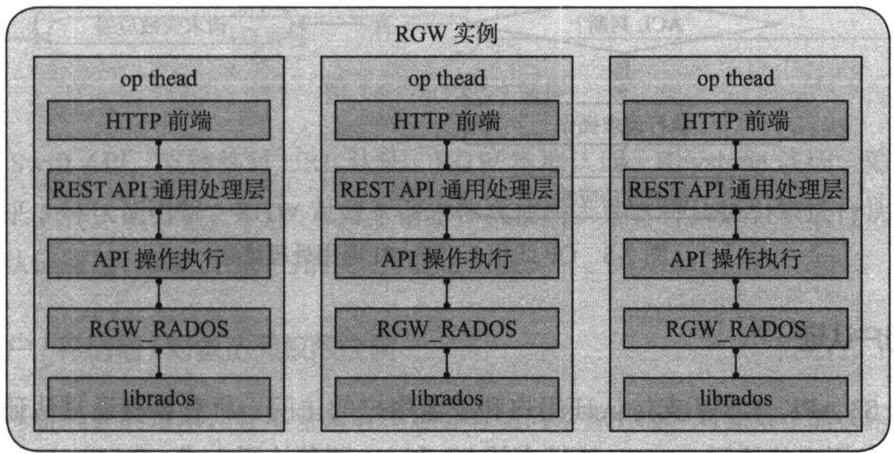


图7-7RGW实例内部I/O路径


REST API 通用处理层的关键步骤如图 7-8 所示，大概分为用户认证、用户 / 存储桶 / 对象的访问控制和用户 / 存储桶配额检查等几个关键步骤。

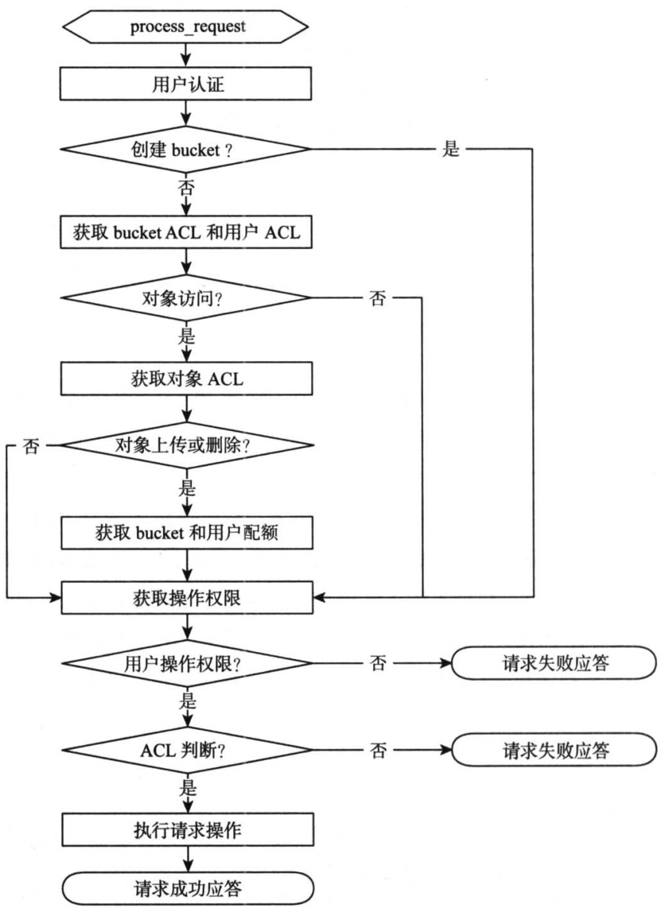


图7-8 OP线程RESTAPI通用处理流程


# 1. 用户认证

对于S3 API，RGW支持认证用户和匿名用户的访问，所有没有通过认证的访问则认为是匿名用户的访问。RGW认证支持V2和V4两种认证方式，RGW V2认证支持本

地认证、LDAP和keystone三种认证方式，认证流程如图7-9所示。RGW V4认证兼容AWSV4（Jewel版本支持）认证机制。

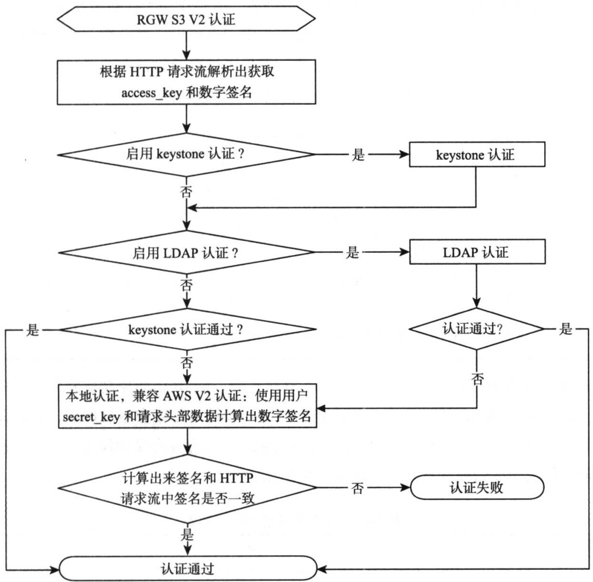


图7-9 RGWV2认证


对于Swift API，支持临时URL认证、RGW本地认证、Keystone认证、第三方认证和匿名认证5种认证引擎，RGW对每个请求依次使用上述5种认证引擎进行认证，如果某个引擎认证通过，认证结束，用户操作通过认证。

# 2. 用户 / 存储桶 / 对象访问权限控制

通过身份验证的请求，并不意味着一定会有访问资源（桶、对象等）的权限，针对不

同资源的访问，用户必须具备相应的访问权限（ACL）才能访问对应的资源。

针对S3 API，RGW网关规定了允许的操作跟资源的对应关系如表7-8，S3访问控制列表分为存储桶访问控制列表和对象访问控制列表，分别作用于存储桶本身和对象本身。一个存储桶或对象的访问控制权限可在创建时指定，也可以针对已存在的存储桶或对象设置访问控制权限，无论采用哪种方式设置，都是通过授予除了存储桶或对象拥有者之外的其他用户一定权限，以便其他用户对该存储桶或对象具备一定访问权限。


表 7-8 S3 API 资源访问控制


<table><tr><td rowspan="2">权限</td><td colspan="2">含义</td></tr><tr><td>存储桶</td><td>对象</td></tr><tr><td>READ</td><td>允许查询存储桶中对象列表</td><td>允许下载该对象</td></tr><tr><td>WRITE</td><td>允许上传/删除对象</td><td>N/A</td></tr><tr><td>READ_ACP</td><td>允许读取存储桶访问控制列表</td><td>允许读取对象访问控制列表</td></tr><tr><td>WRITE_ACP</td><td>允许设置存储桶访问控制列表</td><td>允许设置对象访问控制列表</td></tr><tr><td>FULL_CONTROL</td><td>完全控制权限(READ | WRITE | READ_ACP | WRITE_ACP)</td><td>完全控制权限(READ | WRITE | READ_ACP | WRITE_ACP)</td></tr></table>

Swift API 在权限访问控制上与 S3 API 有所不同，Swift 访问控制权限分为用户访问控制列表和存储桶访问控制列表。用户访问控制列表针对已存在用户设置，其含义如表 7-9 所示。存储桶访问控制列表在创建存储桶时或针对已存在存储桶设置，只有读和写两种权限，作用于存储桶自身和该存储桶下所有的对象。


表 7-9 Swift 用户访问控制列表


<table><tr><td>权限</td><td>含义</td></tr><tr><td>read-only</td><td>授予指定身份用户读取本用户下所有内容，比如可以列举存储桶列表、列举存储桶对象列表、下载对象、读取本用户头部信息、属于本用户的存储桶头部信息、本用户下对象的头部信息等</td></tr><tr><td>read-write</td><td>授予指定身份用户读或写任意一个存储桶，比如创建一个新的存储桶、上传一个新的对象、删除一个对象。但是该用户不能创建、删除、更新本用户的头部信息</td></tr><tr><td>admin</td><td>授予指定身份用户“拥有者”特权。可以创建、删除、更新用户头部信息，并且可以授予其他用户访问控制权限</td></tr></table>

# 3. bucket/用户配额

在一个存储系统中，最重要的资源是存储空间。为了避免某类应用或某个用户占用太多的存储空间导致其他应用或用户无空间可用，我们通常限制单个应用或用户可使用的最大存储空间，称为配额管理。在RGW网关中，配额管理是指对最大可存放的对象

数目和对象总大小进行限制，它支持针对单个用户以及单个用户下单个存储桶两种模式的配额限制，分别使用user_quota和bucket_quota表示。当两种配额模式同时启用时，任何一种先达到了配额限制都会生效。

RGW实例的配额可通过如下方式进行设置：

□全局配置，适用于所有的用户和存储桶。

□创建用户或更新用户配置时配置，适用于配置用户。

□ 对于Swift接口，可在更新用户数据时配置或修改user_quota，在更新存储桶元数据时配置或修改bucket_quota。

在做用户配额限制判断时，如果针对单个用户/存储桶配置了配额，则使用单个用户/存储桶配额判断，否则，使用全局配额判断。

配置配额后，每次上传/删除对象时，需要对配额进行检查并更新已使用量。我们知道RGW网关所有的数据和元数据保存在RADOS对象中，因此在上传对象操作中，首先需要从RADOS对象中读取存储空间使用量，然后判断当前对象是否可以上传，如果可以，上传对象后再更新存储空间使用量到RADOS对象中，这样多了一次读I/O和一次写I/O，对于写性能造成不利影响。因此，RGW网关设计了一个1ru缓存，将用户和存储桶配额以一个map的形式保存在缓存中，读写已有使用量都是优先从缓存中读写，然后再定时将缓存的数据刷到对象中。但这样的设计带来一个问题，因为缓存在本地，没有在RGW实例间做同步，如果一个集群部署了多个RGW实例做负荷分担，每个RGW实例看到的使用量可能不一样。由此可能造成两个影响：一是用户使用量还没达到配额的限制，但是用户不能写入，这种情况通常在通过一个RGW实例删除对象然后通过另外一个RGW实例上传对象时出现；另外一个影响是用户使用量已经达到配额的限制，但是实际上还可以写入，这种情况通常在通过多个RGW实例同时上传对象时出现。RGW网关通过3个参数来控制配额缓存：

□ rgw_bucket_quota_ttl：存储桶配额缓存可信任时间段。在检查配额是否达到限制时，如果缓存中记录的使用量达到配额的一个百分比时（默认配置是 $95\%$ ，通过配置项rgw_bucket_quotasoft_threshold可调整）或者距离上次从RADOS集群中更新配额到缓存中的时间超过该时间时，则认为缓存记录的使用量不可靠，需要重新从RADOS集群中获取最新的使用量并更新到缓存中，同时重置缓存超时时间。

- rgw_user_quota_bucket_SYNC_interval：控制存储桶已用空间从缓存刷到RADOS集群的间隔时间。

- rgw_user_quota_sync_interval：控制用户已用空间从缓存刷到RADOS集群的间隔时间。

以上三个配置项的值越大，缓存跟RADOS对象中配额差别越大，当三者等于0时，相当于没有缓存。

# 4. 用户操作权限判断

用户操作权限判断指的是判断该用户是否具有读、写、删除权限，比如只有具有删除权限的用户才能进行删除对象的操作，对应于用户信息中的op_mask字段。

以上4步完成后，针对不同的操作请求执行具体的请求操作，下面以存储桶创建、对象上传、对象下载操作请求为例，介绍操作请求具体的实现流程。

# 7.3.3 存储桶创建

创建一个存储桶的流程大概分为以下几步，如图7-10所示。

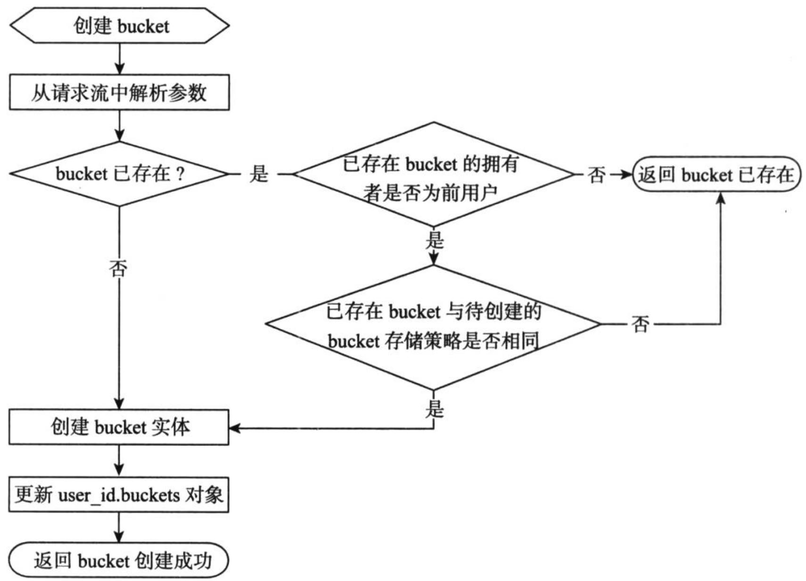


图7-10 存储桶创建流程


1）从HTTP请求流解析出相关参数：对于S3 API，创建存储桶可携带的信息包括存储桶访问控制列表和存储桶中对象的存储策略，对于Swift API，创建存储桶可携带的信息包括存储桶控制访问列表、存储桶中对象的存储策略、存储桶跨源资源访问信息、是否开启版本管理和自定义的元数据。

2）判断存储桶是否存在：由于同一租户下的不同用户不能创建同名的存储桶，因此如果该存储桶名称已存在且其拥有者不是当前的用户，返回存储桶已存在。

3）创建存储桶：所有的检查通过后开始创建存储桶，首先根据应用指定的对象存储策略，并将存储策略保存在存储桶的管理结构RGWBucketInfo中，然后将存储桶的访问控制列表、跨源资源访问信息、自定义元数据封装对应的KV条目，在索引存储池创建单个或多个索引对象成功后，在domain_root存储池创建一个对象，同时将管理结构RGWBucketInfo保存在该对象的内容中，将KV条目保存在该对象的扩展属性中。

4）更新user_id.bullets对象：创建一个用户的同时，创建一个名为user_id.bullets的对象，用于记录该用户下所有的存储桶列表，保存在该对象的OMAP中。我们知道OMAP由一个头部和多个KV条目组成，针对user_id.bullets对象，OMAP头部保存用户使用空间统计信息（使用结构cls_user_header表示，用户使用空间统计信息主要包括该用户下的对象数目和数目总字节数统计，见表7-10）；OMAP的KV条目保存一个存储桶使用空间统计信息（使用结构cls_user_bucket_entry表示，见表7-11）。


表 7-10 cls_user_header 数据结构


<table><tr><td colspan="2">字段</td><td>含义</td></tr><tr><td rowspan="3">stats</td><td>total_entries</td><td>该用户下对象数目</td></tr><tr><td>total_bytes</td><td>该用户下所有对象总字节数</td></tr><tr><td>total_bytes_rounded</td><td>该用户下所有对象字节数以4k对齐后占用的空间</td></tr><tr><td colspan="2">last/stats-sync</td><td>最近一次同步时间，定时同步时更新</td></tr><tr><td colspan="2">last.stats_update</td><td>最近一次更新时间，当该用户下有bucket创建/删除或用户手动发起同步时更新该字段</td></tr></table>


表 7-11 cls_user_bucket_entry 数据结构


<table><tr><td>字段</td><td>含义</td></tr><tr><td>bucket</td><td>存储桶信息</td></tr><tr><td>size</td><td>该存储桶下对象总字节数</td></tr><tr><td>size Rounded</td><td>该存储桶下对象字节数以4k对齐后占用的空间</td></tr><tr><td>creation_time</td><td>存储桶创建时间</td></tr><tr><td>count</td><td>该存储桶下对象数目</td></tr><tr><td>user.stats-sync</td><td>是否已经与索引对象同步过统计信息</td></tr></table>

# 7.3.4 对象上传

RGW针对对象上传操作设计了两个接口：整体上传对象接口和分段上传对象接口，当单个对象大于5GB时，必须调用分段上传接口才能成功上传对象，当单个对象小于条带大小时，不能采用分段上传方式上传对象。下面分别介绍这两个接口的实现。

# 1.整体上传

整体上传对象分为三个阶段：

1）prepare：在prepare阶段的主要工作是初始化manifest数据结构。

2）handle_data：handle_data阶段，RGW每次从HTTP Server缓冲区中取出rgw_max_chunk_size字节的数据，存放在一个bufferlist中，然后分成一个或多个I/O异步下发到RADOS层，每个I/O的大小等于MIN（rgw_max_chunk_size,next_part ofs-data_ offs)，其中next_part offs表示下一个RADOS对象保存的用户数据偏移位置，data offs表示当前数据的偏移位置。

图7-11以块大小为2MB、条带大小为5MB情况下，用户上传一个9MB的对象为例，给出了handle_data阶段的处理流程。

3）complete：等所有数据上传成功后，对象上传进入 complete 阶段，该阶段的主要工作是将对象元数据更新到 head_obj 中，同时将对象条目更新到索引对象中，以便后续列举对象。

# 2. 分段上传对象

分段上传对象比单个操作上传对象流程更复杂一些，涉及3个接口的调用：

1）初始化：在分段上传数据之前，应用首先调用INITIATE MULTI-PART UPGLOAD接口进行初始化，应用在调用该接口的请求中携带对象的访问控制列表、用户对上传对

象自定义的元数据等信息。RGW网关在此操作中生成一个Uploadld返回给应用，同时在dataextra_pool中生成一个临时对象，用于保存每个分段的信息，并将对象的访问控制列表信息、元数据信息等保存到该对象的xattr中。

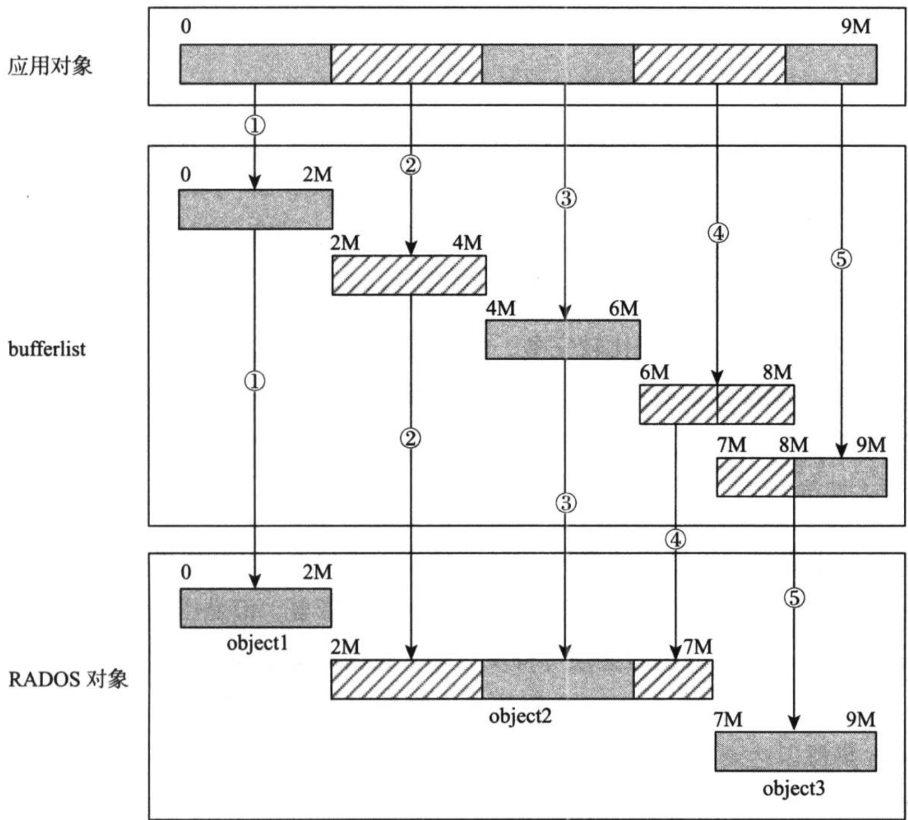


图7-11 应用对象上传流程


2）分段上传：分段上传对象流程跟单个操作上传流程基本一致，不同之处在complete阶段，分段上传对象除了需要将每个分段对象更新到索引对象之外，还需要将每个分段信息更新到初始化时在dataextra_pool中生成的临时对象中。

3）分段上传完成：所有的分段上传完成后，应用需要调用COMPLETE MULTIPART upload 表示对象上传完成。在此操作中RGW会从初始化阶段生成的临时对象中读出各个分段信息，最主要的是分段的manifest，组成一个manifest，然后生成一个head_obj，将这些信息保存到head_obj后，将临时对象删除。

# 7.3.5 对象下载

用户还可以指定对象的某一段（采用(off，length)的形式）下载对象的部分内容，RGW首先从head_obj中读出manifest管理结构，然后根据manifest中定义的规则计算出用户请求的数据段保存在哪些对象中，最后从这些对象中读出数据合并后发送给客户端。

# 7.4 总结与展望

随着最近几年Ceph的火热发展，RGW在很多领域得到了广泛的应用，越来越多的人参与到RGW的开发中来，从而促使RGW的功能越来越完善。经过这几年的不断补充和完善，RGW基本功能已经比较完备，虽然还有些小毛病，比如与S3 JAVA语言有些SDK不兼容、AWS4认证机制有待完善、对象多版本功能还存在一些小问题等，但是基础模块相对已经比较稳定，完全可以用于生产环境。除此之外，RGW以下几个功能特性也非常让人期待：

1）多站点主模式数据容灾备份：Ceph 的基础模块 RADOS 提供多副本的机制实现数据的容灾备份，保证了当某个节点损坏时数据可以恢复，但是由于多副本间要求数据的强一致性，客户端写数据时必须等待所有副本数据同步完成以后才能返回，而写性能受网络的影响比较大，所以 Ceph 集群节点间物理距离不能太远，因此无法在两地部署一个 Ceph 集群以达到容灾备份的目的。RGW 在 Jewel 版本开发的多站点主模式数据备份功能不仅实现了 Ceph 集群间数据备份，而且多个站点可同时对外提供服务，弥补了 Ceph 不能实现两地数据备份的不足。尽管多站点数据间备份是弱一致性（多站点数据同步采用异步复制方式），多站点用户元数据仍然需要通过 master 站点更新，不能满足对数据一致性要求比较高的应用场景，但是对于大部分应用来说已经可以接受。RGW 多站点主备份功能在刚合入的时候发现了不少问题，但是经过近一年的努力，基本上已经稳定下来。

2）支持元数据搜索功能：对象存储适用于海量数据存储的应用场景，如何在海量数据中快速地搜索出所需要的数据非常重要。ElasticSearch 是一个开源的搜索软件，它提供了分布式多用户全文搜索引擎，基于 RESTful 接口。RGW 开发了一个同步插件，该插件可以将 RGW 中对象的元数据自动同步到 ElasticSearch 服务器中，用户搜索对象时首

先用元数据到 ElasticSearch 中搜索出对应的对象，然后到 RGW 中获取对象本身。这样的实现方式有个问题，用户需要同时连上 ElasticSearch 和 RGW 服务器，在两个服务器间不停切换。另外，当用户使用 ElasticSearch 搜索元数据时，无法进行用户认证。因此，社区在考虑用 RGW 作为 ElasticSearch 代理或在 RGW 上封装出新的 API 提供给用户使用，屏蔽用户与 ElasticSearch 之间的直接联系。目前这个方案还在讨论之中。

3）支持NFS访问：为了兼容传统的NAS存储和新型的对象存储系统，便于传统NAS用户将数据迁移到对象存储系统，并且可以通过对象存储接口访问从NAS系统迁移过来的数据，RGW基于nfs-ganesha开发了NFS访问接口。可惜的是，该功能目前还只能支持简单的文件和目录操作。

# 经典重现

——分布式文件系统 CephFS

文件系统伴随操作系统一同诞生，是计算机科学中最基本和最经典的概念之一。Ceph自诞生之日起就被定位为一个分布式文件系统。时至今日，虽然Ceph的三大典型应用场景中，RBD和RGW先后乘着云计算的东风后来居上获得了日益广泛的应用，但是起步最早的CephFS反而一直迟迟未能有所建树。究其原因，一是文件系统采用树状结构管理数据（文件和目录）、基于查表进行寻址的设计理念，与Ceph采用扁平方式管理数据、基于计算进行寻址的设计理念格格不入；二是支持文件系统必然要求Ceph引入集中的元数据管理服务器（作为树状结构的统一入口用于寻址），这又与Ceph去中心化、追求近乎无限横向扩展能力的设计思想激烈冲突。

尽管颇具戏剧性，然而一个不可否认的事实是：RBD和RGW的蓬勃发展反过来又促使Ceph在云计算以外的领域也迅速普及并逐渐变得广为人知。随着传统块、文件存储设备日薄西山，业界期待Ceph作为一个真正意义上的大一统存储系统接管传统存储的呼声越来越高。因此，尽管道阻且长，但是作为替代传统文件存储的重要一环，重启CephFS研究并使之早日进入生产环境已是势在必行。

众所周知，文件系统中元数据的组织和索引方式极大程度上决定了文件系统的功能和性能。CephFS基于MDS（MetaDataServer）对元数据进行管理。容易理解，Ceph的分布式基因使得MDS管理元数据的方式注定与传统文件存储不同，而是有其自身特点：

□采用多实例消除性能瓶颈和提升可靠性

□采用大型日志文件和延迟删除日志机制提升元数据读写性能。

□将Inode内嵌至Dentry中来提升文件索引效率。

□采用目录分片重新定义命名空间层次结构，并且目录分片可以在MDS实例之间动态迁移，从而实现细粒度的流控和负载均衡机制。

本章按照如下形式组织：首先，我们介绍文件系统相关的背景知识、术语（例如超级块、Inode、Dentry、软硬链接等）和 CephFS 的整体设计框架；其次，高效的元数据组织和索引方式是打造高性能文件系统的关键技术之一，在 CephFS 中，这项任务由 MDS 基于动态子树分区法完成，后者和 CRUSH 一起，并称为 Ceph 两大核心设计，我们介绍 MDS 内部实现细节并着重介绍基于动态子树分区法的负载均衡机制；最后，我们探讨通过主备、多活等工作模式将 MDS 推广至 Ceph 这类纯分布式存储系统的思路以及相关异常处理机制。

# 8.1 文件系统基础知识

正式介绍MDS之前，先来了解一下文件系统的基础知识。本节主要介绍什么是文件系统、文件系统中的元数据、硬链接和软链接、日志等等，这对理解MDS的实现原理有非常大的帮助。

# 8.1.1 文件系统

在使用计算机过程中，需要对数据进行读写等一系列的操作。比如存储一份数据，只需要打开文件编辑器写入数据点击保存，文件内容最终会保存到磁盘上，但我们并不知道这些数据存储在磁盘的具体位置；同理，获取一份数据时，也只需要知道对应的文件名和所在目录，使用相关应用程序打开即可，同样不需要关心从磁盘的具体哪个位置来获取。其实当我们在保存和读取文件时，需要操作系统通过文件系统来完成一系列动作，才能定位到磁盘的具体位置来存储或者读取数据。那么什么是文件系统呢？简言之，文件系统是一种针对磁盘（或者其他存储介质）上的用户数据进行组织和追踪的机制，其中元数据负责记录用户数据位置、所有者、访问权限、修改记录等关键信息，本身也要和用户数据一并写入磁盘。

常见的本地文件系统有：Ext2/3/4、XFS、BTRFS、FAT、NTFS；常见传统网络文件

系统有：NFS、CIFS。随着互联网的快速发展，数据规模越来越庞大，企业对存储的要求也越来越高，传统的文件系统已经不能满足需求，分布式文件系统应运而生，常见的有：CephFS、Lustre、HDFS、GFS、GlusterFS等。

文件系统种类繁多、形态各异，那么类似Linux/Unix这样的操作系统应该如何去适配这些文件系统呢？以Linux操作系统为例，它通过一个名为VFS（Virtual File System）的虚拟文件系统，要求所有接入文件系统必须实现VFS所定义的统一并且符合POSIX语义的接口，以此来屏蔽不同的本地文件系统以及网络文件系统之间的差异，这个过程如图8-1所示。

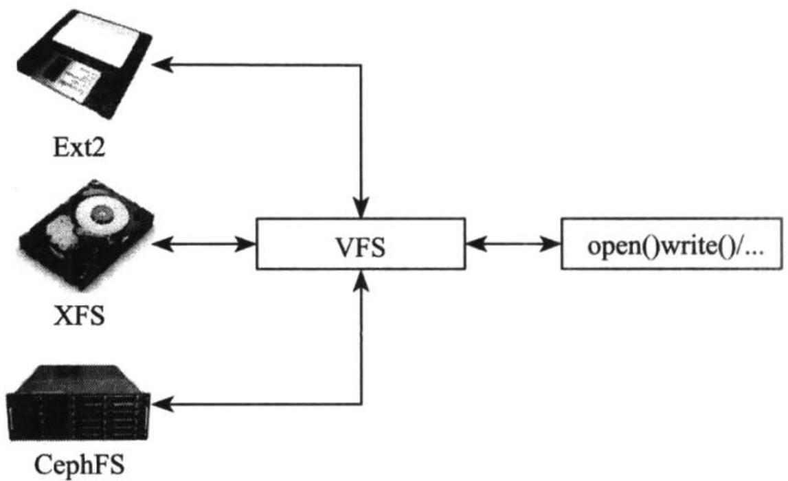


图8-1 通过VFS屏蔽底层不同文件系统之间的差异同时对外提供标准的POSIX接口，来适配不同的网络文件系统


图8-2展示了VFS在Linux操作系统中的位置和作用：


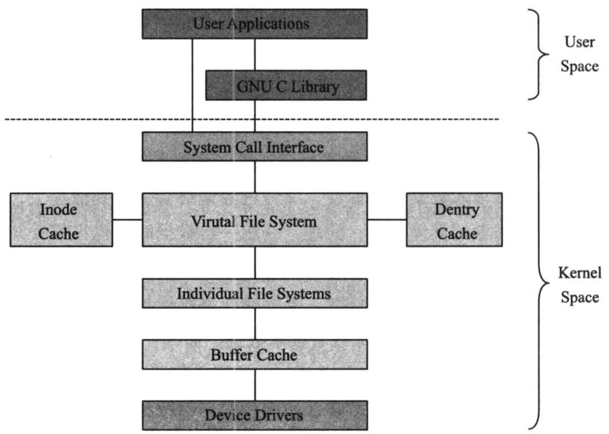


图8-2 VFS在内核中的位置及作用


# 8.1.2 文件系统中的元数据

实现上，VFS 为了适配不同类型的文件系统，定义了 4 种基本数据类型，分别为：SuperBlock，用于管理某一类文件系统信息；Inode，类 Unix 文件系统中的一种数据结构，每个 Inode 保存文件系统中的一个文件系统对象（包括文件、目录、设备文件、socket、管道等等在内）的概要信息，但不包括文件名和文件内容本身；Dentry，类 Unix 文件系统中某个 Inode 的链接，通过它们连接不同的 Inodes，并最终实现文件系统目录树功能。Dentry 是一个内存结构，由文件系统在内存中直接建立，Dentry 中包含了文件名、文件的 Inode 号等信息；File（文件操作句柄），和进程相关，表示一个打开的文件，File 和 Inode 之间是多对一的关系，因为多个进程可以打开同一个文件，每一次打开操作，系统都会创建一个 File。

上述四种基本数据类型中，SuperBlock 和 File 用于面向前端（客户端）提供服务，而 Inode 和 Dentry 则需要后端（服务端）文件系统提供服务功能。Inode 和 Dentry 是理解文件系统中数据组织形式的关键，下面重点进行介绍：

# (1) Inode

Inode 只记录数据块在存储介质上的位置和分布，以及文件对象属性（包括权限、属性组、数据块信息、时间戳等）信息，不包含文件名、内容等变长数据，这样可以使得 Inode 结构大小固定，方便查找。但我们发现要找到具体的存储位置，还缺少文件在目录树中的位置信息，因此需要引入 Dentry。

# (2) Dentry

Dentry 在文件系统中起到连接不同文件对应 Inode 的作用。Dentry 包含文件名、文件 Inode 等信息。一般而言，在 Linux 操作系统下，读取或者写入文件时，需要给出文件所在的绝对路径或者相对路径，文件系统查找文件实际就是按照给出的路径从当前目录（如果是绝对路径，则从根目录开始）到叶子（文件）进行深度遍历的过程。所有文件入口都从根目录开始，而 Dentry 是连接目录到文件之间的关键要素，原理如下：本级 Dentry 记录了本级目录或者文件名以及下一级目录或者文件的 Dentry 位置（为了快速搜索，也会记录上一级目录的 Dentry 位置），此外，因为 Dentry 本身也需要承载在具体的 Inode 对象中，所以 Dentry 也有自己的 Inode 号（根目录的 Inode 号一般默认设置为 1）。Dentry 的内容就像一张表，记录文件名与 Inode 之间的映射关系，而 Dentry 的 Inode 就

像纽带，根据映射关系将它们连接起来，最终组成从根到叶子节点的完整路径，即构成了文件系统目录树。文件Dentry中记录的Inode会指向具体的存储介质的位置和范围，以实现文件内容的获取。上述过程如图8-3所示：

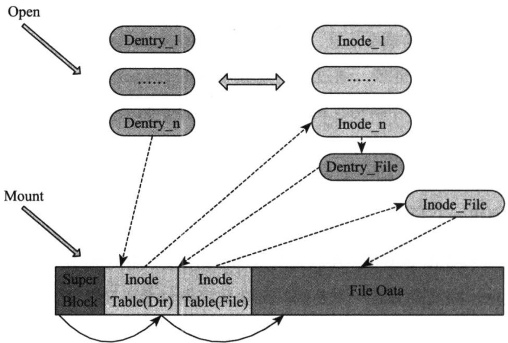


图8-3Dentry与Inode的映射关系


# 8.1.3 硬链接和软链接

文件系统中，为了实现文件共享、隐藏文件路径、增加权限安全和节省存储空间等功能，还需要引入链接这个重要的概念。链接包括硬链接和软链接两种方式。

硬链接指多个文件名指向同一个 Inode 号，即相同的存储内容可以使用不同的文件名来表示，特点是目录不能用来创建硬链接（防止出现目录环）、删除一个硬链接不影响其他文件（即只有所有指向同一个 Inode 的所有文件都被删除，文件才会被真正删除）、只能对已经存在的文件创建和不能跨文件系统进行链接，一般可以通过 ln/link 命令来创建，目录中隐藏的、和.. 就是典型的硬链接。

软链接即创建一个新的 Inode，Inode 存储的内容是另外一个文件路径名的指向，即软链接和普通的 Inode 除了存储的内容不同，没有其他差别。它的特点是可以灵活地实现诸多不做限制的要求：既可对存在或者不存在的文件和目录创建软链接，也可以链接到不同的文件系统，还可以在删除链接时不影响指向的文件等。图 8-4 展示了软链接和硬链接之间的关系。

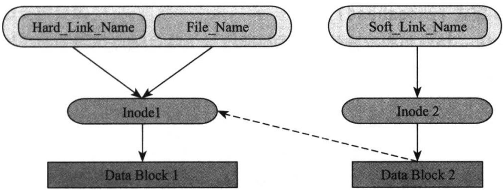


图8-4 软链接与硬链接的关系


# 8.1.4 日志

日志是一种特殊的文件，用于循环记录文件系统的修改，并定期提交到文件系统进行保存。一旦系统发生崩溃，则日志会起到一个检测点的作用，用于恢复尚未保存的数据，防止文件系统出现数据（包括元数据和数据）丢失。图8-5所示的是典型的日志文件系统写入流程。

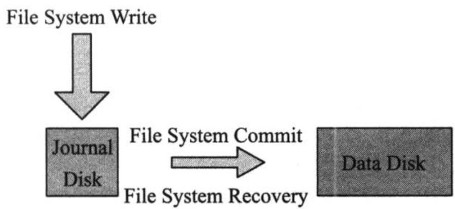


图8-5 日志文件系统写入流程


日志文件系统有许多种类，但常见的设计模式无非有以下3种：

# (1) rewriteback 模式

writeback 模式只有元数据会被记录到日志，而数据仍然写入数据盘。这样虽然可以保证元数据一致性，但可能引起数据崩溃，例如在日志写入后、数据写入前系统发生崩溃的场景。

# (2) ordered 模式

ordered 模式也是只将元数据写入到日志，但前提是数据已经写入了数据盘。这样可以保证系统崩溃后日志数据与文件系统的一致性，缺点是不能最大限度地保证数据不丢失，例如在数据写入后、元数据写入前系统崩溃的场景。

# (3) data 模式 (writeahead)

data 模式将元数据和数据都记录到日志中，这样可以最大程度的防止文件系统崩溃和数据丢失，但由于数据写入了两次，性能会下降。

日志提交有两种常见的策略：超时提交和满时提交。超时提交指在规定时间到达后，日志内容会主动同步到数据存储介质上；满时提交是指日志存储空间已经达到上限，会触发同步数据到存储介质上。一般文件系统会同时启用这两种策略，来最大程度的保证数据安全和一致性。

# 8.2 分布式文件系统 CephFS

# 8.2.1 CephFS设计框架和背景

一般而言，相较传统文件系统而言，分布式文件系统的最大特点是具有良好的横向扩展性，同时性能随存储规模呈线性扩展，而要实现这些目标则必须要对文件系统命名空间分而治之，即通过多服务器实现负荷分担和负载均衡；另外，为了实现快速索引元数据信息以提升性能，将元数据和用户数据进行分离则是必然的选择。

为了实现文件系统数据（包含元数据和用户数据）负载均衡，业界有如下几种分区方法：

# (1) 静态子树分区

即通过手工分区方式，将数据直接分配到某个服务节点上，出现负载不均衡时，再由管理员手动重新进行分配，比如 Sprite、StorageTank 和 PanFS 等就是使用这种方法。很明显这种方式只适应于数据位置固定的场景，不适合动态扩展、或者有可能出现异常的场景。

# (2) Hash 计算分区法

即通过 Hash 计算来分配数据存储位置。这种方式适合数据分布均衡、且需要应用各种异常的场景，但不太适合需要数据分布固定、环境变化频率很高的场景，例如：因为元数据访问频率的不同，所以想要保证 MDS 的负载均衡，则必须要求 MDS 中的元数据对象能根据负载来进行分布，另外元数据热点信息容易频繁的变化，不适合使用 Hash 的方式来重新计算分布。

# （3）动态子树分区

通过实时监控集群节点的负载，动态调整子树分布于不同的节点。这种方式适合各种异常场景，并且能根据负载动态调整数据分布，唯一的缺点是不太适合大量数据的迁移场景，因为大量数据的迁移会导致业务应用性较差，而对于有少量元数据迁移的场景则特别适合，这也是CephFS默认的分区方式。

在采用动态子树分区法的基础上，CephFS 为了达到最佳的扩展性和性能，将元数据和业务数据进行了分离，并且统一存储到 RADOS 层。存储海量数据的 RADOS 实际上是基于 Hash 计算方法来实现的，刚才我们描述过元数据其实不太适合使用 Hash 这种方式进行存储，那为什么 CephFS 的元数据仍然使用基于 Hash 方式的 RADOS 层来保存呢？原因在于：CephFS 元数据访问并不是直接从 RADOS 层获取，而是存在一个元数据缓存区，其中元数据基于动态子树分区的方式进行分配，因此元数据落盘方式则显得无关紧要，为了简化设计以及利用 RADOS 的共享存储功能，缓存中的元数据最终落盘于 RADOS 层，则成为最优选择。在了解了上述设计背景的情况下，我们再来简单了解下 CephFS 的整体架构，如图 8-6 所示。

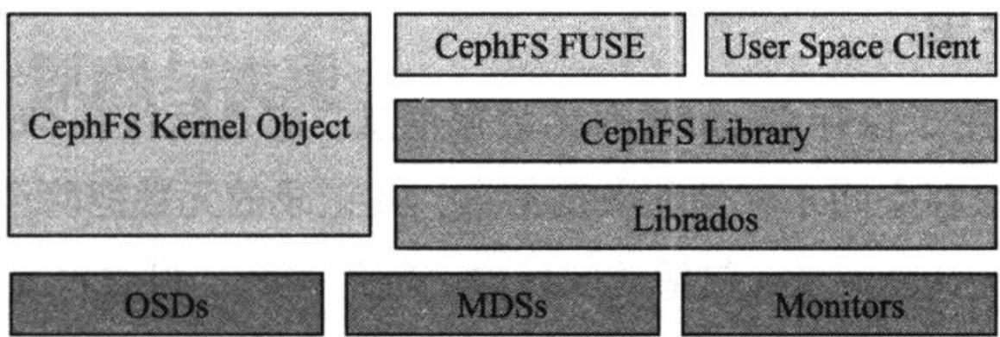


图8-6 CephFS架构


图8-6中，OSDs提供存储服务，Monitors提供管理服务，它们共同组成RADOS层，用于存储CephFS文件系统的业务数据和元数据。MDSs则提供内存元数据服务，为了加快元数据访问效率，MDSs将大部分热点元数据都缓存到内存中，从而避免低效的通过RADOS层来获取元数据。

为了外部应用能够方便的接入和使用 CephFS，CephFS 一共存在如下三种形式的客户端（接口）：

# (1) CephFS Kernel Object

为内核态接口，3.10 以后的内核版本默认支持，它通过 mount -t ceph 命令将 CephFS 挂载到操作系统指定目录下。

# (2) CephFS FUSE

指基于FUSE（FUSE全称是Filesystem in Userspace即用户空间文件系统，是指完全在用户态实现的文件系统，由Linux在内核模块进行支持。通常文件系统作为操作系统的重要组成部分在内核中实现，但缺点是内核态的代码难以调试，特别是一些新兴的网络文件系统更新换代较快的情况下。为了解决上述问题，Linux在2.6.14内核版本开始增加FUSE模块来实现文件系统在用户态的适配）的用户态接口，通过ceph-fuse命令将CephFS挂载到操作系统指定目录下。

# (3)UserSpaceClient

为直接通过客户端应用程序调用 CephFS 提供的文件系统接口，比如 Hadoop 调用 CephFS 提供的 Java 文件系统接口实现文件存储。当然除了支持 Java 语言接口，CephFS 还支持 Python 和 $\mathrm{C} / \mathrm{C}++$ 文件系统接口。

上述三种类型的客户端（接口）各有自身的特点，上层应用可以根据自身需求灵活进行选择。

# 8.2.2 MDS的作用

简言之，MDS用于保存CephFS的元数据信息，它是运行在Ceph服务侧的守护进程，使用动态申请缓存空间来存储元数据信息，其记录的元数据除了文件在磁盘中的位置，还包括文件名、文件属性（包括访问权限、创建时间、组对象等）、归属目录、子树分割以及诸如快照、配额在内的一些高级特性。

在元数据和用户数据分离的文件系统中，高效的元数据性能对整个系统性能至关重要。研究表明，元数据访问占整个文件系统访问比重的 $30\% \sim 70\%$ ，因此MDS的性能好坏直接决定CephFS文件系统性能的优劣。接下来我们分析MDS在设计和实现上具有哪些特点：

首先，Ceph的基本存储单元是对象，这可以最大限度地减少元数据的数量。因为对象比一般的文件块要大，所以同样大小的文件需要记录的对象数量更少，这样就可以保证需要记录的、每个文件的元数据结构也较小。由此带来的另外一个好处是Inode数据可以内嵌到Dentry中（事实上Inode的保存有两种标准，即BSD's FFS和C-FFS，其中BSD模式是Inode保存在Table中从而最终保存到磁盘上，C模式就是将Inode直接嵌入到Dentry中。对比测试表明，使用C模式的文件系统要比BSD模式快 $10\% \sim 300\%$ 。C

模式的缺点在于对硬链接的支持不太友好，需要通过其他扩展功能来解决这个问题，而MDS通过扩展表解决了这个问题，我们将在后文中进行详细描述)。Inode嵌入保存到Dentry的方式，极大地提升了索引Inode的性能，因为在获取Dentry同时顺便将Inode也提取到内存中了，这也有利于将元数据负载均衡应用于分层命名空间。

其次，每个MDS独立更新自己的日志。日志可以保存很长时间（即日志文件的规模可以很大），据此可以筛选出哪些是低频率访问的文件，哪些是高频率访问的文件，以减少低效率的随机访问，并且在MDS失效后简化恢复流程。此外，日志还具有合并I/O操作，提高访问效率的功能。

最后，动态子树分区实现了文件系统的动态负载均衡。Ceph 参考 Farsite（最早使用动态迁移目录实现负载均衡的文件系统）允许 MDS 声明管理子树，通过分布式策略来制定平衡机制，对于配置主备模式的 MDS，在主 MDS 节点异常后，备 MDS 节点可以马上接管服务；对于已经配置多主模式的 MDS，则会将目录树拆分为多个子树（或者单个热点目录子树），保证 MDS 访问负载均衡。

# 8.3 MDS设计原理与实现

# 8.3.1 MDS元数据存储

MDS 的元数据和业务数据都存储在 RADOS 对象（以下统称为 Object）中。进一步的，为了数据安全，MDS 将元数据和业务数据存储在不同的 RADOS 池中，这样的存储方式，非常有利于数据共享，方便 MDS 元数据进行迁移和故障恢复。

# 1. 元数据与 Object 的关系

一个完整的Dentry元数据内容，包括文件名称、Inodes等信息，Dentry自身结构也由一个Inode来标记，用来给上一层的Dentry引用，具体见图8-7元数据对象内部结构图，这些信息都保存在Object中，而Object都存储在RADOS后端，那么这些Object信息该怎么去RADOS中查询定位呢，即怎么避免在元数据中记录Inode与Object的映射关系。我们知道Object在RADOS中都有一个文件名称来标记它，如果我们将记录Dentry的Inode编号设置为Object名称，这个问题就迎刃而解了。虽然Object的大小理论上没有限制，但在实际应用中，Object会被设置为固定大小，比如默认设置为4M。

4M存储空间对于保存一般的Dentry内容绰绰有余，但超大Dentry也很常见（例如某个目录下有很多文件），这样就需要多个Object来保存一个Dentry，这在MDS中通过使用Inode号加Stripe来实现，如下元数据对象文件所示，1000003X是Inode号，00000000是32位的Stripe记录（下面这个例子中Dentry大小都没有超过4M，因此默认没有进行条带切分，即使用多个对象保存）。

```txt
rados -p meta ls  
1000003d33c.00000000  
1000003dfc8.00000000  
1000003d473.00000000  
1000003d063.00000000  
1000003e4b0.00000000 
```

一个标准的 Object 集合，是以相同 Inode 开头加上所有 Stripe 的 Objects，它包括一个完整 Dentry 信息。如图 8-7 所示，根目录默认 Inode 编号为 1，它存储根目录下所有文件和目录的 Dentry（注：不包括目录下的 Dentry，目录下 Dentry 由目录本身的 Inode 来管理，即 Inode 只管理目录树中一个层级），Dentry 中记录文件或者目录的名称，以及对应 Inode 编号。如果记录的是文件，则根据 Inode 编号可以找到文件中内容存储在哪些 Objects 中，因为文件内容的 Objects 是存储在数据资源池中，所以在找到记录文件内容的 Objects 地址后，元数据查找也就此终止；如果记录的是目录，则根据 Inode 编号可以找到下一级目录中 Dentry 存储在哪些 Objects 中，并去元数据池中获取 Objects 信息，找到的这一级目录 Objects 中也会记录它下面所有文件和目录的 Dentry 信息，如图 8-7 中 Inode 等于 100 记录了 hosts 等文件和目录信息，以及它们对应的 Inode 编号。元数据就如上面介绍一级一级的组织目录和文件，如一棵倒树形结构，从根（根目录）到树干（子目录）直到叶子（文件）结束。

需要注意的是，元数据不是直接写入到后端 Object 中，而是先顺序写入到条带化、固定大小的日志中，后者根据落盘策略再写入到后端 Object 中。日志的加入减少了操作延时，在负载较重的情况下通过日志可以保持 I/O 速率均衡，这部分我们将在下面的章节进行详细的介绍。

# 2. 嵌入式 Inode 和 Primary Dentry

对一个文件路径进行解析是通过加载它的 Inode 和 Dentry 来实现的。为了提升性能，文件系统通常将 Inode 放置在 Dentry 附近，这样读取 Dentry 时可以同时将 Inode 获取到，不需要再去获取 Inode。即便如此还是难以保证查找（常用命令，如 ls、find 等）目

录下文件或者文件夹信息时的效率（可能需要到磁盘的不同位置甚至不同磁盘上去查找，很难保证 Inode 还会和 Dentry 存储在一起）。

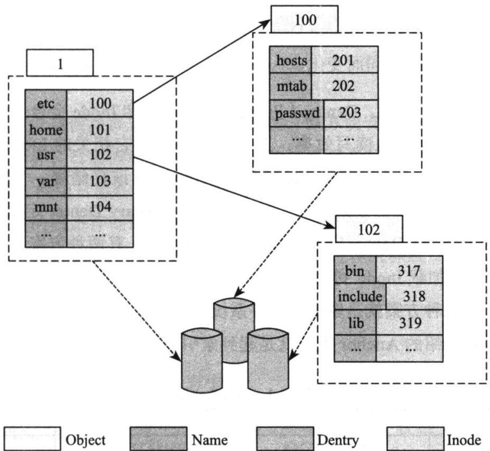


图8-7 元数据对象内部结构


造成以上问题的最终原因是 Inode 和 Dentry 是独立的结构，在标准 POSIX 中，这样设计的原因是存在多个 Dentry 关联一个 Inode 的情况，即硬链接。而在实际使用中，其实硬链接使用场景并不多，且多为临时文件，而效率问题才是我们考虑的重点，因此在 CephFS 中，将 Dentry 和 Inode 的结构进行了合并。通常一个 Inode 对应一个 Dentry，在没有硬链接时，我们将这个 Dentry 叫作 Primary Dentry，并将归属于 Dentry 下面的 Inode 存储到此结构中。一般情况下存储 Dentry 对应 Inode 只占用一个 Object；超过一个 Object 大小的，其扩展 Object 也是存储在一起，这样一次读就可以获取到 Dentry 和 Inode 信息，将此信息放置到缓存并使用 LRU 算法（Least Recently 也就是首先淘汰最长时间未被使用的缓存数据 Used，即最近最少使用算法）进行淘汰。合并后对象增大并不会对读取时延有影响，因为元数据还是存储到 Object，且在一般情况下单个 Object 就可以保存 Dentry 和 Inode 的所有信息，这也是基于对象存储带来的好处。

# 3. RemoteDentry和Anchor表

虽然硬链接的场景不多，但是为兼容标准POSIX文件系统，还是需要实现硬链接功

能。在文件系统基础章节介绍过，硬链接的特性是指向相同的 Inode 号，而在 MDS 中的硬链接是通过多个 Dentry 指向相同的 Inode 来实现，第一个指向 Inode 的 Dentry 是这个文件的 Primary Dentry，后续指向同一个文件 Inode 的 Dentry 我们称为 Remote Dentry，相对于 Primary Dentry 而言，Remote Dentry 可以存在于文件系统层次结构中的任何地方，并且位置还会随应用场景不同而变化。

在上一节中我们介绍过，Dentry（Primary Dentry）和 Inode 会合并记录在同一个结构对象中，为了达到最优的读写效率，上一级目录会将它相关的 Inode 进行合并存储，那么对于拥有多个 Dentry，一个 Inode 的情况，Inode 应该存储哪一个呢？换言之这个 Inode 对象应该存储在哪个目录附近呢？很显然会以 Primary Dentry 定义的目录为标准进行存储，那么以 Remote Dentry 定义的路径该如何访问？有两种方案：第一种方案是像 Primary Dentry 一样加载 Inode 到 Remote Dentry 定义的目录中去，这种方案会导致缓存中有多份数据；第二种方案就是像传统文件系统一样查索引表，这种方案也是 MDS 中使用的方案，下面要介绍的 Anchor 表，就是起到索引表的作用，其结构如表 8-1 所示。


表 8-1 Anchor 表


<table><tr><td>Path</td><td>Inode</td><td>Parent</td><td>Ref</td></tr><tr><td>/test/a222.txt</td><td>1099511886244</td><td>1099511627778#0</td><td>1</td></tr><tr><td>/test/ads</td><td>1099511886254</td><td>1099511627778#0</td><td>1</td></tr><tr><td>/test</td><td>1099511627778</td><td>1#0</td><td>2</td></tr><tr><td>/</td><td>000001</td><td></td><td>1</td></tr></table>

表格中 Ref 是被 Inode 引用的次数（即计数器），Parent 存储了 Inode 父目录的 Inode 和 Fragment_Id（Fragment_Id 由 # 后面的数字表示，指目录分片 ID，参见下文），Inode 字段表示当前目录或者文件的 Inode 号，（Path 在此是虚构出来用来展示的，以便于理解）通过以上 3 个参数，可实现从文件 Inode 到根目录 Inode 路径的回溯，映射出全路径，避免通过一层一层地读取 Dentry 对应的 Inode 来最终获取 Remote Dentry 所指向的 Inode 地址。如表 8-1 所示，/test/a222.txt 和 /test/ads 都为硬链接，如果要找到它们的最终位置，则只需要先通过 / 找到 Object 的 Inode 号，然后找到 /test 对应的 Object 的 Inode 号，最终即可获取 /test/a222.txt 和 /test/ads 的具体位置。

当进行目录重命名时，可能会影响到整个链上的 Inode，此时就需要一个事务来保证整个链上相关的 Inode 同时进行更新，将旧的 Ref 计数减少，新的 Ref 计数增加。如果 Ref 计数达到了零，表示目前已经没有链接需要此引用了，可以从 Anchor 表中移除。对

于在 Inode 表中进行 Dentry 修改操作，首先需要删除旧的 Dentry 记录，然后插入新的 Dentry 记录，如果是删除操作则要减少 Ref 统计，如果是插入操作则要增加 Ref 统计，最后还要判断 Ref 计算是否为 0（用来判断 Dentry 的祖先目录是否可以删除），以上所有步骤都需要放置在一个事务中进行处理，确保 Anchor 表与实际目录结构的一致性。

# 4.日志

大多数文件系统会使用日志保证数据一致性，以方便安全地进行数据更新和写入而不必担心数据被损坏，日志内容在更新完成后会立即被丢弃。相比之下，基于日志文件系统的LFS和hFS使用日志作为主存储结构，原因是日志有卓越的写性能（存储日志一般会使用性能更好的固态存储设备例如SSD、NVRAM等，同时日志会进行顺序读写），而对于日志删除和释放部分，则通常会引入“clean”过程来释放日志的分段信息，从而重新利用日志空间。

MDS 的日志系统使用如下混合模式：

1）更新首先会写入到MDS的日志中；

2）将受影响的元数据标记为“dirty”（指元数据有变化）状态，并在MDS缓存中设置为“pinned”状态（大多数对元数据的操作都需要一定时间才能完成，为了在操作日志时，缓存中的元数据对象不被并行修改，需要锁定它直到操作完成，这称为“pin”）；

3）最终修改会更新到具体目录的元数据对象中，但同时也会做延时处理直到从日志中修剪掉（比如日志空间不够时，会从日志的尾部开始删除），延时处理允许日志可以变得非常大（数百兆字节或更多）。

MDS日志被视为恢复每个MDS节点缓存元数据和文件系统状态的一种手段，它使得MDS不但能获取延迟回写和分组提交等提升写性能的方法，而且不损害元数据的安全性。同时，引入日志能够从两个方面减少Dentry的更新：

首先，在大多数负载情况下，独立的元数据对象会被多次更新，比如多次修改同一个地方或者临时文件创建后立刻删除等等。对于这类情况则没有必要实时更新到元数据对象中，因此可以直接在日志中将这些实际上并未创建、更新的内容过滤掉。

其次，在日志的生命周期内，对给定Dentry的所有更新都被有效地提交，即在这段时间内，所有的更新都被记录在一起并一次性提交到元数据对象中。因此，从这个角度

而言，日志优化了大部分的I/O流程，以一种高效、顺序和限制随机更新元数据对象数目的方式来操作元数据对象。

日志除了支持故障恢复，还允许在恢复MDS时启用其缓存保存大量热元数据，热元数据来自日志，避免从冷缓存（即从后端RADOS中随机读取到缓存中）开始的低效率加载而导致大量等待获取元数据的I/O，最终加快MDS恢复，快速为客户端提供CephFS文件系统服务。

每一个MDS会维护一个日志系统，其日志中保存了最近创建和修改，但还未提交到Object文件中的内容，日志被切分为固定大小且有序的Object。正常负载时，MDS会为每一个日志操作启用单独的I/O操作，目的是为在有更新时提供最小的时延，但在负载较重的情况下，为了避免大量日志小文件写操作导致存储瓶颈，MDS只有在小日志文件增加到一定比例的情况下，才下发一次I/O操作。

最后我们来分析一下日志中最重要的一个结构：日志条目，MDS 使用它来跟踪元数据变化信息，这些信息还未被提交到每个目录元数据对象中。日志条目使用 Metablob 来描述单个元数据更新，每一个 Metablob 包含一个或者多个目录的 Fragment ID、Dentry 和 Inode，Metablob 中单个条目的更新都可能涉及要连接它的祖先目录（祖先目录的概念见 8.3.2 节中的介绍），因为更新需要同步到上层目录，同时日志条目中也会记录祖先目录信息，记录祖先目录信息的目的是在日志恢复时可以快速定位元数据在目录树中属于哪一个层次，除了 Fragment、Dentry 和 Inode 被 Metablob 用来描述其更新状态，在日志条目中还包含 Anchor 表的更新处理、Inode 编号的分配、Inode 截断处理（比如大于默认 4M 的 Inode）和客户端访问操作状态记录。

# 8.3.2 MDS负载均衡实现

# 1. 元数据负载实现背景

随着文件系统的规模越来越大，将元数据均衡地分布到多个节点上成为横向扩展的必要条件。许多分布式文件系统使用静态子树分区（Static SubtreePartition）的方式来实现，即固定地将不同层目录树分配到不同的服务器上，可想而知负载和目录树的位置也是静态的，随着管理空间不断扩大，还需要系统管理员手工重新分配，此外工作负载的瞬时变化也不利于服务器硬件的最优使用。

Ceph则使用动态子树分区（Dynamic SubtreePartition）来实现横向扩展，动态子树能够根据负载情况自动迁移目录树，同时为了实现多个MDS管理目录的负载而支持细粒度分区（这里指对目录进行分片处理）。从性能和冗余的角度考虑，支持客户端节点只与最小范围内的MDS进行交互，以实现最小路径元数据查询，在部分不相关的MDS异常时还能正常获取元数据。复制祖先元数据到本地MDS缓存中，是为了支持目录路径解析和访问控制，但这样会带来一个问题，即过多复制祖先元数据会导致MDS缓存过大，而缓存过大又会导致元数据查询效率降低，因此需要严格控制复制到MDS缓存中的祖先元数据个数。

Ceph创始人Sage Weil重点研究了在MDS缓存中存储元数据，并且可促进伸缩性和容忍任意MDS节点异常。动态子树技术和CRUSH成为构建Ceph分布式系统的两大关键优势。

# 2. 目录分片

在了解子树分区和元数据复制功能之前，先来介绍一下目录分片技术。

元数据的复制只便于读操作，而子树通常按目录层次结构粒度进行分区。以上两种机制都不能很好地处理存在单个超大型目录或者目录超负载的情况下的更新操作。此外，目录元数据存储方式（最理想的情况是每个目录的Dentry和Inodes只写入到一个对象）不能很好地应用到大型目录结构中，因为在这种情况下预读取整个目录的成本太高。

为了解决这两个问题，Ceph扩展了目录层次结构以允许单目录内容被分解为多个片段，称为Fragments。容易理解，目录Inode和Fragments是一对多的关系，即单个目录管理一个或者多个目录Fragments，目录Fragments关联具体某一部分的Inode信息，大部分情况下，由一个Fragment管理所有的目录内容就已经满足要求，但在目录内容比较多的情况下，就需要启用多个Fragments来实现负载平衡。Fragments存储在目录Inode的FragTree的结构中，它基于一个内部顶点开始进行2的N次幂分割，如图8-8所示，目录树被分割为一个或者多个Fragments，其中树叶是单独的Fragments。

从图8-8中可以看到，每一个Fragments通过bitmask值来进行描述，类似ip地址与netmask。例如01/2表示对二进制01进行2bit掩码；1100/4表示对二进制1100进行4bit掩码。通过Hash文件名称和在FragTree中查找的结果值，来实现目录Inode到Fragments的映射。

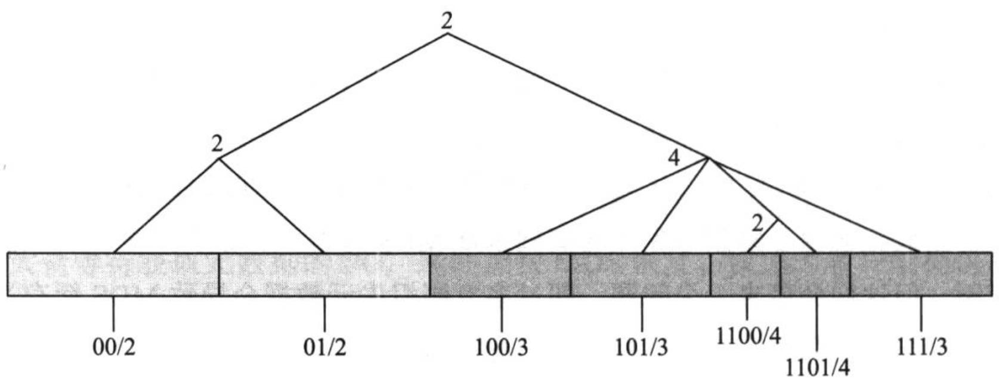


图8-8 Fragments分区


每一个目录下的 Fragments 元数据存储在单独对象中，这样超大目录的预加载的问题就可以得到解决，比如在 readdir 命令执行时，会以顺序方式读取相关的 Fragments 对象到缓存，保证应用程序能快速访问目录内容。由于子树元数据被定义在一组目录 Fragment 中，所以可以通过在 MDS 之间迁移 Fragment 来实现负载均衡，任何 Fragments 在变大或者繁忙时，都能够被分裂成 $2^{n}$ 个子 Fragment，与此相反，如果 Fragment 负载降低或者目录被销毁，则 Fragment 可以进行合并操作。当然分离和合并 Fragment 会产生一定的 I/O 成本，因为这两种操作都会涉及对每个 Fragment 元数据对象的操作。Fragment 是子树分区、元数据复制、子树迁移等功能的基础，后面几节会对 Fragment 在这些功能模块中的应用做更加详细的介绍。

# 3.子树分区

Ceph 支持在 MDS 集群中，允许任意和自适应的进行子树分区（分割）文件系统，同时还提供单一的命名空间，尽管生成的子树在不同的 MDS 节点上，但它支持原子粒度的重命名和硬链接等操作。Ceph 为了负载均衡允许使用 Fragment 的方式对目录进行分割来代替目录定义子树，目录定义子树使得目录在负荷中变成了不可分割的单元，比如同一个目录下有一个或者多个文件是热点繁忙对象，目录定义子树的方式则无法再进行负载分离，但 Fragment 的分割功能则允许将这些热点的文件进行动态分离，变为多个 Fragment，每一个 Fragment 通过其祖先目录中的 Fragment ID 来识别，同时 Fragment 存在 0 个或者多个 bound（目录分割后被切分成并行的几个 Fragment，而这些 Fragment 之间互相称对方为 bound）。

众所周知，文件系统中的元数据是倒树形结构，树的根对应 root 目录，而 root 所在的 MDS 则被设置为 MDS-0，其他的 MDS 则根据当前整个集群中元数据的负载进行子树

分割。而记录分割目录的 Fragment（后面将 Fragment 分割管理的目录片段称为子树）也有 Inode 标记，在祖先的目录中持有这些 Inode 信息。图 8-9 列举了祖先树（Ancestor）、本地子树（Local Subtree）和 Fragment 在 MDS 缓存中的分布：

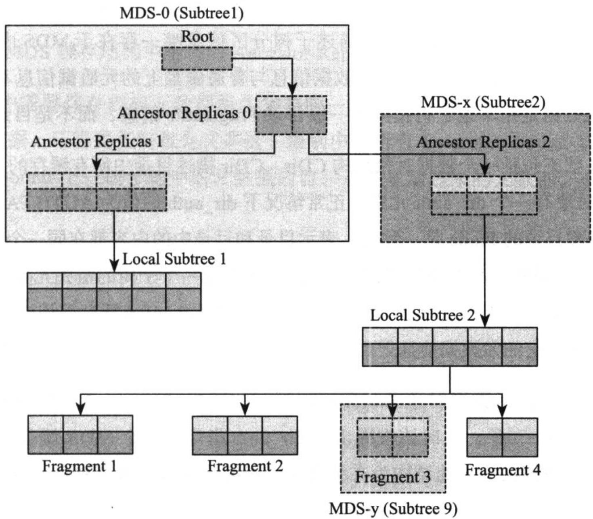


图8-9MDS缓存结构


图8-9中元数据整体上分为3大类：


1）Subtree 1 中虚线表格表示是由 MDS-0 管理的祖先元数据（Ancestor Replicas），并被复制到本地 MDS 缓存中，用来构造根到具体文件的路径；

2）Local Subtree 1 和 Local Subtree 2 中实线表格表示为本 MDS 真正管理的子树元数据，简称为本节点 MDS 的权威元数据，本地权威元数据可以是来自不同 MDS 的 Fragment，如图 8-9 中 Subtree 1、Subtree 2 它们分别来自 MDS-0 和 MDS-x，本地子树元数据通过 Fragments 划分为多个子树边界，形成嵌套子树，如图 8-9 中 Fragment 1 到 Fragment 4；

3）Fragment 3 用虚线表格表示从本地子树分解出来的 Fragment 迁移到 MDS-y 中，以实现热点数据负载均衡。

以上只是展现子树在MDS缓存中的层次结构，实际上缓存中的内容远不止这些，它还包括了非权威的副本元数据、实时状态信息等，在后面几节中会涉及这些内容。

文件系统的命名空间使用子树分区策略可以有效地从目录内容中分离目录的 Inode，比如 / 分配给 MDS0，/usr 分配给 MDS1，其中 /usr 本身的 Inode 被 MDS0 管理，/usr 下面的元数据内容则被 MDS1 管理。描述子树分区信息唯一存在于 MDS 内存和独立的 MDS Journal 中，这里说的子树分区元数据信息与普通磁盘上的元数据信息不同，即这里的子树分区元数据是指本地子树指向上一级目录 Fragments 信息，而不是目录的 Inode。

Fragment 状态包括一个数据对象结构 CDir，CDir 描述目录中所有缓存的 Dentry 信息，每一个 CDir 对象有一个 dir_auth 元素，正常情况下 dir_auth 的值为 AUTH_PARENT，意思是目录的授权和目录的 Inode 是一致的，表示目录和目录中的内容都在同一个 MDS 上，当 dir_auth 的值指向另外一个 MDS，则表示 Fragment 变成一个子树的祖先元数据代理点，真正的元数据信息需要去指向的那个 MDS 上查找，如图 8-9 MDS 缓存结构中 Fragment 3 就只是一个代理点，它的元数据信息需要去 MDS-y 上查找。

高速缓存中任何元数据对象的权限可以通过以下方式确定，即通过父指针指向根，直到到达子树 CDir 对象，此时该权限由其 dir_auth 指定，每个 MDS 缓存维护一个子树分区对应子树的数据结构，此结构为在缓存中以树形结构描述所有对象，定义如下：

```txt
map< CDir*, set<CDir*>> subtree; 
```

下面来举个实例，看看子树分区和子树之间是怎么组织起来的。Fragment作为子树祖先出现在子树映射表中，并在映射表中作为其key值信息，而映射值则是嵌套在此子树下的其他子树集合，示例如表8-2所示。

# 4. 元数据复制

元数据复制有两个重要目的，首先是保证各个MDS节点之间缓存元数据的层次结构，在这里是指各MDS之间协助管理整个用户空间的元数据，保证不同目录层次的元数据都在这些MDS中，当不同层次的目录有变化时，受到影响的MDS能够实时更新来保


表 8-2 子树分区与子树之间关系表


<table><tr><td>MDS</td><td>Path</td></tr><tr><td>MDS0</td><td>/</td></tr><tr><td>MDS1</td><td>/usr</td></tr><tr><td>MDS0</td><td>/usr/local</td></tr><tr><td>MDS0</td><td>/home</td></tr></table>


MDS0子树映射表：


<table><tr><td>子树</td><td>Bounds</td></tr><tr><td>/</td><td>(/usr, /home)</td></tr><tr><td>/usr/local</td><td>()</td></tr><tr><td>/home</td><td>()</td></tr></table>


MDS1子树映射表：


<table><tr><td>子树</td><td>Bounds</td></tr><tr><td>/usr</td><td>(/usr/local)</td></tr></table>

证各MDS节点之间缓存的一致性；其次是MDS之间进行元数据复制操作，保证在MDS失败或者负载过重时能将相应的元数据复制到其他正常的MDS上。

Ceph实施缓存策略来解决MDS致命失败后的恢复，可以简化为以下4个步骤：

1）所有缓存元数据必须与根目录关联，即要缓存MDS权威元数据的所有祖先元数据，见图8-9MDS缓存结构中所有的AncestorReplicas；

2）缓存中需要保存权威元数据祖先父类同一级的 Fragments Bound，即 MDS 除了包含权威元数据，还需要复制祖先父类这一级别中的所有 Fragment bound 数据，但不包含 Fragment bound 下一级子树中的元数据内容，这些复制过来的元数据，在 MDS 定义为副本元数据；

3）持有副本元数据的MDS需要知道副本的原始元数据位置，即副本权威元数据所在MDS的信息；

4）权威元数据必须知道所有该元数据的副本信息在哪些MDS中缓存着。

下面来看看以上这些约束的目的何在，约束条件1）和2）是保证任何一个节点MDS能够解析文件或者目录的绝对路径，当解析path到一个子树的边界时，则复制的祖先元数据能够保证从其他MDS中来获取具体位置，这样可以确保在管理根目录的MDS0失败后，也不会影响子树中绝对路径解析；约束条件2）和3）则保证当访问本地MDS分片边界后，知道去哪个MDS查找；约束条件4）则保证当元数据销毁后，能够通知持有该副本的MDS将缓存中的元数据信息设置为过期。

# 5. 锁机制

每个元数据的复制都会通过锁来进行保护，通过一组简单的分布式状态机来控制MDS能够读/修改给定的字段集。锁会进行细粒度控制，虽然每一个Dentry只通过单个锁来进行保护（控制该元素的命名空间是否可以读取），但每个Inode有5个锁状态，每一个控制不同的相关字段，例如：link计数和anchor状态字段、文件所有者模式字段、文件size、文件mtime字段和Fragment字段。通过锁类型加元数据对象（LockType，Object）方式来获取有序锁请求，以避免死锁。

每一个锁状态机构造了最小化的MDS交互来保护需要更新的字段，通过简单锁保证复制数据一致性和可读性，同时允许使用独占写锁来更新权威元数据。客户端访问模式

有：单客户端、共享读、混合 read/write 和共享写，分散锁管理 Dentry 中 Inode 的 mtime 字段，分散锁的特点是，Fragments 的 Inode 被不同的 MDS 管理时，在锁没有多个组合字段状态下允许并行更新来提高性能，并且更新时允许 mtime 可读。

通常所有的更新操作都会转发到元数据权威对象上进行序列化和日志记录操作。许多操作 link、unlink、resume 会影响多个被不同 MDS 管理的元数据对象，并通过主从模式更新。例如：使用 link 命令创建硬链接，不但会与当前的 MDS 相关联，还会影响到相同 Inode 在不同的 MDS 中的关联，对于同时发起一个增加 link 数量的请求，主从请求分为两个阶段：首先是 prepare 阶段，当所有的从 MDS 都已经记录了一个“prepare”日志事件，则在权威主 MDS 上进行日志一致性更新（有效的提交事务）；其次是 committed 阶段，所有的从 MDS 的日志匹配到“committed”事件，则主 MDS 关闭事务状态。

# 6. 负载均衡实现

每一个MDS会监视统计Inode和Fragment在缓存中的热度。每一个Inode会从读和写两个维度来统计热度，而Fragment则会另外增加readdir操作情况、元数据获取操作频率、写入到对象存储中的频率来统计其热度。子树除了管理自己受欢迎程度，还会在每个子树中维护以下3个维度变量来解决元数据深层内嵌套场景——变量1统计所有嵌套的元数据热度；变量2用于统计当前节点权威元数据的所有嵌套元数据热度；变量3用于统计当前节点权威子树的元数据热度。

在客户端请求时，受影响的元数据计数器会增加，元数据祖先也会受其影响，反过来又影响到复制和迁移的决策。MDS节点之间会定时分享它们的负载水平，以及通过每一个子树的直接祖先，来管理子树元数据组流行程度，这将允许每个负载过高的节点根据热度统计计数器来选择适合的子树进行迁移。热度统计计数器会测量到元数据的访问频率，最终计数器为每个目录测量热度。除了热度计数器，子树目录为了更加精确地进行迁移，会增加一个短的列表来显示客户端最后访问的内容，以及在有新的客户端访问时增加一类扩展计数器来辅助子树迁移。

# 7.子树迁移

通过8.3.1节的介绍，我们知道元数据作为对象保存在RADOS后端，而通过8.3.2节的介绍，我们会发现MDS其实是一个内存缓存池，它为了提高元数据访问的性能，会加载存储在RADOS后端的元数据到内存中，且在多MDS场景下，会根据节点负载情况

分别加载不同的元数据到不同的MDS上，这些不同的元数据就构成了不同的子树。当节点负载发生变化，或者更多时候是MDS上的子树热点有变化时，迁移子树则成为必然。

子树从一个MDS迁移到另外一个MDS上有两种方案，一种方案是将要迁移的最新子树元数据存储到RADOS后端，然后在目的MDS中加载；另外一种方案则是直接将需要迁移的子树从源MDS缓存中动态迁移到目的MDS。显然后一种方案的性能要优于前一种方案，这也是Ceph选择的方案，下面来看看这种方案的实现：首先目的MDS将所有需要迁移的子树元数据副本导入进来，然后源MDS通过日志导出事件提交迁移，同时日志导出完成后，通过ImportFinish事务来关闭。在源MDS迁移之前，任何其他MDS会接收到要复制子树祖先元数据的消息，在复制完成后通知源MDS，因此任何在其他MDS缓存中失效的信息将被重新发送到子树原始信息所在旧的MDS和新的MDS上，以此来获取被迁移子树的元数据信息。

Inode 嵌入到 Dentry 的方式使得子树的迁移成为一种方便可行的方案，它将所有的元数据定义在单一分层的命名空间中，同样基于 RADOS 共享元数据对象，也有助于迁移任意大的子树，因为每次迁移只涉及转移缓存元数据，如果缓存中没有的元数据，则可以直接从共享后端加载。

# 8. 流量控制

元数据负载统计会根据当前节点的硬件资源利用情况，以及客户端访问频率而不断变化，当某个MDS节点上负载瞬间变大，但还不满足子树迁移条件时，MDS可能要应对大量客户端访问同一层次中的文件或者目录，如果成千上万的客户端同时访问一个MDS，那么该节点无法有效地处理请求。存在以上问题的根本原因是客户端可以访问任何给定的元数据，且客户端为了提高访问元数据的效率会记录上次访问MDS的信息，这样也就无法阻止所有客户端访问同一个MDS的场景。如果客户端对元数据在MDS中的分布未知，那么它们的请求则会随机地发送到集群中的某些MDS上，或者需要通过某个MDS进行转发。理想情况下最佳方式是结合以上两者的优点：即对于非频繁访问的元数据条目直接到权威的MDS获取，而频繁访问的条目则分发到多个MDS来获取。

我们应该如何将以上的两个优点利用起来呢？关键点就在于客户端缓存中会保存访问MDS的记录，具体实现如下：首先利用客户端开始查询未知元数据的分布情况，来达到访问各MDS的均衡；然后在客户端访问后会收到MDS回复并复制这些信息，即会

在客户端缓存中缓存未来应该在哪个MDS中来获取元数据信息。对于非频繁访问的条目，MDS集群会告诉客户端直接到权威MDS中获取，对于频繁访问的条目，则MDS集群会告知客户端随机到所有的MDS中去获取，这样就实现客户端访问MDS时的流量控制。

# 8.3.3 MDS故障恢复

故障恢复对于分布式系统至关重要，因为各种异构硬件，跨区域网络等因素增加了故障的可能。Ceph MDS元数据基于日志进行故障恢复，但各种因素促使故障恢复复杂化：首先，日志可能非常大，靠近日志尾部的数据可能已经过时；其次，如果元数据在MDS节点之间进行迁移时出现异常，会引入一些有歧义的权威子树，这需要在故障恢复流程中加以解决；再次，MDS分布式缓存除了依赖日志记录，还大量依赖一些实时记录，比如元数据副本信息，锁状态等（这些数据的信息量太大，如果记录在日志中则太昂贵），因此在故障恢复时需要可靠地建立这些实时信息；最后，打开文件的Inode状态信息独立于命名空间，且只在客户端共享，如果MDS端（Server端）异常导致Inode信息位置有变化时，客户端感知不到，因此故障恢复相应的也需要保证做到客户端应用无感知。

# 1. 日志在故障恢复中的作用

每一个MDS都会维护一份独立的日志，该日志中包含按照时间排列的一系列原子事件，这些事件一般是一些修改操作记录或者新增元数据信息。日志以Segments的方式划分记录，并以子树事件作为Segments的开始部分，子树事件用于描述MDS在这个时间节点对哪些权威子树进行了更改、新增操作。

由于 Inode 条目嵌入在某个层次结构中，因此每次日志更新需要修改相应元数据的祖先的信息，以便定位它在层次结构中的位置。为了避免日志上下文元数据重复，日志中只记录子树到根目录最小范围内的目录元数据信息，且每个 Segment 只记录一次（除非它随后被修改）。在子树和事件之间，每个 Segment 提供了正确解释其包含元数据所需要的内容。

MDS 缓存中的每个脏的元数据（指被修改过的元数据）都被放置在链接列表中，它用于保存被修改的元数据 Segment，且这些 Segment 还未真正刷新到元数据对象中。在旧的 Segment 被从日志尾部修剪之前，仍然由脏元数据 Segment 列表来提供访问。在日志需要一个新的存储对象来保存新的修改时，Segment 会被立即创建，新创建的 Segment

同样也会被链接列表管理。当日志空间不够，需要修剪 Segment 时，则删除整个关联元数据对象的 Segment，以回收磁盘空间。由于 Segment 通过链接列表管理，因此 MDS 通过简单地遍历就可以找到所有相关的 Segment，以最小的开销来修剪它的日志。

# 2.故障检测

每一个MDS会定期将信标消息发送给集群中主Monitor，如果一个MDS在足够长的时间间隔内没有被Monitor检测到，则它会被声明为down状态，并广播至其他所有节点。如果MDS与Monitor的交互中没有收到反馈，则会将自己置为无效状态。

# 3.MDS恢复

MDS 是一个守护进程，它利用 RADOS 作为共享后端存储（包括存储日志对象和元数据对象），因此 MDS 的失败不会导致数据不可用。如果一个 MDS 被标记为 down 状态，那么只需要在另外一个节点上启用新的 MDS 就可以恢复，下面介绍 MDS 恢复流程，分为四个阶段：

# (1) Replay

Replay 阶段也称为日志恢复阶段，它将日志内容读入内存后，在内存中进行回放操作。相对于其他三个阶段，日志回放是相对简单的过程，它开始于第一个完整的日志片段（Segment），MDS 按顺序读取日志事件、修改操作记录和读取顺序元数据信息到它的缓存中，用于恢复在失败 MDS 中还没有来得及提交的元数据，以及初始化新的 MDS 缓存。我们知道日志内容也是通过对象的形式保存到 RADOS 中，它通过读取和写接口来访问分布式存储中的对象，并根据日志标识来检测日志的大小。回放开始于日志最后截断点，即从上次已知点回放（日志定期写入到元数据区后，会删除日志中的记录），每一个日志事件都会进行有序的读取，并通过调用 replay() 方法来恢复它的状态。Replay 完成后，则 MDS 接下来进入到 Resolve 阶段，但如果只有一个 MDS（Resolve 用于确定权威元数据在 MDS 的位置，如果只有一个 MDS 则不需要此步骤），则直接跳过 Resolve 阶段进入 Reconnect 阶段。

# (2) Resolve

Resolve 用于解决跨多个 MDS 出现权威元数据分歧的场景，对于服务端侧包括子树分布、Anchor 表更新等功能，客户端侧包括 rename、unlink 等操作。在 Resolve 阶段，

用于确定日志中还不明确的事务，每个恢复MDS向所有其他的MDS广播Resolve消息，消息内容包括权威子树信息、在失败时导入未知位置子树信息、从属节点向目标节点发起更新请求等。集群中其他正常MDS也会发送类似的Resolve消息到每一个恢复中的MDS。

恢复中的MDS更新自己的高速缓存来反映其他节点上已经明确声明的权威子树。针对最近提交的本地事务，需要将不明确的更新请求信息进行交叉检查（由不同MDS进行），并且生成Replay通知消息到恢复中的MDS。一旦收到所有检测消息，对于不确定的信息，则通过简单地检查该子树是否明确地被另一个MDS节点声明来解决。幸存的MDS也会进行实时检测以了解迁移结果。

最后恢复MDS会修剪掉缓存中所有非权威元数据，保留权威元数据和相关约束祖先元数据。这样做非常有必要，因为恢复的MDS不可能知道在故障发生时，非权威元数据是否有更新、移动、删除等操作。为了保证非权威元数据副本在恢复MDS中的正确性，需要重新去权威元数据所在的MDS进行获取（在Rejoin阶段获取），以此来恢复所有分布式缓存副本，这样做要比从日志中恢复更加可靠。

# (3) Reconnect

文件状态与其他实时状态不太一样，因为它不与其他的MDS共享，而是与客户端的文件系统共享。恢复中的MDS需要与之前的客户端重新建立链接，并且需要查询之前客户端发布的文件句柄，重新在MDS的缓存中创建一致性功能和锁状态。MDS不会同步记录文件打开信息，原因是需要避免在访问MDS时产生多余的延迟，并且大多数文件是以只读方式打开。但是MDS会定期将最近打开的Inode写入日志，客户端通过Inode编号和最后知道的文件名来描述它的状态，如果打开文件Inode没有从缓存中恢复，则通过文件名到目录树中索引得到。

# (4) Rejoin

恢复最后阶段是恢复分布式缓存和锁状态，恢复中的MDS会发WeakRejoin消息到所有MDS节点上，告诉其他节点本MDS恢复了哪些权威元数据，以及需要使用哪些非权威的副本元数据，正常的MDS则会发送StrongRejoin消息到恢复节点，告诉恢复中的MDS自己拥有哪些元数据副本信息，以及正确的锁状态信息。恢复中的MDS接收到正常MDS的Rejoin消息后，会将自己不知道的副本信息加入到缓存中，并更新正确的

锁状态信息。当恢复中的MDS接收到所有正常MDS发送过来的Rejoin消息，并在缓存中加载所有副本信息和锁状态信息后，最终可以将自己设置为活动（Active）状态。

# 8.4 总结与展望

Jewel 版本发布之后，基于主备 MDS 的 CephFS 实现已经能够稳定应用于生产环境，但是基于多活 MDS 的 CephFS 实现则还有待改进，原因如下：

MDS 负载均衡的实现原理看上去不是很复杂，但要准确判断元数据应该选择在什么时机迁移，以及应该从哪个源 MDS 迁移到哪个目的 MDS 实际困难重重，这主要是因为 MDS 仅仅是一个守护进程，它的处理能力强烈依赖于驻留节点上的 CPU、内存、网络和磁盘等硬件资源的使用情况，任何这些因素的变化都会影响到 MDS 的迁移决策。此外，MDS 吞吐量的平衡和性能好坏也很难界定，因为在某些情况下，元数据不平衡的场景反而比平衡的场景性能要好。从代码实现上来看，MDS 为了实现负载均衡功能，需要动态迁移元数据，在迁移过程中会涉及比较多的状态信息，例如：为实现事务一致性需要 5 套锁机制、客户端的状态需要在迁移后实时更新、子树的副本状态维护等等，这些都无形中增加了代码的实现难度，因此在支持子树分区的多 MDS 环境下，系统还不够稳定，不能应用于生产环境。

当然，上述这些都是Ceph社区后续需要重点解决的问题，我们也会更多地参与其中。

# Chapter 2

# 第9章

# 运用之妙

# ——应用案例实战

随着Ceph的应用场景越来越多，在我们应用过程中有一些常见案例，如：

□ Ceph 集群定时 Scrub

Ceph 对接 OpenStack

□ Ceph数据重建配置策略

□ Ceph 集群 Full 紧急处理

Ceph快照在增量备份的应用

□ Ceph 集群异常watcher处理

本章主要就这些常见案例进行介绍，以供参考。

# 9.1 实战案例一：Ceph 集群定时 Scrub

# 1. 背景

Ceph 集群会定期进行 Scrub 操作，在 Ceph 对接 OpenStack 的场景中，如果 Ceph 集群正在进行 Scrub 操作，会对 Scrub 的数据进行加锁，如果 OpenStack 使用 Ceph 作为后端存储的虚拟机此时也在访问该数据，就会导致 OpenStack 中使用 Ceph 作为后端存储的虚拟机可能会出现卡顿现象。

# (1) Scrub 是什么?

Scrub 是 Ceph 集群副本进行数据扫描的操作，用以检测副本间数据的一致性，包括 Scrub 和 Deep-Scrub，其中 Scrub 只对元数据信息进行扫描，相对比较快，而 Deep-Scrub 不仅对元数据进行扫描，还会对存储的数据进行扫描，相对比较慢。

# （2）Scrub默认周期是多久进行一次？

OSD的Scrub默认策略是每天到每周（如果集群负荷大周期就是一周，如果集群负荷小周期就是一天）进行一次，时间区域默认为全天（0时-24时），Deep-Scrub默认策略是每周一次。

# 2. 案例实战

基于对业务运行时间的了解，晚上10点到第二天早上7点为业务闲时，可以进行Scrub操作，本文以此为例进行配置策略的制定。

# 场景：晚22点到第二天7点进行Scrub

先通过tell方式，让Scrub时间区间配置立即生效，具体操作如下：

配置 Scrub 起始时间为 22 点整：

```batch
ceph tell osd.* injectargs "--osd-scrub-begin-hour 22" 
```

配置 Scrub 结束时间为第二天早上 7 点整：

```batch
ceph tell osd.* injectargs "--osd-scrub-end-hour 7" 
```

然后将Ceph集群所有节点的配置文件修改，参考如下：

```txt
vi /etc/ceph/ceph.conf  
[global]  
...  
#备注：增加以下区段配置  
 OSD]  
osd_scrub_begin_hour = 22  
osd_scrub_end_hour = 7
```

这样之后，可以使配置立即生效，即使集群服务重启或者节点重启，配置也会重新从配置文件中加载，永久生效。

# 9.2 实战案例二：Ceph 对接 OpenStack

# 1.背景

Ceph 集群可以作为 OpenStack 的存储后端，分别向 Nova、Cinder 及 Glance 组件提供块设备服务，如图 9-1 所示。

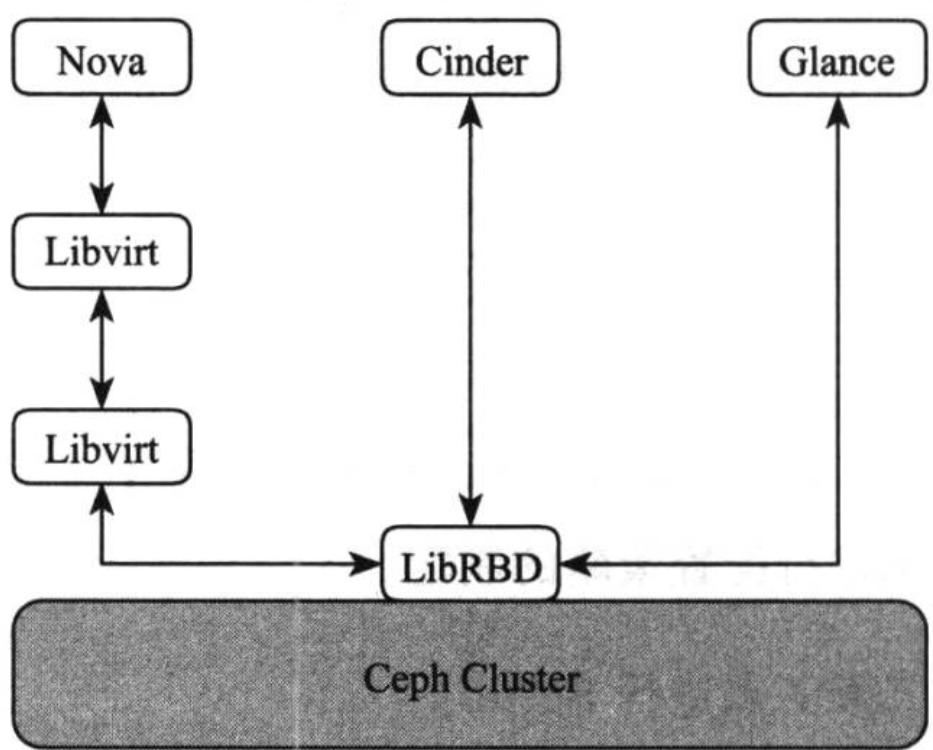


图9-1 Ceph集群分别向Nova、Cinder及Glance提供块设备服务


# 2. 案例实战

# （1）对接前提

□OpenStack处于正常工作状态；

□ Ceph 集群正常工作；

□OpenStack各节点与Ceph集群各节点网络(Public Network)互通。

# （2）安装Ceph客户端

首先在OpenStack所有节点配置好Ceph安装包yum源，在/etc/yum repos.d/目录下新增yum源配置如下（注意：如果已经有Ceph的yum源，则无需重复配置）：

```ini
[ceph]  
gpgcheck=0  
humanname=Packages for ceph and others  
baseurl={your-ceph-repo}  
name=Packages for ceph and others 
```

然后安装 Ceph 客户端，最后将任意一个 Ceph 集群节点的配置文件拷贝到所有 OpenStack 节点中：

```txt
yum install ceph  
scp {ceph-node-ip}: /etc/ceph/* {openstack-node-ip}: /etc/ceph/ 
```

# (3) 创建 Cinder、Nova、Glance 对应存储池

```tcl
ceph osd pool create volumes {pg_num}  
ceph osd pool create images {pg_num}  
ceph osd pool create vms {pg_num} 
```


注意 pg_num 具体设置大小需根据 Ceph 集群规模调整，计算方法可以参照 Ceph 官方网站 pg_num 计算指导。

# （4）配置存储池鉴权

在OpenStack控制节点创建Ceph客户端及存储池的鉴权，生成相应的key文件，并将生成的key文件拷贝到所有其他OpenStack节点：

```shell
ceph auth get-or-create client.cinder mon 'allow r' osd 'allow \ class-read object_prefix rbd_children, allow rwx pool=Volumes, \ allow rwx pool=vms, allow rx pool=images' -o \ /etc/ceph/ceph.client.cinder.keyring  
ceph auth get-or-create client.glance mon 'allow r' osd 'allow \ class-read object_prefix rbd_children, allow rwx pool=images' \ -o /etc/ceph/ceph.client.glance.keyring  
scp /etc/ceph/*.keyring {openstack-node-ip}: /etc/ceph 
```

在OpenStack控制节点修改密钥文件拥有者为对应的组件用户：

```txt
sudo chown glance:glance /etc/ceph/ceph.client.glance.keyring
sudo chown cinder:cinder /etc/ceph/ceph.client.cinder.keyring 
```

在运行nova-compute的节点上，将密钥添加到libvirt，删除临时的密钥文件：

```txt
ceph auth get-key client.cinder | tee client.cinder.key  
uuidgen  
457eb676-33da-42ec-9a8c-9293d545c337 
```

```html
备注：uuidgen 只需要运行一次即可，所有涉及 uuid 的地方都共用这个生成的 uuid cat > secret.xml <<EOF <secret ephemeral='no' private='no'> <uuid>457eb676-33da-42ec-9a8c-9293d545c337</uuid> <usage type='ceph'> <name为客户.cinder secret</name> </usage> </secret>
```

```shell
EOF
#备注:以上cat段落是整个拷贝一次执行
sudo virsh secret-define --file secret.xml
Secret 457eb676-33da-42ec-9a8c-9293d545c337created
sudo virsh secret-set-value --secret \
457eb676-33da-42ec-9a8c-9293d545c337 \
--base64 $(cat client.cinder.key) && \
rm client.cinder.key secret.xml
```

备注：出现删除提示，输入 $\mathbf{y}$ ，回车

# (5) 修改 OpenStack 配置文件

# 1）配置Glance

Glance 有多种后端用于存储镜像，如果默认使用 Ceph 的块设备，则需要对 Glance 组件所在节点进行配置：

```shell
openstack-config --set /etc/glance/glance-api.conf DEFAULT \
"show_image_direct_url" "True"
openstack-config --set /etc/glance/glance-api.conf glancestore \
"defaultstore" "rbd"
openstack-config --set /etc/glance/glance-api.conf glancestore \
"rbdstore_user" "glance"
openstack-config --set /etc/glance/glance-api.conf glancestore \
"rbdstore_pool" "images"
openstack-config --set /etc/glance/glance-api.conf glancestore \
"stores" "glance/store.filesystem.Storage, \
glance/store.http.Storage, glance/store.rbd.Storage"
openstack-config --set /etc/glance/glance-api.conf pasteDeploy \
"flavor" "keystone" 
```

# 2）配置Cinder

想要让OpenStack的Cinder组件访问Ceph的块设备，需要配置Cinder对应的块设备驱动及其他选项，配置如下（该配置适用于单Ceph后端，在Cinder组件所在节点执行）：

```shell
openstack-config --set /etc/cinder/cinder.conf DEFAULT \
"enabled_backward" "ceph"
openstack-config --set /etc/cinder/cinder.conf ceph \
"volume_driver" "cinder.volume.drivers.rbd.RBDDriver"
openstack-config --set /etc/cinder/cinder.conf ceph \
"volumelliackend_name" "ceph"
openstack-config --set /etc/cinder/cinder.conf ceph \ 
```

```tcl
"rbd_pool" "volumes"  
openstack-config --set /etc/cinder/cinder.conf ceph \
"rbd_ceph_conf" "/etc/ceph/ceph.conf"  
openstack-config --set /etc/cinder/cinder.conf ceph \
"rbd Flatten_volume_from_snapshot" "false"  
openstack-config --set /etc/cinder/cinder.conf ceph \
"rbd_maxClone_depth" "5"  
openstack-config --set /etc/cinder/cinder.conf ceph \
"rados_connect_timeout" "-1"  
openstack-config --set /etc/cinder/cinder.conf ceph \
"glance_api_version" "2"  
openstack-config --set /etc/cinder/cinder.conf ceph \
"rbd_user" "cinder"  
openstack-config --set /etc/cinder/cinder.conf ceph \
"rbd_secret_uuid" "457eb676-33da-42ec-9a8c-9293d545c337" 
```

# 3）配置Nova

Nova组件访问Ceph的块设备，需要在运行Nova的各节点上，运行配置如下：

```shell
openstack-config --set /etc/nova/nova.conf libvirt \
"images_type" "rbd"
openstack-config --set /etc/nova/nova.conf libvirt \
"images_rbd_pool" "vms"
openstack-config --set /etc/nova/nova.conf libvirt \
"images_rbd_ceph_conf" "/etc/ceph/ceph.conf"
openstack-config --set /etc/nova/nova.conf libvirt \
"rbd_user" "cinder"
openstack-config --set /etc/nova/nova.conf libvirt \
"rbd_secret_uuid" "457eb676-33da-42ec-9a8c-9293d545c337"
openstack-config --set /etc/nova/nova.conf libvirt \
"inject_password" "false"
openstack-config --set /etc/nova/nova.conf libvirt \
"inject_key" "false"
openstack-config --set /etc/nova/nova.conf libvirt \
"inject_partition" "-2"
openstack-config --set /etc/nova/nova.conf libvirt \
"liveMigration_flag" \
"\VIR_MIGRATE_UNDEFINE_SOURCE,VIR_MIGRATE_PEER2PEER,\VIR_MIGRATE_LIVE,VIR_MIGRATE_PERSIST_DEST\n" 
```

# （6）重启OpenStack各服务

在控制节点，重启Cinder及Glance服务：

```shell
sudo service openstack-glance-api restart  
sudo service openstack-cinder-volume restart  
sudo service openstack-cinder-scheduler restart 
```

在计算节点，重启Nova服务：

```txt
sudo service openstack-nova-compute restart 
```

# （7）验证对接有效性

Ceph 客户端验证：

在OpenStack各节点上，运行命令：

```batch
ceph status 
```

如果能顺利执行，则证明客户端安装成功。

Glance组件对接验证：

在控制节点上，先获取key：

```txt
source /root/keystonerc_admin 
```

然后通过 Glance 上传一个镜像：

```shell
glance image-create --name cirros --disk-format raw \
--container-format ovf --f {your-image-path} 
```

通过查询 Glance 存储池信息，查看镜像是否已经上传到 Ceph:

```txt
rbd ls images 
```

如果查看到镜像信息，则证明 Glance 组件对接成功。

Cinder组件对接验证：

首先在控制节点通过Cinder创建一个空白云盘：

```txt
cinder create --display-name {volume-name} {volume-size} 
```

然后通过Cinder创建一个镜像云盘：

```txt
cinder create --display-name {volume-name} --image-id ${image_id} {volume-size} 
```

通过查询Cinder存储池信息，查看空白云盘及镜像云盘是否已经承载在Ceph：

```txt
rbd ls volumes 
```

如果查看到云盘信息，则证明Cinder组件对接成功。

Nova组件对接验证：

首先通过 Dashboard 创建一个 VM，从刚才创建的镜像云盘启动（前提：有可用网络）：

```css
nova boot --image {image-id} --flavor {flavor-id} --nic net-id={net-id} \{instance-name\} 
```

然后查询 VM 是否创建成功：

```txt
nova list | grep {instance-name} 
```

如果创建的 VM 为 ACTIVE 状态，则证明 Nova 组件对接成功。

# 3. 扩展案例

既然 Ceph 对于 OpenStack 来说只是存储后端的角色，那么很自然地会想：

□多个OpenStack环境是否能对接一个Ceph集群？

□一个OpenStack环境是否能对接多个Ceph集群？

对于第一个问题，从每个OpenStack环境的视角来看，与Ceph集群都是一对一的关系，从Ceph集群视角来看，两个OpenStack都是访问客户端而已，如图9-2所示。

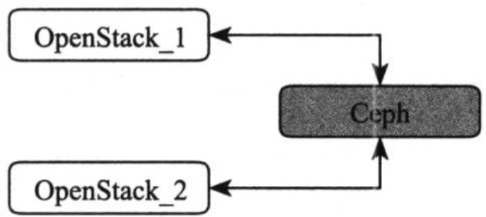


图9-2 两个OpenStack对接一个Ceph集群


所以每个OpenStack环境只需要按照本章的对接步骤进行配置即可，即两个OpenStack可以共用相同的存储池，当然也可以根据需要给另外一个OpenStack环境单独创建存储池。

而对于第二个问题，从OpenStack视角来看，两个Ceph集群就是两个存储后端，从两个Ceph集群角度来看，OpenStack是他们的一个客户端，如图9-3所示：

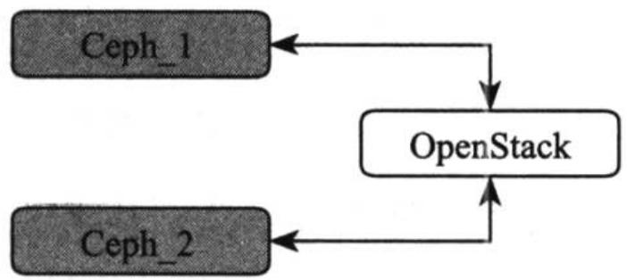


图9-3OpenStack对接两个Ceph集群


但是这里有一个需要注意的地方，在目前的OpenStack版本（Newton）中，只有Cinder是支持多后端的，而Glance是不支持多后端的，所以在OpenStack对接两个Ceph集群的场景下，只能将Glance与其中一个Ceph集群进行对接，即Glance的镜像只能存储在其中一个Ceph集群中，若要进行跨集群创建镜像云盘，是无法充分利用Ceph的COW（Copy-On-Write）特性进行快速创建的，这种情况下，建议非Glance镜像存储的集群只作为空白云盘承载。

# (1) 场景一：两个 OpenStack 集群对接一个 Ceph 集群

第一个OpenStack集群对接Ceph集群的步骤与<配置OpenStack对接Ceph集群>步骤一致，第二个OpenStack集群对接同一个Ceph集群的步骤如下：


本例中，两个OpenStack使用不同的存储池，若需要共用存储池，则不需要额外创建存储池，其他步骤类似。

1）安装Ceph的客户端

同 $<$ 配置OpenStack对接Ceph集群>。

2）在任意一个Ceph集群节点上创建Cinder、Nova、Glance所需的存储池

```txt
ceph osd pool create volumes2 {pg_num}  
ceph osd pool create images2 {pg_num}  
ceph osd pool create vms2 {pg_num} 
```

3）配置Ceph客户端及存储池的鉴权

在OpenStack控制节点创建Ceph客户端及存储池的鉴权，生成相应的key文件，并将生成的key文件拷贝到所有其他OpenStack节点：

```txt
ceph auth get-or-create client.cinder2 mon 'allow r' \ osd 'allow class-read object_prefix rbd_children, \ allow rwx pool=Volumes2, allow rwx pool=vms2, \ allow rx pool=images2' -o /etc/ceph/ceph.client.cinder2.keyring ceph auth get-or-create client.glance2 mon 'allow r' \ osd 'allow class-read object_prefix rbd_children, \ allow rwx pool=images2' -o /etc/ceph/ceph.client.glance2.keyring scp /etc/ceph/*.keyring {openstack-node-ip}: /etc/ceph 
```

在OpenStack控制节点修改密钥文件拥有者为对应的组件用户：

```txt
sudo chown glance:glance /etc/ceph/ceph.client.glance2.keyring 
```

```txt
sudo chown cinder:cinder /etc/ceph/ceph.client.cinder2.keyring 
```

在运行nova-compute的节点上，将密钥添加到libvirt，删除临时的密钥文件：

```txt
ceph auth get-key client.cinder2 | tee client.cinder2.key  
uuidgen  
557eb676-33da-42ec-9a8c-9293d545c338 
```

备注：uuidgen 只需要运行一次即可，所有涉及 uuid 的地方都共用这个生成的 uuid

```html
cat > secret.xml <<EOF  
<secret ephemeral='no' private='no'>  
<uuid>557eb676-33da-42ec-9a8c-9293d545c338</uuid>  
<usage type='ceph'>  
{name}client.cinder2 secret</name>  
</usage>  
</secret>  
EOF 
```

备注：以上cat段落是整个拷贝一次执行

```shell
sudo virsh secret-define --file secret.xml Secret 557eb676-33da-42ec-9a8c-9293d545c338 created sudo virsh secret-set-value --secret \ 557eb676-33da-42ec-9a8c-9293d545c338 \ --base64 $(cat client.cinder2.key) \ && rm client.cinder2.key secret.xml 
```

备注：出现删除提示，输入y，回车

4）修改OpenStack的配置文件

a 配置 Glance

Glance 有多种途径存储镜像，如果默认使用 Ceph 的块设备，则需要对 Glance 组件所在节点进行配置：

```shell
openstack-config --set /etc/glance/glance-api.conf DEFAULT \
"show_image_direct_url" "True"
openstack-config --set /etc/glance/glance-api.conf glancestore \
"defaultstore" "rbd"
openstack-config --set /etc/glance/glance-api.conf glancestore \
"rbdstore_user" "glance2"
openstack-config --set /etc/glance/glance-api.conf glancestore \
"rbdstore_pool" "images2"
openstack-config --set /etc/glance/glance-api.conf glancestore \
"stores" "glance/store.filesystem.Storage, \
glance/store.http.Storage, glance/store.rbd.Storage"
openstack-config --set /etc/glance/glance-api.conf pasteDeploy \
"flavor" "keystone" 
```

⑥ 配置Cinder

想要让OpenStack的Cinder组件访问Ceph的块设备，需要配置对应的驱动及其他选项，配置如下（该配置适用于单Ceph后端，在Cinder组件所在节点执行）：

```shell
openstack-config --set /etc/cinder/cinder.conf DEFAULT \
"enabledbacksends" "ceph"
openstack-config --set /etc/cinder/cinder.conf ceph \
"volume_driver" "cinder.volume.drivers.rbd.RBDDriver"
openstack-config --set /etc/cinder/cinder.conf ceph \
"volume�建端_name" "ceph"
openstack-config --set /etc/cinder/cinder.conf ceph \
"rbd_pool" "volumes2"
openstack-config --set /etc/cinder/cinder.conf ceph \
"rbd_ceph_conf" "/etc/ceph/ceph.conf"
openstack-config --set /etc/cinder/cinder.conf ceph \
"rbd Flatten_volume_from_snapshot" "false"
openstack-config --set /etc/cinder/cinder.conf ceph \
"rbd_maxClone_depth" "5"
openstack-config --set /etc/cinder/cinder.conf ceph \
"rados_connect_timeout" "-1"
openstack-config --set /etc/cinder/cinder.conf ceph \
"glance_api_version" "2"
openstack-config --set /etc/cinder/cinder.conf ceph \
"rbd_user" "cinder2"
openstack-config --set /etc/cinder/cinder.conf ceph \
"rbd_secret_uuid" "457eb676-33da-42ec-9a8c-9293d545c337"
```

$\odot$ 配置Nova

在运行Nova的各节点上，运行配置如下：

```shell
openstack-config --set /etc/nova/nova.conf libvirt \
"images_type" "rbd"
openstack-config --set /etc/nova/nova.conf libvirt \
"images_rbd_pool" "vms2"
openstack-config --set /etc/nova/nova.conf libvirt \
"images_rbd_ceph_conf" "/etc/ceph/ceph.conf"
openstack-config --set /etc/nova/nova.conf libvirt \
"rbd_user" "cinder2"
openstack-config --set /etc/nova/nova.conf libvirt \
"rbd_secret_uuid" "457eb676-33da-42ec-9a8c-9293d545c337"
openstack-config --set /etc/nova/nova.conf libvirt \
"inject_password" "false"
openstack-config --set /etc/nova/nova.conf libvirt \
"inject_key" "false"
openstack-config --set /etc/nova/nova.conf libvirt 
```

```txt
"inject_partition" "-2"
openstack-config --set /etc/nova/nova.conf libvirt \
"live migrations_flag" \
"\"VIR_MIGRATE_UNDEFINE_SOURCE, VIR_MIGRATE_PEER2PEER, \VIR_MIGRATE LIVE, VIR_MIGRATE_PERSIST_DEST\"\" 
```

5）在OpenStack各服务节点重启OpenStack各服务

控制节点：

```shell
sudo service openstack-glance-api restart  
sudo service openstack-cinder-volume restart  
sudo service openstack-cinder-scheduler restart 
```

计算节点：

```txt
sudo service openstack-nova-compute restart 
```

6）验证对接有效性

Ceph 客户端验证：

在OpenStack各节点上，运行命令：

```batch
ceph status 
```

如果能顺利执行，则证明客户端安装成功。

Glance组件对接验证：

在控制节点上，先获取key：

```txt
source /root/keystonerc_admin 
```

然后通过Glance上传一个镜像：

```shell
glance image-create --name cirros --disk-format raw \
--container-format ovf --f {your-image-path} 
```

通过查询 Glance 存储池信息，查看镜像是否已经上传到 Ceph:

```txt
rbd ls images2 
```

如果查看到镜像信息，则证明 Glance 组件对接成功。

Cinder组件对接验证：

首先在控制节点通过Cinder创建一个空白云盘：

```txt
cinder create --display-name test_volume {volume-size} 
```

然后通过Cinder创建一个镜像云盘：

```txt
cinder create --display-name test_imagevol --image-id ${image_id} {volume-size} 
```

通过查询Cinder存储池信息，查看空白云盘及镜像云盘是否已经承载在Ceph:

```txt
rbd ls volumes2 
```

如果查看到云盘信息，则证明Cinder组件对接成功。

Nova组件对接验证：

首先通过 Dashboard 创建一个 VM，从刚才创建的镜像云盘启动（前提：有可用网络）：

```css
nova boot --image {image-id} --flavor {flavor-id} --nic net-id={net-id} \{instance-name\} 
```

然后查询 VM 是否创建成功：

```txt
nova list | grep {instance-name} 
```

如果创建的 VM 为 ACTIVE 状态，则证明 Nova 组件对接成功。

# (2) 场景二: 一个 OpenStack 集群对接两个 Ceph 集群

之前我们也提到了，目前的OpenStack版本（Newton）中，只有Cinder是支持多后端的，而Glance是不支持多后端的，所以在OpenStack对接两个Ceph集群的场景下，只能将Glance与其中一个Ceph集群进行对接。第一个Ceph集群和OpenStack对接与本章案例实战中的配置步骤一致，第二个Ceph集群对接同一个OpenStack集群的步骤如下：

1）在第二个Ceph集群节点上创建Cinder、Nova、Glance所需的存储池

```shell
ceph -c /etc/ceph/ceph2.conf -k \
/etc/ceph/ceph2.client_admin.keyring osd pool create volumes {pg_num} 
```

2）在OpenStack控制节点创建第二个Ceph集群存储池及对应鉴权

在创建之前，必须先将第二个 Ceph 集群的配置文件及 admin 用户的 key 文件拷贝到 OpenStack 控制节点：

```txt
scp {ceph2-node-ip}: /etc/ceph/ceph.conf /etc/ceph/ceph2.conf  
ceph.conf 100% 200 0.2KB/s 00:00  
scp {ceph2-node-ip}: /etc/ceph/ceph.client admin.keyring \ 
```

```txt
/etc/ceph/ceph2.client admin.keyring ceph.client admin.keyring 100% 200 0.2KB/s 00:00 
```

然后在第二个Ceph集群创建存储池：

```batch
ceph -c /etc/ceph/ceph2.conf -k \ /etc/ceph/ceph2.client_admin.keyring osd pool create volumes 256 
```

最后在第二个Ceph集群创建存储池对应鉴权：

```shell
ceph -c /etc/ceph/ceph2.conf -k \
/etc/ceph/ceph2.client_admin.keyring auth get-or-create \
client.cinder2 mon 'allow r' osd 'allow class-read \
object_prefix rbd_children, allow rwx pool=/volumes' -o \
/etc/ceph/ceph.client.cinder2.keyring 
```

3）在OpenStack控制节点修改Cinder配置为多后端

在修改之前，可以在控制节点通过cinder service-list查看当前cinder组件服务进程如下：

```txt
source /root/keystonec_admin  
cinder service-list  
+  
| Binary | Host | Zone | Status | State | Updated_at | Disabled Reason |  
+  
| cinder-scheduler | cinder | nova | enabled | up | 2016-01-04T11:13:10.000000 | None |  
| cinder-volume | cinder | nova | enabled | up | 2016-01-04T11:13:10.000000 | None | 
```

要想修改为多后端，首先需要修改Cinder组件的配置文件如下：

```shell
openstack-config --set /etc/cinder/cinder.conf DEFAULT \
"enabledbacksends" "ceph1,ceph2"
openstack-config --set /etc/cinder/cinder.conf ceph1 \
"volume_driver" "cinder.volume.drivers.rbd.RBDDriver"
openstack-config --set /etc/cinder/cinder.conf ceph1 \
"volume�建立_name" "ceph1"
openstack-config --set /etc/cinder/cinder.conf ceph1 \
"rbd_pool" "volumes"
openstack-config --set /etc/cinder/cinder.conf ceph1 \
"rbd_ceph_conf" "/etc/ceph/ceph.conf"
openstack-config --set /etc/cinder/cinder.conf ceph1 \
"rbd Flatten_volume_from_snapshot" "false"
openstack-config --set /etc/cinder/cinder.conf ceph1 \
"rbd_maxclone_depth" "5"
openstack-config --set /etc/cinder/cinder.conf ceph1 \
```

```txt
"rados_connect_timeout" "-1"  
openstack-config --set /etc/cinder/cinder.conf ceph1 \ "glance api_version" "2"  
openstack-config --set /etc/cinder/cinder.conf ceph1 \ "rbd_user" "cinder"  
openstack-config --set /etc/cinder/cinder.conf ceph1 \ "rbd_secret_uuid" "457eb676-33da-42ec-9a8c-9293d545c337"  
openstack-config --set /etc/cinder/cinder.conf ceph2 \ "volume_driver" "cinder.volume.drivers.rbd.RBDDriver"  
openstack-config --set /etc/cinder/cinder.conf ceph2 \ "volume�建立_name" "ceph2"  
openstack-config --set /etc/cinder/cinder.conf ceph2 \ "rbd_pool" "volumes"  
openstack-config --set /etc/cinder/cinder.conf ceph2 \ "rbd_ceph_conf" "/etc/ceph/ceph.conf"  
openstack-config --set /etc/cinder/cinder.conf ceph2 \ "rbd Flatten_volume_from_snapshot" "false"  
openstack-config --set /etc/cinder/cinder.conf ceph2 \ "rbd_maxClone_depth" "5"  
openstack-config --set /etc/cinder/cinder.conf ceph2 \ "rados_connect_timeout" "-1"  
openstack-config --set /etc/cinder/cinder.conf ceph2 \ "glance api_version" "2"  
openstack-config --set /etc/cinder/cinder.conf ceph2 \ "rbd_user" "cinder2"  
openstack-config --set /etc/cinder/cinder.conf ceph2 \ "rbd_secret_uuid" "557eb676-33da-42ec-9a8c-9293d545c337"
```

# 然后重启Cinder-volume服务：

```batch
service openstack-cinder-volume restart Redirecting to /bin/systemctl restart \openstack-cinder-volume.service service openstack-cinder-scheduler restart Redirecting to /bin/systemctl restart \openstack-cinder-scheduler.service 
```

# 再次查看Cinder组件服务，发现已经多出来2个volume进程了：

```txt
cinder service-list   
| Binary | Host | Zone| Status | State| Updated_at | Disabled \ Reason |   
|cinder-scheduler|cinder |nova|enabled|up|2016-01-04T17:13:29.000000|None|   
|cinder-volume|cinder |nova|enabled|down|2016-01-04T15:47:02.000000|None|   
|cinder-volume|cinder@ceph1|nova|enabled|up|2016-01-04T17:13:27.000000|None| 
```

```txt
| cinder-volume | cinder@ceph2 | nova | enabled | up | 2016-01-04T17:13:27.000000 | None | 
```

然后创建卷类型与后端进行绑定：

```txt
cinder type-create ceph1  
cinder type-key ceph1 set volume�建立_name=ceph1  
cinder type-create ceph2  
cinder type-key ceph2 set volume�建立_name=ceph2
```

最后验证一下是否绑定成功，可以通过分别创建两种类型的云盘进行验证：

```tcl
cinder create --volume-type ceph1 --display_name {volume-name} {volume-size}
cinder create --volume-type ceph2 --display_name {volume-name} {volume-size} 
```

接下来，为了能让 VM 可以访问第二个 Ceph 集群的云盘，我们需要在运行 nova-compute 的节点上，将第二个 Ceph 集群的 cinder 用户密钥添加到 libvirt:

```txt
ceph -c /etc/ceph/ceph2.conf -k \ /etc/ceph/ceph2.client_admin.keyring auth get-key \ client.cinder2 | tee client.cinder2.key 
```

然后与之前cinder.conf中的第二个Ceph集群的uuid进行绑定：

```shell
cat > secret.xml <<EOF
<secret ephemeral='no' private='no'>
<uuid>557eb676-33da-42ec-9a8c-9293d545c337</uuid>
<usage type='ceph'>
"name为客户.cinder2 secret</name>
</usage>
</secret>
EOF
#备注：以上 cat 段落是整个拷贝一次执行
sudo virsh secretdefine --file secret.xml
Secret 557eb676-33da-42ec-9a8c-9293d545c337 created
sudo virsh secret-set-value \
--secret 557eb676-33da-42ec-9a8c-9293d545c337 \
--base64 $(cat client.cinder2.key) && rm \
client.cinder2.key secret.xml
#备注：出现删除提示，输入 y，回车
```

最后我们可以通过将之前创建的两个类型的云盘挂载到OpenStack中的VM验证配置是否生效：

```txt
nova volume-attach {instance-id} {volume1-id} nova volume-attach {instance-id} {volume2-id} 
```

这样，就完成了OpenStack与两个Ceph集群之间的对接配置。


注意

此时 OpenStack 中的镜像只会存储到第一个 Ceph 集群，而且从镜像创建的云盘也只会存储在第一个 Ceph 集群，第二个 Ceph 集群只能提供空白云盘的功能。

# 9.3 实战案例三：Ceph数据重建配置策略

# 1. 背景

在 Ceph 对接 OpenStack 的场景中，如果 Ceph 集群出现 OSD 的 out 或者 in（增加、删除、上线、下线 OSD 等情况），最终都会导致 Ceph 集群中的数据迁移及数据重建，数据迁移及重建会占用一部分网络带宽及磁盘带宽，此时就可能导致 OpenStack 中使用 Ceph 作为后端存储的虚拟机出现卡顿现象。

# 2. 案例实战

# （1）场景一：优先保证Recovery带宽

在对数据安全性要求比较高的场景下，为了保证数据副本的完整性以及快速恢复存储集群的健康，会优先保证数据恢复带宽，此时需要提升Recovery的I/O优先级，降低Client的I/O优先级，具体操作如下（在Ceph任意一个节点或客户端运行即可）：

提升Recovery的I/O优先级（12.0.0版本默认Recovery的I/O优先级为3）：

```batch
ceph tell osd.* injectargs "--osd-recovery-op-priority 63" 
```

降低Client的I/O优先级（12.0.0版本默认Recovery的I/O优先级为63）：

```batch
ceph tell osd.* injectargs "--osd-client-op-priority 3" 
```

待Recovery完成，需要还原配置：

```txt
ceph tell osd.* injectargs "--osd-recovery-op-priority 3"  
ceph tell osd.* injectargs "--osd-client-op-priority 63" 
```

# （2）场景二：优先保证Client带宽

在对数据安全性要求不是很高的场景下，为了降低对用户体验的影响，会优先对Client的I/O优先级及带宽进行保证，此时需要降低Recovery的I/O优先级及带宽，具体操作如下（在Ceph任意一个节点或客户端运行即可）：

降低Recovery的I/O优先级（12.0.0版本默认Recovery的I/O优先级为3）：

ceph tell osd.* injectargs "--osd-recovery-op-priority 1" 

降低Recovery的I/O带宽及Backfill带宽（12.0.0版本默认osd-recovery-max-active为3，osd-recovery-sleep为0）：

ceph tell osd.* injectargs "--osd-recovery-max-active 1"  
ceph tell osd.* injectargs "--osd-recovery-sleep 0.4" 

待Recovery完成，需要还原配置：

ceph tell osd.* injectargs "--osd-recovery-op-priority 3"
ceph tell osd.* injectargs "--osd-recovery-max-active 3"
ceph tell osd.* injectargs "--osd-recovery-sleep 0" 

# （3）场景三：完全保证Client带宽

在极端情况下，如果网络带宽及磁盘性能都有限，这个时候为了不影响用户体验，不得不在业务繁重时段关闭数据重建及迁移的I/O，来完全保证Client的带宽，在业务空闲时段再打开数据重建及迁移，具体操作如下：

在业务繁忙时，完全关闭数据重建及迁移：

ceph osd set norebalance  
ceph osd set norecover  
ceph osd set nobackfill 

在业务空闲时，打开数据重建及迁移：

ceph osd unset norebalance  
ceph osd unset norecover  
ceph osd unset nobackfill 


# 提示

如果在关闭数据重建及迁移期间，数据的其他副本损坏，则会导致副本数据无法完整找回的风险。

# （4）备注

以上三种方案操作配置均为立即生效，且重启服务或者重启节点后失效，如果想长期生效，可以在进行以上操作配置立即生效后，修改所有 Ceph 集群节点的配置文件，如场景二的参考配置：

vi /etc/ceph/ceph.conf 

[global]  
......  
#备注：只需增加以下配置标签内容[osd]osd_recovery_oppriority $= 3$ osd_recovery_max.active $= 1$ osd_recovery_sleep $= 0.4$ 

进行如上操作之后，即使集群服务重启或者节点重启，配置也会重新从配置文件中加载，而不会失效。

# 9.4 实战案例四：Ceph 集群 Full 紧急处理

# 1. 背景

在 Ceph 集群日常运维中，管理员可能会遇到 near_full 或者 full 的告警，但是都不太了解其含义及如何处理此类告警，本文将介绍一下 near_full 和 full 及此类告警情况下的处理方案，以供参考。

# (1) near_full 和 full 是什么?

Ceph 集群中会有一个空间使用率的告警水位，当空间使用率大于等于 near_full 告警水位时，会触发集群进行告警，提示管理员此时集群空间使用率已经到达告警水位，如果管理员没有及时进行扩容或者相应的处理，随着数据的增多，当集群空间使用率大于等于 full 告警水位时，集群将停止接受来自客户端的写入请求（包括数据的删除操作）。

# （2）如何查看当前集群的near_full及full水位？

集群的near_full及full水位可以通过查询Ceph集群节点的MON及OSD获取，方法如下（默认认为集群的MON之间的配置及OSD之间的配置一致）：

# 在MON节点查询MON配置：

```shell
ceph --admin-daemon /run/ceph/ceph-mon.{your-mon-ip}.asok \
config show | grep full_ratio
"mon_osd_full_ratio": "0.95",
"mon_osd_nearfull_ratio": "0.85", 
```

可以看到在MON配置中，near_full的水位为0.85，full的水位为0.95。

然后在OSD所在节点查询OSD配置：

```txt
ceph --admin-daemon /run/ceph/ceph-osd.{your-osd-id}.asok config \show | grep full"mon_osd_full_ratio": "0.95","mon_osd_nearfull_ratio": "0.85", 
```

可以看到在OSD配置中，near_full的水位为0.85，full的水位为0.95。

# (3) 遇到 near_full 的告警该怎么办?

如果集群已经有near_full的告警了，而且也有扩容的设备，那么就可以考虑进行集群的扩容，包括增加磁盘或者增加存储节点。

# （4）遇到full的告警该怎么办？

如果集群已经是 full 的告警了，此时业务已经无法向集群继续写入数据，而此时如果暂时无磁盘或存储节点可供扩容，应该先通知业务及时做好数据保存工作，并对集群进行紧急配置删除一些无用的数据，恢复集群正常工作状态，待扩容设备到了再进行扩容操作。

# 2. 案例实战

# 紧急配置步骤

设置OSD禁止读写

ceph osd pause 

备注：该操作会禁止接收一切读写请求

□通知MON和OSD修改full阈值

```batch
ceph tell mon.* injectargs "--mon-osd-full-ratio 0.96"  
ceph tell osd.* injectargs "--mon-osd-full-ratio 0.96" 
```

□通知PG修改full阈值

```txt
ceph pg set_full_ratio 0.96 
```

□解除OSD禁止读写

```batch
ceph osd unpause 
```

删除相关数据

将配置还原

```txt
ceph tell mon.* injectargs "--mon-osd-full-ratio 0.95"  
ceph tell osd.* injectargs "--mon-osd-full-ratio 0.95"  
ceph pg set_full_ratio 0.95 
```

经过以上步骤，就可以紧急将无用数据删除，让集群恢复正常水位，并给扩容预留了时间。

# 9.5 实战案例五：Ceph快照在增量备份的应用

# 1.背景

随着大数据时代的到来，各行各业的信息化数据急剧增长，数据的安全性越来越受到人们的关注，而在现实生活中，硬件故障、电力故障，甚至是地震火灾等自然或者人为的灾难都是难以避免的，造成的后果也不堪设想，所以完备的容灾备份体系显得越来越重要。在Ceph中，多副本机制及灵活的CRUSH配置从容灾角度保障了Ceph集群数据的安全性，Ceph提供的COW（Copy-on-Write）特性又为我们提供了一个可基于快照技术的备份策略，本小节主要基于Ceph块设备快照技术的增量备份进行实战演练，以供参考。

# （1）什么是容灾和备份？

容灾和备份经常会被混淆，认为是同一个概念，其实容灾和备份是不同的。

首先是目的不同，容灾的目的是为了保障业务的“连续性”，侧重的是业务连续，而备份的目的是为了保证数据的“安全性”，侧重的是数据安全。

其次是手段和时机不同，容灾的手段主要是有一个或者多个可以切换的“备用生产数据”在灾难时进行“生产数据”的接管，时机是“发生灾难时”，而备份的手段主要是将“生产数据”实时或者定时转存到另外的存储介质中去，在灾难来临后可以从转存的数据进行恢复，时机是“发生灾难后”。

但是在实际应用场景中，经常是容灾和备份结合使用，来充分保障业务的连续性及数据的安全性。

# （2）什么是全量备份、增量备份和差量备份？

以我们一周工作日完成的工作内容打个比方，如果周一到周五各做一次备份，那么：

□全量备份：周一备份的是周一的工作内容，周二备份的是周一、周二一共的工作内容，周三备份的是周一到周三一共的工作内容……每次都备份全部的内容，这就叫全量备份。

□增量备份：周一备份的是周一的工作内容，周二备份的是周二的工作内容，周三备份的是周三的工作内容……每次都备份与上一次备份以来增加的内容，这就叫增量备份。

□差量备份：周一备份的是周一的工作内容（以此为基准备份），周二备份的是周二与周一之间的工作内容，周三备份的是周三与周一之间的工作内容……每次都备份当前与基准备份之间的差异内容，这就叫差量备份。

这三种备份方式的差异性，也决定了恢复方式的不同，对于全量备份来说，直接从备份数据恢复即可，对于差量备份来说，必须先恢复基准备份，然后再恢复差量备份数据，而对于增量备份来说，必须按照顺序依次恢复每次的增量数据。

综上，这三种备份方式从备份空间开销来说：全量备份 $>$ 差量备份 $>$ 增量备份，从恢复难度来说：增量备份 $>$ 差量备份 $>$ 全量备份。

# (3) Ceph 块设备的容灾备份

随着Ceph的应用场景越来越广，Ceph应用最频繁的还是给OpenStack提供块设备访问，所以经常会有关于块设备的容灾和备份需求，典型解决方案如两地三中心Ceph集群容灾、RBD-Mirror异步备份，当然还有我们接下来要介绍的基于快照技术的增量备份。

# (4) Ceph 基于 COW 的快照技术

快照，顾名思义就是某一时刻的静态记录，Ceph块设备中的快照就是该块设备在某一时刻的数据静态记录，Ceph的快照技术是基于COW（Copy-On-Write），即做快照时，并不进行数据的复制，只是更新了块设备的元数据（数据量极少），只有在数据进行写入的时候，才会拷贝一份源数据生成快照的对象数据，然后再对源数据进行写入，所以Ceph中的快照，一个是创建起来非常快非常方便，二个是可以借助快照技术，实现我们定期备份数据的需求。

# 2. 案例实战

首先，我们创建一个 image:

rbd create rbd/test_img --size 5000 --image-format 2 

然后，我们写入一部分数据到test.img这个image中（假设这部分数据为Time1_Data）：

```txt
rbd map test_img #备注：为了能写入数据到image，我们先map该image到本地设备/dev/rbd0  
mkfs.ext4 /dev/rbd0 #备注：然后格式化该映射的本地设备  
......  
Writing superblocks and filesystem accounting information: done  
mkdir -p /home/mnt  
mount /dev/rbd0 /home/mnt/ #备注：接着将该设备mount到我们创建的一个文件夹  
echo "Time1_Data" > /home/mnt/Time1_Data #备注：最后写入相关内容  
umount /home/mnt/ #备注：umount该设备是为了将写入内容刷新到image
```

之后对test_img创建一个快照：

```txt
rbd snap create rbd/test_img@snap1 
```

然后再对testimg这个image写入一部分数据（假设这部分数据为Time2_Data):

```shell
mount /dev/rbd0 /home/mnt/  
echo "Time2_Data" > /home/mnt/Time2_Data umount /home/mnt/ 
```

接着再对test_img创建一个快照：

```txt
rbd snap create rbd/test_img@snap2 
```

用同样的方法再对test_img写入Time3_Data内容然后创建快照test_img@snap3:

```shell
mount /dev/rbd0 /home/mnt/  
echo "Time3_Data" > /home/mnt/Time3_Data  
amount /home/mnt/  
rbd snap create rbd/test_img@snap3 
```

我们的整个过程如图9-4所示。

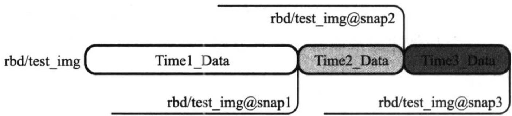


图9-4 创建卷及快照


一般情况下，如果我们要备份test.img这个image（具体应用场景中，这个image可能是VM的一个云盘），我们会直接使用rbd export命令将不同时刻的test.img导出并存储到其他的存储介质中，也就是全量备份，如我们在写入Time1_Data后，使用rbd export命令导出test.img：

```batch
rbd export rbd/test.img Time1_Data.img 
```

我们得到的数据如图9-5所示。

```txt
rbd/test_img Time1_Data 
```

图9-5写入Time1_Data后全量导出卷数据

在写入Time2_Data后，使用rbd export命令导出test_img：

```batch
rbd export rbd/test.img Time2_Data.img 
```

我们得到的数据如图9-6所示。

```txt
rbd/test_img Time1_Data Time2_Data 
```

图9-6写入Time2Data后全量导出卷数据

在写入 Time3_Data 后，使用 rbd export 命令导出 test_img:

```batch
rbd export rbd/test.img Time3_Data.img 
```

我们得到的数据如图9-7所示。

```txt
rbd/test.img Time1_Data Time2_Data Time3_Data 
```

图9-7写入Time3_Data后全量导出卷数据

如果直接用导出的数据进行备份，那么三次备份，都是全量备份，也就是说三次备份共备份了3次Time1_Data，两次Time2_Data和一次Time3_Data，相当于多备份了两次Time1_Data和一次Time2_Data，增加了备份开销，也降低了备份效率，这里很容易想到一个改进方式是每次导出当前与前一次备份的增量数据，然后通过备份增量数据实现增量备份的效果。

一开始，新创建test_img时，可以导出一个test_img backups并备份

```txt
rbd export rbd/test.img test.img Backup 
```

写入Time1_Data后，我们基于之前创建的快照rbd/test_img@snap1导出从创建到写入Time1_Data之间的增量数据，如图9-8所示。

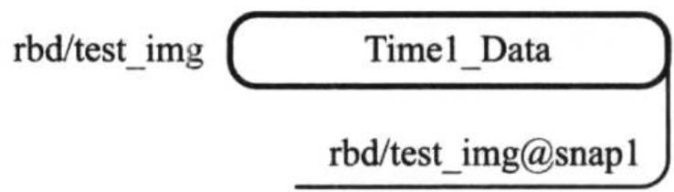


图9-8写入Time1_Data后基于快照导出增量数据


```txt
rbd export-diff rbd/test_img@snap1 test_img_to_snapshot 
```

写入 Time2_Data 后，我们基于快照 rbd/test_img@snap1 和快照 rbd/test_img@snap2 导出从创建 rbd/test_img@snap1 到创建 rbd/test_img@snap2 之间的增量数据，如图 9-9 所示。

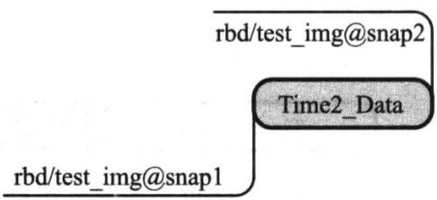


图9-9写入Time2_Data后基于快照导出增量数据


```batch
rbd export-diff rbd/test_img@snap2 snap1_to_snapshot2 --from-snap snap1 
```

写入 Time3_Data 后，我们基于快照 rbd/test_img@snap2 和快照 rbd/test_img@snap3 导出从创建 rbd/test_img@snap2 到创建 rbd/test_img@snap3 之间的增量数据，如图 9-10 所示。

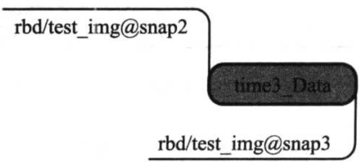


图9-10写入Time3_Data后基于快照导出增量数据


```batch
rbd export-diff rbd/test_img@snap3 snap2_to_snapshot3 --from-snap snap2 
```

这样我们只需要导出一份Time1_Data、一份Time2_Data、一份Time3_Data即可完成增量备份的目的。备份问题解决了，如何恢复呢？既然备份是导出，那么对应的恢复，自然就是导入操作，基于以上的备份数据，我们的恢复步骤为：

首先导入test_img_backup：

```python
rbd import test_img Backup rbd/test_img Recover 
```

然后导入增量文件Time1_Data（导入增量文件一定要按照文件的先后顺序）：

```txt
rbd import-diff test_img_to_snapshot rbd/test_img Recover 
```

接着导入增量文件 Time2_Data:

```txt
rbd import-diff snap1_to_snapshot2 rbd/test_img Recover 
```

最后导入增量文件Time3_Data：

```txt
rbd import-diff snap2_to_snap3 rbd/test_img Recover 
```

这样，就实现了基于快照技术的增量备份。

# 9.6 实战案例六：Ceph 集群异常 viewer 处理

# 1.背景

在 Ceph 集群日常运维中，管理员可能会遇到有的 image 删除不了的情况，有一种情况是由于 image 下有快照信息，只需要先将快照信息清除，然后再删除该 image 即可，还有一种情况是因为该 image 仍旧被一个客户端在访问，具体表现为该 image 中有watcher，如果该客户端出现了异常那么就会出现无法删除该 image 的情况。

# (1)watcher是什么？

Ceph 中有一个 watch/notify 机制（粒度是 object），它用来在不同客户端之间进行消息通知，使得各客户端之间的状态保持一致，而每一个进行 watch 的客户端，对于 Ceph 集群来说都是一个 viewer。

# （2）如何查看当前 image 上的 viewer?

因为watch的粒度是object，想要了解一个image上的watcher信息，一种方法是直接使用命令：

```txt
rbd status test_img   
Watchers:   
watcher=192.8.8.201:0/718053733 client.398077 cookie=140574016325280 
```

还有一种方法就是查看该 image 的 header 对象上的/watcher 信息，首先找到 image 的 header 对象：

```txt
rbd info test_img  
rbd image 'test_img':
size 5000 MB in 1250 objects 
```

```txt
order 22 (4096 kB objects)  
block_name_prefix: rbd_data.fa7b2ae8944a  
format: 2  
features: layering, exclusive-lock, object-map, fast-diff, \deep-flatten 
```

查询到该 image 的 block_name_prefix 为 rbd_data.fa7b2ae8944a 那么该 image 的 header 对象则为 rbd_header.fa7b2ae8944a，然后我们就可以通过命令查看该 image 的 header 对象上的/watcher 信息。

```txt
rados listwatchers -p rbd rbd_header.fa7b2ae8944a  
watcher=192.8.8.10:0/1262448884 client.170939 cookie=140096303678368 
```

# 2. 案例实战

刚才查看到test_img这个image上有一个watcher，假设客户端上的watcher：watcher=192.8.8.10:0/1262448884出现异常，那么我们该如何处理呢？其实我们只需要将此异常客户端加入到OSD的黑名单即可：

```txt
ceph osd blacklist add 192.8.8.10:0/1262448884  
blacklisting 192.8.8.10:0/1262448884 until 2017-03-27  
02:11:54.206165 (3600 sec) 
```

此时我们再去查看该 image 的/watcher 信息：

```txt
rbd status test_img Watchers: none 
```

也可以通过查看该image的header对象watcher信息：

```txt
rados listwatchers -p rbd rbd_header.fa7b2ae8944a 
```

异常客户端的watcher信息已经不存在了，这个时候我们就可以对该image进行删除操作了。

# 9.7 总结与展望

Ceph 因为其极其丰富的配置项及灵活的使用方式，使得 Ceph 在使用过程中充满了乐趣和惊喜（如果使用不当，那可能就是苦恼和惊吓）。随着 Ceph 用户群越来越广泛，社区爱好者和贡献者们也在不断从生产和测试环境中总结更好的使用方式、调整及优化配置项，并开发提供了越来越多便捷的辅助工具，这一切都让 Ceph 变得越来越好用。

# 作者简介

# 谢型果

中兴通讯资深软件工程师，5年存储开发经验，精通本地文件系统ZFS和分布式存储系统Ceph。2014年开始研究 Ceph，2015年加入 Ceph 开源社区，目前是 Ceph 开源社区的 Ceph Member。

# 任焕文

中兴通讯高级软件工程师，有10余年研发经验，曾就职于浪潮和华为，擅长数据库、网络和存储相关技术。Ceph Member成员，现主要负责Ceph文件系统、NAS存储和分布式一致性方面的研发工作。

# 严军

中兴通讯高级软件工程师，从事存储系统开发工作多年，熟悉DPDK开发框架；2015年加入Ceph开源项目，对分布式存储系统QoS有深入研究，目前是Ceph开源社区的积极贡献者。

# 罗润兵

华中科技大学微电子专业研究生，中兴通讯高级软件工程师，精通TCP/IP协议栈和分布式存储系统，2014年开始接触并参与Ceph开源项目，目前是Ceph开源社区的积极贡献者。

# 韦巧苗

中兴通讯高级软件工程师，擅长C/C++编程，有5年存储系统研发经验，对Ceph RGW模块有深入研究，同时在Cache技术及性能优化上也有丰富的经验。

# 骆科学

中兴通讯高级软件工程师，有5年存储产品相关开发经验，擅长虚拟化及存储相关技术，2016年于Ceph中国社区年终盛典中被评为“2016年度社区最佳贡献者”。

Ceph以其优异的可扩展性、可靠性、高性能、灵活性、安全性等特征，成为最活跃的开源存储明星项目，是OpenStack的默认存储后端。大家可以方便地获得Ceph的源代码，但要透彻地理解它、用好它并不容易。本书系统、详实地介绍了Ceph的设计与实现，有理论，有实践，相信能对广大Ceph爱好者，包括开发者和运维人员都有很大的帮助！

郑纬民 清华大学计算机系教授、博士生导师

伴随着全球数字化革命大潮而来的是新技术的不断涌现和商业模式的推陈出新。本书对开源社区的明星项目Ceph进行了完美演绎，有助于读者全面了解开源分布式云存储领域的设计原理和应用。

孙振鹏 最佳国际实践联盟主席、EXIN国际信息科学考试学会亚太区总经理

2015年开始与几位作者开启了一段美妙的 Ceph 旅程，期间我们有互为知己般的信任和支持，过程中更有意思的是不断战胜困难和挑战所赢得的快乐和满足。作为中兴通讯开源先锋的这支Ceph团队极具战斗力，他们一直用行动在诠释他们倡导的“保持奔跑、拥抱开源、拒绝平庸”理念。这本著作倾注了这支王牌团队的巨大心血并且有丰富实践基础，非常精彩，值得一读。

谭芳 中兴通讯长沙研究所

我非常欣喜地看到，中兴的Clove团队的六位开发者，包括多位Core Member和Contributer，愿意将自己在Ceph社区的工作和积累，以及对Ceph的理解和应用花费大量的时间整理成书，为产业界不同领域的从业者提供参考。相信会是一本好书。

何宝宏 中国信息通信研究院技术与标准研究所副所长、互联网研究领域主席

作者所在团队是国内最早从事 Ceph系统研发的机构之一，为Ceph系统的开发、完善和推广做出重要贡献。作者依托自身的理论基础和实践经验，介绍了Ceph系统的工作原理、核心技术和实操技巧，对于云存储和数据中心里那些力图对数据资源进行高效可靠存储的从业人员来说，本书是一本很好的指导手册！

张广艳 清华大学计算机科学与技术系副教授、博士生导师、计算机学会信息存储专委会委员

在软件定义存储的时代，Ceph对存储的影响如同Linux对操作系统的影响。Ceph的发展壮大，离不开各种业务场景的需求拉动，也离不开繁荣活跃的社区推动。本书的6位创作者，他们既是中兴通讯的一支优秀研发团队，也是Ceph社区中的一支优秀的团队。他们深入专研，拨开迷雾，将自己对Ceph设计原理与实现的最新理解与实践，深入系统地分享出来。

闫林 中兴通讯IT技术学院副院长


