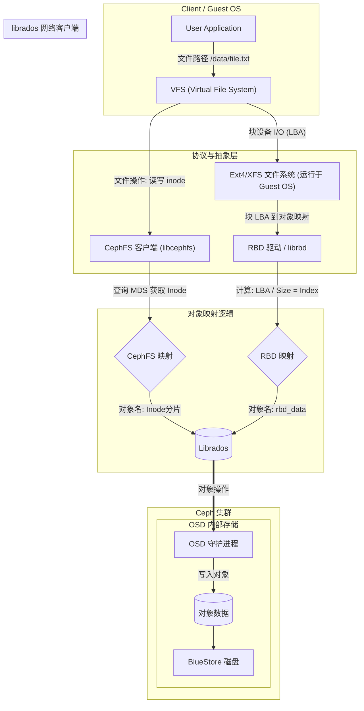

# 31 RBD 本质与 Ceph 架构路径对比详解

## 〇、RBD (块存储) 的真正面目

RBD (RADOS Block Device) 本质上就是 Ceph 提供的一个**虚拟硬盘**。你可以把它理解为类似 VirtualBox 的 `.vdi` 或 VMware 的 `.vmdk` 文件，但它是由 Ceph 集群动态提供的高可用块设备。

从两个视角来理解最直观：

1. **对客户机（用户/OS）而言**
   *   它就是一块**裸硬盘**（如 `/dev/sdb`）。你可以在上面执行一切硬盘能做的操作：分区、格式化（ext4/xfs）、挂载文件系统。

2. **对 Ceph（底层存储）而言**
   *   它**不是**一个巨大的物理文件，而是被逻辑切割成了无数个固定大小的**对象 (Objects)**（默认 4MB 一个）。
   *   这些对象散落在存储池中。比如一个 1TB 的 RBD 镜像，逻辑上可能有 26 万个潜在的“坑位”，每个坑位对应一个固定的对象名 `rbd_data.<hash>.<N>`。
   *   **关键点**：对象的命名是确定性的（Deterministic）。当你写数据到“第 0 块”时，Ceph 会写入对象 `0`。当你删除这块数据时，仅仅是清除了物理内容；下次你再次写“第 0 块”时，依然是写入同一个对象 `0`。这就是为什么被删除的 Head 对象在重建时，依然是同名对象并关联旧的 Snapdir。

---

## 1. 核心区别：“谁在管理文件结构？”

虽然最终都是操作 OSD 里的对象，但**RBD（块存储）**和**CephFS（文件存储）**在“谁来管理文件/目录结构”这一点上有本质区别：

*   **RBD (块存储)**
    *   **Ceph 的视角：“我完全不知道什么是文件。”**
    *   Ceph 认为自己只管理一堆叫 `rbd_data.xxx` 的对象。
    *   **黑盒机制**：当 Guest OS 在 RBD 上格式化 ext4 时，**ext4 的所有元数据（超级块、inode 表等）实际上是被打成数据流，塞进了这些 `rbd_data` 对象里**。Ceph 对此毫无感知。
    *   **转换者**：RBD 驱动（librbd）。

*   **CephFS (文件存储)**
    *   **Ceph 的视角：“我知道文件系统的结构。”**
    *   通过 MDS (Metadata Server)，Ceph 显式地管理目录树、文件名、权限等元数据。
    *   **透明机制**：CephFS 客户端直接将文件的修改映射为底层对象的修改，而不需要维护一个额外的块设备文件系统（如 ext4）。
    *   **转换者**：CephFS 客户端 + MDS。

---

## 1.1 RBD 镜像 vs 本地块设备与初始化流程

在前面的讨论中，我们常把 RBD 视为块设备，但严格来说，**RBD 镜像不是块设备**。理解两者区别是理解 RBD 架构的基础。

### (1) RBD 镜像（服务端视角）
*   **逻辑实体**：镜像是存储在指定 Pool 中的一组固定命名对象。
*   **组成**：
    *   **元数据对象**：`rbd_id.<name>`（用于通过名字查找 Hash）、`rbd_header.<hash>`（记录镜像属性、features 和快照树）。
    *   **数据对象**：`rbd_data.<hash>.<00000000>`、`<00000001>`...（按需生成的 4MB 数据坑位）。
*   **本质**：对 OSD 而言，它只是一组普通的 RADOS 对象，没有任何“磁盘”的特殊属性。

### (2) 本地块设备（客户端视角）
*   通过 `rbd map` 命令，客户端内核模块 `rbd.ko` 将上述镜像绑定到本地 VFS 层，生成 `/dev/rbdX`。
*   **Guest OS 看到的“硬盘”就是这个接口**，它负责处理 VFS 的 I/O 请求，并将其转发给集群。

### (3) 初始化：谁在主导？
Ceph 遵循**智能客户端 + 哑服务端**架构，初始化分三步，**全部由客户端执行**：

| 阶段 | 客户端动作 | 服务端 (OSD) 动作 |
|:---|:---|:---|
| **创建镜像** `rbd create` | 计算唯一 Hash，构造 Header 对象，发送 Write 操作 | **被动接收**。仅将对象存入 BlueStore，完全不知道这是“镜像初始化”。 |
| **映射设备** `rbd map` | 加载内核映射，建立与 OSD 的 TCP 连接，注册块设备队列 | **无特殊动作**，准备接收后续 R/W I/O。 |
| **格式化** `mkfs.ext4` | Guest OS 在 `/dev/rbdX` 上写入 SB、Inode Table、Block Group | **接收数据写入**。把 Ext4 的元数据当成普通二进制流写入对应的 `rbd_data` 对象中。 |

### (4) 与对象生命周期的关联
正如笔记 32 所述，由于**镜像对象的命名是确定性的**且由客户端全权管理：
*   初始化时：客户端按逻辑偏移分配了对象 `0, 1, 2...`。
*   删除/重建时：OSD 只负责回收物理空间。若客户端重建同名镜像，仍会生成同名的数据对象，这就解释了为何被删除的 Head 对象可能依然关联旧的 Snapdir（快照目录），需要客户端手动或自动清理对齐。

---

## 2. 客户机操作到底层对象的转化 (Deep Dive)

你之前的理解非常敏锐：无论是块存储还是文件存储，确实都是将操作转换成了对象操作。但它们的**转换公式**和**路由逻辑**不同。

### (1) 路径 A：RBD 块存储路径 (LBA -> 对象)
逻辑是纯粹的几何/数学计算：逻辑扇区偏移量（LBA）直接映射对象 ID。

> `LBA (逻辑块地址) / 对象大小 (4MB) = 对象索引 N`

*   优点：不需要额外的元数据服务（如 MDS），去中心化，速度极快。

### (2) 路径 B：CephFS 文件存储路径 (Path -> 对象)
逻辑是语义化的：文件路径 -> 目录树 -> Inode -> 对象。

> `/data/file.txt` (Path) -> **MDS 解析** -> `Inode 123` -> `123.00000000` (对象名)

*   优点：支持跨节点共享、POSIX 语义。
*   缺点：依赖 MDS，路径复杂。

---

## 3. 核心组件辨析：libcephfs 与 Librados 的运行位态

你之前的观察非常敏锐。要彻底读懂架构图，必须理解这两个核心组件到底“跑在哪里”以及“为什么存在”。

### (1) CephFS 到底是谁？为什么有 libcephfs？
你的直觉是对的：**CephFS 最主要的使用方式确实是作为 Linux 内核模块 (`ceph.ko`) 存在的**。

但在架构图中出现的 `libcephfs` 是一个**纯用户态的 C/C++ 共享库**。为什么有了内核模块还需要它？
*   **FUSE (用户态挂载)**：内核模块挂载 (`mount -t ceph`) 需要 Root 权限。通过 `libcephfs` + FUSE，普通用户就能挂载 CephFS。
*   **直接嵌入程序 (Libvirt/QEMU)**：这是更高级的用法。像 QEMU 这样的虚拟机程序，不希望依赖宿主机的挂载点，而是直接将 `libcephfs` 链接到代码中。这使得 VM 像读写本地文件一样直接读写 Ceph，少了一层内核拷贝。
*   **本质**：无论是内核模块还是 `libcephfs`，它们的核心职能一致——**负责把文件路径操作变成对底层对象的操作**。

### (2) Librados 是做什么的？在哪里运行？
这是一个常见的误区。**Librados 100% 运行在客户端 (Client/Guest OS) 的内存中**。
它**不是**集群端的服务或守护进程，而是位于客户机上的一个“智能路由库”。

**Librados 为什么是 Ceph 去中心化的核心？**
传统的存储（如 NFS）需要先问服务器数据在哪，而 Ceph 的客户端极其“聪明”，Librados 在本地做了这三件事：
1.  **获取地图 (Cluster Map)**：启动时，Librados 联系 Monitor 下载一张**CRUSH Map**，记录了所有 OSD（磁盘）的拓扑和权重。
2.  **本地计算 (Local Computation)**：当应用要写入对象 `Object_100` 时，**Librados 在本地** 瞬间用 CRUSH 算法算出“`Object_100` 属于 `OSD.3`"。**它不需要询问任何服务器！**
3.  **直接直连**：算出位置后，Librados 直接与 `OSD.3` 建立网络连接并发送数据。

**架构图中的意义**：Librados 是所有上层业务（RBD/CephFS/RGW）汇聚的“翻译官”，它负责把逻辑上的 `Object ID` 转化为物理网络上的 `OSD IP:Port`。

---

## 4. 架构图：两条路径的殊途同归

下图展示了文件存储（CephFS）与块存储（RBD）在客户机的表现不同，但在经过 Librados 后，底层处理路径是完全统一的。

**解读架构图关键点：**

1.  **客户机侧 (左侧)**：路径截然不同。
    *   CephFS 路径需要 **MDS** 参与解析文件路径，计算出属于哪个 Inode 对应的对象。
    *   RBD 路径则在本地通过数学计算（`LBA/Blocksize`）直接得出要操作哪个对象（如 `rbd_data.xxx.0000`）。

2.  **汇聚点 (中间)**：**Librados**。
    *   无论上层是什么业务，最终都调用相同的底层库 `librados`。

3.  **集群侧 (右侧)**：**完全一致的路径**。
    *   **OSD 守护进程根本不区分这是“文件存储”还是“块存储”发来的请求**。对于 OSD 来说，它只看到 `Write Object: 100.00000000` 或 `Write Object: rbd_data.abc.0`，处理方式完全相同（写 WAL -> 写入 BlueStore）。
    *   这就是为什么你会觉得“对于 Ceph 而言没什么差别”，因为 OSD 本身就是被设计为不关心业务语义的“智能磁盘”。

---

## 5. 总结

*   对于**客户机**：
    *   **文件存储**意味着：文件系统元数据由 Ceph 集群（MDS）管理。
    *   **块存储**意味着：文件系统元数据（如 Ext4 的元数据）由**客户机自己**管理，并作为普通数据写入 RBD 对象中。

*   对于 **Ceph (OSD)**：
    *   没有任何区别。都是把二进制数据块塞进指定名字的对象里。
