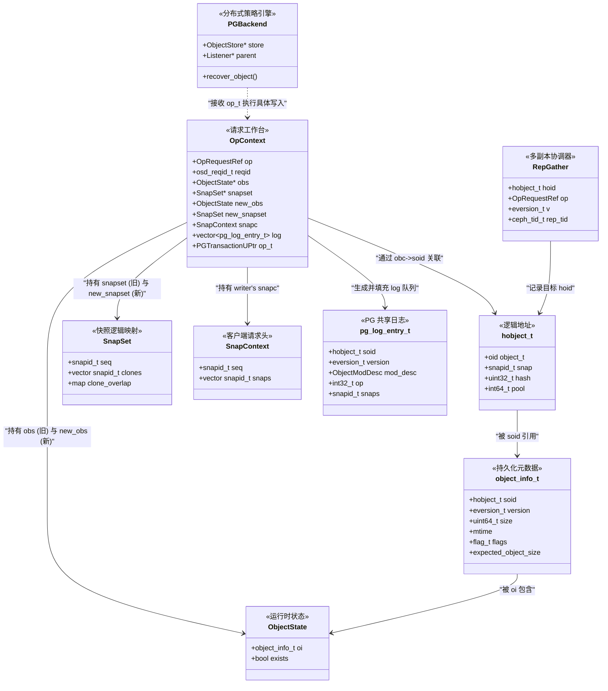

# 32 第四章疑问解析与术语辨析

本笔记用于记录在研读第 4 章（如“读写流程”相关小节）过程中产生的疑问，以及对核心内部对象概念（Head 对象、Snapdir、object_info_t 等）的深度辨析。

---

## 1. Head 对象、克隆对象与 Snapdir

### 1.1. 核心困惑：为什么 Head 对象删除后重建，还能对应同一个 Snapdir？

通常我们将 Ceph OSD 中的对象想象为普通文件系统中“删了就彻底消失”的独立文件。但在 RBD（块设备）的语境下，对象的身份和生命周期遵循**智能客户端 + 确定性路由**的规则。

*   **RBD 镜像的本质**：
    *   **服务端（镜像）**：是 Pool 中按逻辑索引排列的一组 RADOS 对象。
    *   **客户端（块设备）**：是通过 `rbd map` 映射的 `/dev/rbdX`。Guest OS 通过 LBA 直接计算逻辑块的索引。
*   **确定性命名 (Deterministic Naming)**：
    RBD 镜像初始化就被划分为无数个逻辑块。第 `N` 个块对应的底层对象名称是**永久固定**的（格式 `rbd_data.<hash>.<N>`）。客户端通过本地计算 `LBA / 对象大小` 直接得出对象索引。
*   **删除与重建的真相**：
    *   **删除**：仅仅是物理释放（TRIM/Discard）。OSD 回收了 Block，但 RBD 元数据仍保留该逻辑索引 `N`。
    *   **重建**：当客户端再次向该逻辑块写入时，OSD 收到写入请求，发现对象不存在，于是**创建一个同名对象**。对 Ceph 路由层而言，它始终是“同一个对象”。

### 1.2. 场景示例：写入、快照、COW 与 Snapdir 生命周期

假设关注 **逻辑块 0**（对象名 `obj_0`）：

1.  **初始写入**：Guest OS 写入 `Data_V1`。OSD 创建 `obj_0`。
2.  **打快照**：生成 Snap1。此时为 Lazy Snap，不拷贝数据。
3.  **修改触发 COW**：Guest OS 写入 `Data_V2` 覆盖逻辑块 0。OSD 检测到快照存在，触发 COW（Copy-On-Write）：将 `Data_V1` 克隆为 `obj_0__snap_1`（Snapdir），Head 更新为 `Data_V2`。
4.  **删除 Head**：Guest OS 释放逻辑块 0。OSD 物理删除 `obj_0`，但 Snapdir 因受快照保护而保留。
5.  **重建 Head**：Guest OS 再次写入 `Data_V3`。OSD **重建同名对象** `obj_0`。
6.  **对齐清理**：OSD 发现 Head 重建且有残留 Snapdir，根据快照有效性决定维持关联或触发清理。

### 1.3. 关键概念辨析
*   **逻辑身份 vs 物理实例**：路由基于逻辑身份（对象名），物理实例的销毁重建不改变路由指向。
*   **Smart Client / Dumb OSD**：客户端决定何时读写哪个对象；OSD 只是被动接收指令的“哑存储”。

---

## 2. object_info_t 详解

### 2.1. 结构与疑问辨析
`object_info_t` 是 OSD 用来持久化存储对象元信息的结构体。表 4-2 中提到的 `expected_object_size` 和 `expected_write_size` 正是其重要组成部分。

**疑问：它们是客户端指定的吗？**
*   **是**：这两个值完全由**客户端（如 Librbd / Librados 应用）**指定。
*   **是**：它们作为**写提示（Write Hints）**包含在客户端发送的**写操作元数据（Write Op Metadata）**中，随数据流一起发给 OSD。OSD 收到后，会将其解析并持久化存入该对象的 `object_info_t` 里。

### 2.2. 场景示例（以 RBD 写入为例）
客户端 RBD 准备向一个 4MB 的逻辑块（对应一个 RADOS Object）写入数据，它知道自己最终要填满这个对象，且 Guest OS 当前发来的 IO 大小是 4KB。

| 阶段 | 客户端动作 | OSD 底层动作 |
| :--- | :--- | :--- |
| **1. 设定值** | `Librbd` 准备好数据，计算预期大小。 | — |
| **2. 发送请求** | 发起 `CEPH_OSD_OP_WRITE`，携带 4KB 数据并在 Op Header 附加写提示： - `expected_object_size = 4MB` - `expected_write_size = 4KB` | 接收请求，解包 Op Header。 |
| **3. 持久化** | — | 将这两个值存入本地磁盘上对象的 **`object_info_t`** 结构中。 |
| **4. 优化利用** | — | BlueStore 利用这些 Hint 优化存储分配： - **多副本池**：若预期对象很大，预分配连续磁盘 Block 以减少碎片。 - **EC 池**：利用大小确定条带 (Stripe) 边界，准确计算 Padding 和校验码，避免多次回读。 |

### 2.3. Flag 解析与 OMAP 机制辨析
表 4-2 中的 `flag` 字段常包含 `FLAG_USES_OMAP`，其指示该对象是否挂接了 **OMAP (Object Map)** 数据结构。

**疑问：使用 OMAP 是什么意思？是不使用 OMAP 元数据就不存 KVDB 了吗？**
*   **否**：**RocksDB (KVDB) 是 Ceph 底层 (BlueStore) 存储所有元数据的统一基座**。无论对象是否开启 omap，其基础元数据（`object_info_t`、xattr）都持久化存储在 RocksDB 中。
*   **使用 OMAP 的真义**：指该对象内部开放了**应用层自定义的 KV 命名空间**。普通对象只有“主体数据”，而 OMAP 对象除了主体数据外，还允许客户端（如 CephFS）通过 `librados` 接口写入成千上万个额外的键值对。

**Flag 的作用：查询优化**
OSD 处理对象读取时，先检查 `FLAG_USES_OMAP`：
*   **Flag = 0 (无 OMAP)**：OSD 得知该对象无额外 KV 数据，直接读取主体数据或基础属性，**跳过 KV 扫描步骤**，提升性能。
*   **Flag = 1 (有 OMAP)**：OSD 知道去 RocksDB 的特定命名空间下检索该对象的子 KV 记录（如 CephFS 目录下的海量文件名）。

**存储结构对比**
| 对象类型 | 典型示例 | 是否标记 OMAP | 元数据存储形态 (RocksDB 中) |
| :--- | :--- | :---: | :--- |
| **纯数据对象** | RBD 数据块 (`rbd_data.xxx.0005`) | **否** | 仅存少量固定 KV，记录 `object_info_t`（版本、大小等）。 |
| **复杂元数据对象** | CephFS 目录 (`dir_inodes`)   RBD Header (`rbd_header`) | **是** | 1. 基础 KV 记录 `object_info_t`。 2. **独立 OMAP 命名空间**：存储海量扩展 KV 对（如文件名索引、快照列表）。 |

---

## 3. ObjectState

### 3.1. exists 字段与“对象不存在”辨析
`ObjectState` 描述了对象当前的状态，其中 `exists` 字段尤为关键，用于指示对象在**逻辑上是否存在**。

**疑问：对象还有不存在的情况吗？**
*   **是**：在 Ceph（特别是 RBD 精简配置）中，`exists = false` 代表对象是一个“空洞（Hole）”。

**场景示例 1：RBD 精简配置中的“空洞”**
假设一个 100GB 的 RBD 镜像被划分为 25000 个逻辑对象坑位。
*   **情况 A（写入数据）**：向第 1 个坑位写入数据。
    *   **结果**：OSD 在磁盘创建了该对象。
    *   **状态**：`exists = true`。读取时返回真实数据。
*   **情况 B（未写入/全 0）**：第 2 个坑位保持空白。
    *   **结果**：物理磁盘上**根本不存在该对象文件**。
    *   **状态**：`exists = false`。
    *   **行为**：当客户端读取第 2 个坑位时，OSD 发现 `exists = false`，**不报错 `Not Found`**，而是直接返回**全 0 数据（模拟空磁盘）**。这实现了按需分配（Thin Provisioning）。

**场景示例 2：对象删除后的状态告知**
*   **操作**：客户端删除对象 A。
*   **状态**：OSD 物理擦除后，该对象的 `ObjectState` 更新为 `exists = false`，同时版本号（version）增加。
*   **同步作用**：当新加入的 OSD 副本请求同步时，主 OSD 通过 Log 告知：“对象 A 的 `exists` 为假，是我特意删的，不是漏传数据。”

**总结**
`exists` 字段让 Ceph 能高效处理**稀疏文件**：
*   **True**：执行磁盘 I/O 读取数据。
*   **False**：零 I/O 开销，直接返回全 0 填充数据。

---

## 4. SnapSet 与克隆对象 (Clone) 生命周期

在 RADOS 层，**克隆对象 (Clone Object)** 是实现快照功能的物理载体。它的生成、管理与释放由 **SnapSet** 结构体集中管控。

### 4.1. SnapSet 核心成员 (基于表 4-4)
SnapSet 记录了对象在快照层面的逻辑映射关系：
*   **`snaps` 列表**：该对象逻辑上关联的所有快照 ID。
*   **`clones` 列表**：实际存在的物理克隆对象对应的 Snap ID。
    *   用于指引 OSD：当读取某个旧快照时，数据到底存哪个物理文件里。
*   **`overlap` (重叠区)**：标识数据的有效偏移范围。

### 4.2. 克隆对象的生成、管理、使用与释放

#### 阶段 1：生成 (Creation via COW)
1.  **初始状态**：`Obj_A` 写入 `Data_V1`。SnapSet 状态：`snaps=[], clones=[]`。
2.  **创建快照 `Snap_1` (ID 10)**：
    *   此时为 Lazy Snap，仅更新 `snaps=[10]`。物理上尚未产生克隆。
3.  **触发 COW (写入新数据)**：
    *   客户端覆盖 `Obj_A` 数据为 `Data_V2`。
    *   OSD 检测到 SnapSet 中存在快照 10。
    *   **动作**：OSD 将旧数据 `Data_V1` 复制并保存为新对象 `Obj_A@10`（即**克隆对象**）。
    *   **更新**：将 ID 10 加入 `clones` 列表。状态：`clones=[10]`。

#### 阶段 2：管理 (由 SnapSet 托管)
*   克隆对象并非独立存在，而是由其 **Head 对象** 的 SnapSet 进行统一索引。
*   **Head** 负责处理所有对 **最新数据** (V2) 的请求。
*   **Clone (Obj_A@10)** 是只读的，专门备份 `Snap_1` 时刻的数据。Head 通过 `clones` 列表指引 OSD 如何定位历史数据。

#### 阶段 3：使用 (读取历史数据)
客户端请求读取 `Obj_A` 在 `Snap_1` 时的数据：
1.  **携带上下文 ID**：客户端在请求头中指明目标 Snap ID = **10**。
2.  **OSD 解析**：OSD 读取 Head 的 SnapSet，检查 `clones` 列表发现包含 10。
3.  **数据路由**：OSD 绕过当前的 Head，直接去磁盘读取 **Clone (Obj_A@10)** 并返回 `Data_V1`。

#### 阶段 4：释放 (Garbage Collection)
管理员执行删除 `Snap_1` 操作：
1.  **逻辑移除**：SnapSet 的 `snaps` 列表中移除 ID 10。
2.  **清理判断**：OSD 检查 `clones`，发现 ID 10 已无业务引用。
3.  **物理删除**：擦除 `Obj_A@10` 文件，空间释放。状态恢复为 `clones=[]`。

---

## 5. "快照上下文 ID" (SnapContext & Snap ID) 辨析

结合前面的克隆对象机制，理解"上下文 ID"的关键在于区分"人类标签"和"机器逻辑"。

### 5.1. 什么是上下文 ID？
当你创建名为 `snap_1` 的快照时，Ceph 内部运作依赖两套凭证：
1.  **Snap ID (数值)**：Monitor 分配的全局递增整数（如 `10`）。这是 OSD 内部操作的真实标识。
2.  **SnapContext (请求头)**：客户端发起请求时携带的结构体，包含：
    *   `seq`：当前最大的 Snap ID。
    *   `snaps`：当前存在的所有 Snap ID 列表。

### 5.2. OSD 如何进行数据版本路由？
OSD 通过比对**请求头中的目标 ID** 来决定去哪里找数据：

| 客户端动作 | 请求头中的 Snap ID | OSD 行为 (依据 SnapSet) |
| :--- | :--- | :--- |
| **写入/修改** | 无 (默认 ID=0, 代表 HEAD) | OSD 发现存在其他快照 ID (如 10)。 **触发 COW**：将旧数据备份至 Clone 对象，然后更新 Head。 |
| **读最新数据** | 无 / ID=0 | 直接读取 **Head 对象**。 |
| **读历史快照** | 指定 ID=10 | OSD 检查 `clones` 列表包含 10。 **绕过 Head**，直接读取 **Clone 对象 (`Obj_A@10`)**。 |

**总结**：SnapContext 就像是客户端递给 OSD 的“通行证”。OSD 凭此决定是返回最新版本的 Head 数据，还是翻出某个特定的 Clone 历史备份。

---

## 7. PGLog (日志) 与 PG 副本辨析

本节解析 PGLog 的设计动机、粒度及其在副本一致性中的核心作用。

### 7.1. "PG 副本" 与日志粒度的核心疑惑
关于日志，有两个常见的理解误区：

**疑问 1：什么是 "PG 副本" (PG Replicas)？**
*   假设存储池是 3 副本，PG `1.0` 分布在 `OSD 1`、`OSD 2`、`OSD 3` 上。
*   **PG 副本**：指分别驻留在 OSD 1、2、3 中的这 **3 个 PG 实例本身**。
*   "数据不一致" 指的是这 3 个 OSD 实例里包含的 Object 状态出现了差异（如 OSD 1 比 OSD 2 多处理了 10 个写操作）。

**疑问 2：日志是每个对象一个，还是所有对象共享？**
*   **粒度**：**一个 PG 共享一个日志 (Log) 队列**。
*   不是"每个对象有一个 Log"，而是该 PG 内所有 Object 的修改操作都按时间顺序记录在这**唯一的一个流水账**里。

### 7.2. Log 的存储与写入流程
**疑问：日志也是有多个副本存在对应的多个 OSD 中吗？**
*   **是**。日志与数据一样，遵循多路复用。在 OSD 1、2、3 上，各自都独立保存了一份**该 PG 的完整日志**（PGLog 本地文件）。

**写入流程示例**：
1.  **客户端写入 File A (v100)**：请求到达 Primary OSD (OSD 1)。
2.  **Primary 记录**：OSD 1 向**自己的 Log** 追加 `v100: Update File A`。
3.  **日志同步**：OSD 1 将数据和日志指令转发给 OSD 2/3。OSD 2/3 同样向**各自的 Log** 追加 `v100: Update File A` 并落盘数据。

### 7.3. 为什么需要多份独立的日志？
核心目的是为了 **Peering (对账/一致性恢复)** 的效率。

假设 `OSD 2` 掉线重启了：
*   它必须拿**自己的 Log**（比如版本号到 v90）去问当前 Primary："我的账本只记到 v90，你那儿呢？"
*   Primary（假设到 v100）对比后立刻判断："你缺了 v91 到 v100 的操作"。
*   直接拉取这部分差异数据即可恢复。
*   **如果没有日志**：OSD 2 根本无法知道自己缺什么，只能全盘清空重新同步，效率极低。

**总结**：Log 是 OSD 的"记忆"。每个 OSD 持有独立日志，确保了任何副本宕机后能迅速定位自己与集群的差距，实现按需同步。

---

## 8. OpContext (操作上下文) 详解

`OpContext` 是 OSD Primary 处理单个客户端请求时的**临时工作台 (Context)**，贯穿了从接收到副本同步的全过程。
通过一个经典场景——**向一个包含快照 (`snap_1`) 的 3 副本对象 (`obj_A`) 写入新数据**，可以解析 `OpContext` 核心成员的用法。

### 8.1. 初始化：身份确认与数据加载
*   **成员 `reqid` (请求 ID)**
    *   **赋值**：解析自网络包头（如 `client.123:100`）。
    *   **用途**：用于**幂等性检查**。如果网络抖动导致 OSD 收到重复请求，系统通过比对 `reqid` 发现该请求已在处理中，避免重复执行。
*   **成员 `ops` (操作向量)**
    *   **赋值**：客户端的具体操作指令（如 `CEPH_OSD_OP_WRITE`，偏移量 0，长度 4MB）。
    *   **用途**：后续逻辑通过遍历 `ctx.ops` 来解析待处理的数据。
*   **成员 `obs` (ObjectState)**
    *   **动作**：OSD 去本地查询 `obj_A` 状态并加载。
    *   **赋值**：设置 `ctx.obs.exists = true`（表示对象存在），并加载旧的元数据（如 `version: 10`）。

### 8.2. 逻辑判定：快照与 COW 决策
*   **成员 `snapset` (SnapSet)**
    *   **动作**：加载对象关联的快照集合。
    *   **赋值**：`ctx.snapset.snaps = [snap_id_1]`。
    *   **决策**：因为请求是写操作且 `snapset` 非空，OSD 必须触发 **COW (Copy-On-Write)**。在处理新数据前，先将旧数据克隆到 `obj_A@snap_1`。

### 8.3. 变更统计与同步
*   **成员 `delta_stats` (统计增量)**
    *   **用途**：记录本次操作对存储池全局数据的改变。
    *   **赋值**：由于写入了 4MB 数据，`ctx.delta_stats.num_bytes += 4MB`。请求完成后，此增量会被累加到 Pool 的全局指标中。
*   **成员 `repop` (Replication Gather)**
    *   **用途**：管理向 Secondary OSD 发送复制请求的异步任务。
    *   **流程**：Primary OSD 将数据和日志转发给副本，并在 `repop` 中收集两者的 ACK 确认。只有 `repop` 确认所有副本落盘成功，Primary 才会向客户端返回成功。

### 8.4. 提交与元数据更新
*   **成员 `mtime` (修改时间)**
    *   **用途**：记录当前时间戳，写入成功后更新到对象的元数据中。
*   **成员 `user_version`**
    *   **用途**：维护操作的用户级版本号，常用于上层业务逻辑的判断。

**总结**：在上述流程中，`OpContext` 将**谁发的请求 (`reqid`)**、**对象现在的样子 (`obs`)**、**是否要搞快照 (`snapset`)**、**副本同步的任务 (`repop`)** 以及**写进去了多少数据 (`delta_stats`)** 捆绑在了一起，确保了 OSD 在处理过程中的所有动作逻辑连贯、状态一致。

---

## 9. 核心结构体关系全景图与综合场景

结合 Ceph 源码实现，本节将通过全景图和综合示例，将 4.2 节中涉及的 **10 个核心结构体** (Head/Clone, Snapdir, SnapSet, SnapContext, object_info_t, ObjectState, pg_log_entry_t, OpContext, RepGather, PGBackend) 串联起来。

### 9.1. 结构体关系架构图 (Mermaid)

### 9.2. 综合场景示例：10 个概念在 Primary OSD 内存中的完整流转
**场景设定**：客户端向一个包含快照 (`Snap_1`) 的 3 副本对象 (`rbd_data...`) 写入新数据，触发 COW。以下是这 10 个核心结构体协同工作的全过程。

| 阶段 | 涉及结构体 | 详细流转过程 |
| :--- | :--- | :--- |
| **1. 寻址定位** | **(1) hobject_t** | 客户端发来写入请求。OSD 解析请求头，构造出对象的逻辑地址： `hoid = { oid: "rbd...0000", pool: 1, snap: 0(HEAD), hash: 0x1234 }`。 通过 CRUSH 路由，确认当前 OSD 是该对象的主分片（Shard）。 |
| **2. 状态快照** | **(2) ObjectState** **(3) object_info_t** | OSD 去磁盘 (RocksDB) 查找该 `hoid`。 - 加载 **`object_info_t`**：`{ soid: hoid, size: 4MB, version: 10, flags: (USE_OMAP\|...) }`。 - 包装成 **`ObjectState`**：`{ oi: 上述 object_info_t, exists: true }`。 此时我们获得了写入前的“旧状态”。 |
| **3. 策略判定** | **(4) SnapSet** | OSD 同时加载该对象的 `SnapSetContext`： `SnapSet = { seq: 10, clones: [10], clone_overlap: {10: [0-4MB]} }`。 **判定**：SnapSet 非空且包含 ID=10，由于本次是写操作，系统决定执行 **COW (Copy-On-Write)**。 |
| **4. 请求上下文** | **(5) SnapContext** | 解析客户端携带的请求头，提取出 `SnapContext`： `snapc = { seq: 10, snaps: [10] }`。 它告诉 OSD：“当前环境里存在 Snap_1，你要小心处理历史数据。” |
| **5. 初始化工作台** | **(7) OpContext** | Primary OSD 实例化 `OpContext`，将上述所有信息汇聚： - `ctx.obs` 指向旧 ObjectState。 - `ctx.snapset` 指向旧 SnapSet。 - `ctx.snapc` 设为客户端传来的 `snapc`。 - `ctx.reqid` 设为 `client.456:10`（用于幂等）。 |
| **6. 触发 COW 与生成日志** | **(6) pg_log_entry_t** **Clone 对象** | OSD 决定克隆旧数据： - **物理动作**：将 `Data_V1` 复制并落盘为克隆对象 `rbd...0000@10`。 - **日志记录**：向 `ctx.log` 数组追加一条 **`pg_log_entry_t`**： `{ soid: hoid, op: CLONE, version: 11, snaps: [10] }`。 这条日志记录了一次克隆操作。 |
| **7. 准备新状态** | **(3) object_info_t** (新) | 更新 `ctx.new_obs`： - `new_obs.oi.version` 升级为 11。 - `new_obs.oi.size` 更新为 4MB。 - `new_obs.oi.mtime` 设为当前时间。 |
| **8. 执行分布式写入** | **(8) RepGather** **(9) PGBackend** | Primary OSD 准备将新数据同步到 Secondary OSD： - 创建 **`RepGather`**：`{ hoid: rbd...0000, v: 11, rep_tid: 500 }`。它负责跟踪 Secondary OSD 的确认状态。 - Primary 将 `ctx.op_t` (事务) 和日志转发给副本 OSD。 - **PGBackend** 介入：根据存储池类型（多副本 或 EC），ReplicatedBackend 执行 3 份数据的物理分发，ECBackend 则执行切片和校验计算。 |
| **9. 确认与提交** | **(8) RepGather** | Primary 等待 Secondary OSD 返回 ACK。 当 `RepGather` 发现所有副本均已提交：`all_committed = true`。 Primary OSD 更新本地状态，并回调 `on_committed` 释放锁。 |
| **10. 最终落盘** | **(7) OpContext** | 请求结束，`OpContext` 中生成的 `log`、`new_obs`、`new_snapset` 被写入本地 RocksDB。 - **PGLog**：追加 `v11` 条目。 - **object_info_t**：版本号更新为 11，大小更新。 |

### 9.3. 核心关系详细总结表

| 结构体 | 角色类比 | 生命周期 | 关键关系 |
| :--- | :--- | :--- | :--- |
| **hobject_t** | **快递单号** | 永久有效 | 所有其他结构体通过它识别“操作的是哪个对象”。 |
| **object_info_t** | **包裹档案** | 持久化磁盘 | 存储对象的物理属性（size, version, flags）。被 `ObjectState` 包装。 |
| **ObjectState** | **当前状态** | 运行时/内存 | 包含 `object_info_t` + `exists`（是否存在）。区分“有数据”还是“空洞”。 |
| **SnapSet** | **家族树** | 持久化/内存 | 记录克隆对象 (`clones`) 及其数据重叠区。指导 COW 何时发生。 |
| **SnapContext** | **当前快照环境** | 请求级 (Header) | 客户端下发，指示当前“有哪些快照活着”。OSD 据此决定写 Head 还是读 Clone。 |
| **pg_log_entry_t** | **时间轴流水账** | 持久化磁盘 | **按 PG 全局唯一队列**。记录每次修改（MODIFY/CLONE/DELETE）的版本与操作。 |
| **OpContext** | **临时工作台** | 请求级 (内存) | 汇聚旧状态 (`obs`)、新状态 (`new_obs`)、日志 (`log`)、副本任务 (`repop`)。请求结束即销毁。 |
| **RepGather** | **物流调度器** | 请求级 (内存) | 跟踪多副本 ACK 进度的控制器。确保“所有副本都确认了”再通知客户端。 |
| **PGBackend** | **底层执行引擎** | 常驻插件 | 真正干活的人。屏蔽了副本池和纠删码池的差异。执行具体的 IO 分发和恢复。 |
| **Head / Clone** | **物理文件实体** | 持久化磁盘 | **Head**：当前版本数据（`snap=0`）。**Clone**：历史快照的隔离备份（`snap=ID`）。 |