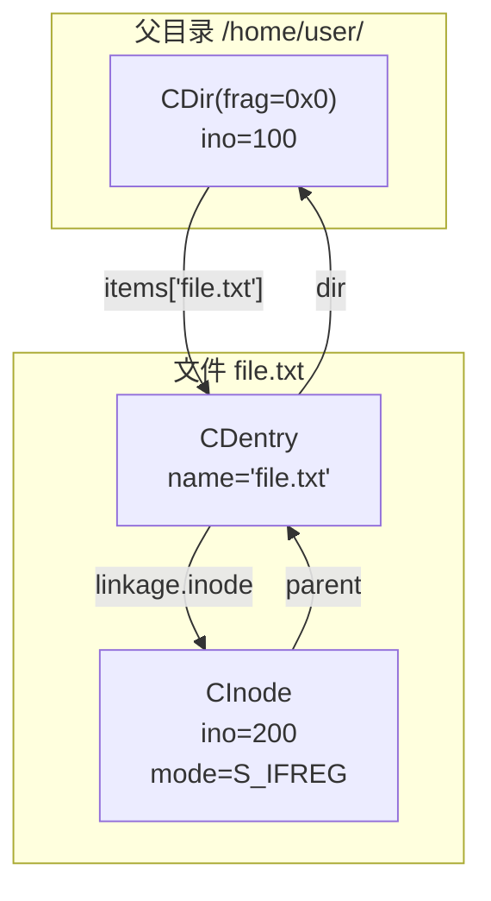
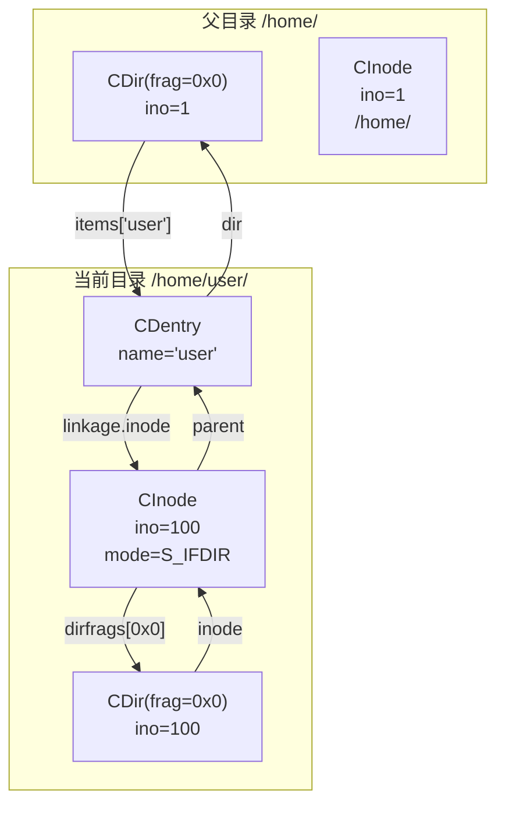
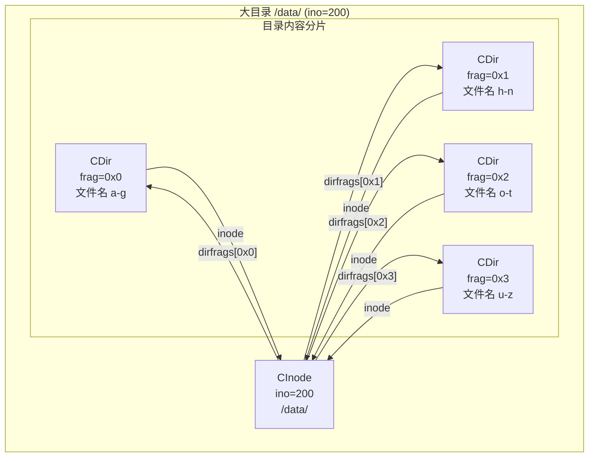
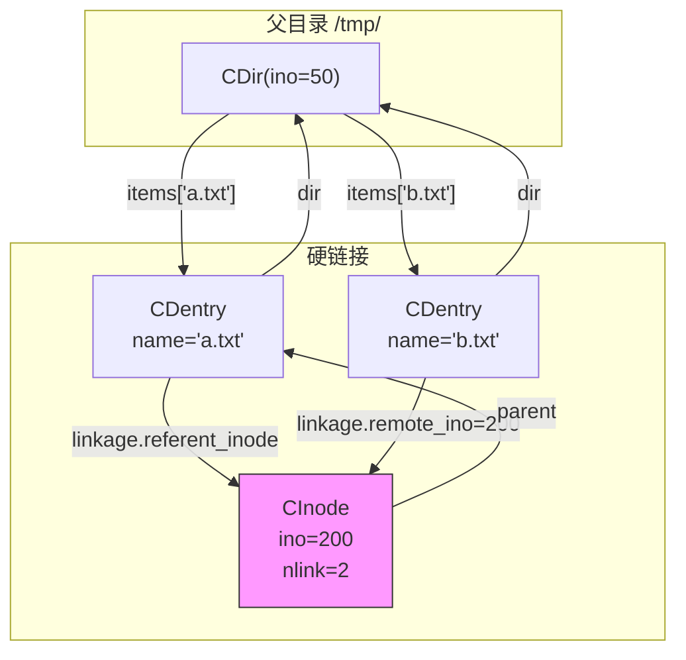
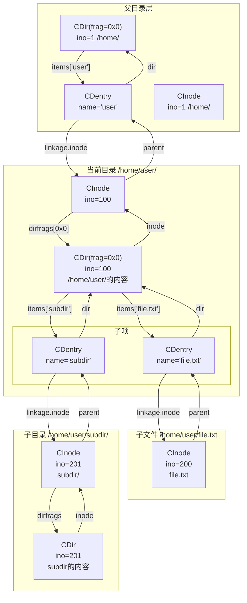
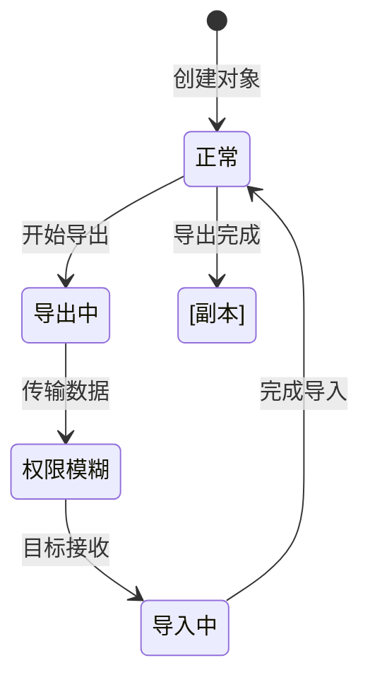
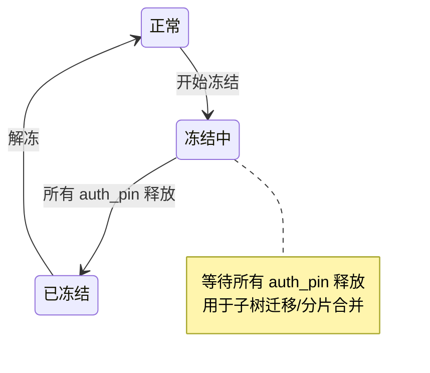

# MDS 缓存核心数据结构

## 〇、为什么需要 MDS 缓存对象？

CephFS 需要在多个 MDS 之间分布式管理文件系统元数据。元数据包括：
- 文件/目录的属性（size, mode, uid, gid, time 等）
- 目录结构（哪些文件在哪个目录下）
- 硬链接关系

核心挑战：
1. **内存管理**：如何高效缓存海量元数据？
2. **一致性**：如何保证多 MDS 之间的元数据一致性？
3. **负载均衡**：如何将元数据分布到多个 MDS？
4. **持久化**：如何将元数据写入 RADOS？

## 一、核心数据结构

### 1.1 对象概览

| 对象 | 定义文件 | 职责 | 关键成员 |
|------|----------|------|----------|
| `MDSCacheObject` | `src/mds/MDSCacheObject.h` | 基类 | `state`, `ref`, `auth_pins`, `replica_map` |
| `CInode` | `src/mds/CInode.h` | 文件/目录属性 | `inode`, `parent`, `dirfrags`, `client_caps` |
| `CDentry` | `src/mds/CDentry.h` | 目录项（文件名→inode） | `name`, `dir`, `linkage` |
| `CDir` | `src/mds/CDir.h` | 目录内容分片 | `inode`, `frag`, `items` |

### 1.2 结构关系速查

```
CInode.parent     ─► CDentry        （我的名字在哪）
CDentry.linkage   ─► CInode         （这个名字指向谁）
CDentry.dir       ─► CDir           （我在哪个目录里）
CDir.inode        ─► CInode         （这个目录是谁）
CDir.items        ─► map<name, CDentry*> （目录里有谁）
CInode.dirfrags   ─► map<frag, CDir*>    （我的内容分片）
```

## 二、核心对象关系

### 2.1 情况一：单个文件/目录自身的关系

#### 2.1.1 普通文件

对于一个普通文件 `/home/user/file.txt`，其自身的 CInode/CDentry 关系如下：



**关系说明**：

| 指针 | 方向 | 说明 |
|------|------|------|
| `CDir.items["file.txt"]` | → CDentry | 父目录分片中包含该文件的目录项 |
| `CDentry.dir` | → CDir | 该目录项属于父目录分片 |
| `CDentry.linkage.inode` | → CInode | primary link，指向文件的 inode |
| `CInode.parent` | → CDentry | 文件的 inode 指向自己的目录项 |

**文件没有 CDir**：普通文件只有 CInode，没有目录内容分片。

#### 2.1.2 小目录（单分片）

对于一个目录 `/home/user/`（内容未分片）：



**关系说明**：

| 指针 | 方向 | 说明 |
|------|------|------|
| `CInode(100).parent` | → CDentry("user") | 指向父目录中表示自己的目录项 |
| `CInode(100).dirfrags` | → {CDir} | 目录自己的内容分片 |
| `CDir.inode` | → CInode(100) | 指向目录自己的 inode |

**关键理解**：
- `CInode.parent` 指向父目录中的 CDentry（表示自己的名字）
- `CDir.inode` 指向目录自己的 CInode（不是父目录）

#### 2.1.3 大目录（多分片）

对于大目录 `/data/`，内容分片为多个 CDir：



**关系说明**：

- 一个目录 inode 可对应多个 CDir（分片）
- 所有 CDir 的 `inode` 都指向同一个 CInode

#### 2.1.4 硬链接文件

两个硬链接 `/tmp/a.txt` 和 `/tmp/b.txt` 指向同一文件：



**硬链接特点**：

| 特性 | 说明 |
|------|------|
| `CInode.nlink` | ≥ 2，表示链接数 |
| `CDentry.linkage` | 使用 **remote link**（remote_ino）而不是 primary link |
| `CDentry.referent_inode` | 指向缓存的 CInode（如果已加载） |
| `CInode.parent` | 只指向其中一个 CDentry |

### 2.2 情况二：目录与子项的关系

目录 `/home/user/` 包含文件 `file.txt` 和子目录 `subdir/`：



**关系汇总**：

| 关系 | 说明 |
|------|------|
| 父 CDir → 子 CDentry | `CDir.items[name] → CDentry*` |
| 子 CDentry → 父 CDir | `CDentry.dir → CDir*` |
| 子 CDentry → 子 CInode | `CDentry.linkage.inode → CInode*` |
| 子 CInode → 子 CDentry | `CInode.parent → CDentry*`（在父目录中的名字） |

### 2.3 完整路径遍历示例

从根遍历到 `/home/user/file.txt`：

```mermaid
graph LR
    RootInode["CInode<br/>ino=1<br/>/"] -->|"dirfrags[0x0]"| RootDir
    RootDir["CDir<br/>ino=1"] -->|"items['home']"| HomeDentry
    HomeDentry["CDentry<br/>'home'"] -->|"linkage.inode"| HomeInode
    HomeInode["CInode<br/>ino=10<br/>/home/"] -->|"dirfrags[0x0]"| HomeDir
    HomeDir["CDir<br/>ino=10"] -->|"items['user']"| UserDentry
    UserDentry["CDentry<br/>'user'"] -->|"linkage.inode"| UserInode
    UserInode["CInode<br/>ino=100<br/>/home/user/"] -->|"dirfrags[0x0]"| UserDir
    UserDir["CDir<br/>ino=100"] -->|"items['file.txt']"| FileDentry
    FileDentry["CDentry<br/>'file.txt'"] -->|"linkage.inode"| FileInode["CInode<br/>ino=200<br/>file.txt"]
```



## 三、MDSCacheObject 基类

所有 MDS 缓存对象的基类，定义在 `src/mds/MDSCacheObject.h`。

#### 核心功能

```c++
class MDSCacheObject {
  unsigned state;     // 状态位
  
  static const int STATE_AUTH      = (1<<30);  // 是权威副本
  static const int STATE_DIRTY     = (1<<29);  // 有未持久化的修改
  static const int STATE_NOTIFYREF = (1<<28);  // 引用归零时通知
  static const int STATE_REJOINING = (1<<27);  // 副本尚未与主副本同步
  
  int ref;           // 引用计数
  int auth_pins;     // auth pin 计数
  
  replica_map_type replica_map;  // 副本映射: mds_rank_t -> nonce
  unsigned replica_nonce;         // 本副本的 nonce
};
```

#### 关键方法

| 方法 | 说明 |
|------|------|
| `get(by)` / `put(by)` | 引用计数管理，支持来源追踪 |
| `auth_pin(who)` / `auth_unpin(who)` | 锁定对象，防止导出 |
| `is_auth()` | 是否权威副本 |
| `is_dirty()` | 是否有未持久化修改 |
| `is_replicated()` | 是否有副本在其他 MDS |
| `add_waiter(mask, ctx)` | 添加等待者 |
| `take_waiting(mask, ls)` | 获取并清除等待者 |

## 四、CInode - Inode 缓存对象

定义在 `src/mds/CInode.h`，表示文件或目录的元数据。

#### 核心成员

```c++
class CInode : public MDSCacheObject {
  CDentry* parent;              // 指向父目录中表示自己的 CDentry
  
  inode_const_ptr inode;        // inode 属性（ino, size, mode, uid...）
  xattr_map_const_ptr xattrs;   // 扩展属性
  old_inode_map_const_ptr old_inodes;  // 快照历史版本
  
  // 仅目录 inode 有：
  mempool::mds_co::map<frag_t, CDir*> dirfrags;  // 目录内容分片
  fragtree_t dirfragtree;                         // 分片树结构
  
  // Capability（客户端缓存权限）
  mempool::mds_co::map<client_t, Capability> client_caps;
};
```

#### 关键方法

```c++
// 路径操作
void make_path_string(std::string& s);  // 生成完整路径

// 目录分片
CDir* get_dirfrag(frag_t fg);           // 获取指定分片
void get_dirfrags(vector<CDir*>& ls);   // 获取所有分片

// 类型判断
bool is_dir() const;                    // 是否目录
bool is_file() const;                   // 是否文件
bool is_symlink() const;                // 是否符号链接
```

## 五、CDentry - 目录项缓存对象

定义在 `src/mds/CDentry.h`，表示目录中的一个条目。

#### 核心成员

```c++
class CDentry : public MDSCacheObject {
  // 名称
  mempool::mds_co::string name;   // 文件名
  __u32 hash;                      // 文件名哈希值
  snapid_t first, last;            // 有效快照范围
  
  // 所属目录
  CDir* dir;                       // 所在的 CDir
  
  // 链接类型
  struct linkage_t {
    CInode* inode;           // primary: 直接指向 CInode
    inodeno_t remote_ino;    // remote: 远程 inode 号
    unsigned char remote_d_type;  // remote: 文件类型
    CInode* referent_inode;  // referent remote: 缓存中的指针
    
    bool is_primary() const { return remote_ino == 0 && inode != nullptr; }
    bool is_remote() const { return remote_ino > 0; }
    bool is_null() const { return remote_ino == 0 && inode == nullptr; }
  };
  linkage_t linkage;
  
  SimpleLock lock;  // DN 锁
};
```

#### 三种链接类型

| 类型 | 条件 | 说明 |
|------|------|------|
| primary link | `remote_ino == 0 && inode != nullptr` | 普通文件/目录，inode 在本地 |
| remote link | `remote_ino > 0` | 硬链接，inode 可能在其他 MDS 或已逐出 |
| null link | `remote_ino == 0 && inode == nullptr` | 未链接或已删除 |

## 六、CDir - 目录分片缓存对象

定义在 `src/mds/CDir.h`，表示目录的一个分片。

#### 目录分片原因

```
大目录问题：单个目录可能有数百万文件
解决方案：将目录内容分片（fragmentation）

原始目录 /data/ (100万个文件)
    │
    ├── 分片 0x0: 文件名 hash 前缀 00-3f
    ├── 分片 0x1: 文件名 hash 前缀 40-7f
    ├── 分片 0x2: 文件名 hash 前缀 80-bf
    └── 分片 0x3: 文件名 hash 前缀 c0-ff

好处：
1. 不同分片可分布到不同 MDS（负载均衡）
2. 减少 single MDS 的内存压力
```

#### 核心成员

```c++
class CDir : public MDSCacheObject {
  CInode* inode;                   // 所属目录的 CInode
  frag_t frag;                     // 分片标识
  
  // 目录内容
  dentry_key_map items;            // map<dentry_key_t, CDentry*>
  
  // 统计信息
  fnode_const_ptr fnode;           // fragstat, rstat
  
  // 子树权限
  mds_authority_t dir_auth;        // (auth_mds, replica_mds)
  
  // 状态
  static const unsigned STATE_COMPLETE = (1<<0);   // 内容完整
  static const unsigned STATE_EXPORTING = (1<<10);  // 正在导出
  static const unsigned STATE_IMPORTING = (1<<11);  // 正在导入
};
```

#### 子树分区

```c++
// 子树根判断
bool is_subtree_root() const {
  return dir_auth != CDIR_AUTH_DEFAULT;
}
```

当 `CDir.dir_auth != CDIR_AUTH_DEFAULT(-1, -1)` 时，该 CDir 是子树根：

```
子树示例：

    /                     [MDS.0 权威]
    ├── home/
    │   └── alice/        [MDS.1 权威]  ← 子树根
    │       └── docs/
    └── tmp/
        └── project/
            └── src/      [MDS.2 权威]  ← 子树根

子树根的 CDir.dir_auth = (auth_mds, replica_mds)
非子树根的 CDir.dir_auth = CDIR_AUTH_DEFAULT（继承父级权限）
```

## 七、状态机与持久化

### 7.1 状态机

#### 权威迁移



#### 冻结状态



### 7.2 持久化

#### RADOS 对象存储

| 对象类型 | 对象名格式 | 内容 |
|----------|-----------|------|
| CInode | `<ino>.inode` | inode 属性、xattrs、old_inodes |
| CDir | `<ino>.<frag>.dir` | fnode、dentry 列表 |

#### 写入流程

```
1. 修改内存对象（CInode/CDir/CDentry）
2. 标记 STATE_DIRTY
3. 加入 LogSegment 的 dirty 列表
4. MDLog 写入操作日志（journal）
5. 异步 flush 到 RADOS
6. 清除 STATE_DIRTY
```

## 八、关键设计特性

所有 MDS 缓存对象使用专用内存池 `mempool::mds_co`：

```c++
namespace mempool::mds_co {
  // 字符串
  using string = std::basic_string<char, pool_allocator<char>>;
  
  // 映射
  template<typename K, typename V>
  using map = std::map<K, V, pool_allocator<...>>;
}
```

好处：
1. 统一管理 MDS 内存使用
2. 方便统计和调试
3. 减少内存碎片

## 九、关键代码位置

```
src/mds/
├── CInode.h         # CInode 定义
├── CInode.cc        # CInode 实现
├── CDentry.h        # CDentry 定义
├── CDentry.cc       # CDentry 实现
├── CDir.h           # CDir 定义
├── CDir.cc          # CDir 实现
├── MDSCacheObject.h # 基类
├── MDCache.h        # 缓存管理器
├── MDCache.cc       # 缓存管理实现
├── Locker.h         # 分布式锁管理
├── Migrator.h       # 子树迁移
├── Server.h         # 客户端请求处理
└── Capability.h     # 客户端 capability
```

## 十、参考文献

1. **Ceph 论文**: "Ceph: A Scalable, High-Performance Distributed File System" (OSDI 2006)
2. **源码**: `src/mds/CInode.h`, `src/mds/CDentry.h`, `src/mds/CDir.h`
3. **设计文档**: Ceph 源码 `doc/dev/` 目录

### 相关技能

- [MDS Capability 系统](../mds-capability/SKILL.md) — CInode 上的 Cap 位委托与撤销
- [MDS 请求路径](../mds-request-path/SKILL.md) — 缓存对象的创建和查询在请求处理中触发